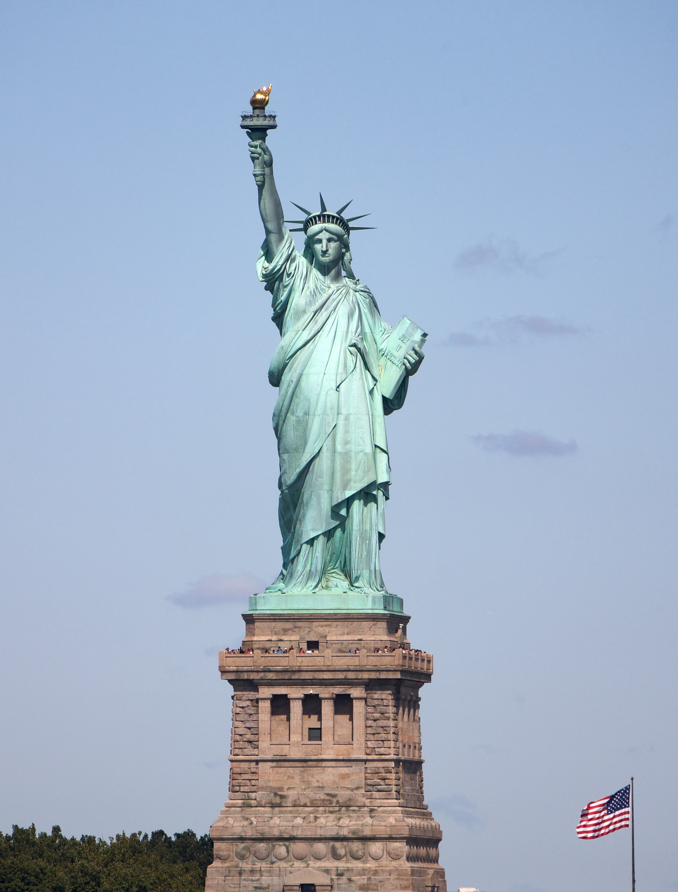
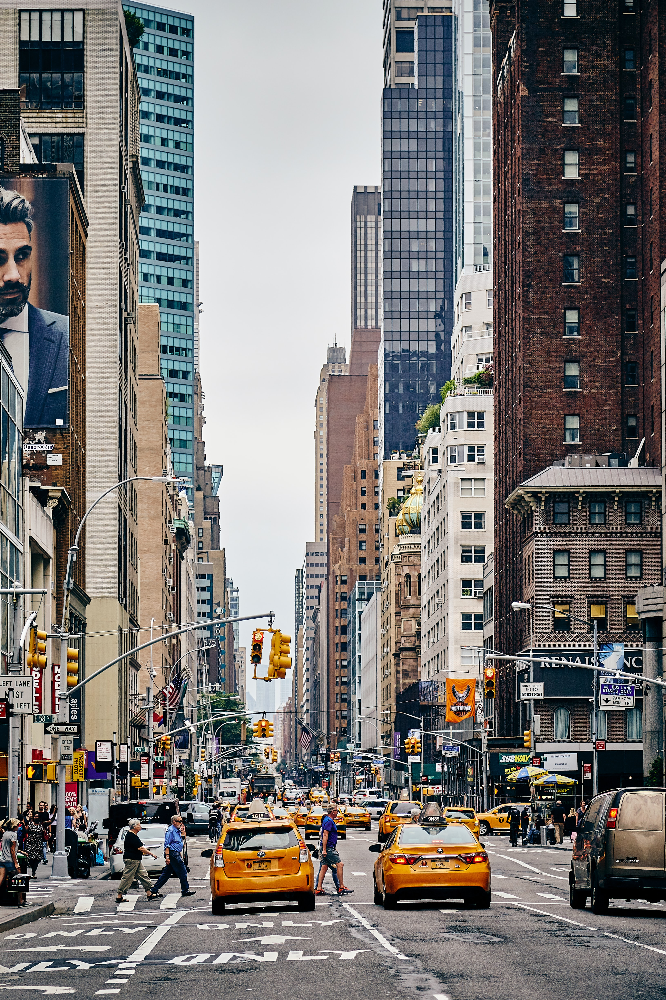
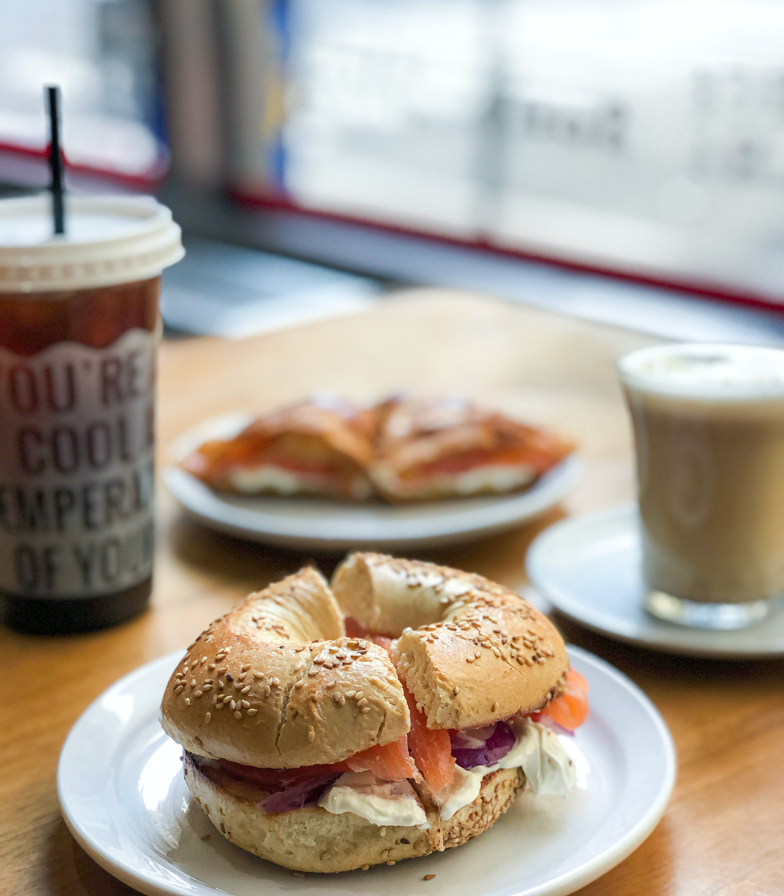

# Travel planner

<aside>
💡 **Notion Tip:** Make travel planning fun with this setup — an all-in-one packing list, trip planner, and shareable itinerary.

</aside>

## Packing list

Never forget your charger again. Add your packing list and check off the items as you go.

**Clothes**  👕

---

- [ ]  Socks
- [ ]  T-Shirts
- [ ]  Jeans

**Toiletries**  🪥

---

- [ ]  Toothbrush
- [ ]  Deodorant
- [ ]  Sunscreen

**Electronics**  💻

---

- [ ]  Charger
- [ ]  Laptop
- [ ]  E-Book

## Schedule

Use this table to keep track of flights, restaurants, activities and more.

↓ Click `Full schedule` to create and see other views.

[Schedule](travel-planner/schedule.csv)

## Map

Have your destination at your fingertips. Zoom in and out by using `cmd + scroll`

[https://goo.gl/maps/dBeAMPruWF3qMHjt8](https://goo.gl/maps/dBeAMPruWF3qMHjt8)

## Photo wall

Add a collage of photos you took on your trip here.

