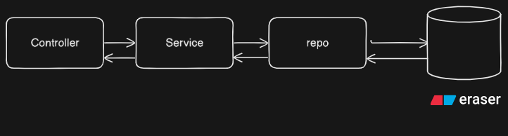

# Microservices Interview questions for 3+ years experience Code decode date -  29 May 2025

## Core Questions



### 1. What are the main challenges in implementing microservices?

**Answer:** The main challenges I've encountered in microservices implementation include:

**Network Complexity & Latency:** Think of an e-commerce platform like Amazon. In a monolith, when you add an item to cart, everything happens in one application. But with microservices, the Cart Service needs to talk to Inventory Service, Product Service, and User Service over the network. Each network call adds latency and potential failure points.

**Distributed Data Management:** Imagine you're processing an order - you need to update inventory, create an order record, and charge the customer. In a monolith, this is one database transaction. With microservices, each service has its own database, so maintaining consistency becomes complex. You can't just rollback everything if one step fails.

**Service Discovery & Communication:** It's like managing a large shopping mall. Services need to find each other dynamically. If the Payment Service moves to a different server, how does the Order Service find it? You need service registries and load balancers.

**Monitoring & Debugging:** When a customer complains their order failed, in a monolith you check one log file. With microservices, that single request might have traveled through 8 different services. Tracing the issue becomes like detective work across multiple systems.

**Operational Complexity:** Instead of deploying one application, you're now deploying 20+ services. Each needs its own CI/CD pipeline, monitoring, scaling policies, and maintenance windows.

### 2. Explain the importance of containerization in microservices.

**Answer:** Containerization is like having standardized shipping containers for global trade - it solves the fundamental problem of "it works on my machine."

**Key Benefits:**

**Environment Consistency:** Imagine you're running an e-commerce platform with 15 microservices:

- User Service (Python/Django)
- Product Service (Node.js)
- Payment Service (Java/Spring Boot)
- Inventory Service (Go)

Without containers, each service needs specific runtime versions, libraries, and configurations. Deploying to production becomes a nightmare of dependency conflicts.

With containers, each service bundles its runtime, dependencies, and configuration. Whether it runs on developer's laptop, staging, or production - it's identical.

**Resource Isolation:** Think of a busy shopping mall during Black Friday. Without containers, if the Search Service suddenly uses 90% CPU (due to high traffic), it could slow down the Payment Service running on the same server.

Containers provide isolation - each service gets its allocated resources and can't affect others.

**Scalability:** During flash sales, your Product Service might need 10 instances while User Service needs only 2. Containers make it easy to:

- Scale services independently
- Deploy quickly (containers start in seconds)
- Move services between servers

**Development Velocity:** New developers can run the entire e-commerce platform locally with one command:

`docker-compose up`

No need to install 5 different runtimes, databases, and configure ports.

**Technology Diversity:** Your team can choose the best tool for each job - Python for ML recommendations, Go for high-performance APIs, Node.js for real-time features - all running seamlessly together.

### 3. How do you approach logging and monitoring in a microservices environment?

**Answer:** Logging and monitoring in microservices is like managing a large restaurant chain - you need visibility into every location while maintaining overall business health.

**Centralized Logging Approach:**

**Challenge:** In an e-commerce system, when a customer reports "my order failed," that single request might touch:

- API Gateway → User Service → Order Service → Inventory Service → Payment Service

Without proper logging, you'd need to check logs on 5 different servers.

**Solution - ELK Stack (Elasticsearch, Logstash, Kibana):**

**Structured Logging**

: Each service logs in JSON format with consistent fields

```jsx
{
  "timestamp": "2024-01-15T10:30:00Z",
  "service": "order-service",
  "traceId": "abc123",
  "level": "ERROR",
  "message": "Payment failed for order 12345",
  "userId": "user789"
}
```

- **Correlation IDs**: Every request gets a unique ID that follows it through all services
- **Centralized Collection**: All logs flow to Elasticsearch for searchable storage

Micrometer  Tracing

**Monitoring Strategy:**

**Application Metrics:**

- **Business Metrics**: Orders per minute, conversion rates, revenue
- **Technical Metrics**: Response times, error rates, throughput

**Infrastructure Metrics:**

- CPU, memory, disk usage per service
- Database connection pools
- Queue depths

**Practical Implementation:**

- **Prometheus + Grafana**: For metrics collection and visualization
- **Health Check Endpoints**: Each service exposes `/health` endpoint
- **Circuit Breaker Monitoring**: Track when services are failing and recovering

**Alerting Rules:**

- Order Service error rate > 5%
- Payment Service response time > 2 seconds
- Inventory Service down for > 1 minute

**Real Example:** When Black Friday traffic hits, dashboards show:

- Search Service CPU spiking → Auto-scale triggers
- Database connection pool full → Alert ops team
- Payment gateway latency increasing → Switch to backup provider

### 4. How would you implement data consistency across microservices?

**Answer:** Data consistency in microservices is like coordinating a complex restaurant order across different kitchen stations - everything needs to work together even though each station operates independently.

**The Challenge:** Imagine an e-commerce order process:

1. Order Service creates order
2. Inventory Service reserves items
3. Payment Service charges customer
4. Shipping Service creates shipment

If payment fails after inventory is reserved, you need to "undo" the reservation. But services can't participate in a traditional database transaction.

**Saga Pattern Implementation:**

**Choreography-Based Saga (Event-Driven):**

```jsx
Order Created → Inventory Reserved → Payment Processed → Shipping Created
  ↓              ↓                 ↓                  ↓
Events        Events            Events            Events
```

Each service publishes events and listens for others. If Payment fails, it publishes "Payment Failed" event, and Inventory Service automatically releases the reservation.

**Orchestration-Based Saga:** A central Order Orchestrator manages the entire flow:

```jsx
Orchestrator → Call Inventory Service
→ Call Payment Service  
→ Call Shipping Service
```

If any step fails, the orchestrator handles compensating actions.

**Practical Implementation:**

**Event Sourcing + CQRS:** Instead of storing current state, store events:

```jsx
OrderCreated(orderId: 123, items: [...])
InventoryReserved(orderId: 123, items: [...])
PaymentProcessed(orderId: 123, amount: 299.99)
```

**Eventual Consistency:** Accept that data might be temporarily inconsistent. Show customers:

- "Order Confirmed" immediately
- "Payment Processing"
- "Order Shipped" when everything is complete

**Compensation Patterns:** For each action, define a compensating action:

- Reserve Inventory ↔ Release Inventory
- Charge Payment ↔ Refund Payment
- Create Shipment ↔ Cancel Shipment

**Real-World Example:** Amazon may reserve inventory during checkout before full payment is confirmed, using eventual consistency for some backend processes. If payment later fails, the order is canceled and the inventory is released.

### 5. What design patterns have you used while implementing microservices?

**Answer:** I've used several key patterns, and I'll explain them with e-commerce examples:

**API Gateway Pattern:** Think of this as the reception desk at a large office building. Instead of customers directly calling 15 different services, they go through one entry point.

**Implementation:**

- Single endpoint: `api.ecommerce.com`
- Routes `/orders/*` to Order Service
- Routes `/products/*` to Product Service
- Handles authentication, rate limiting, request/response transformation

**Circuit Breaker Pattern:** Like electrical circuit breakers in your house - when there's overload, they trip to prevent damage.

**Real Example:** If Payment Service is down, instead of timing out every request:

- Circuit opens after 5 consecutive failures
- Returns cached "Payment temporarily unavailable"
- Periodically tests if service is back up
- Closes circuit when service recovers

**Bulkhead Pattern:** Like compartments in a ship - if one floods, others remain safe.

**Implementation:** Separate thread pools for different operations:

- 10 threads for product searches
- 5 threads for payment processing
- 3 threads for user authentication

If product search overloads, payment processing still works.

**Saga Pattern:** Already covered in data consistency - manages distributed transactions.

**Event Sourcing Pattern:** Store events instead of current state:

```jsx
Instead of: User(id: 123, email: "new@email.com")
Store: UserCreated, EmailChanged, EmailVerified
```

**CQRS (Command Query Responsibility Segregation):** Separate read and write operations:

- Write: Order Service handles order creation
- Read: Separate reporting database optimized for dashboards

**Strangler Fig Pattern:** Gradually replace monolith like a strangler fig plant:

- Route new features to microservices
- Gradually move existing features
- Eventually remove monolith

**Database per Service:** Each microservice owns its data:

- Order Service → Orders Database
- User Service → Users Database
- No cross-database queries

### 6. How do you handle inter-service communication in microservices?

**Answer:** Inter-service communication is like managing communication in a large organization - you need different methods for different situations.

**Synchronous Communication (REST/HTTP):**

**When to Use:** Real-time operations where you need immediate response.

**E-commerce Example:** When user clicks "Add to Cart":

```jsx
Frontend → API Gateway → Cart Service → Product Service (get price)
→ User Service (validate user)
```

**Implementation:**

```jsx
// Cart Service calls Product Service
const productResponse = await fetch(`${PRODUCT_SERVICE_URL}/products/${productId}`);
const product = await productResponse.json();
```

**Pros:** Simple, immediate consistency **Cons:** Creates tight coupling, cascading failures

**Asynchronous Communication (Message Queues):**

**When to Use:** Operations that don't need immediate response or involve multiple services.

**E-commerce Example:** When order is placed:

```jsx
Order Service → Publishes "OrderCreated" event
→ Inventory Service (reduces stock)
→ Email Service (sends confirmation)  
→ Analytics Service (updates metrics)
```

**Implementation with RabbitMQ/Kafka:**

```jsx
// Publisher (Order Service)
await messageQueue.publish('order.created', {
  orderId: 123,
  userId: 456,
  items: [...]
});

// Subscriber (Inventory Service)
messageQueue.subscribe('order.created', async (orderEvent) => {
  await reduceInventory(orderEvent.items);
});
```

**gRPC for Internal Communication:**

**When to Use:** High-performance internal communication between services.

**Benefits:**

- Binary protocol (faster than JSON)
- Strong typing with Protocol Buffers
- Built-in load balancing

**Service Discovery:**

**Netflix Eureka/Consul:** Services register themselves and discover others:

```jsx
// Service registration
serviceRegistry.register({
  name: 'order-service',
  host: '192.168.1.10',
  port: 8080,
  health: '/health'
});

// Service discovery
const orderServiceUrl = await serviceRegistry.discover('order-service');
```

**Real-World Implementation Strategy:**

- **Critical path:** Synchronous (user registration, payment)
- **Background tasks:** Asynchronous (email notifications, analytics)
- **Internal APIs:** gRPC for performance
- **External APIs:** REST for simplicity

## Good to Have Questions

### 8. What are different deployment strategies for microservices?

**Answer:** Deployment strategies in microservices are like different ways to renovate a busy shopping mall - you need to keep business running while making improvements.

**Blue-Green Deployment:**

**Concept:** Maintain two identical production environments - Blue (current) and Green (new version).

**E-commerce Example:** You're updating the Order Service:

- Blue environment: Current Order Service v1.2 (handling live traffic)
- Green environment: New Order Service v1.3 (deployed but no traffic)
- Switch traffic from Blue to Green instantly
- Keep Blue as rollback option

**Implementation:**

```jsx
# Load balancer configuration
upstream order-service {
    server blue-order-service:8080;  # Current version
    # server green-order-service:8080;  # New version (commented out)
}
```

### **Initial Setup**

- **Blue environment** (v1) is live and handling production traffic.
- **Green environment** (v2) is deployed but **not receiving traffic yet**.

---

### 1. **Deploy Green (v2) for User Service**

- Deploy `user-service:v2` to the Green environment.
- Run tests: API checks, DB connections, latency, etc.
- Once verified → switch router/load balancer to point to Green.
- Now all traffic goes to `user-service:v2` .
- If issues found → revert routing back to Blue (`v1`

**Pros:** Instant rollback, zero downtime

**Cons:** Double infrastructure cost, database migration challenges

**Canary Deployment:**

**Concept:** Gradually roll out to small percentage of users, like testing a canary in a coal mine.

**E-commerce Example:** New recommendation algorithm for Product Service:

- Week 1: 5% of users see new recommendations
- Week 2: 20% of users (if metrics look good)
- Week 3: 50% of users
- Week 4: 100% rollout

**Implementation:**

```jsx
# API Gateway routing
- match: { headers: { user-segment: "canary" } }
  route: { cluster: "product-service-v2" }
- match: { prefix: "/" }
  route: { cluster: "product-service-v1" }
```

**Real time example**

Existing deployment: 100% traffic to `user-service:v1` .

Deploy a small number of `v2`  instances (e.g., 1 pod of 5).

Update routing (using Istio, NGINX, or Service Mesh):

- Route 10% of traffic to `v2` .
- Keep 90% on `v1` .

Monitor:

- Logs, error rate, latency, user feedback.

If stable → increase traffic to 25%, 50%, 100%.

If issues → stop rollout or rollback to `v1`

**Advantages**

Easy to rollback if issues occur.

Real-world testing with real users.

Enables monitoring and metric analysis.

Improves user trust with fewer disruptions.

Supports A/B testing and gradual rollout.

### Cons of Canary Deployment

- Adds deployment complexity.
- Needs infrastructure to manage traffic routing.
- Requires strong monitoring and alerting.
- Bugs may still impact canary users.

---

**Rolling Deployment:**

**Concept:** Replace instances one by one, like renovating hotel rooms while guests stay in others.

**Process:**

1. Take one Order Service instance out of load balancer
2. Deploy new version on that instance
3. Add back to load balancer
4. Repeat for next instance

Real time example - Start with 4 pods running `user-service:v1` .

Replace 1 pod with `user-service:v2` .

Monitor it (health checks, logs).

If healthy, continue replacing pods one-by-one.

All 4 pods now run `user-service:v2` .

### Tools Involved

- Kubernetes: manages pod replacement via `RollingUpdate` strategy in `Deployment` .
- CI/CD Tool (e.g., Jenkins, ArgoCD): triggers and monitors deployment.
- Monitoring Tools: Prometheus, Grafana, ELK, etc.

**A/B Testing Deployment:**

### **Use Case Example:**

### Scenario:

You want to test a **new checkout flow** in `order-service`.

- **Version A (v1)**: Old checkout flow
- **Version B (v2)**: New flow with simplified UI and coupon support

---

### **Deployment Flow:**

### 1. **Deploy both versions**

- Deploy `order-service:v1` and `order-service:v2` simultaneously.
- Both versions are live but receive **different traffic**.

### 2. **Split traffic (A/B testing logic)**

- Route users randomly or based on:
    - User ID hash
    - Region
    - Device type
    - Signup date
- Example:
    - 50% of users go to **v1**
    - 50% of users go to **v2**

### 3. **Data Collection**

- Track:
    - Order success rate
    - Cart abandonment
    - API response times
    - Revenue impact

### 4. **Compare Results**

- Use dashboards (Grafana, Google Analytics, custom BI)
- Decide which version performs better

### 5. **Finalize**

- Promote the winning version to 100% traffic.
- Remove the other.

---

### Tools for A/B Testing

- **Istio / Linkerd** – for traffic routing
- **Optimizely / Google Optimize** – for web-based experiments
- **Feature flags (LaunchDarkly, Unleash)** – to control exposure
- **Prometheus + Grafana** – for backend metrics

---

### Benefits

- Test real user impact before committing
- Make data-driven decisions
- Reduce deployment risk

### Drawbacks

- Extra setup complexity
- Data inconsistency if not managed well
- Requires precise monitoring and routing logic

**Feature Flag Strategy:**

```jsx
if (featureFlag.isEnabled('new-checkout', userId)) {
  return newCheckoutFlow();
} else {
  return currentCheckoutFlow();
}
```

### 9. How do you approach database design in a microservices architecture?

**Answer:** Database design in microservices is like organizing a large library system - each department needs its own specialized collection, but they still need to share information efficiently.

**Database per Service Pattern:**

**Principle:** Each microservice owns its data and database schema.

**E-commerce Example:**

```jsx
User Service → PostgreSQL (user profiles, authentication)
Order Service → MongoDB (order documents, flexible schema)
Inventory Service → MySQL (ACID transactions for stock)
Analytics Service → ClickHouse (time-series data)
```

**Benefits:**

- Services can evolve independently
- Choose optimal database for each use case
- No cross-service database dependencies

**Data Sharing Strategies:**

**API-Based Data Access:**

```jsx
// Order Service needs user email
const user = await userService.getUser(userId);
const order = {
  userId: userId,
  userEmail: user.email, // Cache locally
  items: items
};
```

**Event-Driven Data Synchronization:**

When user updates email:

```jsx
User Service → Publishes "UserEmailChanged" event
→ Order Service updates cached email
→ Notification Service updates email
```

**Data Consistency Patterns:**

**Eventual Consistency:** Accept temporary inconsistency for better performance.

**Example:**

- User changes address
- Order Service might show old address for few seconds
- Eventually syncs with new address

**Saga Pattern for Distributed Transactions:** Already covered - ensures data consistency across services.

**Shared Database Anti-Pattern:**

**What NOT to do:**

```jsx
Order Service ←→ Shared Database ←→ Inventory Service
```

**Problems:**

- Tight coupling between services
- Schema changes affect multiple services
- Difficult to scale independently

**CQRS Implementation:**

**Command Side (Write):**

**CQRS Implementation:**

**Command Side (Write):**

```jsx
Order Service → Orders Write Database (optimized for writes)
```

**Query Side (Read):**

```jsx
Order Reporting → Orders Read Database (optimized for reporting)
```

**Data synchronization via events.**

**`Practical Considerations:**

**Reference Data:** Some data is shared across services (countries, currencies):

- **Option 1:** Duplicate in each service
- **Option 2:** Shared reference data service
- **Option 3:** Configuration management

**Reporting and Analytics:** Create dedicated reporting databases:

```jsx
All Services → Event Stream → Data Warehouse → Analytics
```

### 10. How do you implement service versioning in a microservices architecture?

**Answer:** Service versioning in microservices is like managing different versions of mobile apps - you need to support old versions while introducing new features.

**URL-Based Versioning:**

**Implementation:**

```jsx
/api/v1/orders  → Order Service v1
/api/v2/orders  → Order Service v2
```

**E-commerce Example:**

- v1: Returns basic order info
- v2: Adds tracking information and estimated delivery

**Code Example:**

```jsx
// API Gateway routing
app.use('/api/v1/orders', orderServiceV1Router);
app.use('/api/v2/orders', orderServiceV2Router);

// Controller
async function getOrder(req, res) {
  const order = await orderService.getOrder(req.params.id);
  
  if (req.baseUrl.includes('v2')) {
    // v2 includes tracking info
    order.tracking = await trackingService.getTracking(order.id);
  }
  
  res.json(order);
}
```

**Header-Based Versioning:**

**Implementation:**

```jsx
// Client request
fetch('/api/orders', {
  headers: {
    'Accept': 'application/vnd.ecommerce.v2+json'
  }
});

// Service handling
app.use((req, res, next) => {
  const acceptHeader = req.headers.accept;
  req.apiVersion = acceptHeader.includes('v2') ? 'v2' : 'v1';
  next();
});
```

**Contract-First Approach:**

**API Contract Definition (OpenAPI):**

```jsx
# orders-api-v2.yaml
paths:
  /orders/{id}:
    get:
      summary: Get order details
      parameters:
        - name: include_tracking
          in: query
          schema:
            type: boolean
      responses:
        '200':
          content:
            application/json:
              schema:
                $ref: '#/components/schemas/OrderV2'
```

**Backward Compatibility Strategies:**

**Additive Changes (Safe):**

- Add new optional fields
- Add new endpoints
- Add new query parameters

**Breaking Changes (Requires new version):**

- Remove fields
- Change field types
- Change endpoint behavior

**Deprecation Strategy:**

**Phased Approach:**

1. **Announce deprecation:** v1 will be deprecated in 6 months
2. **Support both versions:** Run v1 and v2 in parallel
3. **Monitor usage:** Track which clients use v1
4. **Migrate clients:** Work with teams to upgrade
5. **Retire old version:** Turn off v1 after migration

**Service Evolution Patterns:**

**Expand and Contract:**

```jsx
Phase 1: Add new field (both versions supported)
Phase 2: Migrate clients to use new field  
Phase 3: Remove old field
```

**Adapter Pattern:**

```jsx
class OrderV1Adapter {
  adapt(orderV2) {
    return {
      id: orderV2.id,
      total: orderV2.total,
      // Convert v2 format to v1 format
      items: orderV2.lineItems.map(item => ({
        productId: item.product.id,
        quantity: item.qty
      }))
    };
  }
}
```

**Consumer-Driven Contracts:**

**Testing Approach:**

```jsx
// Consumer (Frontend) defines contract
const orderContract = {
  request: {
    method: 'GET',
    path: '/orders/123'
  },
  response: {
    status: 200,
    body: {
      id: '123',
      total: 299.99,
      status: 'confirmed'
    }
  }
};

// Provider (Order Service) must satisfy contract
```

### 11. Describe approaches to handle authentication and authorization across microservices.

**Answer:** Authentication and authorization in microservices is like managing security in a large office building - you need one entry point for identity verification, but different access levels for different departments.

**JWT (JSON Web Token) Approach:**

**Flow:**

1. User logs in → Authentication Service issues JWT
2. JWT contains user info and permissions
3. Each microservice validates JWT independently

**E-commerce Example:**

```jsx
// JWT payload
{
  "userId": "12345",
  "email": "user@example.com",
  "roles": ["customer", "premium"],
  "permissions": ["view_orders", "create_orders"],
  "exp": 1640995200
}

// Order Service validates JWT
const jwt = require('jsonwebtoken');

function validateJWT(req, res, next) {
  const token = req.headers.authorization?.split(' ')[1];
  
  try {
    const decoded = jwt.verify(token, process.env.JWT_SECRET);
    req.user = decoded;
    next();
  } catch (error) {
    res.status(401).json({ error: 'Invalid token' });
  }
}

// Check permissions
function requirePermission(permission) {
  return (req, res, next) => {
    if (req.user.permissions.includes(permission)) {
      next();
    } else {
      res.status(403).json({ error: 'Insufficient permissions' });
    }
  };
}

// Usage
app.get('/orders', validateJWT, requirePermission('view_orders'), getOrders);
```

**OAuth 2.0 with API Gateway:**

**Architecture:**

```jsx
Client → API Gateway (OAuth validation) → Microservices
```

**Implementation:**

```jsx
// API Gateway middleware
async function validateOAuth(req, res, next) {
  const token = req.headers.authorization;
  
  // Validate with OAuth server
  const userInfo = await oauthServer.introspect(token);
  
  if (userInfo.active) {
    req.user = userInfo;
    next();
  } else {
    res.status(401).json({ error: 'Invalid token' });
  }
}
```

**Service-to-Service Authentication:**

**Mutual TLS (mTLS):** Each service has certificates for secure communication.

**Service Account Tokens:**

```jsx
// Order Service calling Inventory Service
const serviceToken = await getServiceAccountToken();

const response = await fetch('http://inventory-service/check-stock', {
  headers: {
    'Authorization': `Bearer ${serviceToken}`,
    'X-Service-Name': 'order-service'
  }
});
```

**Role-Based Access Control (RBAC):**

**E-commerce Roles:**

```jsx
const roles = {
  customer: ['view_orders', 'create_orders', 'view_products'],
  admin: ['*'], // All permissions
  support: ['view_orders', 'update_order_status'],
  warehouse: ['view_inventory', 'update_inventory']
};

// Permission checking
function hasPermission(userRoles, requiredPermission) {
  return userRoles.some(role => 
    roles[role].includes(requiredPermission) || 
    roles[role].includes('*')
  );
}
```

**Fine-Grained Authorization:**

**Attribute-Based Access Control (ABAC):**

```jsx
// Policy: Users can only view their own orders
function canViewOrder(user, orderId) {
  return user.id === order.userId || user.roles.includes('admin');
}

// Policy: Premium users can access expedited shipping
function canAccessExpedited(user) {
  return user.subscription === 'premium';
}
```

**Session Management:**

**Distributed Session Store:**

```jsx
// Redis-based session store
const session = await redis.get(`session:${sessionId}`);

if (session) {
  req.user = JSON.parse(session);
  // Extend session expiry
  await redis.expire(`session:${sessionId}`, 3600);
}
```

**Security Best Practices:**

**Token Rotation:**

```jsx
// Refresh token mechanism
app.post('/refresh-token', async (req, res) => {
  const refreshToken = req.body.refreshToken;
  
  if (await validateRefreshToken(refreshToken)) {
    const newAccessToken = generateAccessToken(user);
    const newRefreshToken = generateRefreshToken(user);
    
    res.json({
      accessToken: newAccessToken,
      refreshToken: newRefreshToken
    });
  }
});
```

**Rate Limiting by User:**

```jsx
// Per-user rate limiting
const rateLimiter = rateLimit({
  windowMs: 15 * 60 * 1000, // 15 minutes
  max: (req) => {
    return req.user.subscription === 'premium' ? 1000 : 100;
  },
  keyGenerator: (req) => req.user.id
});
```

**Audit Logging:**

```jsx
// Track all access attempts
function auditLog(req, res, next) {
  console.log({
    timestamp: new Date().toISOString(),
    userId: req.user?.id,
    action: `${req.method} ${req.path}`,
    ip: req.ip,
    userAgent: req.headers['user-agent']
  });
  next();
}
```

This comprehensive approach ensures secure, scalable authentication and authorization across your microservices architecture while maintaining good user experience and operational efficiency.

### ✅ **Question 1: What are the main drawbacks of using `synchronized` methods?**

**Answer:**

Using `synchronized` methods in Java is the simplest way to handle thread-safety, but it comes with some important drawbacks:

1. **No Flexibility**:
    
    `synchronized` is a blocking mechanism with no built-in support for advanced control like try-lock or timed lock attempts. You can't try acquiring a lock without getting stuck.
    
2. **Can't Interrupt**:
    
    If a thread is waiting for a lock via `synchronized`, it cannot be interrupted. This limits responsiveness in multi-threaded applications.
    
3. **No Fairness or Priority Handling**:
    
    There's no way to control the order in which threads acquire the lock—leading to potential starvation.
    
4. **Coarse-Grained Locking**:
    
    It can sometimes lead to unnecessary locking if the scope is too wide (e.g., locking an entire method).
    
5. **No Condition Support**:
    
    You can't use multiple condition variables or fine-grained signaling like `await()`, `signal()`, or `signalAll()` which are useful in complex thread coordination.
    

---

### ✅ **Question 2: How does `ReentrantLock` improve performance and flexibility?**

**Answer:**

`ReentrantLock` from `java.util.concurrent.locks` improves over `synchronized` in several ways:

1. **Try and Timeout**:
    
    You can attempt to acquire the lock using `tryLock()` or `tryLock(timeout)` — improving responsiveness and avoiding deadlock.
    
2. **Interruptibility**:
    
    Threads waiting on a `ReentrantLock` can be interrupted using `lockInterruptibly()`.
    
3. **Fairness**:
    
    It supports **fair locking**, meaning threads acquire the lock in the order they requested it (FIFO), avoiding starvation.
    
4. **Multiple Conditions**:
    
    Supports multiple `Condition` objects for more granular signaling between threads, improving complex thread interactions.
    
5. **Explicit Locking**:
    
    Since locking and unlocking are explicit (`lock()` / `unlock()`), developers have more control over synchronization scope.
    

---

### ✅ **Question 3: Implement a Multi-threaded Rate Limiter in Java**

Here’s a **production-style implementation** using `ReentrantLock`:

```java
import java.util.concurrent.locks.ReentrantLock;
import java.util.concurrent.TimeUnit;
import java.util.LinkedList;

public class RateLimiter {
    private final int maxRequests;
    private final long timeWindowMillis;
    private final LinkedList<Long> timestamps;
    private final ReentrantLock lock;

    public RateLimiter(int maxRequests, long timeWindowSeconds) {
        this.maxRequests = maxRequests;
        this.timeWindowMillis = timeWindowSeconds * 1000;
        this.timestamps = new LinkedList<>();
        this.lock = new ReentrantLock();
    }

    public boolean allowRequest() {
        long currentTime = System.currentTimeMillis();
        lock.lock();
        try {
            while (!timestamps.isEmpty() && currentTime - timestamps.peekFirst() > timeWindowMillis) {
                timestamps.pollFirst();
            }

            if (timestamps.size() < maxRequests) {
                timestamps.addLast(currentTime);
                return true;
            } else {
                return false;
            }
        } finally {
            lock.unlock();
        }
    }

    // For demo: simulate API calls
    public static void main(String[] args) {
        RateLimiter limiter = new RateLimiter(5, 10); // 5 requests per 10 seconds

        Runnable apiTask = () -> {
            if (limiter.allowRequest()) {
                System.out.println(Thread.currentThread().getName() + " -> API request allowed");
            } else {
                System.out.println(Thread.currentThread().getName() + " -> Rate limit exceeded");
            }
        };

        for (int i = 0; i < 10; i++) {
            new Thread(apiTask, "Thread-" + i).start();
        }
    }
}

```

### ✅ **Q1: How would you design an API Gateway to handle dynamic routing and security policies?**

**Answer:**

To design a robust **API Gateway** with **dynamic routing** and **security policy enforcement**, I'd follow a microservices-friendly and scalable approach:

### 🔁 **Dynamic Routing**:

- **Service Discovery**:
    
    Use tools like **Eureka**, **Consul**, or Kubernetes **DNS-based discovery** to dynamically route traffic to the appropriate microservice.
    
- **Routing Engine**:
    
    Implement or configure a gateway like **Spring Cloud Gateway**, **Kong**, or **NGINX**, which can load route configurations from a **central config server or database**.
    
- **Path-based Routing**:
    
    E.g., `/user/** → user-service`, `/orders/** → order-service`. These routes can be defined via YAML, database, or config APIs.
    
- **Dynamic Config Updates**:
    
    Use something like **Spring Cloud Config + Actuator refresh**, or **hot reload** from a DB or config store (e.g., Redis).
    

### 🔒 **Security Policies**:

- **Authentication**:
    - Implement **JWT (JSON Web Token)** based authentication.
    - Use **OAuth2** via an identity provider (e.g., Keycloak, Okta).
    - Token validation at the **gateway level** to offload downstream services.
- **Authorization**:
    - Role-based or scope-based access control.
    - Policies stored in DB or config service and evaluated per route.
- **Rate Limiting & Throttling**:
    - Use filters or plugins (e.g., Redis-based counters, Bucket4j, or Kong rate-limiting plugin).
- **Audit Logging**:
    - Log metadata like IP, userId, headers, timestamp for each request.
- **Circuit Breakers / Fallbacks**:
    - Integrate **Resilience4j** or **Hystrix** to protect downstream services.

---

### ✅ **Q2: What are the challenges of handling pagination in REST APIs for massive datasets?**

**Answer:**

When handling **pagination at scale**, especially with **millions of records**, several challenges arise:

### 1. **Performance (Offset Pagination Pitfall)**:

- **Offset + Limit** queries (`?offset=1000000&limit=20`) become inefficient at scale because the DB still scans all preceding rows.
- This leads to **high latency and CPU load**.

### 2. **Data Consistency**:

- While paginating through data, **new records may be inserted or deleted**, causing:
    - **Duplicates**
    - **Missing records**
    - Inconsistent user experience (e.g., jumping records)

### 3. **Cursor-Based Pagination (a better approach)**:

- Instead of offsets, use a **stable, sequential field** (e.g., `created_at`, `id`) and query:
    
    ```sql
    WHERE created_at > last_seen_timestamp LIMIT 20
    
    ```
    
- Pros:
    - Fast, index-friendly
    - More consistent
- Cons:
    - Not flexible for arbitrary pages (no jumping to page 100)

### 4. **Sorting and Filtering**:

- Paginating after applying filters or complex sort criteria can make indexes ineffective unless planned ahead.
- Compound indexes may be needed.

### 5. **API Design Issues**:

- Must support:
    - `next`, `prev` links (HATEOAS style)
    - Total count (may be expensive)
    - Tokenized cursors for secure pagination

### 6. **Statelessness**:

- API should remain stateless, even when paginating. Avoid storing state on the server side (e.g., no session pagination).

---

### 💡 Example API Response for Cursor-based Pagination:

```java
{
  "data": [...],
  "nextCursor": "2024-04-01T10:15:00Z",
  "hasMore": true
}

```

### Real Interview Tip:

If asked about frameworks, say:

> For pagination with Spring Data, I use Pageable abstraction, but for large datasets I prefer custom queries with cursor-based pagination for better performance and consistency.
> 

### ✅ **Q1: How would you manage API timeouts and retries in a distributed system?**

**Answer:**

In a distributed system, **timeouts and retries** are critical for reliability and resilience. Here's how I approach them:

### 🔧 1. **Set Explicit Timeouts at Every Layer**:

- **HTTP clients (e.g., RestTemplate, WebClient)**: Set `connectTimeout` and `readTimeout`.
- **Database calls**: Use timeout configurations at JDBC/connection pool level (e.g., HikariCP).
- **Async systems**: Set timeouts for thread pools and message listeners (e.g., Kafka consumers).

### 🔁 2. **Retries with Backoff and Jitter**:

- Use **exponential backoff** with **random jitter** to avoid thundering herd problems.
- In Java, I use:
    - **Resilience4j Retry** with backoff config.
    - Or implement retry logic using **Spring Retry**.

### ⚠️ 3. **Avoid Blind Retries**:

- Never retry on non-transient errors (e.g., 400s, validation failures).
- Retry only on **timeouts, 5xx**, or network-level exceptions.

### 🧠 4. **Circuit Breakers & Timeouts Together**:

- Wrap calls with **circuit breakers** (e.g., Resilience4j) to avoid retrying failing services endlessly.
- Example:

```java
Retry retry = Retry.ofDefaults("myService");
CircuitBreaker breaker = CircuitBreaker.ofDefaults("myBreaker");
Supplier<Response> decorated = Decorators.ofSupplier(myService::call)
  .withRetry(retry)
  .withCircuitBreaker(breaker)
  .decorate();

```

### 📈 5. **Centralized Observability**:

- Log all timeouts and retries.
- Monitor retry metrics, circuit breaker states, and response latencies using **Prometheus/Grafana or ELK**.

---

### ✅ **Q2: What’s the best way to implement WebSockets in a fintech application?**

**Answer:**

WebSockets are great for **real-time updates** like trades, balances, or FX rates in fintech. Here's how I’d implement them securely and at scale:

### ⚙️ 1. **Use Spring Boot + STOMP over WebSockets**:

- Spring provides excellent support using `@MessageMapping`, `@SendTo`, and built-in brokers like RabbitMQ or Redis.

### 🔒 2. **Authentication & Authorization**:

- Use **JWT tokens** for authenticating the initial handshake.
- Intercept the connection with a **`HandshakeInterceptor`** in Spring:

```java
public class AuthInterceptor implements HandshakeInterceptor {
  public boolean beforeHandshake(...) {
    // Validate JWT token and user roles
  }
}

```

### 🚀 3. **Scalability (Clustered Deployment)**:

- Use **Redis Pub/Sub** or a **message broker** (Kafka, RabbitMQ) to **broadcast events across multiple WebSocket nodes**.
- Store client sessions in distributed memory like Redis (Spring Session helps).

### 📉 4. **Disconnect / Reconnect Handling**:

- Implement **heartbeat/ping mechanism** to detect stale clients.
- Use `@EventListener` for `SessionDisconnectEvent`.

### 🧑‍💻 5. **Fallback Strategy**:

- Always provide a **fallback (e.g., polling or SSE)** for legacy clients or firewall-restricted environments.

---

### ✅ **Q3: How would you enforce idempotency in payment APIs?**

**Answer:**

Idempotency is crucial in fintech to **avoid duplicate payments** during retries. Here's how I enforce it:

### 🔐 1. **Client-Side Idempotency Key**:

- Require clients to send an **`Idempotency-Key`** header in the API request (usually a UUID).
- This key uniquely identifies a request **semantically** (e.g., same amount, user, method).

### 💾 2. **Server-Side Store (Idempotency Table)**:

- When a request with an `Idempotency-Key` comes in:
    1. Check if it exists in a DB or cache.
    2. If yes → return the **same response** (no re-processing).
    3. If no → process, persist the key and response.

```sql
CREATE TABLE idempotency (
  idempotency_key VARCHAR PRIMARY KEY,
  user_id VARCHAR,
  request_hash TEXT,
  response_json TEXT,
  created_at TIMESTAMP
)

```

### 🧠 3. **Hash Validation**:

- Hash the request payload and compare it with the stored version.
- Prevent misuse of idempotency keys for **different requests**.

### 🕒 4. **Expiry Policy**:

- Clean up old keys (e.g., 24-48 hours) to avoid table bloat.
- Use Redis with TTL for temporary storage in high-throughput systems.

### 💥 5. **Error Handling**:

- Return **409 Conflict** or **422 Unprocessable Entity** if key reused with different payloads.

---

### 💡 Real-world example:

> Stripe’s payment API uses Idempotency-Key headers and returns the same charge object for retries — this is standard practice in payment systems to ensure safety and consistency.
> 

### ✅ **Q1: Design a high-throughput, low-latency order-matching system for a stock exchange**

**Answer:**

A **stock exchange order-matching engine** must be ultra-fast and highly reliable. Here’s a breakdown of how I’d approach it:

---

### 💡 **Core Components**:

1. **Order Ingestion Service**:
    - Accepts market/limit orders from clients via **WebSocket or FIX** protocol.
    - Performs basic validation & forwards to matching engine.
2. **Matching Engine (Core)**:
    - Maintains **order books** per stock (`symbol`).
    - Uses **in-memory data structures** (e.g., priority queues / skip lists / TreeMaps).
    - Match logic:
        - Buy → Max price priority
        - Sell → Min price priority
    - Executes trades, updates order books in **O(log n)**.
3. **Trade Ledger & Persistence**:
    - Once orders are matched, persist the trade event asynchronously (write-behind cache).
    - Use **append-only log** (e.g., Kafka or commit log DB) for audit & replayability.

---

### ⚡ **Performance Optimizations**:

- **Language**: Core matching engine written in **Java, C++, or Rust** for ultra-low GC latency.
- **Multithreading**:
    - One thread per symbol/market to avoid locks (actor model).
    - Or partition symbols across cores (sharded matching engine).
- **Lock-free / Wait-free queues** (Disruptor pattern).
- **Batch order processing** when appropriate.

---

### 📦 **Scalability**:

- Horizontal scaling by **sharding per instrument or market segment**.
- Kafka / Redis / Chronicle Queue to buffer & distribute orders.

---

### 🔒 **Fault Tolerance**:

- Replicate engine state via **WAL (write-ahead log)** or **Kafka replay**.
- Snapshot order books at intervals + replay logs on recovery.

---

### 🧠 Bonus:

> NASDAQ and NYSE use deterministic, memory-efficient, low-latency engines, where every microsecond matters — this system must process 100k+ TPS under 1ms latency.
> 

---

### ✅ **Q2: How would you ensure data integrity in a multi-region database setup?**

**Answer:**

Multi-region databases are essential for global availability, but they introduce complexity in maintaining consistency. Here's how I'd ensure **data integrity**:

---

### 🏦 **1. Use Strongly Consistent DBs Where Needed**:

- For **mission-critical data** (e.g., payments, balances), use databases with:
    - **Global ACID transactions**
    - **Synchronous replication** (e.g., **CockroachDB**, **Spanner**, or **YugabyteDB**)

### 🔁 **2. Replication Strategy**:

- Choose between:
    - **Synchronous replication** (strong consistency, slower)
    - **Asynchronous replication** (faster, risk of data loss in failover)

Use a hybrid:

- Critical writes → **sync**
- Eventual-consistency for reads, logs → **async**

---

### 🔑 **3. Global IDs and Timestamps**:

- Use **UUIDs or ULIDs** to avoid ID collisions across regions.
- Sync on **logical clocks / hybrid timestamps** (e.g., Google’s TrueTime, Lamport clock).

---

### 🔒 **4. Conflict Resolution**:

- If eventual consistency is used, ensure **CRDTs** or conflict-handling logic at application layer.
- Use **last-write-wins** only if acceptable — otherwise apply **business logic reconciliation**.

---

### 🧪 **5. Transaction Patterns**:

- Use **sagas** or **eventual consistency with compensating actions** for distributed transactions.
- Break monolith transactions into **smaller, atomic local transactions + message-based orchestration**.

---

### 🛑 **6. Write Fencing & Versioning**:

- Use **optimistic locking / version numbers** to prevent stale writes.
- Enforce **linearizability** in critical paths (e.g., balance updates, orders).

---

### 🧠 Interview Bonus:

> I'd monitor replication lag, apply strong consistency where absolutely necessary, and design the system for failure isolation — it's better to fail gracefully than to corrupt data across regions.
> 

---

### 💡 Want to go next level?

You can offer to sketch out:

- **Order-matching pseudocode using TreeMap in Java**
- A **multi-region write-safe schema design** (e.g., user wallet or payment ledger)
- Or even talk about **Paxos vs Raft** if asked about consensus protocols

---

Let me know if you want diagrams, code samples, or to simulate a real interview whiteboard session.

### You said:

Explain Leader Election. How would you implement it in a microservices-based system?
What are the trade-offs between CQRS and traditional CRUD-based systems?
How does a Distributed Message Queue (like Kafka) handle backpressure?

### ChatGPT said:

You're asking high-impact **system design and architecture questions** — nice! Here's how to answer these in a **real-time backend/microservices interview**, with **solid explanations, real-world tools, and trade-offs**.

---

### ✅ **Q1: Explain Leader Election. How would you implement it in a microservices-based system?**

**Answer:**

**Leader Election** is the process of designating one node (service instance) as the **"coordinator" or "primary"**, responsible for certain tasks (e.g., scheduling, resource locking, background jobs) while others stay passive or standby.

---

### 🔄 **Why it's needed**:

- To avoid **duplicate work**
- Ensure **data consistency**
- Support **HA (High Availability)** while avoiding race conditions

---

### 🔧 **Implementation in Microservices**:

✅ **Using a Distributed Lock via ZooKeeper / etcd / Consul**:

- Each node tries to acquire a lock on startup.
- The one who gets it → becomes the leader.
- If the leader crashes or loses the lock (e.g., network split), others retry.

```java
// Using Curator (Zookeeper client for Java)
LeaderSelector selector = new LeaderSelector(client, "/leader", listener);
selector.autoRequeue();
selector.start();

```

✅ **Using Kubernetes Leader Election (for jobs or Cron)**:

- With annotations + `LeaseLock` stored in Kubernetes API (via leader-elector sidecar or Spring Cloud K8s).
- Great for cloud-native microservices.

✅ **Using Redis (SETNX pattern)**:

- Try acquiring a lock key using `SET key val NX PX timeout`
- If success → leader
- Use key expiration + renewal to avoid deadlock

---

### 🛑 Failure Handling:

- Set TTL on lock.
- Have backup services monitoring the leader.
- Upon crash or timeout, a new election occurs.

---

### 🧠 Bonus Tip:

> Leader election is especially useful for job scheduling, distributed cache invalidation, or orchestration in saga patterns.
> 

---

### ✅ **Q2: What are the trade-offs between CQRS and traditional CRUD systems?**

**Answer:**

CQRS (Command Query Responsibility Segregation) **separates read and write models**, while traditional CRUD merges them in a single model.

---

### 🔄 **Traditional CRUD**:

- Simple: one model for reads/writes
- Easy to develop & maintain for small systems
- Limitation: doesn’t scale well for read-heavy or complex business rules

---

### ⚔️ **Trade-offs in CQRS**:

| Aspect | CQRS | CRUD |
| --- | --- | --- |
| **Complexity** | High (2 models + messaging) | Low |
| **Scalability** | Great (separate read/write DBs) | Limited |
| **Read Optimization** | Flexible (denormalized views, caching) | Tied to DB schema |
| **Write Validation** | Strong (rich domain models) | Basic |
| **Latency** | Eventual consistency in read model | Immediate consistency |
| **Use Case** | Event-driven systems, DDD, financial apps | Simple CRUD apps |

---

### 📌 When to Use CQRS:

- Complex business logic in writes (commands)
- High-volume reads with custom views
- Need for audit trails (event sourcing pairs well)

### 📌 When to Stick with CRUD:

- Simpler apps, admin panels, or small teams
- Fast delivery with minimal ops overhead

---

> Real-world example: CQRS + Event Sourcing works great for payment processing, order management, ledger systems, where auditability and scalability are key.
> 

---

### ✅ **Q3: How does a Distributed Message Queue like Kafka handle backpressure?**

**Answer:**

Backpressure happens when **producers push faster than consumers can process**. Kafka handles it via **built-in flow control + buffering**.

---

### 🧱 Kafka’s Backpressure Strategies:

1. **Persistent Log-Based Storage**:
    - Kafka acts like a **log**, not a traditional queue.
    - Messages are retained for a **fixed time (e.g., 7 days)**, regardless of consumption.
    - So **slow consumers don’t block producers**.
2. **Producer Backpressure (Push Slowdown)**:
    - Producers can **block or retry** if Kafka brokers are under pressure.
    - Configurable via:
        - `acks=all`
        - `retries`
        - `linger.ms` (batch delay)
        - `max.in.flight.requests`
3. **Consumer Control (Pull-based model)**:
    - Consumers pull messages at their own rate.
    - Kafka tracks offsets — consumers can **pause/resume** or **throttle** themselves.
4. **Brokers + Disk I/O Management**:
    - Kafka persists to disk (sequential write = high throughput).
    - If disk is full → it **halts producers** or **returns errors**.
5. **Custom Throttling**:
    - Kafka 2.x+ supports **quota management**:
        - Throttle producers/consumers if they exceed defined rates.

---

### 💡 Best Practices:

- Scale consumer groups based on topic partitions.
- Monitor **lag per consumer group** to detect bottlenecks.
- Use `pause()` and `resume()` in consumers (e.g., Spring Kafka).

---

### 🧠 Interview Pro Tip:

> Kafka never forces backpressure on producers directly like RabbitMQ might. Instead, it buffers + persists while allowing decoupled processing, which is why it's ideal for event-driven microservices.
> 

### ✅ **3. Fail-Fast vs Fail-Safe Iterators**

### 🔹 **Fail-Fast Iterator**:

- **Definition**: Immediately throws a `ConcurrentModificationException` if the collection is **modified structurally** after the iterator is created (except through the iterator itself).
- **Examples**: `ArrayList`, `HashMap`, `HashSet`
- **Implementation**:
    - Uses a **modCount** field internally.
    - Compares it during iteration to detect concurrent modification.

```java
List<String> list = new ArrayList<>();
list.add("A");
Iterator<String> it = list.iterator();
list.add("B");  // Structural change
it.next();      // Throws ConcurrentModificationException

```

### 🔹 **Fail-Safe Iterator**:

- **Definition**: Does **not throw** exceptions even if the collection is modified during iteration — because it iterates over a **copy** of the collection.
- **Examples**: `CopyOnWriteArrayList`, `ConcurrentHashMap`
- **Use Case**: Useful in **concurrent applications** where read-write happens in parallel.

```java
CopyOnWriteArrayList<String> list = new CopyOnWriteArrayList<>();
list.add("X");
for (String item : list) {
    list.add("Y");  // Safe modification, no exception
}

```

### 🧠 Interview Tip:

> "Fail-fast helps detect bugs early in single-threaded contexts, while fail-safe ensures thread-safety and consistency at the cost of performance."
> 

---

### ✅ **4. Immutable Class with Mutable Fields**

Even if a class contains **mutable objects**, you can still make it **immutable** by applying **defensive copying**.

### 🔐 Key Principles:

1. Make the class `final` (so it can’t be subclassed)
2. All fields `private` and `final`
3. No setters
4. Deep copies of **mutable objects** in constructor and getters

---

### ✅ Example:

```java
public final class Employee {
    private final String name;
    private final Date dateOfJoining;

    public Employee(String name, Date dateOfJoining) {
        this.name = name;
        this.dateOfJoining = new Date(dateOfJoining.getTime()); // defensive copy
    }

    public String getName() {
        return name;
    }

    public Date getDateOfJoining() {
        return new Date(dateOfJoining.getTime()); // defensive copy
    }
}

```

---

### 🧠 Interview Tip:

> "Even though Date is mutable, the object remains immutable because callers can't modify the internal state. I always return a deep copy to preserve encapsulation."
> 

---

Let me know if you want to practice more Java core topics (e.g., `volatile`, memory model, GC, synchronization) — I can fire off more bite-sized, interview-ready bullets.

### ✅ **5. Soft, Weak, and Phantom References in Java**

These are part of `java.lang.ref` and help manage **memory-sensitive caching**, **cleanup hooks**, and **object lifecycle monitoring**.

### 🔹 **SoftReference**:

- Cleared **only when JVM is low on memory**.
- Useful for **memory-sensitive caches**.
- Survives GC if memory is sufficient.

```java
SoftReference<MyObject> ref = new SoftReference<>(new MyObject());
MyObject obj = ref.get();  // May return null if GC cleared it

```

### 🔹 **WeakReference**:

- Cleared **as soon as there are no strong refs**, even if memory is available.
- Common in **maps for caches** (e.g., `WeakHashMap`).

```java
WeakReference<MyObject> ref = new WeakReference<>(new MyObject());
System.gc();  // Often collected immediately

```

### 🔹 **PhantomReference**:

- Doesn’t return the object with `get()`
- Enqueued after object is **finalized but before memory is reclaimed**
- Used for **post-mortem cleanup / native resource deallocation**

```java
PhantomReference<MyObject> ref = new PhantomReference<>(myObj, refQueue);

```

---

### 🧠 Interview Summary:

> "Soft references are good for caches, weak for mappings where you don’t want to prevent GC, and phantom for hooking into GC cleanup – especially for resources like off-heap memory."
> 

---

### ✅ **Multithreading & Concurrency**

### 🔹 **1. Race Condition & How to Prevent It**

**Race condition** happens when multiple threads access shared data **without proper synchronization**, leading to inconsistent or corrupted results.

---

### 🔧 **How to Prevent**:

| Technique | Use Case |
| --- | --- |
| `synchronized` blocks/methods | Coarse-grained locking |
| `ReentrantLock` | Fine-grained, flexible control (timeout, interruptible) |
| `AtomicXXX` (like `AtomicInteger`) | Lock-free operations on single vars |
| `volatile` | Guarantees visibility, not atomicity |

---

### ✅ Example (Using `synchronized`):

```java
public synchronized void increment() {
    count++;
}

```

### ✅ Example (Using `AtomicInteger`):

```java
AtomicInteger count = new AtomicInteger(0);
count.incrementAndGet();  // Lock-free and thread-safe

```

---

### 🧠 Interview Tip:

> "I choose Atomic types when I need performance on shared counters, and Locks when I need complex coordination — like tryLock or fair queuing. For more granular control, I go for StampedLock or ReadWriteLock."
> 

### ✅ **2. Fork/Join Framework**

### 🔹 Core Idea:

> The Fork/Join Framework (since Java 7) is designed for recursive, parallel task execution. It breaks a large task into smaller subtasks (forks), runs them in parallel, and then joins the results.
> 

---

### 🔧 Example Use Case:

- Parallel sorting
- Matrix operations
- Big recursive computations (e.g., Fibonacci, file processing)

---

### ✅ Real-Time Explanation:

> "Fork/Join uses a work-stealing algorithm where idle threads can 'steal' tasks from others' queues to stay busy. This leads to efficient CPU utilization on multi-core systems."
> 

---

### 🔍 Code Snippet:

```java
class SumTask extends RecursiveTask<Integer> {
    int[] arr; int start, end;

    SumTask(int[] arr, int start, int end) { this.arr = arr; this.start = start; this.end = end; }

    protected Integer compute() {
        if (end - start <= 10) {
            int sum = 0;
            for (int i = start; i < end; i++) sum += arr[i];
            return sum;
        } else {
            int mid = (start + end) / 2;
            SumTask left = new SumTask(arr, start, mid);
            SumTask right = new SumTask(arr, mid, end);
            left.fork();
            return right.compute() + left.join();
        }
    }
}

```

---

### 🧠 Interview Tip:

> "Fork/Join is great for divide-and-conquer strategies. For more modern use, I also look into CompletableFuture with async pipelines for non-blocking parallelism."
> 

---

### ✅ **3. CountDownLatch vs CyclicBarrier**

These two are used for **thread coordination**, but have different use cases.

| Feature | **CountDownLatch** | **CyclicBarrier** |
| --- | --- | --- |
| One-time use | ✅ Yes | ❌ No – it's reusable |
| Used for | Waiting for other threads to complete | Waiting for multiple threads to reach a point |
| Resettable | ❌ No | ✅ Yes |
| Thread Action | No built-in action | Optional runnable on barrier trip |
| Real-World Analogy | Wait until 5 people finish a job | Wait until 5 people arrive, then proceed |

---

### ✅ Example:

**CountDownLatch – one-time gate:**

```java
CountDownLatch latch = new CountDownLatch(3);

for (int i = 0; i < 3; i++) {
    new Thread(() -> {
        doWork();
        latch.countDown();
    }).start();
}

latch.await(); // Main thread waits
System.out.println("All workers finished.");

```

---

**CyclicBarrier – wait and proceed together:**

```java
CyclicBarrier barrier = new CyclicBarrier(3, () -> System.out.println("All ready. Proceed."));

for (int i = 0; i < 3; i++) {
    new Thread(() -> {
        prep();
        barrier.await(); // Wait for others
        proceed();
    }).start();
}

```

---

### 🧠 Interview Tip:

> "I use CountDownLatch when I want one thread to wait for several others (e.g., service startup sync), and CyclicBarrier when I want all threads to sync at a common point repeatedly — such as during simulation phases or batch jobs."
> 

### ✅ **4. Producer-Consumer using `BlockingQueue`**

### 🔹 Core Idea:

> The Producer-Consumer pattern handles communication between threads: producers generate data, consumers process it. BlockingQueue helps manage this safely without manual wait()/notify() calls.
> 

---

### ✅ Best Practice:

Use `LinkedBlockingQueue` or `ArrayBlockingQueue` to **decouple producer and consumer speed**. The queue blocks producers if full, and consumers if empty.

---

### 🔧 Code Example:

```java
BlockingQueue<String> queue = new LinkedBlockingQueue<>(10);

// Producer
new Thread(() -> {
    try {
        queue.put("data"); // blocks if full
    } catch (InterruptedException e) { Thread.currentThread().interrupt(); }
}).start();

// Consumer
new Thread(() -> {
    try {
        String item = queue.take(); // blocks if empty
        process(item);
    } catch (InterruptedException e) { Thread.currentThread().interrupt(); }
}).start();

```

---

### 🧠 Interview Tip:

> "Using BlockingQueue simplifies synchronization and prevents common pitfalls like missed signals or busy-waiting. In real apps, I prefer Executors with worker threads consuming from queues."
> 

---

### ✅ **5. Debugging Deadlocks**

### 🔹 What is a Deadlock?

Occurs when two or more threads hold locks and wait for each other in a **circular dependency**, causing all to freeze.

---

### ✅ Detection & Prevention:

| Technique | Purpose |
| --- | --- |
| `jstack` | Analyze thread dump to find threads **waiting on locks** |
| `ThreadMXBean` | Programmatic deadlock detection |
| Lock Timeout | Use `tryLock(timeout)` to avoid indefinite waiting |
| Lock Ordering | Always acquire locks in **same order** across threads |
| Use higher-level constructs | Prefer `ReentrantLock`, `ExecutorService`, or `ForkJoinPool` |

---

### 🔧 Sample jstack deadlock snippet:

```
Found one Java-level deadlock:
Thread-1 is waiting to lock ObjectA held by Thread-2
Thread-2 is waiting to lock ObjectB held by Thread-1

```

---

### 🔧 Example using `tryLock`:

```java
if (lock1.tryLock(1, TimeUnit.SECONDS)) {
    if (lock2.tryLock(1, TimeUnit.SECONDS)) {
        // critical section
    }
}

```

---

### 🧠 Interview Tip:

> "In production, I use jstack or VisualVM to inspect thread states and lock ownership. For prevention, I prefer lock timeouts or avoid nested locking by using task queues and executor-based designs."
> 

### ✅ **1. Spring Boot Actuator**

### 🔹 Core Idea:

> Spring Boot Actuator exposes production-ready endpoints for monitoring, metrics, health checks, and environment introspection.
> 

---

### ✅ Interview-Ready Answer:

> "I use Spring Boot Actuator to monitor app internals like memory usage, thread count, database health, and custom metrics. It integrates well with Prometheus, Grafana, and Spring Admin UI."
> 

---

### ✅ Common Actuator Endpoints:

| Endpoint | Purpose |
| --- | --- |
| `/actuator/health` | App status (UP/DOWN) |
| `/actuator/metrics` | JVM, HTTP requests, DB, GC, etc. |
| `/actuator/env` | Exposed environment properties |
| `/actuator/beans` | All registered Spring beans |

You can enable them via `application.yml`:

```yaml
management:
  endpoints:
    web:
      exposure:
        include: "*"

```

---

### 🧠 Interview Tip:

> "I also create custom health indicators to check downstream services (like DB, Kafka, or external APIs) and plug in Micrometer to publish metrics."
> 

---

### ✅ **2. Auto-Configuration in Spring Boot**

### 🔹 Core Idea:

> Auto-configuration reduces boilerplate by automatically configuring beans based on classpath dependencies and config properties.
> 

---

### ✅ Interview-Ready Explanation:

> "Spring Boot uses @EnableAutoConfiguration (under the hood of @SpringBootApplication) to scan the classpath, check configuration properties, and conditionally wire beans using @ConditionalOn... annotations."
> 

---

### 🔧 Example:

If `spring-boot-starter-data-jpa` is present:

- Spring auto-configures:
    - `EntityManagerFactory`
    - `DataSource`
    - TransactionManager

And picks up your properties:

```yaml
spring:
  datasource:
    url: jdbc:mysql://...

```

---

### ✅ Customize Auto-Config:

You can exclude auto-configs like:

```java
@SpringBootApplication(exclude = {DataSourceAutoConfiguration.class})

```

Or create your own:

```java
@Configuration
@ConditionalOnProperty(name = "feature.toggle", havingValue = "true")
public class MyFeatureConfig { ... }

```

---

### 🧠 Interview Tip:

> "Auto-configuration helps speed up development, but I always validate bean loading order and override configs when doing real-world integrations like Kafka or custom security."
> 

---

Let me know if you want to prep next on:

- Spring Cloud (Config, Gateway, Discovery)
- Resilience (Circuit Breaker, Retry)
- Distributed tracing with Sleuth + Zipkin

### ✅ **3. AOP (Aspect-Oriented Programming) – Real-World Example**

### 🔹 Core Idea:

> AOP allows separation of cross-cutting concerns (like logging, security, or transaction management) from business logic using @Aspect.
> 

---

### ✅ Interview-Ready Explanation:

> "I used Spring AOP to log execution time of service methods. This helped monitor performance bottlenecks without polluting the service logic."
> 

---

### 🔧 Real Example: Logging execution time

```java
@Aspect
@Component
public class LoggingAspect {

    @Around("execution(* com.example.service.*.*(..))")
    public Object logExecutionTime(ProceedingJoinPoint joinPoint) throws Throwable {
        long start = System.currentTimeMillis();
        Object result = joinPoint.proceed();  // executes the method
        long end = System.currentTimeMillis();
        System.out.println(joinPoint.getSignature() + " executed in " + (end - start) + " ms");
        return result;
    }
}

```

- `@Around` intercepts method execution
- You can expand this to log input/output, handle exceptions, etc.

---

### 🧠 Interview Tip:

> "In production, I prefer using Sl4j and externalize logs to ELK or Loki via structured logging. I also apply AOP for security audits, retries, and dynamic permission checks."
> 

---

### ✅ **4. Spring Security with JWT (Stateless Auth)**

### 🔹 Core Idea:

> JWT (JSON Web Tokens) is used for stateless, token-based authentication where the backend doesn’t store session data.
> 

---

### ✅ Interview-Grade Summary:

> "I used JWT with Spring Security to handle stateless auth. The user logs in, gets a token, and then every API call is authenticated via a JWT filter that validates and extracts user info."
> 

---

### 🔧 Flow:

1. **Login Endpoint**: Authenticates user & generates JWT
2. **JWT Token**: Sent in `Authorization: Bearer <token>` header
3. **Custom Filter**: Intercepts requests, validates JWT, sets `SecurityContext`
4. **Authorization**: Based on roles/claims inside JWT

---

### 🔧 JWT Filter Example:

```java
public class JwtFilter extends OncePerRequestFilter {
    protected void doFilterInternal(HttpServletRequest req, HttpServletResponse res, FilterChain chain)
        throws ServletException, IOException {

        String authHeader = req.getHeader("Authorization");
        if (authHeader != null && authHeader.startsWith("Bearer ")) {
            String token = authHeader.substring(7);
            // validateToken(token), extract user, set context
        }
        chain.doFilter(req, res);
    }
}

```

---

### 🔧 Security Config Snippet:

```java
@EnableWebSecurity
public class SecurityConfig extends WebSecurityConfigurerAdapter {

    protected void configure(HttpSecurity http) throws Exception {
        http.csrf().disable()
            .authorizeRequests().antMatchers("/auth/**").permitAll()
            .anyRequest().authenticated()
            .and().addFilterBefore(jwtFilter, UsernamePasswordAuthenticationFilter.class);
    }
}

```

---

### 🧠 Interview Tip:

> "I keep JWTs short-lived, refresh them via a token endpoint, and sign them using HMAC (HS256) or RSA (asymmetric keys). I also store them securely in headers and avoid local/session storage in SPAs."
> 

---

Want to prep for:

- **OAuth2 login with Spring Security**
- **API Gateway + centralized auth**
- **Role-based or attribute-based access control (RBAC/ABAC)**

### ✅ **5. `@Component` vs `@Service` vs `@Repository` vs `@Controller`**

All are **stereotypes** in Spring used to mark classes as **Spring-managed beans**, but they carry **semantic meaning** and sometimes enable additional functionality.

| Annotation | Purpose / Layer | Extra Features |
| --- | --- | --- |
| `@Component` | Generic bean / fallback | Base for all others |
| `@Service` | Business logic layer | Marks it for service-layer semantics (e.g., AOP for transactions) |
| `@Repository` | DAO layer (persistence) | Adds exception translation for JPA/SQL exceptions |
| `@Controller` | Web layer (MVC) | Marks a Spring MVC controller (`@RequestMapping`, etc.) |

---

### 🧠 Interview-Ready Answer:

> "@Component is the base stereotype for any Spring bean. I use @Service for business logic, @Repository for data access, and @Controller when exposing REST/MVC endpoints. These help Spring apply the right logic like exception translation or HTTP mapping automatically."
> 

---

### ✅ **1. Rate Limiting in Microservices (Redis + Token Bucket)**

### 🔹 Why It's Needed:

> Rate limiting protects APIs from abuse or overload by limiting the number of requests a client/system can make in a given time window.
> 

---

### ✅ Real-Time Answer:

> "I implemented rate limiting using Redis and the token bucket algorithm, where each client has a bucket of tokens. Tokens refill over time, and requests are allowed only if there's a token available."
> 

---

### 🔧 Redis-based Token Bucket (Concept):

- Each client has a key in Redis (`rate-limit:user123`)
- Tokens refill at a fixed rate (e.g., 5 per minute)
- Each request:
    - Checks token count
    - If ≥1, allow and decrement
    - Else, reject with 429

---

### 🔧 Technologies:

- **Redis** (fast in-memory store)
- Use libraries like:
    - `Bucket4j` (Java-based)
    - Redis Lua scripts (for atomic ops)
- Integrate via:
    - **API Gateway** (e.g., Spring Cloud Gateway)
    - Or in a filter/interceptor

### 🔧 Sample Redis Lua Script (Atomic check + decrement):

```lua
local tokens = redis.call("GET", KEYS[1])
if tokens and tonumber(tokens) > 0 then
  redis.call("DECR", KEYS[1])
  return 1
else
  return 0
end

```

### 🧠 Interview Tip:

> "I prefer Redis because of its speed and atomicity with Lua scripts. I can also use API Gateway filters for global throttling and fallback headers like Retry-After for better UX. For more complex cases, I integrate with Istio, Envoy, or use a dedicated rate limiter service."
> 

### ✅ **2. Async vs Sync APIs**

### 🔹 Core Difference:

> Synchronous API: Request waits for response (e.g., HTTP REST).Asynchronous API: Request is fire-and-forget or response comes later via callback or polling (e.g., Kafka, RabbitMQ, Webhooks).
> 

---

### ✅ Interview-Ready Explanation:

> "Synchronous APIs are suitable for real-time, interactive flows like login or payment confirmation. Asynchronous APIs shine in decoupled, event-driven systems where latency can be tolerated — like order processing or email notifications."
> 

---

### 🔧 Technologies Comparison:

| Style | Protocol/Tech | Use Case |
| --- | --- | --- |
| Sync | HTTP/REST, gRPC | Immediate response needed |
| Async | Kafka, RabbitMQ, WebSockets | Long-running, decoupled processing |

---

### 🧠 Interview Tip:

> "In microservices, I often use Kafka for event-driven patterns (e.g., order placed → billing → shipment), and fallback to HTTP for quick client-server interactions. For hybrid, I expose HTTP but internally use async for resilience and retries."
> 

---

### ✅ **3. Eureka & Zuul in Spring Cloud**

These are key to building **cloud-native, service-discovery-enabled systems**.

---

### ✅ Real-Time Answer:

> "In Spring Cloud, I use Eureka for service discovery and Zuul (or Spring Cloud Gateway) for dynamic routing and filtering. This helps decouple clients from service locations, making the architecture resilient and scalable."
> 

---

### 🔧 Eureka (Service Discovery):

- Services register themselves with Eureka (`@EnableEurekaClient`)
- Clients use service names to discover other services
- Eureka handles health checks, service registry, and load balancing

---

### 🔧 Zuul (API Gateway):

- Reverse proxy that routes traffic to backend services
- Supports filters (auth, rate limiting, logging)
- Works with Eureka for **dynamic routing**
- Example route config:

```yaml
zuul:
  routes:
    user-service: /users/**

```

---

### 🧠 Interview Tip:

> "In modern systems, I prefer Spring Cloud Gateway over Zuul for reactive support and better performance. I also integrate it with OAuth2 or JWT for centralized authentication and Resilience4j for circuit breaking at gateway level."
> 

---

### 🛠️ Pro Insight (Optional Flex):

> "In a production-grade setup, I run Eureka on multiple nodes for HA, apply client-side load balancing with Ribbon or WebClient, and externalize gateway rules for better control."
> 

---

Let me know if you want follow-ups on:

- Spring Cloud Config (for centralized config)
- Circuit breaker pattern
- Eventual consistency in async systems

### ✅ **4. API Versioning**

### 🔹 Why it matters:

> APIs evolve — you need versioning to avoid breaking existing clients while rolling out new features or contract changes.
> 

---

### ✅ Interview-Ready Summary:

> "I prefer path-based versioning (/v1/users) for public APIs because it's intuitive and easy to document. Internally or for clients with SDKs, I also support header-based versioning for cleaner URIs and better cache behavior."
> 

---

### 🔧 API Versioning Methods:

| Method | Example | Pros | Cons |
| --- | --- | --- | --- |
| Path-based | `/api/v1/users` | Easy, clear, cacheable | Ties version to URL |
| Header-based | `Accept: application/vnd.v1+json` | Clean URLs, flexible | Harder to test/debug manually |
| Query param-based | `/users?version=1` | Quick, non-breaking | Not REST-ideal, less cacheable |

---

### 🧠 Interview Tip:

> "I make sure versioning is consistent across services, documented via OpenAPI/Swagger, and backed with contract tests (like Pact). For breaking changes, I deprecate old versions gracefully with proper headers."
> 

---

### ✅ **5. Retry Mechanism for Failing API Calls**

### 🔹 Core Idea:

> Retry transient failures (timeouts, 5xx errors) — but do it smartly to avoid flooding the system.
> 

---

### ✅ Interview-Ready Summary:

> "I use exponential backoff with jitter to retry failing API calls, and combine it with a circuit breaker (via Resilience4j) to prevent overloading a struggling service."
> 

---

### 🔧 Exponential Backoff:

- Retry after increasing delays: 1s, 2s, 4s, etc.
- Add **jitter (randomness)** to avoid thundering herd
- Works best for **transient errors** (timeouts, rate limits)

---

### 🔧 Circuit Breaker (Resilience4j):

```java
@Bean
public Customizer<Resilience4JCircuitBreakerFactory> defaultCustomizer() {
    return factory -> factory.configureDefault(id ->
        new Resilience4JConfigBuilder(id)
            .circuitBreakerConfig(CircuitBreakerConfig.ofDefaults())
            .timeLimiterConfig(TimeLimiterConfig.ofDefaults())
            .build());
}

```

- **Closed**: normal ops
- **Open**: fails fast to protect downstream
- **Half-open**: probes to see if recovery happened

---

### 🧠 Interview Tip:

> "In critical flows (like payments), I combine retries + circuit breaker + fallback logic, and report all failures via logs and metrics. I also tune thresholds carefully — too aggressive and you trigger failures; too lenient and you overload the system."
> 

---

### 🔄 Pro Move:

Use **RetryTemplate** (Spring Retry) or annotate methods with:

```java
@Retryable(value = TimeoutException.class, maxAttempts = 3, backoff = @Backoff(delay = 1000, multiplier = 2))

```

---

Want to take this further with:

- Bulkhead pattern (to isolate thread pools)?
- Distributed tracing with Sleuth + Zipkin?
- Rate limiting combined with circuit breaking?

### ✅ **1. If Java didn’t have the `synchronized` keyword, how would you implement thread safety?**

### 🔹 Interview-Ready Answer:

> "If synchronized wasn’t available, I’d use explicit locking mechanisms from java.util.concurrent.locks, like ReentrantLock, or atomic classes from java.util.concurrent.atomic to ensure thread safety."
> 

---

### 🔧 Options:

1. **`ReentrantLock`**
    - Gives more control than `synchronized`
    - Supports `tryLock()`, `lockInterruptibly()`, and `fairness`
    
    ```java
    private final ReentrantLock lock = new ReentrantLock();
    
    public void safeMethod() {
        lock.lock();
        try {
            // critical section
        } finally {
            lock.unlock();
        }
    }
    
    ```
    
2. **Atomic Variables**
    - For simple counters or flags
    
    ```java
    private AtomicInteger counter = new AtomicInteger(0);
    counter.incrementAndGet();
    
    ```
    
3. **Concurrent Collections**
    - `ConcurrentHashMap`, `CopyOnWriteArrayList`, etc., provide internal thread safety

---

### 🧠 Interview Tip:

> "I’d choose the solution based on the use case. For compound actions, I prefer ReentrantLock. For simple atomic operations, AtomicInteger or LongAdder. Also, I’d avoid locks where possible using lock-free algorithms or immutable design."
> 

---

### ✅ **2. How would you store a billion records in memory while ensuring efficient search operations?**

### 🔹 Core Focus:

Memory optimization + search time + structure choice = performance

---

### ✅ Interview-Ready Answer:

> "I’d use memory-efficient data structures like tries, Bloom filters, or compressed maps depending on the search pattern. I'd also partition the data (sharding) and offload part of it to memory-mapped files or secondary cache (like Redis) if needed."
> 

---

### 🔧 Options Based on Use Case:

| Use Case | Data Structure / Strategy | Why It Works |
| --- | --- | --- |
| Fast prefix search | **Trie** (Patricia Trie) | O(k) time, space efficient with shared prefixes |
| Key-based lookup | **ConcurrentHashMap + Sharding** | Fast O(1) avg time with controlled concurrency |
| Membership check | **Bloom Filter** | Memory-light, false positives allowed |
| Range or sorted search | **SkipList / TreeMap** | Sorted, log(n) lookup |
| Off-heap storage | **Memory-mapped files (MappedByteBuffer)** | Reduces heap pressure |

---

### 🔧 Additional Optimization:

- **Compression**: Use libraries like RoaringBitmap or LZ4
- **Data locality**: Structure data to maximize CPU cache hits
- **Indexing**: Build in-memory indexes if the data is complex

---

### 🧠 Interview Tip:

> "Storing a billion records is as much about data layout and access patterns as it is about raw RAM. I'd combine memory-efficient collections with horizontal scaling (e.g., Redis cluster) if single-node memory is a limitation."
> 

---

Let me know if you want to explore:

- Designing in-memory caching systems (e.g., like Redis in Java)
- How to handle persistence + failover with large in-memory datasets
- More deep dives into concurrent Java internals

### ✅ **3. Explain Java’s ClassLoader in a way that a 10-year-old could understand.**

### 🔹 The Concept:

A **ClassLoader** in Java is like a **bookstore clerk** who finds and brings you books (classes) when you need them. When you want to read a book (run a program), the clerk makes sure the right one is available, even if it's stored in different places. The clerk is smart and knows where to search for the books.

---

### ✅ Interview-Ready Explanation for a 10-Year-Old:

> "Imagine you're at a library, and you want to read a new book. The ClassLoader is like a librarian who helps you find the book you want to read. The librarian knows where all the books are kept, whether they are on the shelf, in another room, or even in a different library. When you need a book (or a part of a program), the librarian goes and gets it for you so you can read it."
> 

---

### 🧠 Interview Tip:

> "In reality, Java’s ClassLoader finds and loads classes into memory when needed. It starts with the Bootstrap ClassLoader (which knows about essential classes like String), then the Extension ClassLoader (for libraries), and finally, the Application ClassLoader (for your custom code). These loaders follow a specific order to avoid conflicts."
> 

---

### ✅ **4. What exactly happens inside the JVM when a NullPointerException is thrown?**

### 🔹 Core Explanation:

When you try to **use something that doesn’t exist** (like calling a method on a **null object**), Java **throws a NullPointerException (NPE)** to **tell you that something is wrong**. This happens because the JVM is trying to access a memory address that doesn't point to an actual object.

---

### ✅ Interview-Ready Explanation:

> "Imagine you're trying to talk to a friend, but you don’t have their phone number. If you try calling them, you get an error because there’s no number to dial — that's like a NullPointerException. In Java, this happens when you try to use something that doesn’t exist, like trying to call a method on an object that is null."
> 

---

### 🧠 Interview Tip (Inside the JVM):

> "Here’s what happens under the hood: The JVM checks if the object reference is pointing to null before accessing any fields or methods. If it's null, it immediately throws a NullPointerException to avoid accessing memory that isn't assigned. This is part of the runtime exception mechanism, and it's Java's way of helping you avoid bugs that could cause unpredictable behavior."
> 

---

### 🧠 Pro Tip:

If you’re asked about **fixing NullPointerException** in the context of best practices, you could say:

> "I handle potential NullPointerExceptions by using null checks or leveraging Optional to safely deal with nullable values. I also rely on Null Object Patterns and defensive programming techniques to reduce errors."
> 

---

Feel free to dive deeper into concepts like **memory management in the JVM**, **Garbage Collection**, or **Runtime Exceptions** if these questions get extended! Would you like to explore more JVM internals or object-oriented design patterns? Let me know!

### ✅ **5. Design a Traffic Management System for a City with Self-Driving Cars**

### 🔹 Key Components:

1. **Real-Time Traffic Data**: Collect real-time data on traffic conditions, including traffic lights, road closures, accidents, and congestion.
2. **Self-Driving Car Communication**: Enable communication between self-driving cars and the traffic management system for coordinated movement.
3. **Routing and Navigation**: Provide optimal routing decisions based on real-time data to minimize congestion and prevent accidents.
4. **AI and Machine Learning**: Use AI to predict traffic patterns, adjust traffic signals, and optimize routes dynamically.

---

### ✅ Interview-Ready Breakdown:

1. **Real-Time Traffic Monitoring**:
    - Sensors, cameras, and IoT devices on roads collect **real-time traffic data** (vehicle counts, speed, congestion).
    - Data is sent to a **centralized traffic management server** for analysis.
2. **Self-Driving Car Integration**:
    - Each **self-driving car** communicates with the traffic system through **V2X (Vehicle-to-Everything)** technology to receive traffic updates, signal status, and other road conditions.
    - Cars are equipped with **AI-based routing algorithms** that continuously adjust their routes based on traffic data.
3. **Traffic Signal Optimization**:
    - Traffic signals are **adaptive**, controlled by AI that adjusts light durations based on real-time traffic conditions.
    - The system **learns** from past traffic patterns and predicts when to open or close lanes to reduce congestion.
4. **Coordination for Self-Driving Cars**:
    - **Cars communicate with each other** and with the traffic infrastructure to avoid accidents and maintain optimal speeds (cooperative adaptive cruise control).
    - **Intersection management**: Cars can **negotiate** who goes first at intersections with advanced algorithms, ensuring smooth traffic flow.
5. **Data Handling and Scalability**:
    - The system must **scale** to handle traffic from millions of cars, leveraging distributed systems and **cloud services** for computation and storage.
    - Use of **edge computing** for real-time decision-making to reduce latency.

---

### 🧠 Interview Tip:

> "I’d ensure this system is fault-tolerant by employing redundancy at all levels (cloud, edge nodes, V2X communication). I’d also consider privacy concerns and ensure data is secure and anonymized. For scaling, I'd use event-driven architecture (Kafka) and containerization (Kubernetes) to handle dynamic load."
> 

---

### ✅ **6. If You Had to Reduce API Response Time by 50% in a Large-Scale System, Where Would You Start?**

### 🔹 Key Areas to Focus:

1. **Caching**: Cache frequently requested data to avoid expensive database calls.
2. **Database Optimization**: Optimize database queries, use indexing, and reduce unnecessary joins.
3. **Asynchronous Processing**: Offload heavy tasks to background jobs instead of blocking the main request thread.
4. **API Gateway and Load Balancing**: Use an API Gateway to manage traffic efficiently and ensure proper load distribution.
5. **Content Delivery Network (CDN)**: Use CDNs to cache static content at edge locations to reduce latency.

---

### ✅ Interview-Ready Breakdown:

1. **Cache Hot Data**:
    - **Cache** frequently accessed data (e.g., user profiles, product details) in **Redis** or **Memcached** to avoid hitting the database on every request.
    - **Layered caching**: Use **Edge caching** (CDNs) for static content and **application-level caching** for dynamic content.
    - **Cache expiration** and **cache invalidation** strategies must be carefully managed.
2. **Database Optimization**:
    - **Optimize database queries**: Use **indexes**, reduce **complex joins**, and avoid **selecting unnecessary columns**.
    - Use **denormalization** or **materialized views** where appropriate to reduce the complexity of database queries.
    - Implement **read replicas** to scale read operations and distribute the load.
3. **Asynchronous Processing**:
    - For non-critical tasks, use **message queues** (like **Kafka**, **RabbitMQ**) and process data asynchronously. For example, logging or data analytics can be offloaded.
    - Use **background processing** (e.g., **Java’s CompletableFuture** or **Spring’s @Async**) to handle heavy tasks asynchronously.
4. **Optimize API Gateway & Load Balancing**:
    - **API Gateway** should handle **request routing**, caching, and load balancing. Tools like **NGINX** or **Spring Cloud Gateway** can improve performance.
    - Use **Load Balancing** to distribute traffic across multiple instances of your service to avoid overloading any single instance.
5. **Minimize Payload Size**:
    - Compress API responses (e.g., using **GZIP** or **Brotli**).
    - Optimize data models (only return necessary fields, use efficient formats like **JSON** or **Protocol Buffers**).
6. **Client-Side Optimization**:
    - Consider **HTTP/2** to reduce latency, especially when making multiple requests.
    - For mobile apps, use **compression** and reduce the frequency of API calls by aggregating them.

---

### 🧠 Interview Tip:

> "I’d start by identifying the longest latency contributors (whether it’s DB calls, third-party APIs, or network). Then, prioritize caching, asynchronous operations, and optimize database queries. Finally, I’d monitor response times after each change to measure the impact."
> 

---

### 🔄 Pro Tip:

For **scaling API systems**, consider implementing **API rate limiting**, **circuit breakers** (Resilience4j), and **event-driven architecture** for handling high throughput.

### ✅ **7. How would you design a video streaming platform that adapts in real-time to network conditions?**

### 🔹 Key Components:

- **Adaptive Bitrate Streaming (ABR)**
- **Content Delivery Network (CDN)**
- **Real-Time Monitoring**
- **Buffering and Playback Control**
- **Scalability and Load Balancing**

---

### ✅ Interview-Ready Breakdown:

1. **Adaptive Bitrate Streaming (ABR)**:
    - **ABR** allows the video quality (bitrate) to change dynamically based on the viewer's network conditions. For example, if the viewer's internet speed is fast, the video plays in HD. If the network slows down, the quality automatically drops to reduce buffering.
    - This is achieved by encoding the video in multiple **bitrates** and allowing the player to switch between them as needed. Common protocols for this include **HLS (HTTP Live Streaming)** and **DASH (Dynamic Adaptive Streaming over HTTP)**.
2. **Real-Time Monitoring of Network Conditions**:
    - Continuously measure **buffer status**, **latency**, **packet loss**, and **available bandwidth** on the client side.
    - Use this data to **adjust the video resolution** and streaming settings in real-time. For instance, if the buffer is getting low or the network is unstable, the player can lower the resolution or use a lower bitrate video stream.
3. **CDN (Content Delivery Network)**:
    - Use a **distributed CDN** to cache video content close to users in different geographic locations, reducing **latency** and ensuring quicker access to video chunks.
    - Ensure the CDN has **adaptive load balancing** to distribute requests to different servers based on network load and proximity to users.
4. **Dynamic Buffering and Playback Control**:
    - **Buffering**: Implement **smart buffering** that starts playback as soon as enough video is buffered, but not too much to avoid delays.
    - **Preloading**: Preload upcoming segments of the video in the background while ensuring that network bandwidth is used efficiently without overwhelming the available resources.
5. **Real-Time Feedback Loop**:
    - Implement a **feedback loop** between the server and the player. If the player detects significant fluctuations in network speed, it sends a signal to the server to adjust the stream accordingly.
6. **Failover Mechanism**:
    - If a user experiences repeated video stalling or low quality due to network instability, a **fallback** option (such as a lower-quality version or different stream) can be automatically enabled.

---

### 🧠 Interview Tip:

> "In this design, the key challenge is to manage latency, bandwidth fluctuations, and quality consistency. I’d focus on having an intelligent buffer management strategy, using protocols like HLS for ABR, and leveraging a CDN for global reach and load distribution."
> 

---

### 🔧 Advanced Considerations:

- **Client-Side Buffering Algorithms**: Consider the **BOLA (Buffer Occupancy-based Live Adaptive Streaming)** algorithm to control buffer behavior.
- **Edge Computing**: Deploy edge nodes for adaptive encoding and local caching to further reduce latency.

---

### ✅ **8. Can you sort an array faster than O(n log n)?**

### 🔹 Core Question:

This question is testing your knowledge of sorting algorithms and recognizing the **lower bounds** of time complexity for specific problems.

---

### ✅ Interview-Ready Answer:

> "In general, for comparison-based sorting algorithms, the lower bound is O(n log n). However, there are special cases where you can achieve better performance with non-comparison-based algorithms like Counting Sort, Radix Sort, and Bucket Sort. These can achieve a time complexity of O(n), but only under specific conditions."
> 

---

### 🔧 Explanation:

1. **Comparison-Based Sorting (O(n log n))**:
    - Algorithms like **Merge Sort**, **Quick Sort**, and **Heap Sort** operate at a **best/worst-case** time complexity of **O(n log n)**.
    - This is because each comparison involves dividing the array in some way (e.g., divide and conquer in Merge Sort), leading to a logarithmic number of levels.
2. **Non-Comparison-Based Sorting (O(n))**:
    - **Counting Sort**: Works for integers or small ranges of data. It counts occurrences and can sort in **O(n)** time, but the space complexity can be large if the range of input values is large.
    - **Radix Sort**: Works by sorting digits or bits of the numbers in phases. The time complexity depends on the number of digits (k) and the number of elements (n), so it can be **O(nk)**. For integers with a fixed size (e.g., 32-bit integers), **k** is constant, so the complexity can be considered **O(n)**.
    - **Bucket Sort**: Efficient when the input data is uniformly distributed over a range. It divides the input into buckets and sorts each bucket. It achieves **O(n)** when the elements are evenly distributed, but if the data is highly skewed, it can degrade to **O(n^2)**.

---

### 🧠 Interview Tip:

> "I’d clarify that non-comparison-based sorting algorithms like Counting Sort or Radix Sort can outperform O(n log n) in specific scenarios, especially when we know something about the data (such as integer range or digit length). However, in the general case with arbitrary data, comparison-based sorting algorithms are still bound by O(n log n)."
> 

---

### 🔧 Example: Counting Sort (for integers)

```java
void countingSort(int[] arr) {
    int max = Arrays.stream(arr).max().getAsInt();
    int[] count = new int[max + 1];

    // Count the occurrences of each number
    for (int num : arr) {
        count[num]++;
    }

    // Reconstruct the sorted array
    int index = 0;
    for (int i = 0; i <= max; i++) {
        while (count[i] > 0) {
            arr[index++] = i;
            count[i]--;
        }
    }
}

```

---

### 🔄 Pro Tip:

For **large datasets**, **external sorting** techniques are often used, such as **merge sort** on data too large to fit into memory. You can **merge** sorted chunks, achieving **O(n log n)** time even for data that doesn’t fit into memory.

### ✅ **9. You have an infinite stream of numbers. How would you efficiently find the median at any point?**

### 🔹 Key Insights:

- The challenge here is to handle the **infinite nature** of the stream while ensuring that the **median** can be calculated efficiently at any time.
- Efficient median computation usually requires maintaining a balance of **sorted data**.

---

### ✅ Interview-Ready Breakdown:

1. **Use Two Heaps (Max-Heap and Min-Heap)**:
    - This is the most efficient approach for finding the median of an **infinite stream** of numbers in **O(log n)** time per insertion.
    - We can maintain two heaps:
        - A **Max-Heap** for the lower half of the numbers.
        - A **Min-Heap** for the upper half of the numbers.
2. **Why Two Heaps?**:
    - The **Max-Heap** stores the smaller half of the numbers (with the root being the largest), and the **Min-Heap** stores the larger half of the numbers (with the root being the smallest).
    - The **median** is:
        - If the number of elements is odd: The root of the **Max-Heap** (the largest number in the smaller half).
        - If the number of elements is even: The median can be the average of the roots of both heaps, or you can return one of the roots depending on the exact problem.
3. **Insertion Logic**:
    - For each new number in the stream, insert it into the appropriate heap.
    - Rebalance the heaps if necessary to maintain the invariant that the difference in size between the two heaps is at most 1.
        - If the **Max-Heap** has more than one extra element, move the root to the **Min-Heap**.
        - If the **Min-Heap** has more elements, move the root to the **Max-Heap**.

---

### 🧠 Interview Tip:

> "This approach works efficiently because both heap operations (insert and remove) are O(log n). Using two heaps allows us to always keep the median at the top of the Max-Heap (for an odd number of elements) or to calculate it easily from the top elements of both heaps."
> 

---

### 🧠 Algorithm Example:

```java
import java.util.*;

public class MedianStream {
    private PriorityQueue<Integer> maxHeap = new PriorityQueue<>(Collections.reverseOrder());
    private PriorityQueue<Integer> minHeap = new PriorityQueue<>();

    public void addNum(int num) {
        if (maxHeap.isEmpty() || num <= maxHeap.peek()) {
            maxHeap.add(num);
        } else {
            minHeap.add(num);
        }

        // Balance heaps if necessary
        if (maxHeap.size() > minHeap.size() + 1) {
            minHeap.add(maxHeap.poll());
        } else if (minHeap.size() > maxHeap.size()) {
            maxHeap.add(minHeap.poll());
        }
    }

    public double findMedian() {
        if (maxHeap.size() > minHeap.size()) {
            return maxHeap.peek();
        }
        return (maxHeap.peek() + minHeap.peek()) / 2.0;
    }
}

```

---

### ✅ **10. If you could only use one data structure for every problem, which one would it be and why?**

### 🔹 Key Insights:

- This question is not about the **best data structure for every possible problem**, but rather about your **ability to choose the most versatile data structure** that can adapt to multiple scenarios.
- A good answer would show that you understand the strengths and trade-offs of different data structures.

---

### ✅ Interview-Ready Answer:

> "I would choose a Hash Map (or Hash Table), because it is highly flexible and offers constant time complexity (O(1)) for inserts, deletes, and lookups, which covers a broad range of use cases. It's highly versatile for problems involving key-value relationships, frequent lookups, and set membership. Additionally, with some additional logic, you can implement other data structures such as stacks, queues, and graphs using hash maps."
> 

---

### 🔧 Why a Hash Map?

1. **Flexibility**:
    - **Hash Maps** provide **O(1)** average-time complexity for **insertion**, **deletion**, and **lookup** operations.
    - You can use **hash maps** to implement complex data structures:
        - **Sets**: By using the hash map's keys, you can simulate sets.
        - **Stacks/Queues**: Using keys for indices, you can implement a stack or queue with custom logic.
        - **Graphs**: You can represent a graph by using hash maps to store adjacency lists.
2. **Real-World Use Cases**:
    - **Caching**: A hash map is ideal for implementing **LRU (Least Recently Used)** caches where you store recently accessed data.
    - **Counting and Frequency**: You can use hash maps for counting occurrences of elements in a stream, such as counting words in a document or tracking elements in an inventory system.
    - **Mapping**: Any problem involving a **key-value pair** is perfectly suited for a hash map, including database indexing, configuration settings, and managing users with unique identifiers.
3. **Adaptability**:
    - With a **HashMap**, you can build other abstract data structures and adapt to various problem types (e.g., adjacency lists for graphs, frequency counters, etc.).

---

### 🧠 Interview Tip:

> "While a hash map may not be the best choice for problems requiring ordering (e.g., sorting), it excels in situations requiring fast lookup, insertion, and deletion. Additionally, hash maps are widely used in real-world applications such as databases, caching mechanisms, and maintaining state across systems."
> 

---

### 🔧 Pro Tip:

If asked about **trade-offs**, you can mention that **hash maps** can have issues with **hash collisions** and **memory usage** if not used carefully, especially when data distribution isn't ideal. But for general-purpose use cases, it is often the most efficient and adaptable data structure.

### ✅ **11. How would you explain recursion to someone who has never coded before?**

### 🔹 Key Insights:

- Recursion is a concept where a function calls itself to solve a problem in smaller parts.
- The challenge is to **simplify** this idea and relate it to something tangible.

---

### ✅ Interview-Ready Explanation:

- *"Imagine you're standing in front of a large set of stairs. You want to know how to get to the top. Instead of thinking about the entire staircase, you think: 'I’ll take one step and then figure out how to get to the top of the rest of the stairs.' Then, you reach the next step and say: 'Okay, now I’ll take one more step and figure out the rest.' You keep doing this until you reach the very top. In each step, you're solving a smaller part of the problem—getting to the next step—until you've reached the top.

In coding, recursion works the same way. A function calls itself to solve a smaller part of the problem, and each time it makes that call, it's like taking a step towards solving the problem. The trick is to have a **base case**, or a point where the function stops calling itself and says, 'I’m done.'"**

---

### 🧠 Interview Tip:

> "Recursion is like a puzzle where each piece (function call) helps you break down a problem into smaller and easier-to-solve pieces. But you need to have a clear stopping point, or else you risk an infinite loop!"
> 

---

### 🔧 Example to Demonstrate Recursion (Fibonacci):

- **Fibonacci Sequence**: Each number is the sum of the two previous ones, and it can be solved by recursion.

```java
public int fibonacci(int n) {
    if (n <= 1) return n;  // Base case
    return fibonacci(n - 1) + fibonacci(n - 2);  // Recursive call
}

```

- Here, the function keeps calling itself with smaller numbers until it reaches the base case (`n <= 1`).

---

### ✅ **12. If you could remove one feature from Java, what would it be and why?**

### 🔹 Key Insights:

- This question is testing your ability to analyze the **trade-offs** of language features, and your choice should ideally reflect a deep understanding of **Java's design principles** and its **practical use cases**.

---

### ✅ Interview-Ready Answer:

> "If I could remove one feature from Java, it would likely be Checked Exceptions. While they are designed to force the developer to handle errors explicitly, in practice they often lead to excessive boilerplate code. This can clutter the codebase and create poor user experiences. In many cases, unchecked exceptions or alternative error-handling mechanisms (like Optional or Result) are more flexible and make error handling easier and more readable."
> 

---

### 🔧 Why Remove Checked Exceptions?

1. **Excessive Boilerplate**:
    - Java forces developers to handle checked exceptions, leading to unnecessary `try-catch` blocks and the need to declare exceptions in method signatures, which can clutter the code.
2. **Readability**:
    - Checked exceptions often obscure the logic of the program and make it harder to follow. Unchecked exceptions, on the other hand, allow the developer to focus on the actual business logic.
3. **Overuse**:
    - Developers sometimes overuse checked exceptions for cases that could be handled more cleanly with runtime exceptions or other error-handling approaches.
4. **Alternative Approaches**:
    - Languages like **Scala** and **Kotlin** (which runs on the JVM) don’t enforce checked exceptions and offer more flexible error-handling strategies, leading to cleaner code.
    - Java has introduced alternatives like **`Optional`**, **`CompletableFuture`**, and **`Result`**, which can make error handling more graceful and functional.

---

### 🧠 Interview Tip:

> "Removing checked exceptions could streamline Java code, but at the same time, we would need to adopt other strategies for handling errors (such as using Optional for nulls or using more meaningful exceptions). The key is balance—checked exceptions can be useful, but they shouldn’t be overused in every scenario."
> 

---

### 🔧 Example of How Checked Exceptions Can Be Problematic:

```java
public void processFile() throws IOException {
    FileReader reader = new FileReader("file.txt");  // Checked exception
    // Additional processing code
}

```

In this case, every method in the call chain must either handle or declare the `IOException`, leading to extra boilerplate. With unchecked exceptions, the code is cleaner:

```java
public void processFile() {
    try {
        FileReader reader = new FileReader("file.txt");
        // Additional processing code
    } catch (IOException e) {
        // Handle exception gracefully
    }
}

```

Alternatively, you could use **`Optional`** or **`Result`** to handle the absence of a file or other error conditions more flexibly.

---

### 🔄 Pro Tip:

> When answering questions like this, always provide a balanced perspective. If you're removing a feature, discuss alternatives and how you'd handle the functionality in a more flexible or modern way.
> 

### ✅ **13. Tell me something interesting about technology that isn’t on your resume.**

### 🔹 Key Insights:

- The goal is to **show your curiosity** and passion for technology.
- It could be a **hobby project**, an interesting **technological trend**, or something **new** you're learning about.

---

### ✅ Interview-Ready Answer:

> "One interesting thing that isn't on my resume is my interest in quantum computing. I've been following its developments over the past few years, reading about how quantum algorithms could revolutionize industries like cryptography, artificial intelligence, and even drug discovery. I’m particularly fascinated by the concept of quantum entanglement and how it might allow us to solve problems that are currently impossible for classical computers. I’ve also been experimenting with quantum programming languages like Qiskit by IBM and running simple quantum algorithms on actual quantum computers in the cloud. It’s still early days for quantum computing, but I find the possibility of it transforming how we think about computing to be incredibly exciting!"
> 

---

### 🧠 Why This Works:

- **Shows curiosity and passion**: By discussing something outside the typical work-related experience, you're showcasing your ability to think beyond the immediate requirements of your job.
- **Keeps it relevant**: Quantum computing, while not directly related to many day-to-day software engineering jobs, is an emerging technology that could have significant future impacts on various fields. This shows you're keeping an eye on trends that may shape the future of technology.
- **Unique**: The fact that you're learning about quantum computing on your own demonstrates your ability to self-learn and stay ahead of the curve, which is a great trait for a tech professional.

---

### 🔧 Other Possible Answers:

Here are some other interesting things you could mention depending on your personal interests:

1. **AI and Ethics**: "I'm really interested in the ethical implications of AI and machine learning, especially as they become more integrated into critical areas like healthcare, law enforcement, and finance. I've been following discussions on **bias in AI models** and how we can build more fair and transparent algorithms. It's an area that raises a lot of questions about the responsibility of technologists."
2. **Internet of Things (IoT) Projects**: "I've been building a smart home system using **Raspberry Pi** and various sensors to automate lighting, temperature control, and security systems. It’s fascinating how IoT devices are shaping the way we interact with our environments and how they can improve our daily lives."
3. **Blockchain Beyond Cryptocurrency**: "While blockchain is most commonly associated with cryptocurrencies, I find the applications in **supply chain management** and **secure voting systems** especially interesting. I’ve been exploring ways blockchain can provide transparency and reduce fraud in non-financial industries."
4. **Augmented Reality (AR)**: "I’m currently experimenting with **AR development** using tools like **Unity** and **ARKit**. I’m fascinated by the potential applications in education and remote work, where AR can overlay useful information in real-time to enhance learning or collaboration."

---

### 🔄 Pro Tip:

> Be genuine. Choose something that truly excites you or that you’re actively exploring. If it's something you're passionate about, it will show, and it can lead to an engaging conversation with the interviewer. Plus, it highlights your ability to learn new things, a trait that’s always valuable in the tech world.
> 

### ✅ **1. How would you debug a memory leak in a production Java application?**

### 🔹 Key Insights:

- Memory leaks in production can be **challenging to debug** because they often manifest only after extended runtime.
- You’ll need to identify the root cause of the leak without affecting the system's performance too much.

---

### ✅ Interview-Ready Answer:

**"To debug a memory leak in a production Java application, I would follow these steps:**

1. **Monitor Memory Usage**:
    - First, I would check the **memory usage** over time, using tools like **JVM heap dumps**, **visualVM**, or **JConsole**. These tools help identify if the memory usage keeps growing without being released.
2. **Heap Dumps**:
    - If I notice memory consumption increasing, I would trigger a **heap dump**. In production, tools like **jmap** or **VisualVM** can help take heap dumps. This will allow me to inspect what objects are being retained in memory.
3. **Analyze Heap Dumps**:
    - Using a tool like **Eclipse MAT (Memory Analyzer Tool)**, I would analyze the heap dump. I would look for objects that are unexpectedly retained and try to identify what is holding onto them (e.g., static references, event listeners, thread pools).
4. **Analyze Garbage Collection (GC) Logs**:
    - I would enable **GC logging** to understand how often garbage collection is occurring and whether it is successfully reclaiming memory. A memory leak can sometimes be identified by the absence of frequent GC activity, which means that the garbage collector is unable to clean up unused objects.
5. **Thread Dumps**:
    - In some cases, memory leaks may be related to **threading issues** (e.g., threads accumulating in a thread pool). I would take **thread dumps** (using `jstack`) to check if threads are stuck or leaking resources.
6. **Profile the Application**:
    - Using a **profiler** like **YourKit**, **JProfiler**, or **Flight Recorder**, I would look for hotspots where memory consumption is abnormally high. This would help in pinpointing where the leak occurs (e.g., classes or objects that are not released).
7. **Review Code**:
    - I would review the codebase to look for patterns that may lead to memory leaks, such as improper use of **caches**, failing to close resources (e.g., database connections or file streams), or **circular references** in objects.
8. **Fix the Leak**:
    - Once identified, I would refactor the code to **release resources properly**, remove **unused listeners**, avoid excessive caching, and ensure proper management of **static references**. If necessary, I would implement **weak references** or **soft references** for objects that can be discarded when memory is tight.
9. **Test and Monitor**:
    - After applying the fix, I would conduct load testing in a staging environment and monitor the system’s memory usage in production to ensure the issue is resolved. I’d also set up automated **heap dump** analysis in production for quicker detection of future leaks."**

---

### 🧠 Interview Tip:

> "Memory leaks can be subtle and hard to spot without the right tools. By using heap dumps, GC logs, and profilers, we can gather concrete evidence of what’s happening inside the JVM. Identifying the source of a leak in a live system can be tricky, but methodical analysis usually leads to the root cause."
> 

---

### ✅ **2. Explain CAP theorem and its relevance to distributed systems.**

### 🔹 Key Insights:

- The **CAP theorem** is a fundamental concept in **distributed systems** that describes the trade-offs between **Consistency**, **Availability**, and **Partition tolerance**.
- It's important to understand the implications of the **trade-offs** in real-world distributed systems.

---

### ✅ Interview-Ready Answer:

**"The CAP theorem (also known as Brewer's theorem) is a principle that applies to distributed systems, and it defines the relationship between three key properties:**

1. **Consistency (C)**:
    - Every read request returns the most recent write (i.e., the data is consistent across all nodes in the system).
2. **Availability (A)**:
    - Every request (read or write) will receive a response, even if some of the nodes are down. The system is available for use.
3. **Partition Tolerance (P)**:
    - The system can tolerate **network partitions** (communication failures between nodes). In other words, even if a partition occurs, the system continues to function.

**According to the CAP theorem, a distributed system can provide at most two out of the three properties at the same time**:

- **CA (Consistency + Availability)**: The system guarantees consistency and availability but cannot tolerate partitions. If a partition occurs, the system stops working.
    - Example: A **single-node** database or a tightly-coupled **local database** with no network partitioning.
- **CP (Consistency + Partition Tolerance)**: The system guarantees consistency and can tolerate partitions, but it may not be available during a partition.
    - Example: **Zookeeper** and some **distributed databases** that prioritize consistency over availability during network splits.
- **AP (Availability + Partition Tolerance)**: The system ensures availability and can tolerate partitions, but it may not guarantee that the data is always consistent (due to the partition).
    - Example: **Cassandra**, **DynamoDB**, or **Couchbase**, where the system prioritizes availability and partition tolerance at the expense of strong consistency.

**In practice, most distributed systems are designed to trade-off one property for the others depending on their use case. For instance:**

- **Banking systems** often prioritize **Consistency** (C) and **Partition tolerance** (P) but may not be available during certain network issues.
- **Social media platforms** (like Twitter or Facebook) may prioritize **Availability** (A) and **Partition tolerance** (P), with **eventual consistency** ensuring the system stays available even during network splits.

**Relevance to Distributed Systems**:

- The **CAP theorem** helps architects decide how to design distributed systems based on their needs. For example, if a system needs to be **highly available** but can tolerate stale data, then an **AP system** might be the best fit. If strong consistency is required, then **CP** may be the better choice. Most systems today make pragmatic trade-offs based on the use case, often opting for **eventual consistency**.

---

### 🧠 Interview Tip:

> "The CAP theorem isn't a strict rule, but rather a framework for understanding the trade-offs that engineers must consider when building distributed systems. It's crucial for system designers to understand that, depending on the requirements of their system, they may have to sacrifice one of the properties to ensure the others work efficiently."
> 

### ✅ **3. How does event-driven architecture work with Kafka?**

### 🔹 Key Insights:

- Kafka is widely used as a messaging system in **event-driven architectures**.
- Kafka allows the system to process events asynchronously and decouple various services.

---

### ✅ Interview-Ready Answer:

**"In an event-driven architecture, components of the system communicate by producing and consuming events (messages) rather than direct requests and responses. Kafka acts as the backbone for this architecture, serving as a distributed message broker that facilitates communication between microservices. Here's how it works:**

1. **Producers**: These are the services or components that **publish events** to Kafka. An event might represent an action, like a user placing an order, a payment being processed, or an inventory update. The producer sends this event (message) to a **Kafka topic**.
2. **Kafka Topics**: A topic is a category or feed name to which messages are published. Kafka topics allow you to organize events by type, so consumers can subscribe to the ones relevant to them. Topics in Kafka are **partitioned**, allowing horizontal scalability and parallel processing.
3. **Consumers**: These are services that **subscribe to topics** and process events asynchronously. Each consumer reads messages from one or more partitions of a Kafka topic. Consumers may handle the events in real time or asynchronously, depending on the system's design.
4. **Event Stream**: Kafka acts as a **distributed log** where the events are stored. The events are immutable and can be replayed, which is valuable for processes like **event sourcing** or handling failures. Kafka stores messages with an **offset** to track the position of the consumer.
5. **Decoupling Services**: In an event-driven system, producers and consumers are **decoupled**. This means the producer doesn't need to know who is consuming the data or how many consumers are involved. Consumers can process the data in isolation and even at different rates.
6. **Scalability & Fault Tolerance**: Kafka is built to be **distributed**, and it provides high availability and fault tolerance. If a consumer fails or a partition becomes unavailable, Kafka can **replicate** data and recover quickly.

**Kafka fits perfectly into event-driven architectures because it ensures loose coupling between services, making it easier to build scalable, asynchronous, and fault-tolerant systems. For example, you might use Kafka to handle event notifications, logging, or data streams between services like payment gateways, order management systems, or real-time analytics platforms."**

---

### 🧠 Interview Tip:

> "Kafka makes it easier to build reactive, event-driven systems by allowing different services to communicate asynchronously, handle large-scale data streams, and be resilient to failures. The key benefit is decoupling, which improves the maintainability and scalability of the system."
> 

---

### ✅ **4. Redis vs. Memcached: Which one do you pick for caching, and why?**

### 🔹 Key Insights:

- Redis and Memcached are both **in-memory data stores** but have different features and use cases.
- The choice between Redis and Memcached depends on your application's specific needs, such as **data structure support**, **persistence requirements**, and **scalability**.

---

### ✅ Interview-Ready Answer:

**"Both Redis and Memcached are widely used for caching, but they have some key differences that influence which one you should pick:**

1. **Redis**:
    - **Data Types**: Redis supports a wide range of data structures beyond simple key-value pairs. These include **strings**, **hashes**, **lists**, **sets**, **sorted sets**, **bitmaps**, **hyperloglogs**, and **geospatial indexes**. This makes Redis ideal for use cases that require complex data structures.
    - **Persistence**: Redis offers **persistence options**, allowing it to write data to disk (via **RDB snapshots** or **AOF logs**). This means that even if Redis restarts, you can recover your data. This is useful if you need both fast in-memory access and durability.
    - **Replication and High Availability**: Redis supports **replication**, **sentinel**, and **cluster modes**, enabling high availability, horizontal scalability, and fault tolerance.
    - **Use Case**: Redis is a good choice when you need advanced data structures, persistence, or when you want to perform **real-time analytics**, **session storage**, or **leaderboards**.
2. **Memcached**:
    - **Simple Key-Value Store**: Memcached is a **simple key-value store** designed for caching. It stores objects in memory, and its main purpose is to speed up applications by reducing database load.
    - **No Persistence**: Memcached does not support persistence. Once the server is restarted, all cached data is lost. This is fine for ephemeral data that doesn't need to be stored long-term.
    - **Multi-threading**: Memcached supports **multi-threading**, which means it can handle more concurrent requests in some cases, particularly when you have a high volume of simple key-value operations.
    - **Use Case**: Memcached is a great choice when you need a **high-performance cache** with simple data retrieval and don’t require persistence or complex data structures. It works well for scenarios like **session caching**, **HTML page caching**, or **database query caching**.

**Which one to pick?**

- If your use case requires **advanced data structures**, **persistence**, or **high availability**, **Redis** is the better choice.
- If you need a **simple, high-performance cache** and don't require persistence or complex data structures, **Memcached** might be the better option.

In most modern applications, **Redis** is typically favored due to its versatility, support for persistence, and rich data types."

---

### 🧠 Interview Tip:

> "Choosing between Redis and Memcached boils down to the complexity of the data you need to store and whether you require features like persistence or clustering. For most use cases where you need a versatile, feature-rich cache, Redis is the go-to choice."
> 

### ✅ **5. How do you monitor and troubleshoot issues in a microservices architecture?**

### 🔹 Key Insights:

- Microservices involve many independent services, making it harder to pinpoint problems across multiple systems.
- You need to track everything from **service health** to **communication issues** between services.

---

### ✅ Interview-Ready Answer:

**"Monitoring and troubleshooting in a microservices architecture require a robust approach because you're dealing with multiple independent services that communicate with each other. Here's how I approach monitoring and troubleshooting in such an environment:**

### **1. Distributed Tracing (e.g., OpenTelemetry, Jaeger, Zipkin)**:

- In a microservices architecture, a request often flows through multiple services. **Distributed tracing** helps to track and visualize this flow.
- **OpenTelemetry**, **Jaeger**, or **Zipkin** can be used to instrument services and capture tracing data. When an issue occurs, these tools allow you to trace a request's journey across multiple services, identifying bottlenecks, slow services, or failures in the communication chain.
- For example, if a user request takes longer than expected, I can look at the trace to see where the delay occurred and whether it’s in a particular service.

### **2. Centralized Logging (e.g., ELK Stack, Splunk, Fluentd)**:

- Microservices generate logs independently, making it important to aggregate them in a centralized location. Tools like the **ELK Stack** (Elasticsearch, Logstash, Kibana), **Splunk**, or **Fluentd** can be used to collect and analyze logs from all services in one place.
- This allows you to quickly search logs, correlate events, and identify errors, exceptions, or slow service responses.
- For example, if one service fails to process a request, its logs will indicate the error, and cross-referencing logs from related services can reveal root causes like miscommunication or resource unavailability.

### **3. Health Checks (e.g., Spring Boot Actuator)**:

- It's crucial to ensure that all microservices are up and running. I would implement **health check endpoints** (e.g., `/actuator/health` in **Spring Boot**) to monitor the health of each microservice in real-time.
- Health checks can be configured to verify if a service is operating correctly or if it’s experiencing issues like database unavailability, high memory usage, or network problems.
- **Alerting** systems can be set up to notify the team if any service fails the health check.

### **4. Metrics and Monitoring (e.g., Prometheus, Grafana, Datadog)**:

- **Prometheus** combined with **Grafana** is a powerful combination for monitoring. Prometheus can scrape metrics from services (e.g., latency, error rates, request counts), while **Grafana** can visualize these metrics in real-time dashboards.
- These metrics can help detect issues early, such as increased response times or spikes in errors. For example, I can set up alerts to notify me when response times exceed a threshold or error rates increase above a certain level.
- **Datadog** and similar platforms provide end-to-end observability, including **APM (Application Performance Management)** features that help detect performance bottlenecks and issues.

### **5. Service Mesh (e.g., Istio, Linkerd)**:

- **Service meshes** like **Istio** or **Linkerd** provide advanced capabilities for monitoring microservices, including **traffic routing**, **rate limiting**, **retry logic**, and **observability**.
- They give you insights into service-to-service communication, allowing you to trace and monitor the performance and health of microservices communication in a centralized manner.
- They can also be used to enforce **security policies** (e.g., mutual TLS) and manage **circuit breakers**.

### **6. Circuit Breakers and Resilience (e.g., Hystrix, Resilience4J)**:

- Using **circuit breakers** is key for ensuring that failing services don't cause cascading failures across the system. Tools like **Hystrix** or **Resilience4J** can detect failures and prevent repeated calls to unhealthy services, helping to maintain the overall system's stability.
- If a service is down or responding slowly, the circuit breaker can open, and fallback mechanisms can be triggered, reducing the load and preventing a system-wide outage.

### **7. Root Cause Analysis (RCA)**:

- Once an issue is identified, performing **Root Cause Analysis** is crucial. This involves diving deeper into logs, traces, and metrics to identify the exact cause of the issue.
- For example, if a service is timing out, I would check its logs and metrics to see if it’s due to a resource bottleneck (e.g., CPU or memory overload) or an issue with another dependent service.

### **8. Automated Alerting and Notification (e.g., PagerDuty, Slack)**:

- Using **alerting tools** like **PagerDuty**, **Opsgenie**, or **Slack integrations**, I set up automated alerts based on specific conditions such as high error rates, service unavailability, or slow response times.
- These notifications ensure that I or my team can respond to issues quickly and mitigate service downtime.

### **9. Post-Mortem and Continuous Improvement**:

- After troubleshooting and resolving an issue, I’d perform a **post-mortem** to analyze what went wrong, what worked well, and how we can improve the system's resilience and monitoring.
- This could involve refining our alerting thresholds, adding new health checks, or improving the system’s redundancy to avoid similar issues in the future."

---

### 🧠 Interview Tip:

> "In a microservices architecture, where each service is independent, monitoring and troubleshooting become essential to ensure the system operates smoothly. Combining techniques like distributed tracing, centralized logging, and real-time metrics allows us to proactively identify and address issues before they impact users."
> 

### ✅ **4. Explain circuit breakers and how you’d implement them using Hystrix in a microservices architecture.**

### 🔹 Key Insights:

- **Circuit Breakers** are a key design pattern for improving the resilience and stability of a system by preventing failures from propagating across services.
- **Hystrix** is a popular library for implementing circuit breakers in a **microservices architecture** and helps ensure the system doesn't cascade into failure when one service becomes unreliable.

---

### ✅ Interview-Ready Answer:

**"In a microservices architecture, each service depends on others, and failures can propagate quickly across the system. To prevent this, the Circuit Breaker pattern is used to stop cascading failures and to provide fallback mechanisms when a service is unavailable. Here's how it works:**

### **What is a Circuit Breaker?**

- A circuit breaker acts like an electrical circuit breaker in the physical world. It detects failures in a system, "opens" (stops sending requests to a failing service), and prevents further strain on the service, giving it time to recover.
- Once the service becomes healthy again, the circuit breaker "closes" and starts accepting requests.

**The typical behavior of a circuit breaker involves three states:**

1. **Closed**: The circuit is closed by default, meaning requests are flowing to the service. The circuit breaker monitors the service for failures.
2. **Open**: If the failure threshold is reached (e.g., multiple failed requests), the circuit breaker opens, and no further requests are sent to the service until it's deemed healthy again.
3. **Half-Open**: After a configured recovery time, the circuit breaker allows a limited number of requests to go through to test if the service has recovered. If the requests succeed, the circuit breaker closes. If they fail, it remains open.

### **Why Use Circuit Breakers?**

- **Prevent System Collapse**: When one service fails, it can trigger a cascade of failures across other services. Circuit breakers prevent this by isolating the failing service.
- **Improve Resilience**: They allow the system to gracefully degrade by providing **fallback mechanisms** (e.g., returning cached data or default responses).
- **Manage Dependencies**: Services can avoid overloading a downstream service that is experiencing issues.

### **Implementing Circuit Breakers with Hystrix in Microservices**

Hystrix is a popular library from Netflix that implements the **circuit breaker pattern** and adds features like **timeouts**, **failback mechanisms**, and **bulkheading** for better resilience in a microservices architecture.

**Here's how I'd implement circuit breakers with Hystrix:**

1. **Include Hystrix Dependency**:
    
    In a Spring Boot application, you'd add the following dependency in the `pom.xml` (for Maven):
    
    ```xml
    <dependency>
        <groupId>org.springframework.cloud</groupId>
        <artifactId>spring-cloud-starter-netflix-hystrix</artifactId>
    </dependency>
    
    ```
    
    In the case of Gradle, you'd include:
    
    ```groovy
    implementation 'org.springframework.cloud:spring-cloud-starter-netflix-hystrix'
    
    ```
    
2. **Enable Hystrix**:
    
    In the Spring Boot application, enable Hystrix by annotating your main class with `@EnableCircuitBreaker`:
    
    ```java
    @SpringBootApplication
    @EnableCircuitBreaker
    public class MyApplication {
        public static void main(String[] args) {
            SpringApplication.run(MyApplication.class, args);
        }
    }
    
    ```
    
3. **Define a Circuit Breaker on a Service Call**:
    
    You can define a circuit breaker around a service call using `@HystrixCommand` annotation. This will specify the behavior when the service call fails.
    
    Example of a service method with Hystrix applied:
    
    ```java
    @Service
    public class MyService {
    
        @HystrixCommand(fallbackMethod = "fallbackMethod")
        public String fetchDataFromExternalService() {
            // Simulating an external service call that might fail
            return restTemplate.getForObject("http://external-service/api/data", String.class);
        }
    
        // Fallback method to provide a default response if the circuit is open
        public String fallbackMethod() {
            return "Fallback data";  // Return a default or cached response
        }
    }
    
    ```
    
    - **`@HystrixCommand`**: This annotation wraps a method call, and if the method fails (either due to an exception or timeout), the fallback method will be called.
    - **`fallbackMethod`**: This is the method that will be invoked if the primary service fails. This method returns a default value or a cached response.
4. **Hystrix Configuration (Time-Out, Thresholds, etc.)**:
    
    You can configure **Hystrix** to control things like timeouts, failure thresholds, and circuit breaker behavior. Here’s an example of how you would configure these settings in `application.properties`:
    
    ```
    hystrix.command.default.execution.isolation.thread.timeoutInMilliseconds=1000  # Timeout for the service call
    hystrix.command.default.circuitBreaker.requestVolumeThreshold=10  # Minimum requests before circuit breaker opens
    hystrix.command.default.circuitBreaker.errorThresholdPercentage=50  # Error threshold before circuit breaker opens
    hystrix.command.default.circuitBreaker.sleepWindowInMilliseconds=5000  # Recovery time before trying the service again
    
    ```
    
    - **`timeoutInMilliseconds`**: Defines the timeout for service calls.
    - **`requestVolumeThreshold`**: Number of requests needed before the circuit breaker is evaluated.
    - **`errorThresholdPercentage`**: The failure rate percentage (in terms of request failures) that triggers the circuit breaker.
    - **`sleepWindowInMilliseconds`**: The time Hystrix waits before allowing traffic to flow again (half-open state).
5. **Monitoring and Dashboards (Hystrix Dashboard)**:
    
    Hystrix provides a **Hystrix Dashboard** that gives real-time metrics on circuit breaker status, request volumes, and failure rates.
    
    To enable Hystrix Dashboard, include the following dependency:
    
    ```xml
    <dependency>
        <groupId>org.springframework.cloud</groupId>
        <artifactId>spring-cloud-starter-netflix-hystrix-dashboard</artifactId>
    </dependency>
    
    ```
    
    Then, add an endpoint to view the metrics:
    
    ```java
    @EnableHystrixDashboard
    @SpringBootApplication
    public class MyApplication {
        public static void main(String[] args) {
            SpringApplication.run(MyApplication.class, args);
        }
    }
    
    ```
    
    You can then view the dashboard at `/hystrix` URL in the browser.
    

---

### 🧠 Interview Tip:

> "Using Hystrix as a circuit breaker in a microservices environment helps prevent cascading failures and makes the system more resilient. The fallback mechanism ensures that even when a service is down, the system can continue functioning with minimal disruption. Always pair Hystrix with proper monitoring and alerting to detect issues early."
> 

### ✅ **1. How does the Vert.x Event Bus work for inter-component communication?**

### 🔹 Key Insights:

- **Vert.x** is designed for building scalable, asynchronous, non-blocking applications, and the **Event Bus** is a core component that facilitates communication between different parts of a Vert.x application.
- It allows for efficient, lightweight messaging between Vert.x components (verticles), and enables inter-process and inter-thread communication, even across different machines.

---

### ✅ Interview-Ready Answer:

**"The Event Bus in Vert.x is a lightweight, asynchronous, and distributed message-passing mechanism that allows communication between different components (verticles) in a Vert.x application. It's designed to support high concurrency and scalable communication patterns in a non-blocking, event-driven manner. Here's how it works:**

### **1. Event Bus Basics**:

- The Event Bus enables **publish/subscribe** and **point-to-point** messaging patterns.
    - **Publish/Subscribe**: Components (verticles) can publish messages to a specific address on the event bus, and other verticles can subscribe to that address to receive messages.
    - **Request/Response**: Verticles can send a request to an address and expect a response asynchronously.

### **2. Communication Across Verticles**:

- In Vert.x, **verticles** are the basic units of computation and are often used to represent microservices, business logic, or I/O operations.
- The Event Bus allows verticles to communicate with each other either within the same application or across different instances of Vert.x, even in a distributed environment.
    - **Local Communication**: In a single-node Vert.x instance, verticles communicate using the Event Bus within the same JVM.
    - **Distributed Communication**: If the system is scaled across multiple Vert.x instances or machines, the Event Bus can also work in a distributed mode using a **clustered Event Bus**, allowing communication across instances.

### **3. How It Works**:

- **Sending Messages**: A verticle can send a message to the event bus using `eventBus.send(address, message)`. The message can be any serializable object.
- **Receiving Messages**: A verticle can register a handler to receive messages from an address using `eventBus.consumer(address, handler)` for subscription-based communication.
- **Example**:
    
    ```java
    // Sending a message to an address
    vertx.eventBus().send("my.address", "Hello!");
    
    // Receiving the message on a different verticle
    vertx.eventBus().consumer("my.address", message -> {
        System.out.println("Received message: " + message.body());
    });
    
    ```
    

### **4. Benefits of the Event Bus**:

- **Asynchronous and Non-blocking**: The Event Bus does not block any threads while sending or receiving messages. It’s designed to handle high concurrency efficiently.
- **Scalable**: The Event Bus can scale horizontally across multiple machines in a cluster, supporting distributed communication.
- **Simple Messaging Model**: It provides a simple way for verticles to communicate without dealing with the complexities of low-level networking or thread synchronization.
- **Fault Tolerance**: In a clustered setup, the Event Bus supports message delivery even in the face of node failures.

---

### ✅ Interview Tip:

> "The Vert.x Event Bus is at the heart of the platform’s scalability and communication. It allows developers to decouple components and scale applications horizontally without worrying about thread management or synchronization. It’s perfect for high-performance, event-driven applications."
> 

---

### ✅ **2. What’s the difference between Vert.x and traditional blocking frameworks like Spring Boot?**

### 🔹 Key Insights:

- **Vert.x** is an **asynchronous**, **non-blocking** framework that works on a single event loop, while **Spring Boot** (typically) is a **blocking** framework based on a thread-per-request model.
- Vert.x is designed for high-performance, low-latency applications that need to handle thousands or even millions of concurrent connections, such as web servers or microservices.
- Spring Boot is more conventional, well-suited for traditional enterprise applications where ease of use, integration, and feature-rich ecosystems are prioritized.

---

### ✅ Interview-Ready Answer:

**"The main difference between Vert.x and traditional blocking frameworks like Spring Boot lies in their programming model and how they handle concurrency:**

### **1. Concurrency Model:**

- **Vert.x** uses an **event-driven, non-blocking** model. All the code in Vert.x runs on a single event loop (or a small number of event loops), and tasks are executed asynchronously. This allows Vert.x to handle thousands or even millions of connections without blocking.
- **Spring Boot**, on the other hand, is traditionally **blocking** and uses a thread-per-request model. For each incoming HTTP request, Spring Boot creates a new thread (or reuses a thread from a pool), and the thread is blocked until the request is processed and a response is returned.

### **2. Performance and Scalability:**

- **Vert.x** is designed for **high-throughput**, **low-latency** applications. Since it does not block threads, Vert.x can handle many more concurrent requests with fewer resources (CPU and memory) compared to traditional blocking frameworks. It's ideal for use cases like web servers, real-time applications, and microservices that need to handle large numbers of concurrent connections efficiently.
- **Spring Boot** is generally suitable for traditional web applications and microservices. While Spring Boot provides excellent developer experience, features, and integrations, its blocking nature can lead to thread exhaustion under heavy load. Spring Boot can be used in asynchronous mode using frameworks like **Spring WebFlux** or **Reactor**, but this requires more setup and is not the default behavior.

### **3. Event-Driven vs. Thread-Per-Request:**

- **Vert.x** operates on an **event loop**, meaning that it processes requests in a non-blocking fashion using **callbacks**. It enables more efficient use of CPU, especially in IO-bound operations. For example, while waiting for a database response, Vert.x can continue processing other requests.
- In **Spring Boot**, each incoming request (e.g., HTTP, database query) typically blocks a thread until it completes. This can lead to resource contention and lower scalability when handling many concurrent requests unless explicitly configured for asynchronous processing.

### **4. Flexibility and Ecosystem:**

- **Spring Boot** is part of the larger **Spring ecosystem**, which provides a rich set of tools and integrations for building enterprise-grade applications. It is widely used in the industry, has extensive documentation, and supports a wide range of use cases from web applications to batch processing.
- **Vert.x** is more lightweight and provides a **minimalist approach**, focusing mainly on asynchronous, event-driven programming. While it has strong support for reactive systems and high-performance applications, it does not have as extensive an ecosystem as Spring.

### **5. Use Case Suitability:**

- **Vert.x** is best suited for applications that require high concurrency, low-latency, or real-time capabilities such as:
    - **Web servers** or **APIs** that handle many concurrent connections.
    - **IoT applications** where real-time processing and non-blocking behavior are critical.
    - **Microservices** that need to be highly scalable and responsive.
- **Spring Boot** is more suitable for applications where the focus is on ease of development, integration, and leveraging the Spring ecosystem. It is ideal for traditional CRUD-based applications, enterprise systems, and web applications.

---

### ✅ Interview Tip:

> "Vert.x is designed for high-performance, event-driven systems and can handle a massive number of concurrent connections with minimal overhead, while Spring Boot provides a more conventional, feature-rich approach suited for traditional web applications. Choosing between them depends on the performance needs and the type of application you're building."
> 

---

Would you like to dive deeper into **specific examples** of **Vert.x** applications or explore **more comparisons** between **Vert.x** and other frameworks like **Spring WebFlux**? Let me know!

### You said:

3. How would you use Vert.x reactive programming to handle high-concurrency tasks?
 4. Explain how Vert.x handles non-blocking I/O and why it’s beneficial.
 5. How would you implement a distributed task scheduler using Vert.x and Redis?

### ChatGPT said:

Absolutely! Here's how you can handle these **Vert.x interview questions** with **real-time answers** tailored for high-impact Java/backend interviews:

---

### ✅ **3. How would you use Vert.x reactive programming to handle high-concurrency tasks?**

**Interview-Ready Answer:**

> “Vert.x uses a reactive, non-blocking model that allows handling high-concurrency tasks on a small number of threads through its event loop and Reactive APIs like RxJava, Mutiny, or Reactor.
> 

Here's how I would use Vert.x for high-concurrency:

🔹 **Verticles & Event Loop**:

I would split my logic into **verticles**—each component runs on a dedicated event loop. Since Vert.x uses very few threads (e.g., 2 * number of CPU cores), I’d avoid blocking calls and offload those to worker verticles.

🔹 **Reactive Programming**:

Using **Vert.x RxJava** or **Mutiny** extensions, I can compose async calls like DB queries, HTTP calls, and file reads using `flatMap`, `zip`, or `onItem().transform()`—this makes my code composable and clean.

🔹 **Backpressure-aware**:

Reactive streams like `Flowable` (RxJava) help control backpressure when dealing with large streaming data like live feeds or telemetry.

🔹 **Real Example**:

```java
eventBus.consumer("process.data", message -> {
    myReactiveService.processData(message.body())
        .subscribe(result -> {
            message.reply(result);
        }, err -> {
            message.fail(500, err.getMessage());
        });
});

```

By avoiding thread-per-request and using **reactive chains**, Vert.x handles **tens of thousands** of concurrent events efficiently on minimal threads.”

---

### ✅ **4. Explain how Vert.x handles non-blocking I/O and why it’s beneficial.**

**Interview-Ready Answer:**

> “Vert.x is built on top of Netty, which is a high-performance NIO (Non-blocking I/O) framework. It uses a single-threaded event loop model where each thread handles multiple connections without blocking.
> 

🔸 **How It Works**:

- Incoming requests/events are queued in the **event loop**.
- Instead of blocking the thread waiting for I/O (e.g., DB, file, HTTP), Vert.x uses **callbacks** or **futures/promises** to resume execution when the operation completes.

🔸 **Why It’s Beneficial**:

1. **Massive concurrency**: You don’t need 1 thread per connection. One thread can handle thousands of sockets.
2. **Scalability**: Reduced context switching and memory overhead lead to better performance under high load.
3. **Resilience**: Since threads are never blocked, the system remains responsive even under peak load.

🔸 **Example**:

```java
webClient.get(8080, "localhost", "/data")
    .send()
    .onSuccess(response -> {
        // non-blocking response processing
    });

```

In summary, **non-blocking I/O** in Vert.x means **fewer threads, better throughput**, and **cost-efficient scaling**—making it ideal for microservices and real-time apps.”

---

### ✅ **5. How would you implement a distributed task scheduler using Vert.x and Redis?**

**Interview-Ready Answer:**

> “To implement a distributed task scheduler using Vert.x and Redis, I’d combine Vert.x’s Timer APIs with Redis locks to ensure only one instance processes a scheduled job in a cluster.
> 

### ✅ Key Components:

1. **Redis for Leader Election / Locking**
2. **Vert.x Timers for Scheduling**
3. **Event Bus for Communication**

---

### 💡 **Architecture Plan**:

1. **Redis Lock (Distributed Mutex)**:
    - Each node attempts to acquire a Redis lock for the task.
    - Only the node holding the lock proceeds to execute the task.
    - Lock has TTL to avoid stale ownership.
2. **Vert.x Timer / Scheduler**:
    - Use `vertx.setPeriodic()` to schedule checks every interval (e.g., 1 min).
    - If lock acquired → perform task → release lock.
3. **Implementation Sketch**:

```java
vertx.setPeriodic(60000, id -> {
    redisAPI.setnx("task-lock", "node-1").onSuccess(res -> {
        if (res.toInteger() == 1) {
            // Lock acquired
            performScheduledTask()
                .onComplete(done -> {
                    redisAPI.del("task-lock");
                });
        }
    });
});

```

1. **Scalability**:
    - Multiple instances can run in parallel.
    - Only one will acquire the lock for each task, avoiding duplicate execution.

---

### 🧠 Why this Works:

- Redis handles **distributed coordination**.
- Vert.x keeps scheduling **non-blocking**.
- Easily extendable to support **task queues**, **dynamic scheduling**, or **failover handling**.

---

✅ **Summary**:

> “Using Redis as a distributed lock and Vert.x timers for scheduling gives a lightweight, scalable distributed task scheduler—perfect for clustered microservices or job runners.”
> 

### ✅ **1. How would you design a rate-limiting mechanism for a public API?**

> “To protect a public API from abuse and ensure fair usage, I’d design a rate-limiting system using a distributed in-memory store like Redis, implementing an algorithm like Token Bucket or Leaky Bucket.”
> 

---

### 🧱 **Design Components**:

- **Keyed by Client ID / IP**.
- **Redis** for shared, fast access.
- **Middleware** (like an API gateway or Spring filter).
- **Algorithm**: Token Bucket is preferred due to burst flexibility.

---

### 🔧 **Token Bucket Algorithm (in Redis)**:

- Each client has a "bucket" with tokens.
- Each request consumes 1 token.
- Tokens are added at a fixed rate (e.g., 10 tokens/sec).
- If bucket is empty, request is **rejected** (HTTP 429 Too Many Requests).

### 🔁 **How It Works**:

```
- Redis key: rate:<client-id>
- Value: {tokens: 10, lastRefillTime: <timestamp>}
- On request:
    - Calculate tokens to add since lastRefillTime
    - If tokens > 0, allow and decrement
    - Else, reject

```

---

### ✅ **Why Redis?**

- **Distributed**: Works across multiple nodes/services.
- **Fast**: Sub-millisecond reads/writes.
- **Atomic**: Use Lua scripts for consistent updates.

---

### 🧠 Optional Enhancements:

- Per-user, per-IP, or per-endpoint limits.
- Sliding Window Log for precision.
- Use **API gateway** like **Kong, NGINX**, or **Spring Cloud Gateway** with built-in rate-limiting support.

---

**Interview Tip**:

> “Token Bucket gives burst flexibility and Redis offers atomic, distributed enforcement—perfect for production-level rate limiting.”
> 

---

### ✅ **2. What’s the difference between synchronous and asynchronous APIs?**

> “The difference lies in how the request is handled and when the client receives the response.”
> 

---

### 🔄 **Synchronous API**:

- **Request waits for a response**.
- Caller is **blocked** until the operation completes.
- Simple and predictable.

**Example**: REST API to fetch user profile.

```
GET /user/123 → Waits → 200 OK + JSON Response

```

---

### ⚡ **Asynchronous API**:

- Request is accepted, but **processed later**.
- Caller **doesn’t wait**; may get status or callback.
- Ideal for long-running or decoupled tasks.

**Example**:

```
POST /export → 202 Accepted + jobId
Later: GET /status/{jobId} or push via webhook

```

---

### 🔍 **Comparison**:

| Feature | Synchronous | Asynchronous |
| --- | --- | --- |
| Response Timing | Immediate (blocking) | Delayed (non-blocking) |
| Client Experience | Simple but slower | Complex but scalable |
| Use Case | Read operations, quick tasks | Long-running jobs, messaging systems |
| Technologies | REST, gRPC (sync) | Kafka, Webhooks, WebSockets, Polling |

---

**Interview Tip**:

> “I’d prefer sync for quick lookups and async for background tasks like notifications, data exports, or batch processing—especially in event-driven microservices.”
> 

### ✅ **3. How would you design a payment gateway to handle high traffic?**

> “Designing a payment gateway for high traffic involves availability, idempotency, security, and low latency. I'd break it down into modular, resilient microservices with asynchronous processing and strong consistency where required.”
> 

---

### 🔧 **High-Level Architecture**:

### 🧱 **Core Components**:

- **API Gateway** – For authentication, throttling, routing.
- **Rate Limiter** – Redis-based (per IP, per merchant).
- **Auth Service** – OAuth2/JWT for merchants.
- **Payment Processor** – Validates, tokenizes, and initiates payments.
- **Idempotency Layer** – Handles retries with unique request IDs.
- **Fraud Detection** – Real-time scoring engine.
- **Queueing Layer** – Kafka or RabbitMQ to offload processing.
- **Transaction DB** – Strongly consistent, ACID-compliant (e.g., PostgreSQL + WAL logs).
- **Notification Service** – Webhooks, SMS, email, etc.

---

### 🧠 **Key Design Decisions**:

✅ **Scalability**:

- Stateless services behind a load balancer (Kubernetes + HPA).
- Partition database (sharding by merchant ID or region).
- Use **event-driven** model with Kafka to process async stages (settlement, notifications).

✅ **Performance**:

- Use Redis/Memcached for caching tokens, rate-limits, merchant profiles.
- Optimize for **95th percentile latency** (<300ms for core payment path).

✅ **Idempotency**:

- Every transaction has an `idempotency-key` stored with timestamp.
- Prevents double charges on retries.

✅ **Security**:

- PCI-DSS compliant tokenization.
- Encrypt card data using vaults like HashiCorp Vault.
- Secure TLS + IP whitelisting for merchant callbacks.

---

**Interview Tip**:

> “At high traffic, throughput matters—but so does trust. I'd focus on making each payment request fast, idempotent, secure, and auditable.”
> 

---

### ✅ **4. Explain the role of message queues like Kafka or RabbitMQ in a distributed system.**

> “Message queues like Kafka or RabbitMQ decouple producers and consumers in a distributed system, improving scalability, resilience, and asynchronous processing.”
> 

---

### 💡 **Why Use Message Queues?**

### 🔄 **1. Asynchronous Communication**:

- Producer sends messages **without waiting** for consumers.
- Critical for long-running tasks (e.g., sending emails, generating invoices).

### 💥 **2. Load Buffering**:

- Acts as a **shock absorber** when consumer is slow or temporarily down.

### 🔁 **3. Retry / Failover**:

- Failed messages can be retried.
- Dead-letter queues store poison messages for analysis.

---

### 📦 **Kafka vs RabbitMQ**:

| Feature | Kafka | RabbitMQ |
| --- | --- | --- |
| Model | Pub-sub, distributed log | Message broker (queue-based) |
| Message Retention | Configurable (days, GBs) | Until acknowledged |
| Throughput | High (>1M/sec) | Moderate (10K–100K/sec) |
| Use Case | Event streaming, analytics | Task queues, RPC |
| Ordering | Partition-level | Per-queue |

---

### 📚 **Real Use Cases**:

- Kafka → Order events, payment success logs, fraud alerts.
- RabbitMQ → Notify inventory service to reduce stock post-purchase.

---

**Interview Tip**:

> “Message queues let me build reactive, loosely coupled systems. If a service goes down, the queue ensures no data is lost, and systems stay event-driven and scalable.”
> 

### ✅ **5. How would you troubleshoot a failing API in production?**

> “When an API fails in production, I follow a layered debugging approach — starting from monitoring, isolating the failure, and then deep-diving into logs, metrics, and dependencies.”
> 

---

### 🧭 **Step-by-Step Troubleshooting Strategy**:

### 🔍 1. **Observe & Identify the Failure**

- Check **Monitoring Dashboards** (Prometheus + Grafana, New Relic, Datadog, etc.)
    - Look at **error rate**, **latency spikes**, **memory/cpu usage**, **5xx errors**
- Use **Spring Boot Actuator** (`/health`, `/metrics`) to confirm service status.
- Is it global or region-specific? All users or one client?

---

### 🧾 2. **Check Logs & Traces**

- Search logs in **ELK** or **CloudWatch** using correlation ID or request ID.
- Trace using **OpenTelemetry / Zipkin / Jaeger** to find where the request fails (DB call, downstream API, etc).
- Look for common culprits:
    - `NullPointerException`, `TimeoutException`, `CircuitBreakerOpenException`

---

### 🧪 3. **Replicate the Issue in Lower Environment**

- Try reproducing with same inputs in staging using **Postman** or **cURL**.
- Simulate edge cases (empty payloads, malformed headers, large input).

---

### 🧰 4. **Inspect Dependencies**

- Is a downstream service (like payment gateway, auth provider) failing?
- Use **timeouts + circuit breakers** (Resilience4j/Hystrix) to isolate it.

---

### 🛠️ 5. **Infrastructure Checks**

- Is the container or pod crashing (OOMKilled, high CPU)?
- Is DB under heavy load or locked up?
- Any recent **config changes** or **new deployments**?

---

### 🧘 6. **Apply Quick Fix if Needed**

- Rollback to last known good version.
- Redeploy affected pod/service.
- Temporarily increase retries, circuit timeout, or disable new traffic (canary disable).

---

### 🔒 7. **Postmortem and Root Cause Analysis**

- Add missing monitoring/logging if any.
- Fix code-level issue (e.g., null check, fallback handling).
- Improve automated test coverage or alerts.
- Document the fix.

---

### 🧠 Example:

> “Recently, a customer refund API started failing with timeouts. I checked Zipkin traces and found the refund service was slow due to DB lock contention. We temporarily scaled up the DB write replicas, implemented a fallback queue, and then optimized the refund SQL query to fix it long-term.”
> 

---

### 🔑 Interview Tip:

> “I treat failures as opportunities to improve resilience. Having strong observability and a cool head under pressure is key in production firefighting.”
> 

### ✅ **3. How does event-driven architecture work with Kafka?**

> “In an event-driven architecture with Kafka, services communicate by publishing and consuming events instead of making direct API calls. This leads to loose coupling, scalability, and async workflows.”
> 

---

### 📦 **How It Works**:

### 🧱 Components:

- **Producer**: Sends events (e.g., `OrderCreated`)
- **Kafka Topics**: Immutable logs where events are written.
- **Consumer(s)**: Subscribes to events and processes them.

---

### 🔁 **Example Use Case**: E-commerce

```
1. Order Service → publishes OrderCreated event to Kafka
2. Inventory Service → consumes OrderCreated → reduces stock
3. Notification Service → sends confirmation email
4. Analytics Service → updates sales metrics

```

---

### ✅ Benefits:

- **Decoupled**: Services don’t need to know each other.
- **Scalable**: Consumers can scale horizontally.
- **Reliable**: Events persist in Kafka for replay.
- **Async**: Reduces API bottlenecks.

---

### 🧠 Interview Tip:

> “Kafka enables event sourcing, auditability, and replayability. It’s ideal for financial systems or real-time data pipelines.”
> 

---

### ✅ **4. Redis vs. Memcached: Which one do you pick for caching, and why?**

> “I’d pick Redis for most real-world systems due to its rich data structures, persistence options, and pub/sub support.”
> 

---

### ⚔️ Redis vs. Memcached Comparison:

| Feature | Redis | Memcached |
| --- | --- | --- |
| Data Types | Strings, Lists, Sets, Hashes, etc. | Strings only |
| Persistence | AOF, RDB snapshots | No persistence |
| Pub/Sub | ✅ Yes | ❌ No |
| TTL per key | ✅ Yes | ✅ Yes |
| Memory Management | LRU, LFU, eviction policies | LRU only |
| Use Cases | Caching, queues, rate-limiting | Simple key-value caching |

---

### 🧠 Real-World Use Case:

> “In a fintech app, I used Redis to cache user session tokens, rate-limits (token bucket), and also to maintain order queues. Memcached is great for ephemeral, flat caching but lacks durability and versatility.”
> 

---

### ✅ **5. How do you monitor and troubleshoot issues in a microservices architecture?**

> “Monitoring in microservices is all about observability — logs, metrics, and traces. I use a combination of centralized tools and standardized practices.”
> 

---

### 🔍 **Monitoring Stack**:

| Layer | Tool/Tech |
| --- | --- |
| Metrics | Prometheus + Grafana |
| Logs | ELK Stack (Elasticsearch, Logstash, Kibana) or Loki |
| Traces | OpenTelemetry + Jaeger / Zipkin |
| Alerts | Alertmanager, PagerDuty, Slack |
| Health Checks | Spring Boot Actuator endpoints |

---

### 🚦 What to Monitor:

- **Service health**: `/health`, memory, CPU
- **Error rates**: 5xx errors, timeouts
- **Latency**: p95/p99 latency per API
- **Throughput**: RPS, queue lag
- **Dependencies**: DB, external APIs

---

### 🔧 Troubleshooting Process:

1. **Alert triggers** (e.g., spike in 500 errors)
2. **Trace request ID** across services (via OpenTelemetry)
3. **Check logs** using correlation ID (ELK query)
4. **Dashboard drilldown** for latency, memory, CPU
5. **Validate external service dependencies**
6. **Use chaos testing** tools to simulate failure (optional in proactive teams)

---

### 🧠 Interview Tip:

> “In microservices, failure is expected. My focus is on proactive monitoring, clear dashboards, and fast root-cause analysis using observability tooling.”
> 

## ✅ **Challenge 1: Detect Cycle in a Directed Graph using DFS**

### 🔍 **Approach**:

- Use DFS with two arrays:
    - `visited[]` → nodes that were visited.
    - `recStack[]` → track the current recursion path.

### ✅ **Java Code**:

```java
import java.util.*;

public class CycleDetectionDFS {
    private final int vertices;
    private final List<List<Integer>> adjList;

    public CycleDetectionDFS(int v) {
        this.vertices = v;
        adjList = new ArrayList<>();
        for (int i = 0; i < v; i++)
            adjList.add(new ArrayList<>());
    }

    public void addEdge(int src, int dest) {
        adjList.get(src).add(dest);
    }

    public boolean hasCycle() {
        boolean[] visited = new boolean[vertices];
        boolean[] recStack = new boolean[vertices];

        for (int i = 0; i < vertices; i++)
            if (dfs(i, visited, recStack))
                return true;

        return false;
    }

    private boolean dfs(int node, boolean[] visited, boolean[] recStack) {
        if (recStack[node]) return true;
        if (visited[node]) return false;

        visited[node] = true;
        recStack[node] = true;

        for (int neighbor : adjList.get(node)) {
            if (dfs(neighbor, visited, recStack))
                return true;
        }

        recStack[node] = false;
        return false;
    }

    // Sample test
    public static void main(String[] args) {
        CycleDetectionDFS graph = new CycleDetectionDFS(4);
        graph.addEdge(0, 1);
        graph.addEdge(1, 2);
        graph.addEdge(2, 3);
        graph.addEdge(3, 1); // cycle

        System.out.println("Graph has cycle? " + graph.hasCycle());
    }
}

```

🧠 **Output**:

```
Graph has cycle? true

```

---

## ✅ **Challenge 2: LRU Cache in Java using LinkedHashMap**

### 🔍 **Approach**:

Use `LinkedHashMap` with **access order** and override `removeEldestEntry()` for eviction.

### ✅ **Java Code**:

```java
import java.util.LinkedHashMap;
import java.util.Map;

public class LRUCache<K, V> extends LinkedHashMap<K, V> {
    private final int capacity;

    public LRUCache(int capacity) {
        super(capacity, 0.75f, true); // accessOrder = true
        this.capacity = capacity;
    }

    @Override
    protected boolean removeEldestEntry(Map.Entry<K, V> eldest) {
        return size() > capacity;
    }

    // Sample test
    public static void main(String[] args) {
        LRUCache<Integer, String> cache = new LRUCache<>(3);

        cache.put(1, "A");
        cache.put(2, "B");
        cache.put(3, "C");
        System.out.println("Cache: " + cache);

        cache.get(2); // access key 2
        cache.put(4, "D"); // evicts key 1

        System.out.println("Cache after access & eviction: " + cache);
    }
}

```

🧠 **Output**:

```
Cache: {1=A, 2=B, 3=C}
Cache after access & eviction: {3=C, 2=B, 4=D}

```

---

### 🔥 Interview Tip:

> “In real-world systems, I’d combine LRU with TTL using Guava Cache or Caffeine for better control and performance.”
> 

---

Want to convert the LRU into a thread-safe version using `ConcurrentLinkedHashMap` or implement custom doubly-linked list + hashmap?

### You said:

Challenge 3: Find the top K frequent elements in an unsorted array.
Challenge 4: Serialize and deserialize a binary tree.

### ChatGPT said:

Absolutely! Let's tackle both challenges with **interview-optimized Java solutions** — clean, efficient, and ready for whiteboard or production discussions.

---

## ✅ **Challenge 3: Top K Frequent Elements**

### 🔍 **Approach**:

- Use a **HashMap** to count frequencies.
- Use a **Min Heap (PriorityQueue)** to track top `k` elements.

### ✅ **Java Code**:

```java
import java.util.*;

public class TopKFrequentElements {
    public static List<Integer> topKFrequent(int[] nums, int k) {
        Map<Integer, Integer> freqMap = new HashMap<>();
        for (int num : nums)
            freqMap.put(num, freqMap.getOrDefault(num, 0) + 1);

        PriorityQueue<Map.Entry<Integer, Integer>> minHeap =
                new PriorityQueue<>(Comparator.comparingInt(Map.Entry::getValue));

        for (Map.Entry<Integer, Integer> entry : freqMap.entrySet()) {
            minHeap.offer(entry);
            if (minHeap.size() > k)
                minHeap.poll();
        }

        List<Integer> result = new ArrayList<>();
        while (!minHeap.isEmpty())
            result.add(minHeap.poll().getKey());

        Collections.reverse(result); // optional
        return result;
    }

    public static void main(String[] args) {
        int[] nums = {1, 1, 1, 2, 2, 3, 4, 4, 4, 4};
        int k = 2;
        System.out.println("Top " + k + " frequent elements: " + topKFrequent(nums, k));
    }
}

```

🧠 **Output**:

```
Top 2 frequent elements: [1, 4]

```

---

## ✅ **Challenge 4: Serialize and Deserialize a Binary Tree**

### 🔍 **Approach**:

- Use **Preorder Traversal (DFS)** to serialize.
- Use a **Queue** to deserialize in the same order.

### ✅ **Java Code**:

```java
import java.util.*;

class TreeNode {
    int val;
    TreeNode left, right;
    TreeNode(int val) { this.val = val; }
}

public class SerializeDeserializeBinaryTree {

    private static final String NULL = "X";
    private static final String SEP = ",";

    // Serialize: Tree -> String
    public String serialize(TreeNode root) {
        StringBuilder sb = new StringBuilder();
        serializeHelper(root, sb);
        return sb.toString();
    }

    private void serializeHelper(TreeNode node, StringBuilder sb) {
        if (node == null) {
            sb.append(NULL).append(SEP);
            return;
        }
        sb.append(node.val).append(SEP);
        serializeHelper(node.left, sb);
        serializeHelper(node.right, sb);
    }

    // Deserialize: String -> Tree
    public TreeNode deserialize(String data) {
        Queue<String> nodes = new LinkedList<>(Arrays.asList(data.split(SEP)));
        return deserializeHelper(nodes);
    }

    private TreeNode deserializeHelper(Queue<String> nodes) {
        String val = nodes.poll();
        if (val.equals(NULL)) return null;
        TreeNode node = new TreeNode(Integer.parseInt(val));
        node.left = deserializeHelper(nodes);
        node.right = deserializeHelper(nodes);
        return node;
    }

    // Test it
    public static void main(String[] args) {
        SerializeDeserializeBinaryTree codec = new SerializeDeserializeBinaryTree();

        TreeNode root = new TreeNode(10);
        root.left = new TreeNode(5);
        root.right = new TreeNode(20);

        String serialized = codec.serialize(root);
        System.out.println("Serialized Tree: " + serialized);

        TreeNode deserialized = codec.deserialize(serialized);
        System.out.println("Root after Deserialization: " + deserialized.val);
    }
}

```

🧠 **Output**:

```
Serialized Tree: 10,5,X,X,20,X,X,
Root after Deserialization: 10

```

---

### 🔥 Interview Tips:

- For **top-K problems**, mention **bucket sort** if `k` is large or performance is critical.
- For **tree serialization**, explain **trade-offs** between preorder, level-order (BFS), and compact formats (e.g., JSON).

### **Iterator in Java**

An **Iterator** is an object in Java that allows you to traverse through a collection (such as a list, set, or map) and access its elements sequentially without exposing the underlying data structure. It provides a standard way to iterate over a collection, checking for the presence of elements and safely removing them during the iteration.

The `Iterator` interface is part of the `java.util` package and is used with collections that implement the `Collection` interface. It defines three main methods:

1. **`hasNext()`**: Returns `true` if there are more elements in the collection to iterate over.
2. **`next()`**: Returns the next element in the collection and advances the iterator.
3. **`remove()`**: Removes the last element returned by the iterator (optional operation).

### **Basic Example:**

```java
import java.util.ArrayList;
import java.util.Iterator;

public class IteratorExample {
    public static void main(String[] args) {
        // Create a collection (ArrayList)
        ArrayList<String> list = new ArrayList<>();
        list.add("Apple");
        list.add("Banana");
        list.add("Cherry");

        // Create an iterator for the collection
        Iterator<String> iterator = list.iterator();

        // Use the iterator to iterate over the collection
        while (iterator.hasNext()) {
            String item = iterator.next();
            System.out.println(item);
        }
    }
}

```

### **Explanation:**

1. An `ArrayList` is created and populated with some strings.
2. The `iterator()` method of the `ArrayList` is called to get an iterator.
3. The `hasNext()` method checks if there are any more elements in the list.
4. The `next()` method retrieves the next element in the collection.
5. The loop continues until `hasNext()` returns `false`, indicating there are no more elements left to iterate over.

### **Iterator Example with `remove()` Method:**

The `Iterator` interface also allows you to safely remove elements from the collection during iteration using the `remove()` method.

```java
import java.util.ArrayList;
import java.util.Iterator;

public class IteratorRemoveExample {
    public static void main(String[] args) {
        // Create a collection (ArrayList)
        ArrayList<String> list = new ArrayList<>();
        list.add("Apple");
        list.add("Banana");
        list.add("Cherry");

        // Create an iterator for the collection
        Iterator<String> iterator = list.iterator();

        // Remove elements during iteration
        while (iterator.hasNext()) {
            String item = iterator.next();
            if (item.equals("Banana")) {
                iterator.remove();  // Safely remove "Banana" during iteration
            }
        }

        // Output the updated list
        System.out.println(list);  // Output: [Apple, Cherry]
    }
}

```

### **Explanation of `remove()`**:

- The `remove()` method removes the last element returned by the `next()` method.
- It's safe to use during iteration because it ensures that the collection is modified while maintaining the integrity of the iterator.

### **Advantages of Using Iterator:**

1. **Encapsulation of Collection**: You don’t need to worry about the internal structure of the collection, as the `Iterator` abstracts it for you.
2. **Safe Removal**: The `Iterator` ensures that removing elements during iteration is safe, unlike directly modifying the collection (which can lead to exceptions like `ConcurrentModificationException`).
3. **Cross-Collection Use**: The `Iterator` pattern allows you to use the same way of iteration regardless of the underlying collection type (list, set, etc.).

### **Iterators for Different Collections:**

- **ArrayList** and other **List** implementations: Provides an ordered collection.
- **HashSet** and other **Set** implementations: Provides an unordered collection.
- **HashMap** and other **Map** implementations: You can use `Iterator` to iterate over keys, values, or key-value pairs.

### **Iterator for HashMap (Key-Value Pair Iteration)**:

```java
import java.util.HashMap;
import java.util.Iterator;
import java.util.Map;

public class MapIteratorExample {
    public static void main(String[] args) {
        // Create a Map
        HashMap<String, Integer> map = new HashMap<>();
        map.put("Apple", 1);
        map.put("Banana", 2);
        map.put("Cherry", 3);

        // Create an iterator for the entry set
        Iterator<Map.Entry<String, Integer>> iterator = map.entrySet().iterator();

        // Iterate over the key-value pairs
        while (iterator.hasNext()) {
            Map.Entry<String, Integer> entry = iterator.next();
            System.out.println(entry.getKey() + ": " + entry.getValue());
        }
    }
}

```

### **Output:**

```
Apple: 1
Banana: 2
Cherry: 3

```

### **Conclusion**:

The `Iterator` is a powerful, flexible, and thread-safe way of iterating over Java collections. It abstracts the details of how the collection is structured and makes it easy to traverse elements without modifying the underlying collection during iteration (except through `remove()`).

### You said:

How to make an object immutable?Where have you used immutable object?

### ChatGPT said:

### **How to Make an Object Immutable in Java**

To make an object immutable in Java, you need to ensure the following principles:

1. **Make the class `final`**:
    - This prevents subclassing, ensuring that no one can alter the behavior of the class by extending it.
2. **Make all fields `final` and `private`**:
    - `final` ensures that the fields can only be assigned once, preventing changes after the object is created.
    - `private` ensures that the fields are not directly accessible from outside the class.
3. **Do not provide setter methods**:
    - Setters would allow modification of fields, which would break the immutability of the object.
4. **Ensure deep copies for mutable fields**:
    - If the object contains any fields that reference mutable objects (e.g., arrays, lists, or custom objects), make sure to:
        - **Never expose the mutable field directly**.
        - **Return a copy of the mutable field** when providing access to it.
5. **Initialize all fields via constructor**:
    - The only way to set the values of the fields is through the constructor, making sure the object is fully initialized when created.

### **Example of an Immutable Object**:

```java
import java.util.List;
import java.util.Collections;

public final class Person {
    private final String name;
    private final int age;
    private final List<String> hobbies;

    // Constructor to initialize fields
    public Person(String name, int age, List<String> hobbies) {
        this.name = name;
        this.age = age;
        // Create a defensive copy to prevent external modifications
        this.hobbies = List.copyOf(hobbies);
    }

    // Getters without setters, ensuring immutability
    public String getName() {
        return name;
    }

    public int getAge() {
        return age;
    }

    public List<String> getHobbies() {
        // Return a copy to ensure the list cannot be modified
        return List.copyOf(hobbies);
    }
}

```

### **Explanation:**

- **`final` class**: The class is marked as `final`, so it cannot be subclassed.
- **`final` and `private` fields**: All fields are `final` and `private` to prevent modification after object creation.
- **No setters**: There are no setter methods, so the object's state cannot be changed after it is initialized.
- **Defensive copying of mutable fields**: For the list `hobbies`, a defensive copy is created in both the constructor and getter method to prevent external modifications to the list.

### **Benefits of Immutable Objects**:

- **Thread-safety**: Immutable objects are inherently thread-safe because their state cannot change after creation, so no synchronization is needed when shared between threads.
- **Hashing consistency**: Immutable objects are useful as keys in hash-based collections (e.g., `HashMap`) because their hash code does not change over time.
- **Easier to reason about**: Their state is predictable, and you don’t need to worry about changes occurring in different parts of the program.

---

### **Where Have I Used Immutable Objects?**

1. **In multi-threaded applications**:
    - **Example**: In a multi-threaded environment, I used immutable objects to represent shared data that would be read by multiple threads but not modified by them. For instance, an immutable `Person` object could be used to ensure thread-safety without the need for synchronization when shared between threads.
2. **In Java Collections**:
    - **Example**: I have often used immutable objects as keys in `HashMap` and `HashSet` because their state remains constant, ensuring consistent behavior in these hash-based collections. I used immutable classes to represent data that should not change after it's inserted into the collection.
3. **In functional programming**:
    - **Example**: While working with functional programming paradigms in Java, I used immutable objects to represent values that could not be changed once created. This was particularly useful when implementing things like value objects and working with streams.
4. **In financial systems**:
    - **Example**: In a financial application, I used immutable objects to represent entities like `Transaction` or `Account`, where the values of certain fields should not be altered after creation to ensure the integrity of the data.
5. **In caching**:
    - **Example**: In a caching layer, I used immutable objects for cache entries to ensure that once an object is put in the cache, its state doesn't change. This ensured the consistency of the cache across various components in the system.

---

In summary, immutable objects are a great way to enforce consistency, avoid bugs related to state changes, and improve thread safety in Java applications. They are useful in various scenarios like multi-threading, functional programming, and when designing stable data models.

### You said:

What is a difference between String, StringBuilder and StringBuffer?Which fits better on what situation?

### ChatGPT said:

### **Difference Between String, StringBuilder, and StringBuffer**

### **1. String**:

- **Immutability**: The `String` class is immutable, meaning once a `String` object is created, its value cannot be changed. Any operation that modifies a `String` (like concatenation) results in a new `String` object.
- **Performance**: Due to immutability, creating and modifying strings can be inefficient in cases where frequent changes are needed, as new objects are created every time.
- **Usage**: Ideal for cases where the string’s value doesn't change frequently or at all (e.g., constants, fixed messages).

**Example**:

```java
String str = "Hello";
str = str + " World";  // New String object is created

```

### **2. StringBuilder**:

- **Mutability**: `StringBuilder` is mutable, meaning the string’s value can be modified after it is created without creating a new object every time. It uses a buffer to hold characters that can be modified.
- **Performance**: It is more efficient than `String` for scenarios where strings need to be modified frequently, especially in loops, as no new objects are created with each modification.
- **Thread Safety**: Not thread-safe. If used in multi-threaded environments, you need to manage synchronization yourself.
- **Usage**: Best for single-threaded environments where strings are being built or modified dynamically, such as constructing strings in loops or appending large amounts of data.

**Example**:

```java
StringBuilder sb = new StringBuilder("Hello");
sb.append(" World");  // Modifies the existing object without creating a new one

```

### **3. StringBuffer**:

- **Mutability**: Like `StringBuilder`, `StringBuffer` is mutable and allows modifications to its content without creating new objects.
- **Performance**: It’s similar to `StringBuilder` in terms of performance. The key difference is that `StringBuffer` is slightly slower than `StringBuilder` due to the overhead of synchronization.
- **Thread Safety**: `StringBuffer` is thread-safe. Methods in `StringBuffer` are synchronized, so it is safe to use in multi-threaded environments. However, this synchronization comes with a performance cost.
- **Usage**: Use `StringBuffer` when thread safety is a concern in a multi-threaded environment, but avoid it if you don’t need thread safety, as `StringBuilder` will offer better performance.

**Example**:

```java
StringBuffer sbf = new StringBuffer("Hello");
sbf.append(" World");  // Modifies the existing object

```

---

### **Which One Fits Better in Which Situation?**

1. **When to Use `String`:**
    - When the string's value doesn’t change.
    - For string literals, constants, or when you don’t need to modify the string after it is created.
    - When immutability is important (e.g., hashmaps with `String` keys, string constants in Java).
    - Example: `String str = "Hello";`
2. **When to Use `StringBuilder`:**
    - When you need to build or modify strings in a single-threaded environment, especially in loops or when performing a lot of concatenation.
    - Best for performance when dealing with string concatenation in scenarios where thread safety is not a concern.
    - Example: Building an HTML document or CSV string in a loop.
3. **When to Use `StringBuffer`:**
    - When you need a mutable string in a multi-threaded environment and thread safety is a concern.
    - Suitable for cases where multiple threads are modifying the string, such as when different threads are working on parts of a string concurrently.
    - Example: Logging systems where multiple threads are concurrently appending logs.

---

### **Performance Comparison**:

- **String** is immutable, and using it with concatenation (`+`) creates a new `String` object each time, which can be inefficient when concatenating strings multiple times.
- **StringBuilder** and **StringBuffer** are more efficient for string concatenation, with **StringBuilder** being the faster choice in single-threaded environments.
- **StringBuffer** provides thread safety but at the cost of additional synchronization, making it slower than `StringBuilder` in most situations.

---

### **Summary**:

- Use **`String`** when you don’t need to modify the string, as it is immutable.
- Use **`StringBuilder`** when you need to perform string modifications in a single-threaded environment for better performance.
- Use **`StringBuffer`** when you need to perform string modifications in a multi-threaded environment and thread safety is required.

### ✅ **Interview Question Format + Real-Time Answers**

---

### **Main Question:**

> ❓ What are the issues with standard Java collections in a multithreaded environment?
> 

🗣️ **Answer:**

Standard Java collections like `ArrayList`, `HashMap`, or `HashSet` are **not thread-safe**. If multiple threads modify them concurrently **without synchronization**, it can lead to:

- **Data races**
- **Inconsistent state**
- **Corruption** (e.g., infinite loops in hash maps)
- **`ConcurrentModificationException`** during iteration

---

### **Follow-up:**

> ❓ How do you make these data structures thread-safe?
> 

🗣️ **Answer:**

There are a few ways:

1. **`Collections.synchronizedXXX()`**
    
    Example: `Collections.synchronizedList(new ArrayList<>())`
    
    - Wraps the collection with synchronized blocks on every method.
    - Still **not safe during iteration** without manually synchronizing the block.
2. **Using `java.util.concurrent` classes** (preferred)
    - `ConcurrentHashMap`
    - `CopyOnWriteArrayList`
    - `ConcurrentLinkedQueue`
        
        These are **designed for concurrency** and offer **better performance** under contention.
        

---

### **Follow-up:**

> ❓ What are the main differences between synchronized collections and their concurrent counterparts?
> 

🗣️ **Answer:**

| Feature | `Collections.synchronizedXXX()` | `java.util.concurrent` Collections |
| --- | --- | --- |
| Synchronization mechanism | Method-level, coarse-grained lock | Fine-grained locking / lock-free mechanisms |
| Performance under contention | Poor (bottlenecks) | Much better scalability |
| Fail-fast behavior | Yes | No — they are **weakly consistent** |
| Iterator safety | Must manually synchronize | Safe during concurrent access |

---

### **Follow-up:**

> ❓ Have you worked on a multi-threaded system? What precautions did you take?
> 

🗣️ **Answer:**

Yes, I’ve worked on microservices handling **concurrent REST calls** and internal worker threads processing messages. Precautions included:

- Using **`ConcurrentHashMap`** for shared in-memory state.
- Designing services to be **stateless** when possible.
- Avoiding shared mutable state or using **`AtomicInteger`, `AtomicReference`**, etc.
- Using **synchronization** or **locks** only when absolutely necessary to reduce blocking.

---

### **Follow-up:**

> ❓ Have you had to diagnose a threading issue in the past? How did you do it?
> 

🗣️ **Answer:**

Yes, I encountered a **deadlock** situation in a production-like QA environment. Two services held different locks and were waiting on each other.

To debug:

- Used **`jstack`** to take thread dumps.
- Identified the threads stuck in **BLOCKED state**.
- Found circular lock dependency in the logs.
    
    We resolved it by **restructuring the code** to acquire locks in a consistent order and using **timeout-based locking** (e.g., `tryLock()` in `ReentrantLock`).
    

---

Let me know if you'd like me to wrap this into a behavioral answer (STAR format) or code examples (e.g., safe iteration with `ConcurrentHashMap`).

### You said:

What is the singleton pattern? Briefly describe how it works.How would you implement one in a normal Java class?
When was the last time you created one?
What are the benefits / pitfalls?
What other design patterns do you often use?

### ChatGPT said:

Here’s a detailed response for a Singleton pattern interview question, structured with **main answers**, **follow-up discussion**, and **real-world insight**.

---

### ✅ **Interview Question Format + Sample Answers**

---

### **Main Question:**

> ❓ What is the Singleton pattern? Briefly describe how it works.
> 

🗣️ **Answer:**

The Singleton pattern ensures that **only one instance of a class is created** and provides a **global access point** to that instance.

It's useful when you need to coordinate access to a shared resource (e.g., configuration manager, logger, cache, database connection pool).

---

### **Follow-up:**

> ❓ How would you implement a Singleton in a normal Java class?
> 

🗣️ **Answer (Simple thread-safe lazy initialization example):**

```java
public class Singleton {
    private static volatile Singleton instance;

    private Singleton() {
        // private constructor
    }

    public static Singleton getInstance() {
        if (instance == null) {
            synchronized (Singleton.class) {
                if (instance == null) {
                    instance = new Singleton(); // lazy init
                }
            }
        }
        return instance;
    }
}

```

✅ This implementation is:

- **Thread-safe**
- **Lazy initialized**
- Uses **Double-Checked Locking** to reduce synchronization overhead.

> ✨ Alternatively, in Java 5+ we can use the Bill Pugh method with inner static class or even Enum for a more elegant solution.
> 

---

### **Follow-up:**

> ❓ When was the last time you created one?
> 

🗣️ **Answer:**

In a recent project, I created a singleton class to manage **feature toggles**, which were loaded once from a config file and then cached. The singleton exposed toggle flags to different services without reloading them multiple times.

---

### **Follow-up:**

> ❓ What are the benefits and pitfalls of using Singleton?
> 

🗣️ **Benefits:**

- Controlled access to sole instance.
- Reduced memory usage.
- Useful for stateless utility-like managers (e.g., logging, caching).

🗣️ **Pitfalls:**

- **Hidden dependencies** (makes unit testing difficult if not injected).
- Can become **global state** and lead to tight coupling.
- Hard to manage in multi-threaded contexts if not implemented correctly.

---

### **Follow-up:**

> ❓ What other design patterns do you often use?
> 

🗣️ **Answer:**

- **Factory Pattern** – for object creation without exposing the instantiation logic.
- **Builder Pattern** – for constructing complex objects with optional parameters (especially in DTOs or requests).
- **Observer Pattern** – used in pub-sub systems like event-driven architecture.
- **Strategy Pattern** – for switching between different algorithms at runtime (e.g., payment gateways).
- **Decorator Pattern** – for adding behavior dynamically (e.g., middleware/logging wrappers in services).

---

Let me know if you'd like code snippets or real examples for any of the other patterns too!

### You said:

What are the differences between blocking and non-blocking method?
(Note: you may have to explain what you mean by blocking ie. you have to wait for a slow operation on the same thread to complete)What types of operations could cause problems with blocking? (Looking for: File reads, network calls, database calls, etc. Basically any IO)
How can you get around problems with blocking?

### ChatGPT said:

Here’s a breakdown of the **blocking vs non-blocking methods** interview question, with answers, follow-up discussions, and real-world context:

---

### ✅ **Interview Question Format + Sample Answers**

---

### **Main Question:**

> ❓ What are the differences between blocking and non-blocking methods?
> 

🗣️ **Answer:**

A **blocking method** is one where the **execution thread waits** for the operation to complete before it can proceed. In other words, the thread is blocked, and it cannot do any other work while waiting for the operation to finish.

For example:

- **File I/O operations** (reading or writing to a file).
- **Network calls** (waiting for a response from a remote server).
- **Database queries** (waiting for the database to return results).

On the other hand, **non-blocking methods** do not block the execution thread. They allow the thread to **continue doing other work** while waiting for the operation to complete. When the result is ready, the operation typically uses a **callback, promise, or event** to notify the thread.

---

### **Follow-up:**

> ❓ Can you explain what you mean by blocking, especially in the context of slow operations?
> 

🗣️ **Answer:**

Blocking means that a thread waits for a task (like a slow operation) to complete before it can proceed. For instance, in a **blocking I/O operation**, the thread cannot perform other tasks until the data is read from the disk or the network.

For example, if you're reading a large file synchronously on the main thread, the entire application is paused while that file is being read. If this is happening in a UI thread, the UI would freeze during that time, leading to a poor user experience.

---

### **Follow-up:**

> ❓ What types of operations could cause problems with blocking?
> 

🗣️ **Answer:**

Blocking is particularly problematic when performing operations that take a long time to complete, such as:

- **File reads/writes** (e.g., opening a large file or writing to a disk).
- **Network calls** (waiting for a server response).
- **Database queries** (waiting for data from a database server).
- **External APIs** (slow third-party integrations).

These operations can severely affect the performance and responsiveness of applications, especially in **high-concurrency** environments where many threads are waiting on such operations to complete.

---

### **Follow-up:**

> ❓ How can you get around problems with blocking?
> 

🗣️ **Answer:**

To handle blocking efficiently, we can use **non-blocking** or **asynchronous** approaches to prevent the main thread from being blocked:

1. **Asynchronous Programming (Non-blocking I/O):**
    - Use async methods or futures to handle operations in the background without blocking the main thread.
    - Examples in Java: `CompletableFuture`, `Future`, `ExecutorService`, or frameworks like **Vert.x**.
2. **Thread Pooling and Worker Threads:**
    - For long-running operations (like file I/O), use worker threads or thread pools to offload the blocking tasks, preventing the main thread from being blocked.
3. **Reactive Programming:**
    - Frameworks like **Spring WebFlux** or **Project Reactor** offer non-blocking I/O operations using event-driven models.
    - These frameworks use **reactive streams** to handle concurrency, allowing the system to scale better with fewer threads and non-blocking calls.
4. **Event-driven Architecture:**
    - Using an event loop or **message queues** (e.g., **RabbitMQ**, **Kafka**) ensures that tasks are processed asynchronously.
5. **Reactive Libraries and APIs**:
    - **RxJava**, **Project Reactor** (Spring), and **Akka** are popular libraries for handling asynchronous or non-blocking programming.

---

### **Follow-up:**

> ❓ Can you give an example where non-blocking methods improved performance?
> 

🗣️ **Answer:**

In a project I worked on, we had a **file processing pipeline** where the system needed to read multiple large files and then process the data. Using **synchronous blocking I/O** would have made the system **unresponsive** and **slow** since reading each file would block the thread.

By using **non-blocking file readers** and processing files asynchronously, we were able to significantly reduce processing time. Files were read in parallel, and other work continued while waiting for the I/O operations to finish, improving overall performance and scalability.

---

Let me know if you'd like more in-depth examples or code snippets related to asynchronous/non-blocking I/O operations!

### You said:

Difference between inheritance or composition?Which one do you prefer? Also, Provide some example where you have used composition.

### ChatGPT said:

### ✅ **Interview Question Format + Sample Answers**

---

### **Main Question:**

> ❓ What is the difference between inheritance and composition? Which one do you prefer?
> 

---

🗣️ **Answer:**

**Inheritance** and **Composition** are two important concepts in object-oriented programming, and both are used for reusing code, but they are applied differently.

### **Inheritance:**

- **Definition**: Inheritance is a mechanism where one class (the child class) **inherits** the properties and behaviors (methods) of another class (the parent class). This allows for code reuse and the creation of a hierarchical relationship.
- **Pros**:
    - Promotes **code reuse** by inheriting common behavior from a parent class.
    - Establishes a natural **"is-a"** relationship between classes. For example, a `Dog` **is a** `Animal`.
- **Cons**:
    - Can lead to **tight coupling** between parent and child classes.
    - Limits flexibility, especially in **deep inheritance trees**, which can be difficult to maintain.
    - **Inheritance** can introduce **fragility** in large systems due to changes in the parent class affecting all child classes.

### **Composition:**

- **Definition**: Composition is a design principle where a class is composed of one or more objects from other classes, rather than inheriting them. It represents a **has-a** relationship.
- **Pros**:
    - **More flexible** than inheritance. Classes can be composed dynamically, making it easier to change behavior at runtime.
    - Encourages **loose coupling**, as the composed classes are not tightly coupled to each other.
    - Easier to maintain, especially for large systems.
- **Cons**:
    - Might involve more **boilerplate code** to manage the relationships between classes.

---

### **Follow-up:**

> ❓ Which one do you prefer, and why?
> 

🗣️ **Answer:**

I generally prefer **composition** over inheritance in most cases, for a few key reasons:

- It leads to **loose coupling** and **greater flexibility**. You can change the behavior of a class dynamically by swapping the composed objects, without affecting the rest of the system.
- **Inheritance** can lead to a rigid design, especially when inheritance hierarchies become deep or convoluted. If you need to modify or extend behavior, inheritance can be restrictive.
- **Composition** is often more aligned with **SOLID principles** like the **Single Responsibility Principle (SRP)** and **Open/Closed Principle (OCP)**, making code easier to extend without changing existing code.

That being said, **inheritance** can still be useful when there is a clear **"is-a"** relationship between classes. For example, a `Car` is a type of `Vehicle`, so inheritance works well in that scenario. However, I prefer composition when there's no strong "is-a" relationship.

---

### **Follow-up:**

> ❓ Can you provide an example where you used composition in your past projects?
> 

🗣️ **Answer:**

Sure! One example where I used **composition** was in a **payment processing system**.

### Scenario:

We were building a payment gateway that needed to support multiple payment methods (credit card, PayPal, bank transfer, etc.). Instead of using inheritance to extend a `PaymentMethod` class for each type of payment, I used **composition** to define individual components for each payment type.

### Example Code:

```java
public class PaymentService {
    private PaymentProcessor processor; // Composition - has-a relationship

    public PaymentService(PaymentProcessor processor) {
        this.processor = processor;
    }

    public void processPayment(double amount) {
        processor.process(amount);  // Delegating behavior to composed object
    }
}

public interface PaymentProcessor {
    void process(double amount);
}

public class CreditCardProcessor implements PaymentProcessor {
    public void process(double amount) {
        System.out.println("Processing credit card payment of $" + amount);
    }
}

public class PayPalProcessor implements PaymentProcessor {
    public void process(double amount) {
        System.out.println("Processing PayPal payment of $" + amount);
    }
}

public class BankTransferProcessor implements PaymentProcessor {
    public void process(double amount) {
        System.out.println("Processing bank transfer payment of $" + amount);
    }
}

```

### **How composition is used**:

- The `PaymentService` class doesn't care about the specific payment method. It simply uses a `PaymentProcessor` interface to delegate the payment processing task to the appropriate implementation.
- Each payment method (`CreditCardProcessor`, `PayPalProcessor`, `BankTransferProcessor`) is a separate class, and `PaymentService` is composed with one of these classes depending on the user's choice.

### **Benefits**:

- This approach allows us to easily add more payment methods without modifying existing code (following the **Open/Closed Principle**).
- It makes the code more flexible and maintainable because each payment method is independent, and we don't need a complex inheritance hierarchy.

---

### **Final Thoughts**:

- **Composition** is typically preferred when there is no clear **"is-a"** relationship, or when you want to avoid tightly coupling classes.
- **Inheritance** is best when a clear hierarchical relationship exists and behavior can be easily extended by creating subclasses.

Let me know if you’d like further clarifications or additional examples!

### You said:

What is a polymorphism?Give some use cases where polymorphism is best suited.

### ChatGPT said:

### **Polymorphism**:

**Polymorphism** is a fundamental concept in object-oriented programming (OOP) that allows one interface to be used for a general class of actions. The term **polymorphism** is derived from Greek, meaning **"many shapes"**.

In Java, **polymorphism** refers to the ability of different classes to respond to the same method call in a way that is appropriate for their specific class. This is achieved through **method overriding** (runtime polymorphism) and **method overloading** (compile-time polymorphism).

### **Types of Polymorphism**:

1. **Compile-time Polymorphism (Method Overloading)**:
    - Occurs when multiple methods have the same name but differ in the number or type of parameters.
    - Example:
        
        ```java
        public class MathOperation {
            public int add(int a, int b) {
                return a + b;
            }
        
            public double add(double a, double b) {
                return a + b;
            }
        }
        
        ```
        
2. **Runtime Polymorphism (Method Overriding)**:
    - Occurs when a subclass provides a specific implementation of a method that is already defined in its superclass.
    - Example:
        
        ```java
        class Animal {
            public void sound() {
                System.out.println("Animal makes a sound");
            }
        }
        
        class Dog extends Animal {
            @Override
            public void sound() {
                System.out.println("Dog barks");
            }
        }
        
        class Cat extends Animal {
            @Override
            public void sound() {
                System.out.println("Cat meows");
            }
        }
        
        public class TestPolymorphism {
            public static void main(String[] args) {
                Animal myDog = new Dog();
                Animal myCat = new Cat();
        
                myDog.sound();  // Outputs: Dog barks
                myCat.sound();  // Outputs: Cat meows
            }
        }
        
        ```
        

---

### **Use Cases Where Polymorphism is Best Suited**:

1. **Designing a Common Interface**:
    - Polymorphism is very useful when you have multiple implementations of a common interface or abstract class. It allows the system to remain flexible and scalable.
    - **Example**: In a payment system, you might have different types of payment methods like `CreditCardPayment`, `PayPalPayment`, etc. Each method would implement a common interface `PaymentMethod`, but the actual processing logic would differ.
    
    ```java
    public interface PaymentMethod {
        void processPayment(double amount);
    }
    
    public class CreditCardPayment implements PaymentMethod {
        public void processPayment(double amount) {
            System.out.println("Processing Credit Card payment of $" + amount);
        }
    }
    
    public class PayPalPayment implements PaymentMethod {
        public void processPayment(double amount) {
            System.out.println("Processing PayPal payment of $" + amount);
        }
    }
    
    ```
    
    In the above case, polymorphism allows you to use any `PaymentMethod` interchangeably.
    
2. **Simplifying Code (Single Method for Multiple Types)**:
    - Polymorphism allows the use of a single method to operate on objects of different types. This can significantly reduce the complexity of your code.
    - **Example**: Imagine a `Shape` class hierarchy with `Circle`, `Rectangle`, and `Triangle`. You can write a single method `calculateArea()` that works for all types of shapes:
    
    ```java
    public abstract class Shape {
        public abstract double calculateArea();
    }
    
    public class Circle extends Shape {
        private double radius;
    
        public Circle(double radius) {
            this.radius = radius;
        }
    
        @Override
        public double calculateArea() {
            return Math.PI * radius * radius;
        }
    }
    
    public class Rectangle extends Shape {
        private double length;
        private double width;
    
        public Rectangle(double length, double width) {
            this.length = length;
            this.width = width;
        }
    
        @Override
        public double calculateArea() {
            return length * width;
        }
    }
    
    public class ShapeTest {
        public static void main(String[] args) {
            Shape myShape1 = new Circle(5);
            Shape myShape2 = new Rectangle(4, 6);
    
            System.out.println("Circle Area: " + myShape1.calculateArea());
            System.out.println("Rectangle Area: " + myShape2.calculateArea());
        }
    }
    
    ```
    
    This allows you to interact with a variety of objects that implement a common interface (`Shape`) while keeping the code generic and easy to extend.
    
3. **Extending Systems Without Changing Existing Code**:
    - Polymorphism makes systems more extensible. You can add new functionality without modifying the existing code. If the system is designed with polymorphic behavior, adding new classes that implement existing interfaces doesn't require changes to the current code.
    - **Example**: Adding a new payment method (`BitcoinPayment`) to the payment system described earlier can be done without modifying the existing `PaymentMethod` interface or its current implementations.
4. **Implementing Strategy Design Pattern**:
    - Polymorphism is often used in the **Strategy Design Pattern**, which allows you to choose an algorithm at runtime.
    - **Example**: Consider a scenario where different sorting algorithms (`BubbleSort`, `MergeSort`, `QuickSort`) are needed based on user preference. Using polymorphism, you can switch the algorithm at runtime without changing the client code.
    
    ```java
    public interface SortStrategy {
        void sort(int[] array);
    }
    
    public class BubbleSort implements SortStrategy {
        public void sort(int[] array) {
            System.out.println("Sorting using Bubble Sort");
            // Bubble sort logic
        }
    }
    
    public class QuickSort implements SortStrategy {
        public void sort(int[] array) {
            System.out.println("Sorting using Quick Sort");
            // Quick sort logic
        }
    }
    
    public class SortingContext {
        private SortStrategy strategy;
    
        public SortingContext(SortStrategy strategy) {
            this.strategy = strategy;
        }
    
        public void setStrategy(SortStrategy strategy) {
            this.strategy = strategy;
        }
    
        public void sort(int[] array) {
            strategy.sort(array);
        }
    }
    
    ```
    
5. **Event Handling in GUIs**:
    - Polymorphism is useful in event-driven programming, such as GUI programming, where a single event handler can handle different types of events.
    - **Example**: A button click, mouse event, or keyboard event can all be handled by the same event handler interface but implemented differently for each type of event.

---

### **Summary**:

- **Polymorphism** allows you to **use a single interface** or method to represent different underlying forms (objects or methods). It promotes **flexibility** and **extensibility** in your code.
- It's best suited for:
    1. Designing a **common interface** for related classes.
    2. Reducing **complexity** and **code duplication** by using a single method for multiple types.
    3. Extending existing systems without modifying **existing code**.
    4. Implementing **design patterns** like **Strategy** or **Command**.

Polymorphism is a powerful tool to keep your code clean, modular, and easy to extend in large systems.

### **Difference Between `HashMap`, `Hashtable`, and `ConcurrentHashMap`**

### **1. HashMap**:

- **Thread Safety**: `HashMap` is **not synchronized**, meaning it is **not thread-safe**. Multiple threads can access and modify a `HashMap` concurrently, which can lead to data corruption and unpredictable behavior.
- **Performance**: Since `HashMap` is not synchronized, it has better performance compared to `Hashtable` and `ConcurrentHashMap` in single-threaded scenarios.
- **Null Values**: `HashMap` allows **one null key** and **multiple null values**.
- **Usage**: Use `HashMap` when you don't need thread safety, i.e., in a single-threaded environment or when you are managing synchronization yourself.
- **Time Complexity**: Average time complexity for basic operations (get, put) is **O(1)**.

**Example**:

```java
HashMap<String, String> map = new HashMap<>();
map.put("key1", "value1");
map.put("key2", "value2");

```

---

### **2. Hashtable**:

- **Thread Safety**: `Hashtable` is **synchronized**, which means it is **thread-safe**. However, it synchronizes every method call, making it less efficient in cases where high concurrency is required.
- **Performance**: Due to synchronization, `Hashtable` is slower than `HashMap` when used in single-threaded environments or low-concurrency scenarios.
- **Null Values**: `Hashtable` does **not allow null keys or null values**.
- **Usage**: Use `Hashtable` when you need thread safety, but **avoid it for high-performance scenarios** where many threads are accessing the map simultaneously. For high concurrency, `ConcurrentHashMap` is usually a better option.
- **Time Complexity**: Average time complexity for basic operations (get, put) is **O(1)**, but overall performance is lower due to synchronization.

**Example**:

```java
Hashtable<String, String> map = new Hashtable<>();
map.put("key1", "value1");
map.put("key2", "value2");

```

---

### **3. ConcurrentHashMap**:

- **Thread Safety**: `ConcurrentHashMap` is **thread-safe** and designed for **high-concurrency**. It allows multiple threads to read and write to the map simultaneously without locking the entire map. This is achieved by segmenting the map into smaller buckets.
- **Performance**: It performs better than `Hashtable` in multi-threaded environments, as it allows concurrent access to different parts of the map without locking the entire structure.
- **Null Values**: `ConcurrentHashMap` does **not allow null keys** or **null values**.
- **Usage**: Use `ConcurrentHashMap` when you need thread safety with high concurrency. It is ideal for scenarios where many threads need to read from and write to the map concurrently (e.g., caching, session storage, etc.).
- **Time Complexity**: Average time complexity for basic operations (get, put) is **O(1)**, but the performance can be better than `Hashtable` due to its fine-grained locking mechanism.

**Example**:

```java
ConcurrentHashMap<String, String> map = new ConcurrentHashMap<>();
map.put("key1", "value1");
map.put("key2", "value2");

```

---

### **Key Differences**:

| Feature | **HashMap** | **Hashtable** | **ConcurrentHashMap** |
| --- | --- | --- | --- |
| **Thread Safety** | Not synchronized, not thread-safe | Synchronized, thread-safe | Thread-safe with high concurrency support |
| **Performance** | Best performance in single-threaded scenarios | Slower due to synchronization | Better than `Hashtable` in multi-threaded environments |
| **Null Keys/Values** | Allows 1 null key, multiple null values | Does not allow null keys/values | Does not allow null keys/values |
| **Usage** | Single-threaded, or manual synchronization | Legacy thread-safe implementation | High concurrency, multiple threads accessing/ modifying data |
| **Synchronization** | Not synchronized | Fully synchronized | Fine-grained synchronization (locks parts of the map, not the entire map) |
| **Internal Structure** | Single lock for the entire map | Single lock for the entire map | Divides the map into segments with separate locks for better scalability |

---

### **When to Use Which?**

### **Use `HashMap`**:

- In a **single-threaded environment**, or where you are manually synchronizing access to the map.
- When **thread safety is not a concern**, and you need better performance.
- For **non-concurrent access** scenarios (e.g., simple lookups, storing configurations).

### **Use `Hashtable`**:

- When **legacy code** needs to be maintained, or when thread safety with synchronization is required for **basic use cases**.
- **Avoid using it in modern applications** due to performance bottlenecks. Prefer `ConcurrentHashMap` for high-concurrency requirements.

### **Use `ConcurrentHashMap`**:

- When you need **thread safety with high concurrency**.
- In **multi-threaded environments** where you need to allow multiple threads to **read and write** to the map concurrently.
- For scenarios like **caching**, **session management**, or **shared resources** accessed by multiple threads.

### You said:

What is a synchronized keyword?Can this affect performance?

### ChatGPT said:

### **What is the `synchronized` keyword in Java?**

In Java, the `synchronized` keyword is used to ensure that only one thread can access a particular block of code or method at a time, providing **mutual exclusion** and ensuring **thread safety**. When a method or block is marked as `synchronized`, the thread holds a **lock** on the object or class it is synchronized on, preventing other threads from entering the synchronized section of code until the lock is released.

### **Types of `synchronized` blocks in Java:**

1. **Synchronized Method**:
    
    When you declare a method as `synchronized`, the method will be locked on the instance of the object (for non-static methods) or the class (for static methods) when a thread enters the method. This ensures that only one thread can execute the method at a time.
    
    **Example (instance method)**:
    
    ```java
    public synchronized void myMethod() {
        // critical section
    }
    
    ```
    
2. **Synchronized Block**:
    
    Instead of synchronizing an entire method, you can use a synchronized block to lock a specific part of the code, reducing the scope of the synchronization and improving performance.
    
    **Example**:
    
    ```java
    public void myMethod() {
        synchronized (this) {
            // critical section
        }
    }
    
    ```
    
    The object passed to the synchronized block (e.g., `this` or a custom object) determines which lock is used to control access.
    
3. **Synchronized Static Methods**:
    
    When a static method is synchronized, it locks on the **Class object** itself, rather than an instance of the class.
    
    **Example (static method)**:
    
    ```java
    public synchronized static void myStaticMethod() {
        // critical section
    }
    
    ```
    

### **How does the `synchronized` keyword affect performance?**

Yes, using the `synchronized` keyword can affect performance, and here's how:

### **1. Thread Contention**:

- When multiple threads try to access a synchronized method or block concurrently, only one thread can acquire the lock and proceed, while others must wait for the lock to be released. This **contention** can lead to **context switching**, where threads are paused and resumed, consuming CPU resources and degrading performance.
- In **highly concurrent applications**, frequent synchronization can cause a lot of threads to wait for locks, increasing latency and reducing throughput.

### **2. Blocking**:

- A thread that tries to enter a synchronized block while another thread is already inside it will be blocked, meaning it will have to wait until the lock is available.
- If there is heavy synchronization on shared resources (e.g., shared data structures or files), threads will be blocked more often, causing delays.

### **3. Locking Overhead**:

- The JVM must acquire and release locks when a synchronized method/block is entered or exited. This process requires some overhead. While this overhead is relatively low for a small number of threads, it becomes more significant when there are many threads contending for the same lock.
- The overhead includes checking whether a lock is available and performing atomic operations to acquire and release locks, which adds to the execution time.

### **4. Potential for Deadlocks**:

- If multiple threads hold locks on different resources and are waiting for each other to release their locks, a **deadlock** can occur. Deadlocks halt the execution of the program and can be difficult to debug, causing significant performance issues.
- You can avoid deadlocks by using a **lock ordering** strategy or **timeout mechanisms** when acquiring locks.

### **5. Fine-Grained Synchronization**:

- If you lock large portions of code (e.g., entire methods), it can drastically reduce concurrency. By minimizing the scope of synchronization (e.g., using synchronized blocks), you can avoid unnecessary blocking and allow multiple threads to perform operations concurrently, improving performance.
- For example, locking only the specific shared resource inside a block (instead of the entire method) reduces the likelihood of threads being blocked unnecessarily.

### **How to mitigate performance issues with `synchronized`?**

1. **Reduce Lock Contention**: Minimize the scope of synchronized code to reduce the amount of time each thread holds the lock. Use synchronized blocks instead of synchronizing entire methods when possible.
2. **Use Fine-Grained Locks**: Instead of synchronizing on a large shared object, use multiple locks for smaller, independent sections of code. This allows multiple threads to access different parts of the code concurrently.
3. **Use `java.util.concurrent` Classes**: Java provides concurrency utilities like `ReentrantLock`, `ReadWriteLock`, `Semaphore`, and `Atomic variables` in the `java.util.concurrent` package, which provide more advanced and flexible control over thread synchronization. These can sometimes offer better performance compared to the basic `synchronized` keyword.
4. **Avoid Locking on Heavy Resources**: If possible, avoid synchronizing methods that perform I/O or network operations, as these tend to be slow operations. You can use separate locks for different resources to avoid bottlenecks.
5. **Minimize Shared Data**: Reduce the amount of shared data between threads, as synchronization is mostly required to access shared mutable state. Using immutable objects can reduce the need for synchronization.

---

### **Conclusion:**

The `synchronized` keyword is essential for thread safety in concurrent programs but can lead to performance issues due to blocking, contention, and locking overhead. It is important to use synchronization judiciously, minimize its scope, and explore alternatives like `java.util.concurrent` classes for high-performance multi-threading.