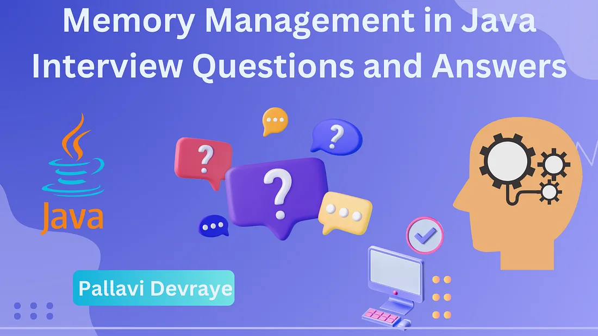
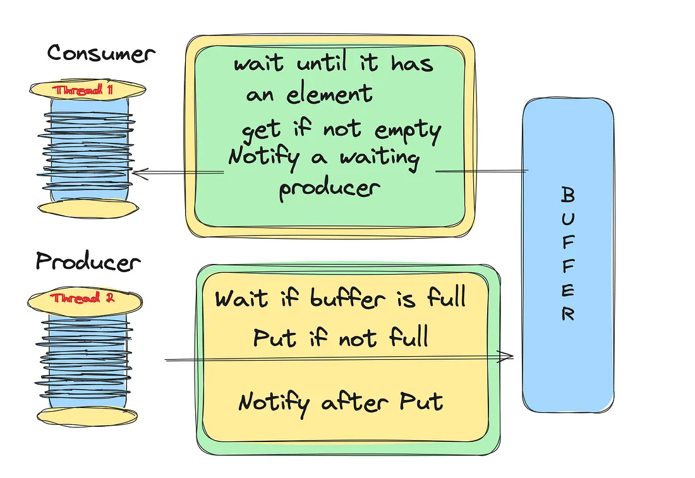

# Medium interview questions part 1

# **Mastering Generics in Java <>. Interview Questions**

**What are Generics in Java?**

Generics means **parameterized types**. Generics allow you to create classes, interfaces, and methods that operate on types specified as parameters. Using generics, you can write code that works with different types while enforcing compile-time type safety.

**Example Without Generics:**

```
List list = new ArrayList();
list.add("Hello");
String s = (String) list.get(0); // Must cast to String
```

**With Generics:**

```
List<String> list = new ArrayList<>();
list.add("Hello");
String s = list.get(0); // No casting needed, type safety is ensured
```

**Why Use Generics?**

1. **Type Safety:** Generics allow you to catch type errors at compile time, reducing the chance of ClassCastException.

```
// Without Generics, we can store any type of objects.
List list = new ArrayList();
list.add(10);
list.add("10");

// With Generics, it is required to specify the type of object we need to store.
List<Integer> list = new ArrayList<Integer>();
list.add(10);
list.add("10");// compile-time error
```

2. **Elimination of Casting:** No need to cast when retrieving elements, as the compiler already knows the type.

```
// Before Generics, we need to type cast.
List list = new ArrayList();
list.add("hello");
String s = (String) list.get(0); //typecasting

// After Generics, we don't need to typecast the object.
List<String> list = new ArrayList<String>();
list.add("hello");
String s = list.get(0);
```

3. **Code Reusability:** You can write a single class or method that works with any data type, making your code more flexible and reusable.

```
import java.util.Arrays;

public class GenericSorting {

  public static void main(String[] args) {
    Integer[] a = {76, 55, 58, 23, 6, 50};
    Character[] c = {'v', 'g', 'a', 'c', 'x', 'd', 't'};
    String[] s = {"Vali", "Ali", "Ahmed", "Aysu", "Leman", "Orkhan", "Lale"};

    System.out.print("Sorted Integer array :  ");
    bubbleSort(a);

    System.out.print("Sorted Character array :  ");
    bubbleSort(c);

    System.out.print("Sorted String array :  ");
    bubbleSort(s);

  }

  public static <T extends Comparable<T>> void bubbleSort(T[] array) {
    for (int i = 0; i < array.length - 1; i++) {
      for (int j = 0; j < array.length - i - 1; j++) {
        if (array[j].compareTo(array[j + 1]) > 0) {
          swap(j, j + 1, array);
        }
      }
    }

    System.out.println(Arrays.toString(array));
  }

  public static <T> void swap(int i, int j, T[] a) {
    T t = a[i];
    a[i] = a[j];
    a[j] = t;
  }

}

// Output:
Sorted Integer array :  [6, 23, 50, 55, 58, 76]
Sorted Character array :  [a, c, d, g, t, v, x]
Sorted String array :  [Ahmed, Ali, Aysu, Lale, Leman, Orkhan, Vali]
```

**Generic Classes**Generic classes allow you to define classes that can work with any type specified by the user.

**Syntax:**

```
class Box<T> {
    private T item;

    public void setItem(T item) {
        this.item = item;
    }

    public T getItem() {
        return item;
    }
}
```

In this example, T is a type parameter that can be replaced with any type when creating an instance of Box.

**Usage:**

```
Box<String> stringBox = new Box<>();
stringBox.setItem("Hello");
System.out.println(stringBox.getItem());
```

**Generic Methods**Generic methods allow you to define methods with type parameters, letting them work with any type specified at runtime.

**Syntax:**

```
public class GenericsExample {
    public static <T> void printArray(T[] array) {
        for (T element : array) {
            System.out.println(element);
        }
    }
}
```

**Usage:**

```
Integer[] intArray = {1, 2, 3};
String[] strArray = {"Hello", "World"};

GenericsExample.printArray(intArray);
GenericsExample.printArray(strArray);
```

**Examples of Generics**

1. **Mutually Recursive Type Variable Bounds**

```
interface ConvertibleTo<T> {
    T convert();
}

class ReprChange<T extends ConvertibleTo<S>,
                 S extends ConvertibleTo<T>> {
    T t;

    void set(S s) { t = s.convert();    }
    S    get()    { return t.convert(); }
}
```

**2. Nested Generic Classes**

```
class Seq<T> {
  T head;
  Seq<T> tail;

  Seq() {
    this(null, null);
  }

  Seq(T head, Seq<T> tail) {
    this.head = head;
    this.tail = tail;
  }

  boolean isEmpty() {
    return tail == null;
  }

  class Zipper<S> {
    Seq<Pair<T, S>> zip(Seq<S> that) {
      if (isEmpty() || that.isEmpty()) {
        return new Seq<>();
      }
      Seq<T>.Zipper<S> tailZipper = tail.new Zipper<>();
      return new Seq<>(new Pair<>(head, that.head), tailZipper.zip(that.tail));
    }
  }
}

class Pair<T, S> {
  T fst;
  S snd;

  Pair(T f, S s) {
    fst = f;
    snd = s;
  }
}

class Test {
  public static void main(String[] args) {
    Seq<String> strs = new Seq<>("a", new Seq<>("b", new Seq<>()));
    Seq<Number> nums = new Seq<>(1, new Seq<>(1.5, new Seq<>()));

    Seq<String>.Zipper<Number> zipper = strs.new Zipper<Number>();

    Seq<Pair<String, Number>> combined = zipper.zip(nums);
  }
}
```

**3. Multiple Bounds**

```
interface IoeThrowingSupplier<S> {
  S get();
}

public class Generics {

  public static <S extends Readable & Closeable,
                 T extends Appendable & Closeable>
  void copy(IoeThrowingSupplier<S> src,
            IoeThrowingSupplier<T> tgt,
            int size) throws IOException {

    try (S s = src.get(); T t = tgt.get()) {
      CharBuffer buf = CharBuffer.allocate(size);
      int i = s.read(buf);
      while (i >= 0) {
        buf.flip(); // prepare buffer for writing
        t.append(buf);
        buf.clear(); // prepare buffer for reading
        i = s.read(buf);
      }
    }

  }

}
```

**Type parameters in Generics**The type parameters naming conventions are important to learn generics thoroughly. The common type parameters are as follows:

- T — Type
- E — Element
- K — Key
- N — Number
- V — Value

**Bounded Type Parameters**

Generics can also restrict the types that can be used, known as “bounded types.”

**Syntax:**

```
public <T extends Number> void printDouble(T number) {
    System.out.println(number.doubleValue());
}
```

**Explanation:** Here, <T extends Number> means that T must be a subclass of Number, so only types like Integer, Double, Float, etc., are allowed.

**Usage:**

```
printDouble(5);       // Works with Integer
printDouble(5.5);     // Works with Double
// printDouble("Hello"); // Compile-time error, String is not a subclass of Number
```

**Wildcards (?)**

Wildcards are represented by a question mark ?, and they allow unknown types in generics. There are three main types of wildcards:

1. **Unbounded Wildcard (**<?>**):** Accepts any type.

```
List<?> list = new ArrayList<String>();
list = new ArrayList<Integer>(); // Works with any type
```

2. **Upper-Bounded Wildcard (**<? extends Type>**):** Accepts a type or any subtype.

```
public void printNumbers(List<? extends Number> list) {
    for (Number n : list) {
        System.out.println(n);
    }
}
```

3. **Lower-Bounded Wildcard (**<? super Type>**):** Accepts a type or any supertype.

```
public void addNumbers(List<? super Integer> list) {
    list.add(10); // You can add Integer or its subclass
}
```

Differences **List, List<T>, List<Object>, List<?>, and List<Student>.**


Each version of List parameter has unique use cases:

- Raw ****List: Rarely used due to lack of type safety.
- List<T>: Most flexible and type-safe, commonly used in generic methods.
- List<Object>: Less flexible, limited to Object type.
- List<?>: Useful for read-only methods that accept any list type.
- List<Student>: Strong type safety for specific types.

**Common Interview Questions on Java Generics**

1. **What are generics and why are they useful?**

*Generics allow classes and methods to operate on any specified type, making code type-safe and reusable. They prevent runtime type errors and reduce the need for casting.*

2. **What is type erasure?**

*Type erasure is a process where generic types are removed at runtime, replaced by their bounds or Object. This allows backward compatibility with older Java versions but means you can’t use type parameters at runtime.[https://www.baeldung.com/java-type-erasure](https://www.baeldung.com/java-type-erasure)*

3. **What is the difference between** <? extends T> **and** <? super T>**?**

***<? extends T>** allows any type that is a subtype of T and is used for **read-only** operations (you can’t add elements safely).*

***<? super T>** allows any type that is a supertype of T and is used for **write-only** operations (you can add elements safely, but reading may give Object).*

4. **Can you use primitive types with generics?**

*No, Java Generics work only with reference types. You need to use wrapper classes (like Integer for int, Double for double) instead.*

5. **How do bounded type parameters improve type safety?**

*Bounded types allow you to specify constraints on types, ensuring that generics work only with types that meet certain criteria (like extends Number), reducing runtime errors.*

6. **What’s the difference between** List<Object> **and** List<?>**?**

***List<Object>** can accept only Object types and cannot be assigned a list of a specific type (like List<String>).*

***List<?>** can accept any type, so it is more flexible but restricted in adding elements.*

7. **Why can’t we create a generic array in Java (e.g.,** T[] array = new T[10];**)?**

*Java prevents the creation of generic arrays due to type erasure, which makes it unsafe. Instead, you can use Object[] and cast as needed or use collections.*

8. **What is PECS in Generics?**

***PECS** stands for **Producer Extends, Consumer Super**. When you want to **produce** items from a collection, use <? extends T>. When you want to **consume** items, use <? super T>.*

9. What Is Type Inference?

Type inference is when the compiler can look at the type of a method argument to infer a generic type. For example, if we passed in *T* to a method which returns *T,* then the compiler can figure out the return type. Let’s try this out by invoking our generic method from the previous question:

```
Integer inferredInteger = returnType(1);
String inferredString = returnType("String");"); background-repeat: no-repeat; background-position: center center; background-color: rgb(99, 177, 117);">Copy
```

As we can see, there’s no need for a cast, and no need to pass in any generic type argument. The argument type only infers the return type.



Memory management is a crucial aspect of Java programming, and understanding it is vital for writing efficient and performant code. Here are some of the most important interview questions regarding memory management in Java, along with detailed explanations and code examples where applicable.

# **1. What is the Java Memory Model?**

Answer: The Java Memory Model (JMM) defines how threads interact through memory and what behaviors are allowed in a multithreaded environment. It specifies the interaction between the main memory and the local memory (CPU cache).

Key Points:

- The JMM ensures visibility of changes to variables across threads.
- It defines the rules for synchronizing access to memory.
- It is important for understanding how to write thread-safe code.

# **2. Describe the different parts of the Java heap memory.**

Answer: Java heap memory is divided into several parts:

1. Young Generation:

- Eden Space: Where new objects are allocated.
- Survivor Spaces (S0 and S1): Objects that survive garbage collection in Eden are moved here.

2. Old Generation (Tenured):

- Objects that survive multiple garbage collection cycles in the Young Generation are promoted here.

3. Metaspace (formerly PermGen):

- Stores class metadata and other static content.

Example:

```
public class MemoryAllocationExample {
    public static void main(String[] args) {
        // Object allocation in Eden space
        Object obj1 = new Object();
        Object obj2 = new Object();

        // Objects may be moved to Survivor space after GC
        System.gc();

        // Long-lived objects may be moved to Old Generation
        List<Object> longLivedObjects = new ArrayList<>();
        for (int i = 0; i < 1000; i++) {
            longLivedObjects.add(new Object());
        }
    }
}
```

# **3. What is garbage collection in Java?**

Answer: Garbage collection (GC) is the process by which the JVM automatically reclaims memory by deleting objects that are no longer reachable in the application.

Key Points:

- It helps in managing memory efficiently by removing unused objects.
- The main types of GC algorithms are Serial, Parallel, CMS (Concurrent Mark-Sweep), and G1 (Garbage-First).

# **4. How does the garbage collector know which objects to collect?**

Answer: The garbage collector uses several algorithms to determine which objects are no longer reachable:

1. Reference Counting:

- Counts references to each object, but can lead to issues with cyclic references.

2. Tracing (Mark and Sweep):

- Marks all reachable objects and then sweeps through the heap to collect unmarked objects.

3. Generational GC:

- Based on the generational hypothesis that most objects die young. It divides the heap into different generations (Young and Old).

# **5. Explain the concept of “Stop-the-world” in Java garbage collection.**

Answer: “Stop-the-world” refers to the pause in application execution when the garbage collector runs. During this time, all application threads are stopped to allow the GC to perform its work.

Example:

```
public class StopTheWorldExample {
    public static void main(String[] args) {
        Runtime runtime = Runtime.getRuntime();
        System.out.println("Total Memory: " + runtime.totalMemory());
        System.out.println("Free Memory: " + runtime.freeMemory());

        // Trigger a GC
        System.gc();

        // GC may cause a stop-the-world pause
        System.out.println("Free Memory after GC: " + runtime.freeMemory());
    }
}
```

# **6. What are the different types of references in Java?**

Answer: Java provides different types of references to manage memory more flexibly:

1. Strong Reference:

- Standard reference type that prevents the object from being collected.

2. Soft Reference:

- Used for memory-sensitive caches. Objects are collected only when the JVM runs out of memory.

3. Weak Reference:

- Used for implementing canonicalizing mappings. Objects are collected when there are no strong or soft references.

4. Phantom Reference:

- Used to schedule post-mortem cleanup actions. Objects are collected but the reference is enqueued.

Example:

```
import java.lang.ref.*;

public class ReferenceExample {
    public static void main(String[] args) {
        // Strong Reference
        String strongRef = new String("Strong Reference");

        // Soft Reference
        SoftReference<String> softRef = new SoftReference<>(new String("Soft Reference"));

        // Weak Reference
        WeakReference<String> weakRef = new WeakReference<>(new String("Weak Reference"));

        // Phantom Reference
        ReferenceQueue<String> queue = new ReferenceQueue<>();
        PhantomReference<String> phantomRef = new PhantomReference<>(new String("Phantom Reference"), queue);

        System.gc();

        // Soft reference might still be accessible if there's enough memory
        if (softRef.get() != null) {
            System.out.println("Soft Reference: " + softRef.get());
        }

        // Weak reference will likely be collected
        if (weakRef.get() == null) {
            System.out.println("Weak Reference has been collected");
        }

        // Phantom reference is always null
        System.out.println("Phantom Reference: " + phantomRef.get());
    }
}
```

# **7. What is the difference between the `finalize()` method and the `Cleaner`/`PhantomReference`?**

Answer:

`finalize()` Method:

- Called by the garbage collector before an object is collected.
- Deprecated due to unpredictable behavior and performance issues.

Cleaner/PhantomReference:

- Introduced to provide a more reliable way to clean up resources.
- `Cleaner` can be used to register cleanup actions.
- `PhantomReference` allows actions to be scheduled after the object is collected.

Example:

```
import java.lang.ref.Cleaner;

public class CleanerExample {
    private static final Cleaner cleaner = Cleaner.create();

    static class Resource implements Runnable {
        @Override
        public void run() {
            System.out.println("Cleaning up resources...");
        }
    }

    public static void main(String[] args) {
        Cleaner.Cleanable cleanable = cleaner.register(new Object(), new Resource());

        System.gc();
    }
}
```

# **8. How does the JVM manage memory in terms of stack and heap?**

Answer:

- Stack Memory: Used for storing method call frames, including local variables and function call details. Each thread has its own stack.
- Heap Memory: Used for dynamic memory allocation of objects. Shared among all threads.

Example:

```
public class StackHeapExample {
    public static void main(String[] args) {
        int localVariable = 42; // Stored in stack

        MyObject obj = new MyObject(); // Stored in heap
        obj.display();
    }
}

class MyObject {
    void display() {
        System.out.println("Hello, World!");
    }
}
```

# **9. What is a memory leak in Java, and how can it be prevented?**

Answer: A memory leak in Java occurs when objects that are no longer needed are not properly garbage collected because references to them still exist.

Prevention:

- Ensure references to unused objects are removed.
- Use tools like Eclipse MAT or VisualVM to analyze heap dumps.
- Be cautious with static fields, collections, and event listeners.

Example:

```
public class MemoryLeakExample {
    private static List<Object> leakList = new ArrayList<>();

    public static void main(String[] args) {
        for (int i = 0; i < 10000; i++) {
            leakList.add(new Object());
        }
    }
}
```

# **10. Explain the concept of the `OutOfMemoryError` in Java.**

Answer: `OutOfMemoryError` is thrown when the JVM cannot allocate an object due to insufficient memory.

Causes:

- Excessive memory usage.
- Memory leaks.
- Inadequate heap size configuration.

Example:

```
public class OutOfMemoryErrorExample {
    public static void main(String[] args) {
        try {
            List<int[]> arrays = new ArrayList<>();
            while (true) {
                arrays.add(new int[1000000]);
            }
        } catch (OutOfMemoryError e) {
            System.err.println("Out of memory error caught: " + e.getMessage());
        }
    }
```

# **Best Practices for Securing REST APIs in Java Applications**

As RESTful APIs become increasingly prevalent in modern software development, ensuring their security is paramount. Java, being a widely-used language for building web applications, requires careful attention to security practices when implementing REST APIs. In this comprehensive guide, we’ll explore best practices for securing REST APIs in Java applications, covering authentication, authorization, input validation, and more.

## **1. Authentication:**

Utilize industry-standard authentication mechanisms such as OAuth 2.0 or JWT (JSON Web Tokens) for securing REST APIs.

Implement robust authentication filters or interceptors to validate user credentials before allowing access to protected resources.Consider using HTTPS to encrypt communication between clients and servers to prevent eavesdropping and data tampering.

Implement multi-factor authentication (MFA) to add an extra layer of security, requiring users to verify their identity using multiple factors such as passwords, biometrics, or one-time codes.

Consider incorporating third-party authentication providers like Google Sign-In or OAuth providers such as Facebook or GitHub for seamless and secure authentication.

Implement session management techniques such as token expiration and token revocation to mitigate the risk of session hijacking or token theft.

## **2. Authorization:**

Implement role-based access control (RBAC) or attribute-based access control (ABAC) to enforce access policies based on user roles or specific attributes.

Use annotations or interceptors to enforce authorization rules at the method or endpoint level.

Regularly review and update access control policies to ensure that only authorized users can access sensitive resources.

Use dynamic authorization techniques such as policy-based access control (PBAC) to enforce fine-grained access control policies based on contextual attributes such as time of day, location, or device type.

Implement attribute-based access control (ABAC) using frameworks like Apache Shiro or Spring Security to define access policies based on user attributes and environmental conditions.

Regularly audit and review access control configurations to ensure that permissions are aligned with business requirements and least privilege principles.

## **3. Input Validation:**

Validate and sanitize all incoming data to prevent injection attacks such as SQL injection or cross-site scripting (XSS).

Use input validation libraries like Hibernate Validator or Apache Commons Validator to enforce data integrity and prevent security vulnerabilities.

Implement strict data validation rules to reject any malicious or malformed input from clients.

Validate input data at multiple layers of the application stack, including client-side validation, server-side validation, and database validation, to mitigate the risk of data manipulation attacks.

Implement positive security controls to validate input data against a predefined set of allowed values or patterns, reducing the risk of injection and tampering attacks.

Utilize input validation libraries with built-in protection against common vulnerabilities such as OWASP ESAPI (Enterprise Security API) to ensure consistent and comprehensive input validation.

## **4. Cross-Origin Resource Sharing (CORS):**

Configure CORS policies to restrict access to REST APIs from unauthorized domains and prevent cross-origin attacks.

Whitelist trusted domains and define acceptable HTTP methods and headers to mitigate potential security risks associated with cross-origin requests.

Implement CORS preflight requests and response headers to enforce browser-based access controls and prevent cross-origin attacks such as cross-site request forgery (CSRF) and cross-site scripting (XSS).

Leverage CORS configuration options to define granular access policies, including allowed origins, methods, and headers, based on the specific requirements of the application.

Consider using a reverse proxy or API gateway to centralize CORS configuration and provide additional security features such as request filtering and rate limiting.

## **5. Rate Limiting and Throttling:**

Implement rate limiting and throttling mechanisms to prevent abuse and protect against denial-of-service (DoS) attacks.

Use tools like Spring Security Rate Limiting or API gateway solutions to control the rate of incoming requests from clients.

Implement adaptive rate limiting algorithms based on client behavior and system load to dynamically adjust rate limits and prevent abuse without impacting legitimate users.

Monitor and analyze API usage patterns to identify abnormal or suspicious activity indicative of potential security threats, such as brute force attacks or API scraping.

Implement automated alerting and response mechanisms to notify administrators of anomalous behavior and trigger proactive mitigation measures such as IP blocking or CAPTCHA challenges.

## **6. Logging and Monitoring:**

Enable comprehensive logging to record all API requests and responses, including user authentication details and access control decisions.

Integrate monitoring tools to detect and respond to suspicious activities or security breaches in real-time.

Regularly review logs and monitor system metrics to identify potential security vulnerabilities or performance issues.

Encrypt sensitive information in log files, such as user credentials or personal data, using strong encryption algorithms and key management practices to protect against unauthorized access.

Implement log aggregation and analysis tools to centralize log data from multiple sources and perform real-time threat detection and incident response.

Integrate anomaly detection algorithms and machine learning techniques into monitoring systems to identify patterns indicative of security breaches or abnormal behavior.

## **7. Secure Communication:**

Encrypt sensitive data transmitted over the network using TLS (Transport Layer Security) to prevent interception and tampering by attackers.

Disable insecure protocols and cipher suites to ensure that only secure communication channels are used for REST API interactions.

Implement certificate pinning or mutual TLS authentication for additional security when communicating with trusted clients or servers.

Implement Perfect Forward Secrecy (PFS) to ensure that session keys are ephemeral and cannot be compromised even if long-term private keys are compromised in the future.

Use certificate transparency logs to monitor and validate SSL/TLS certificates issued for domain names associated with REST APIs, reducing the risk of certificate misissuance and fraudulent certificates.Regularly update SSL/TLS configurations and cryptographic libraries to address vulnerabilities and weaknesses identified through security research and industry best practices.

## **Conclusion:**

Securing REST APIs in Java applications requires a multi-layered approach encompassing authentication, authorization, input validation, and other security measures. By following best practices and staying informed about emerging threats and vulnerabilities, developers can build robust and secure RESTful APIs to protect sensitive data and ensure the integrity of their applications.

# **Understanding RestTemplate in Java Spring: When and How to Use It**

`RestTemplate` is a class provided by the Spring Framework that simplifies the process of making HTTP requests and handling responses. It abstracts away much of the boilerplate code typically associated with making HTTP calls, making it easier to interact with RESTful web services.

# **Getting Started with RestTemplate**

## **Adding Dependencies**

To use `RestTemplate`, you need to include the Spring Web dependency in your `pom.xml` file if you're using Maven:

```
<dependency>
    <groupId>org.springframework.boot</groupId>
    <artifactId>spring-boot-starter-web</artifactId>
</dependency>
```

For Gradle, add the following dependency to your `build.gradle` file:

```
implementation 'org.springframework.boot:spring-boot-starter-web'
```

## **Creating a RestTemplate Bean**

It’s a common practice to define a `RestTemplate` bean in your Spring configuration class so that it can be injected wherever needed:

```
import org.springframework.context.annotation.Bean;
import org.springframework.context.annotation.Configuration;
import org.springframework.web.client.RestTemplate;

@Configuration
public class AppConfig {

    @Bean
    public RestTemplate restTemplate() {
        return new RestTemplate();
    }
}
```

# **Making HTTP Requests with RestTemplate**

## **GET Request**

To perform a GET request, you can use the `getForObject` or `getForEntity` methods. Here’s an example:

```
import org.springframework.beans.factory.annotation.Autowired;
import org.springframework.stereotype.Service;
import org.springframework.web.client.RestTemplate;

@Service
public class RestTemplateService {

    @Autowired
    private RestTemplate restTemplate;

    public String getPost(int id) {
        String url = "https://jsonplaceholder.typicode.com/posts/" + id;
        return restTemplate.getForObject(url, String.class);
    }
}
```

## **POST Request**

For a POST request, you can use the `postForObject` or `postForEntity` methods. Here’s how to send a JSON payload:

```
import org.springframework.beans.factory.annotation.Autowired;
import org.springframework.stereotype.Service;
import org.springframework.web.client.RestTemplate;

import java.util.HashMap;
import java.util.Map;

@Service
public class RestTemplateService {

    @Autowired
    private RestTemplate restTemplate;

    public String createPost() {
        String url = "https://jsonplaceholder.typicode.com/posts";

        Map<String, String> request = new HashMap<>();
        request.put("title", "foo");
        request.put("body", "bar");
        request.put("userId", "1");

        return restTemplate.postForObject(url, request, String.class);
    }
}
```

## **PUT Request**

For updating resources, you can use the `put` method:

```
import org.springframework.beans.factory.annotation.Autowired;
import org.springframework.stereotype.Service;
import org.springframework.web.client.RestTemplate;

import java.util.HashMap;
import java.util.Map;

@Service
public class RestTemplateService {

    @Autowired
    private RestTemplate restTemplate;

    public void updatePost(int id) {
        String url = "https://jsonplaceholder.typicode.com/posts/" + id;

        Map<String, String> request = new HashMap<>();
        request.put("title", "updated title");
        request.put("body", "updated body");

        restTemplate.put(url, request);
    }
}
```

## **DELETE Request**

To delete a resource, use the `delete` method:

```
import org.springframework.beans.factory.annotation.Autowired;
import org.springframework.stereotype.Service;
import org.springframework.web.client.RestTemplate;

@Service
public class RestTemplateService {

    @Autowired
    private RestTemplate restTemplate;

    public void deletePost(int id) {
        String url = "https://jsonplaceholder.typicode.com/posts/" + id;
        restTemplate.delete(url);
    }
}
```

# **Handling Responses**

`RestTemplate` provides several methods to handle responses. The simplest is `getForObject`, which directly returns the response body. Alternatively, `getForEntity` returns a `ResponseEntity` that contains more details, such as the response headers and status code.

```
import org.springframework.beans.factory.annotation.Autowired;
import org.springframework.http.ResponseEntity;
import org.springframework.stereotype.Service;
import org.springframework.web.client.RestTemplate;

@Service
public class RestTemplateService {

    @Autowired
    private RestTemplate restTemplate;

    public ResponseEntity<String> getPostEntity(int id) {
        String url = "https://jsonplaceholder.typicode.com/posts/" + id;
        return restTemplate.getForEntity(url, String.class);
    }
}
```

# **Customizing RestTemplate**

## **Timeout Configuration**

You can configure timeouts for the underlying HTTP client used by `RestTemplate`:

```
import org.apache.http.impl.client.CloseableHttpClient;
import org.apache.http.impl.client.HttpClients;
import org.apache.http.impl.conn.PoolingHttpClientConnectionManager;
import org.springframework.context.annotation.Bean;
import org.springframework.context.annotation.Configuration;
import org.springframework.http.client.HttpComponentsClientHttpRequestFactory;
import org.springframework.web.client.RestTemplate;

@Configuration
public class AppConfig {

    @Bean
    public RestTemplate restTemplate() {
        HttpComponentsClientHttpRequestFactory factory = new HttpComponentsClientHttpRequestFactory();
        factory.setReadTimeout(5000);
        factory.setConnectTimeout(5000);

        return new RestTemplate(factory);
    }
}
```

## **Interceptors**

You can add interceptors to manipulate requests and responses:

```
import org.springframework.context.annotation.Bean;
import org.springframework.context.annotation.Configuration;
import org.springframework.http.client.ClientHttpRequestInterceptor;
import org.springframework.http.client.ClientHttpResponse;
import org.springframework.web.client.RestTemplate;

import java.io.IOException;
import java.util.Collections;

@Configuration
public class AppConfig {

    @Bean
    public RestTemplate restTemplate() {
        RestTemplate restTemplate = new RestTemplate();
        restTemplate.setInterceptors(Collections.singletonList(new CustomClientHttpRequestInterceptor()));
        return restTemplate;
    }

    class CustomClientHttpRequestInterceptor implements ClientHttpRequestInterceptor {

        @Override
        public ClientHttpResponse intercept(HttpRequest request, byte[] body, ClientHttpRequestExecution execution) throws IOException {
            // Modify request here
            ClientHttpResponse response = execution.execute(request, body);
            // Modify response here
            return response;
        }
    }
}
```

# **When to Use RestTemplate in Your Java Spring Application**

`RestTemplate` is a well-established utility in the Spring framework, designed to simplify the interaction with RESTful web services. Despite the introduction of `WebClient` in Spring 5, which offers a more modern, reactive approach, there are still scenarios where `RestTemplate` remains a viable and sometimes preferable choice. This article discusses when to use `RestTemplate` in your Java Spring applications.

# **Scenarios for Using RestTemplate**

1. **Simple, Synchronous HTTP Requests**
- If your application requires simple HTTP requests and responses without the need for advanced features like non-blocking I/O or reactive programming, `RestTemplate` is an excellent choice. Its synchronous nature and straightforward API make it easy to perform basic HTTP operations.

```
@Service
public class SimpleRestClientService {
    @Autowired
    private RestTemplate restTemplate;

    public String getSimpleData() {
        String url = "https://api.example.com/data";
        return restTemplate.getForObject(url, String.class);
    }
}
```

**2. Legacy Systems and Existing Codebases**

- If you are maintaining or extending a legacy system that already uses `RestTemplate`, it makes sense to continue using it for consistency. Refactoring to `WebClient` may introduce unnecessary complexity and potential bugs.

**3. Applications with Low to Moderate Load**

- For applications that do not need to handle a large number of simultaneous requests, `RestTemplate`’s synchronous blocking nature is sufficient. It simplifies the codebase without the need for managing asynchronous calls.

```
@Service
public class ModerateLoadService {
    @Autowired
    private RestTemplate restTemplate;

    public String getModerateLoadData(int id) {
        String url = "https://api.example.com/resource/" + id;
        return restTemplate.getForObject(url, String.class);
    }
}
```

4. **Testing and Prototyping**

- `RestTemplate` is ideal for quickly prototyping and testing new features or services. Its simplicity allows for rapid development without the overhead of configuring a more complex client like `WebClient`.

```
@RestController
public class PrototypeController {
    @Autowired
    private RestTemplate restTemplate;

    @GetMapping("/test")
    public String testEndpoint() {
        String url = "https://jsonplaceholder.typicode.com/posts/1";
        return restTemplate.getForObject(url, String.class);
    }
}
```

**5. Blocking APIs and Third-Party Services**

- When integrating with third-party services or APIs that are inherently blocking, `RestTemplate` can be a suitable choice. The nature of these APIs means that using a non-blocking client may not provide significant benefits.

```
@Service
public class ThirdPartyService {
    @Autowired
    private RestTemplate restTemplate;

    public String getThirdPartyData() {
        String url = "https://thirdparty.api/resource";
        return restTemplate.getForObject(url, String.class);
    }
}
```

# **Considerations and Limitations**

While `RestTemplate` is suitable for the scenarios mentioned above, it is important to consider its limitations:

- **Blocking Nature**: `RestTemplate` is synchronous and blocks the executing thread until the request completes. This can be a drawback for high-throughput or latency-sensitive applications.
- **Deprecation**: With the introduction of `WebClient`, `RestTemplate` is no longer the preferred choice for new developments. Spring team recommends using `WebClient` for non-blocking and reactive applications.
- **Lack of Advanced Features**: `RestTemplate` lacks some advanced features and flexibility provided by `WebClient`, such as better handling of non-blocking I/O and reactive streams.

# **Essential Interview Questions and Answers on Docker for Java Developers**

Docker has become an integral tool for Java developers, streamlining the development, testing, and deployment processes through containerization. Here are some essential Docker interview questions and answers tailored for Java developers to help you prepare for your next technical interview.

## **1. What is Docker and why is it useful for Java developers?**

**Answer**: Docker is an open-source platform that automates the deployment, scaling, and management of applications within lightweight containers. For Java developers, Docker provides an isolated environment that ensures consistent behavior across different stages of development, testing, and production. It simplifies dependency management, eliminates environment discrepancies, and enhances CI/CD workflows.

## **2. What are the key components of Docker architecture?**

**Answer**: The key components of Docker architecture include:

- Docker Client: The command-line interface to interact with Docker.
- Docker Daemon (dockerd): The background service running on the host machine that manages Docker objects (images, containers, networks, and volumes).
- Docker Images: Read-only templates used to create containers, often built from a Dockerfile.
- Docker Containers: The runnable instances of Docker images, containing everything needed to run an application.
- Docker Registry: A repository for storing and distributing Docker images, such as Docker Hub

## **3. What is a Dockerfile and how is it used?**

**Answer**: A Dockerfile is a script composed of a series of instructions to assemble a Docker image. It defines the base image, application dependencies, environment variables, and commands to run the application.

**Example**:

```
# Use an official OpenJDK runtime as a parent image
FROM openjdk:11-jre-slim

# Set the working directory in the container
WORKDIR /app

# Copy the current directory contents into the container at /app
COPY . /app

# Compile and package the application using Maven
RUN ./mvnw package

# Specify the JAR file to run
CMD ["java", "-jar", "target/my-java-app.jar"]
```

## **4. How do you create and run a Docker image for a Java application?**

**Answer**: To create a Docker image, write a Dockerfile and then use the `docker build` command. To run the image, use the `docker run` command.

**Example**:

```
# Build the Docker image
docker build -t my-java-app .

# Run the Docker container
docker run -d -p 8080:8080 my-java-app
```

This command builds an image named `my-java-app` and runs a container mapping port 8080 of the host to port 8080 of the container.

## **5. How do you use `COPY` and `ADD` instructions in a Dockerfile?**

Answer: Both `COPY` and `ADD` instructions are used to copy files and directories into a Docker image, but they have different functionalities:

- `COPY`: Copies files and directories from the host to the container.
- `ADD`: Offers all the features of `COPY`, but also supports extracting TAR files and downloading files from URLs.

Example:

```
COPY myapp.jar /app/
ADD http://example.com/config.yaml /app/config.yaml
```

## **6. What is `docker-compose` and how is it useful for Java developers?**

**Answer**: `docker-compose` is a tool for defining and running multi-container Docker applications. It uses a YAML file to configure the application’s services, networks, and volumes, making it easier to manage complex applications that require multiple containers.

**Example**: `docker-compose.yml`:

```
version: '3'
services:
  app:
    image: my-java-app
    ports:
      - "8080:8080"
    depends_on:
      - db
  db:
    image: mysql:5.7
    environment:
      MYSQL_ROOT_PASSWORD: example
      MYSQL_DATABASE: testdb
```

Running with Docker Compose:

```
docker-compose up
```

## **7. How do you persist data in Docker containers?**

**Answer**: To persist data in Docker containers, use Docker volumes or bind mounts. Volumes are managed by Docker and are suitable for data persistence across container lifecycles.

**Example**:

```
docker run -d -p 8080:8080 -v mydata:/var/lib/mysql mysql:5.7
```

This command creates a named volume `mydata` and mounts it to `/var/lib/mysql` inside the container, ensuring data persistence.

## **8. What is the difference between Docker volumes and bind mounts?**

**Answer**:

- Docker Volumes: Managed by Docker, stored in a location controlled by Docker, and preferred for persisting data.
- Bind Mounts: Directly map a directory or file from the host filesystem to the container, providing direct access to the host’s files.

**Example**:

```
# Volume
docker run -v myvolume:/app/data my-java-app

# Bind Mount
docker run -v /path/on/host:/app/data my-java-app
```

## **9. How do you share a Docker image with others?**

**Answer**: To share a Docker image, push it to a Docker registry, such as Docker Hub.

**Example**:

1. Tag the image:

```
docker tag my-java-app username/my-java-app:latest
```

2. Push the image:

```
docker push username/my-java-app:latest
```

3. Others can pull the image using:

```
docker pull username/my-java-app:latest
```

## **10. How can you optimize the size of Docker images for Java applications?**

**Answer**: To optimize Docker image size for Java applications:

- Use multi-stage builds to separate the build environment from the runtime environment.
- Use a minimal base image, such as `alpine`.
- Remove unnecessary files and dependencies after building the application.

**Example**:

```
# Stage 1: Build
FROM maven:3.6.3-jdk-11 as builder
WORKDIR /app
COPY . /app
RUN mvn clean package

# Stage 2: Runtime
FROM openjdk:11-jre-slim
WORKDIR /app
COPY --from=builder /app/target/my-java-app.jar /app/
CMD ["java", "-jar", "my-java-app.jar"]
```

## **11. What are Docker networks and why are they important?**

**Answer**: Docker networks allow containers to communicate with each other, providing isolation and security for applications. Docker supports different types of networks:

- Bridge Network: The default network, suitable for containers running on a single host.
- Host Network: Removes network isolation between the container and the Docker host, using the host’s networking stack.
- Overlay Network: Enables communication between Docker containers across different hosts in a Docker Swarm or Kubernetes cluster.

**Example**:

```
# Create a custom bridge network
docker network create mynetwork

# Run containers on the custom network
docker run -d --network mynetwork --name app my-java-app
docker run -d --network mynetwork --name db mysql:5.7
```

## **12. How do you debug a running Docker container?**

**Answer**: To debug a running Docker container, you can use several commands:

- `docker logs [container_id]`: View the logs of a container.
- `docker exec -it [container_id] /bin/bash`: Access the container's shell interactively.
- `docker inspect [container_id]`: Retrieve detailed information about a container.

Example:

```
# View container logs
docker logs my-java-app

# Access the container's shell
docker exec -it my-java-app /bin/bash

# Inspect container details
docker inspect my-java-app
```

## **13. What is Docker Swarm and how does it differ from Kubernetes?**

**Answer**: Docker Swarm is Docker’s native clustering and orchestration tool that enables the deployment and management of a swarm of Docker engines in a distributed environment. It provides features like scaling, load balancing, and service discovery.

Differences from Kubernetes:

- Complexity: Docker Swarm is easier to set up and use, while Kubernetes offers more advanced features and flexibility.
- Scaling: Kubernetes provides more robust and automatic scaling options.
- Ecosystem: Kubernetes has a larger ecosystem and community support with more integrations and tools.

**Example**:

```
# Initialize a Docker Swarm
docker swarm init

# Deploy a stack in the Swarm
docker stack deploy -c docker-compose.yml mystack
```

## **14. How can you secure Docker containers?**

**Answer**: To secure Docker containers, follow these best practices:

- Use official and trusted images.
- Regularly scan images for vulnerabilities.
- Run containers with the least privileges (use non-root users).
- Limit container capabilities using seccomp and AppArmor profiles.
- Use Docker secrets to manage sensitive information.
- Monitor container activity and apply network security policies.

**Example**:

```
# Use a non-root user in a Dockerfile
FROM openjdk:11-jre-slim
RUN useradd -ms /bin/bash javauser
USER javauser

# Run container with limited capabilities
docker run --cap-drop ALL --cap-add NET_BIND_SERVICE my-java-app
```

## **15. What are multi-stage builds in Docker, and how do they benefit Java applications?**

Answer: Multi-stage builds in Docker allow you to use multiple `FROM` statements in a Dockerfile, enabling the use of intermediate images to create the final image. This reduces the size of the final image by excluding unnecessary build tools and dependencies.

Benefits for Java Applications:

- Smaller image size by excluding build-time dependencies.
- Enhanced security by including only the runtime environment.
- Easier to maintain and update Dockerfiles.

**Example**:

```
# Stage 1: Build
FROM maven:3.6.3-jdk-11 as builder
WORKDIR /app
COPY . /app
RUN mvn clean package

# Stage 2: Runtime
FROM openjdk:11-jre-slim
WORKDIR /app
COPY --from=builder /app/target/my-java-app.jar /app/
CMD ["java", "-jar", "my-java-app.jar"]
```

# **16. What are differences Between Dockerization and Containerization**

Dockerization and containerization are often used interchangeably, but they have distinct meanings in the context of modern software development and deployment. Understanding these differences can help clarify how they are applied and their respective roles in application management.

## **Containerization**

**Definition**: Containerization is a technology that allows you to package an application and its dependencies together in a standardized unit called a container. Containers abstract the application layer away from the operating system and infrastructure, ensuring consistency across multiple environments.

Key Points:

- Technology-Agnostic: Containerization is a general concept and can be implemented using various container technologies such as Docker, LXC (Linux Containers), rkt, and others.
- Isolation: Containers provide process and file system isolation, ensuring that applications run independently without interfering with each other.
- Efficiency: Containers are lightweight and share the host OS kernel, making them more efficient than traditional virtual machines (VMs) which require separate OS instances.

Example Technologies:

- Docker
- LXC
- rkt (CoreOS)

## **Dockerization**

**Definition**: Dockerization specifically refers to the process of packaging an application and its dependencies into a Docker container. It involves creating a Dockerfile, building a Docker image, and running containers using Docker.

Key Points:

- Specific to Docker: Dockerization is a subset of containerization that uses Docker as the containerization platform.
- Docker Tools: Involves using Docker-specific tools and commands such as `docker build`, `docker run`, `docker-compose`, and `docker swarm`.
- Standardization: Docker provides a standardized environment and a vast ecosystem, making it the most popular containerization tool.

Example Process:

1. Create a Dockerfile: Define the application environment and dependencies

```
FROM openjdk:11-jre-slim
WORKDIR /app
COPY . /app
RUN ./mvnw package
CMD ["java", "-jar", "target/my-java-app.jar"]
```

2. Build the Docker Image: Use the Dockerfile to build the image.

```
docker build -t my-java-app .
```

3. Run the Docker Container: Run the container from the image.

```
docker run -d -p 8080:8080 my-java-app
```


# **Conclusion**

Docker greatly enhances the efficiency and consistency of Java application development and deployment. By understanding these key Docker concepts and commands, you can effectively manage containerized applications and streamline your development workflow. Prepare with these questions and answers to confidently address Docker-related queries in your next interview.

# **Mastering WebClient in Spring Boot: When and Why to Use It Over RestTemplate**

When developing Spring Boot applications, communicating with RESTful web services is a frequent requirement. Historically, developers have used **RestTemplate** for this purpose. However, with the advent of reactive programming and the need for more efficient resource utilization, **WebClient** has become the preferred choice. This article explores the differences between **RestTemplate** and **WebClient**, and highlights why WebClient is more suitable in modern applications with real-world examples.

# **When to Use RestTemplate?**

## **Definition of RestTemplate:**

**RestTemplate** is a synchronous, blocking client provided by Spring Framework for consuming RESTful web services. It executes requests and waits until the response is returned. While simple and widely used, its blocking nature makes it less suitable for high-throughput or low-latency applications.

## **Key Features of RestTemplate:**

- Synchronous and blocking.
- Easy to use for basic HTTP requests.
- Well-integrated with traditional Spring applications.

Despite the growing popularity of **WebClient**, **RestTemplate** continues to be a widely used option in many Spring Boot applications, especially in traditional, synchronous architectures. Below are scenarios where using **RestTemplate** is still valid and often preferable.

## **1. Synchronous Applications**

If your application is designed as a synchronous, blocking system where each operation waits for the previous one to complete, **RestTemplate** is sufficient and simpler to use. Examples include:

- Legacy systems that do not utilize reactive or asynchronous paradigms.
- Internal tools or systems with low traffic and minimal scalability needs.

## **2. Simple Use Cases**

For straightforward use cases like making one-off HTTP requests, downloading small files, or posting data to a service, **RestTemplate** offers ease of use:

- Quick implementation for CRUD operations.
- Integration with existing Spring MVC-based applications.

## **3. Legacy Systems**

Many older applications were built before the advent of WebClient and heavily rely on RestTemplate. Refactoring these applications to use WebClient might require significant effort with minimal immediate benefits:

- Applications following a monolithic architecture.
- Systems without performance bottlenecks where non-blocking I/O is unnecessary.

## **4. Limited Concurrency Requirements**

In applications with low concurrency requirements, where resource utilization is not a concern, **RestTemplate** is adequate:

- Internal enterprise applications with limited users.
- Batch jobs or ETL systems making periodic HTTP calls.

## **5. Testing and Prototyping**

For quick prototyping or testing APIs, RestTemplate is often favored due to its simplicity and low setup overhead.

# **Why Was RestTemplate Widely Used?**

1. **Historical Significance**:
- **RestTemplate** was introduced early in the Spring ecosystem and became a standard for HTTP communication in Spring applications before the rise of reactive programming.
- It was the default choice for consuming REST APIs in Spring for years, and many developers are familiar with it.

**2. Ease of Use**:

- RestTemplate’s straightforward API allows developers to perform common HTTP operations like `GET`, `POST`, `PUT`, and `DELETE` with minimal configuration.

**3. Strong Ecosystem Support**:

Many Spring Boot tutorials, guides, and examples have used RestTemplate, ensuring that developers have access to abundant resources and community support.

**4. Synchronous Nature**:

- Its blocking behavior aligns naturally with traditional programming paradigms, making it intuitive for developers transitioning from desktop or monolithic applications to web services.

**5. Mature and Stable**:

- RestTemplate is a mature and stable library, making it a reliable choice for many use cases.

# **When to Use WebClient?**

## **Definition of WebClient:**

**WebClient** is a non-blocking, reactive web client introduced as part of the Spring WebFlux framework. It is built to support asynchronous and streaming scenarios, making it ideal for applications requiring high concurrency and scalability.

## **Key Features of WebClient:**

- Asynchronous and non-blocking.
- Supports both synchronous and reactive programming.
- Suitable for streaming and real-time scenarios.
- Built-in support for functional-style programming.

**WebClient** is a powerful tool introduced in the **Spring WebFlux** module, designed for handling asynchronous, non-blocking HTTP requests. Its versatility, efficiency, and modern design make it ideal for a wide range of applications. Below is a detailed discussion of scenarios where WebClient shines and is the recommended choice.

## **1. Reactive and Non-Blocking Applications**

WebClient is the go-to choice when developing reactive applications. Reactive programming is designed to handle a large number of concurrent requests efficiently by leveraging non-blocking I/O. Use WebClient in the following cases:

- **Reactive APIs**: If your application uses **Reactor**, **RxJava**, or other reactive frameworks, WebClient integrates seamlessly.
- **Event-Driven Architectures**: Systems that rely on events, such as IoT platforms, benefit from the asynchronous capabilities of WebClient.

**Example**:

```
public Mono<User> fetchUser(String userId) {
    return WebClient.create()
        .get()
        .uri("https://api.example.com/users/{id}", userId)
        .retrieve()
        .bodyToMono(User.class);
}
```

## **2. Microservices Communication**

In microservices architecture, services often need to communicate with one another. WebClient enables efficient, high-throughput inter-service communication. It allows:

- **Concurrent Requests**: Send multiple requests simultaneously without blocking threads.
- **Low-Latency Responses**: Handle real-time data with reduced response times.

**Example**:

```
public Flux<Order> fetchUserOrders(String userId) {
    return WebClient.create()
        .get()
        .uri("https://orderservice.com/orders?userId=" + userId)
        .retrieve()
        .bodyToFlux(Order.class);
}
```

## **3. High-Concurrency Requirements**

For applications that need to handle many simultaneous requests, WebClient is ideal:

- It uses fewer threads compared to blocking clients like RestTemplate, resulting in better scalability.
- Suitable for applications with thousands of users or services running on constrained resources.

**Example Use Case**:

- Social media platforms with millions of users.
- E-commerce platforms handling a high volume of concurrent requests during sales events.

## **4. Streaming and Real-Time Data**

WebClient excels in handling streaming data and server-sent events (SSE). Use WebClient for applications requiring:

- **Data Streaming**: For example, consuming real-time stock price updates or sensor data.
- **Long-Lived Connections**: Handling WebSockets or SSE for applications like chats or live dashboards.

**Example**:

```
public Flux<StockPrice> streamStockPrices() {
    return WebClient.create()
        .get()
        .uri("https://api.example.com/stock-prices/stream")
        .retrieve()
        .bodyToFlux(StockPrice.class);
}
```

## **5. Handling Large Payloads**

Applications dealing with large file uploads/downloads or streaming large data sets should use WebClient because of its efficient resource utilization:

- Efficient memory handling due to its non-blocking I/O.
- Supports streaming data chunks without loading the entire content into memory.

**Example**:

```
public Flux<DataChunk> downloadLargeFile() {
    return WebClient.create()
        .get()
        .uri("https://api.example.com/largefile")
        .retrieve()
        .bodyToFlux(DataChunk.class);
}
```

## **6. Modernizing Legacy Systems**

As systems evolve, legacy synchronous applications are often modernized into asynchronous, reactive systems. WebClient is ideal for such transitions:

- Works seamlessly with legacy synchronous APIs while supporting a reactive design.
- Enables partial modernization by allowing some parts of the system to be reactive.

## **7. Fault Tolerance and Resilience**

WebClient integrates with libraries like **Resilience4j** to provide fault-tolerant, resilient communication:

- **Retries**: Retry failed requests automatically.
- **Circuit Breakers**: Prevent cascading failures in interconnected services.
- **Timeouts**: Configure timeouts to handle slow responses gracefully.

**Example**:

```
import io.github.resilience4j.circuitbreaker.CircuitBreaker;
import reactor.core.publisher.Mono;

CircuitBreaker circuitBreaker = CircuitBreaker.ofDefaults("myService");

public Mono<User> fetchUserWithResilience(String userId) {
    return WebClient.create()
        .get()
        .uri("https://api.example.com/users/{id}", userId)
        .retrieve()
        .bodyToMono(User.class)
        .transformDeferred(CircuitBreakerOperator.of(circuitBreaker));
}
```

## **8. Security and Token Management**

WebClient provides robust support for secure communication:

- **OAuth2 Integration**: Works with Spring Security for handling OAuth2 token management.
- **Custom Authentication**: Configure custom headers or tokens for secure communication.

**Example**:

```
public Mono<User> fetchUserWithToken(String userId, String token) {
    return WebClient.builder()
        .defaultHeader(HttpHeaders.AUTHORIZATION, "Bearer " + token)
        .build()
        .get()
        .uri("https://api.example.com/users/{id}", userId)
        .retrieve()
        .bodyToMono(User.class);
}
```

## **9. Testing and Mocking APIs**

WebClient is suitable for testing purposes as it integrates with mock servers like **WireMock**:

- Simulate API responses for integration testing.
- Test failure scenarios like timeouts or error codes.

**Example**:

```
@Test
public void testFetchUser() {
    WireMockServer wireMockServer = new WireMockServer();
    wireMockServer.start();
    wireMockServer.stubFor(get(urlEqualTo("/users/1"))
        .willReturn(aResponse()
            .withHeader("Content-Type", "application/json")
            .withBody("{\"id\":1,\"name\":\"John Doe\"}")));

    WebClient webClient = WebClient.create(wireMockServer.baseUrl());
    Mono<User> user = webClient.get().uri("/users/1").retrieve().bodyToMono(User.class);

    StepVerifier.create(user)
        .expectNextMatches(u -> u.getName().equals("John Doe"))
        .verifyComplete();

    wireMockServer.stop();
}
```

## **10. Cross-Platform Integrations**

WebClient’s flexibility allows it to integrate with diverse platforms and protocols:

- Consuming REST APIs, GraphQL endpoints, or SOAP services.
- Communicating with cloud platforms like AWS, Azure, or Google Cloud.

# **Why Use WebClient Over RestTemplate in a Spring Boot Application?**

When developing Spring Boot applications, communicating with RESTful web services is a frequent requirement. Historically, developers have used **RestTemplate** for this purpose. However, with the advent of reactive programming and the need for more efficient resource utilization, **WebClient** has become the preferred choice. This article explores the differences between **RestTemplate** and **WebClient**, and highlights why WebClient is more suitable in modern applications with real-world examples.

# **Why Choose WebClient Over RestTemplate?**

1. **Non-Blocking I/O**: WebClient uses a non-blocking model, which means threads are not held up while waiting for responses. This is particularly useful when multiple API calls are made concurrently.
2. **Support for Reactive Streams**: WebClient integrates seamlessly with reactive libraries like **Reactor** and **RxJava**, making it suitable for modern reactive architectures.
3. **Better Scalability**: Non-blocking behavior allows WebClient to handle more requests simultaneously without exhausting server threads.
4. **Modern and Extensible**: WebClient is more flexible and feature-rich, supporting advanced use cases like streaming large files, handling WebSocket connections, and multipart requests.

# **Real-Time Example: Comparing RestTemplate and WebClient**

## **Example 1: Fetching Data from an External API**

**Using RestTemplate**:

```
import org.springframework.web.client.RestTemplate;

public class RestTemplateExample {
    private RestTemplate restTemplate = new RestTemplate();

    public String getUserDetails(String userId) {
        String url = "https://api.example.com/users/" + userId;
        return restTemplate.getForObject(url, String.class);
    }
}
```

**Using WebClient**:

```
import org.springframework.web.reactive.function.client.WebClient;
import reactor.core.publisher.Mono;

public class WebClientExample {
    private WebClient webClient = WebClient.create();

    public Mono<String> getUserDetails(String userId) {
        String url = "https://api.example.com/users/" + userId;
        return webClient.get()
                        .uri(url)
                        .retrieve()
                        .bodyToMono(String.class);
    }
}
```

**Key Differences**:

- RestTemplate blocks until the API call completes.
- WebClient returns a `Mono`, allowing the application to process other tasks while waiting for the response.

## **Example 2: Concurrent API Calls**

**Using RestTemplate** (Inefficient in a multi-threaded environment):

```
import java.util.concurrent.ExecutorService;
import java.util.concurrent.Executors;

public class RestTemplateConcurrentExample {
    private RestTemplate restTemplate = new RestTemplate();

    public void fetchMultipleUsers(String[] userIds) {
        ExecutorService executor = Executors.newFixedThreadPool(userIds.length);
        for (String userId : userIds) {
            executor.submit(() -> {
                String url = "https://api.example.com/users/" + userId;
                String response = restTemplate.getForObject(url, String.class);
                System.out.println(response);
            });
        }
        executor.shutdown();
    }
}
```

**Using WebClient** (Efficient and elegant):

```
import reactor.core.publisher.Flux;

public class WebClientConcurrentExample {
    private WebClient webClient = WebClient.create();

    public Flux<String> fetchMultipleUsers(String[] userIds) {
        return Flux.fromArray(userIds)
                   .flatMap(userId -> webClient.get()
                                               .uri("https://api.example.com/users/" + userId)
                                               .retrieve()
                                               .bodyToMono(String.class));
    }
}
```

**Key Differences**:

- RestTemplate requires managing threads explicitly, increasing complexity.
- WebClient handles concurrency inherently, reducing boilerplate code.

# **Migrating from RestTemplate to WebClient**

To switch from RestTemplate to WebClient in your project:

1. Add the dependency:

```
<dependency>
    <groupId>org.springframework.boot</groupId>
    <artifactId>spring-boot-starter-webflux</artifactId>
</dependency>
```

2. Replace synchronous calls with reactive equivalents.

3. Update tests to handle reactive data types like `Mono` and `Flux`.

# **Conclusion**

WebClient is a powerful, versatile, and modern HTTP client for Spring Boot applications, enabling developers to build efficient, reactive, and scalable systems. It is best suited for high-concurrency environments, real-time data processing, microservices, and modern reactive applications. For projects starting today or migrating to a reactive paradigm, **WebClient is the clear choice**.

While RestTemplate is simpler and may suffice for small applications or legacy systems, **WebClient** is the go-to choice for modern, scalable, and reactive Spring Boot applications. It provides a more efficient way to interact with web services, especially in scenarios requiring high concurrency and low latency.

By embracing WebClient, developers can future-proof their applications and unlock the full potential of reactive programming.

- E-commerce platforms handling a high volume of concurrent requests during sales events.

# **Best Practices for Exception Logging in Spring Boot: Real-Time Examples**

Exception logging is a critical aspect of building resilient and maintainable Spring Boot applications. Effective logging not only helps in troubleshooting issues but also aids in monitoring the health of your application. This article explains best practices for exception logging in Spring Boot, illustrated with real-time examples.

## **1. Log Sufficient Context Information**

When logging exceptions, it’s essential to capture enough context to understand the circumstances of the error. This includes the exception message, stack trace, and relevant application state or parameters. Spring Boot provides various ways to log exceptions effectively.

**Example: Using `@ControllerAdvice` for Global Exception Handling**

Spring Boot’s `@ControllerAdvice` allows you to handle exceptions across the whole application in one global place.

```
import org.slf4j.Logger;
import org.slf4j.LoggerFactory;
import org.springframework.http.HttpStatus;
import org.springframework.http.ResponseEntity;
import org.springframework.web.bind.annotation.ControllerAdvice;
import org.springframework.web.bind.annotation.ExceptionHandler;
import org.springframework.web.context.request.WebRequest;

@ControllerAdvice
public class GlobalExceptionHandler {

    private static final Logger logger = LoggerFactory.getLogger(GlobalExceptionHandler.class);

    @ExceptionHandler(Exception.class)
    public ResponseEntity<Object> handleAllExceptions(Exception ex, WebRequest request) {
        // Log exception with context information
        logger.error("Exception occurred: {}, Request Details: {}", ex.getMessage(), request.getDescription(false), ex);
        return new ResponseEntity<>("An error occurred", HttpStatus.INTERNAL_SERVER_ERROR);
    }

    @ExceptionHandler(IllegalArgumentException.class)
    public ResponseEntity<Object> handleIllegalArgumentException(IllegalArgumentException ex, WebRequest request) {
        // Log specific exception
        logger.error("Invalid argument: {}, Request Details: {}", ex.getMessage(), request.getDescription(false), ex);
        return new ResponseEntity<>("Invalid argument", HttpStatus.BAD_REQUEST);
    }
}
```

In this example:

- We log the exception message, stack trace, and request details to provide full context.
- Different exception types can be handled specifically, ensuring precise logging and appropriate responses.

## **2. Use Appropriate Log Levels**

Choosing the right log level is crucial for effective logging. The log level should reflect the severity of the issue.

**Example: Configuring Log Levels with Logback**

Spring Boot uses Logback as the default logging framework. You can configure log levels in `application.yml` or `application.properties`.

```
logging:
  level:
    root: INFO
    com.example.yourpackage: DEBUG
    org.springframework.web: ERROR
```

In this configuration:

- The root logger is set to `INFO` level.
- Specific packages, such as your application package, can have different log levels (`DEBUG` in this case).
- Spring framework logs are set to `ERROR` level to reduce noise.

**Logging Examples with Different Levels**

```
import org.slf4j.Logger;
import org.slf4j.LoggerFactory;
import org.springframework.web.bind.annotation.GetMapping;
import org.springframework.web.bind.annotation.RequestMapping;
import org.springframework.web.bind.annotation.RestController;

@RestController
@RequestMapping("/api")
public class ExampleController {

    private static final Logger logger = LoggerFactory.getLogger(ExampleController.class);

    @GetMapping("/test")
    public String testLogging() {
        try {
            // Simulate an error
            throw new RuntimeException("Test exception");
        } catch (RuntimeException e) {
            // Log at different levels
            logger.debug("A debug message", e);
            logger.info("An informational message", e);
            logger.warn("A warning message", e);
            logger.error("An error message", e);
            throw e;
        }
    }
}
```

## **3. Centralize and Standardize Logging Configuration**

Centralizing your logging configuration ensures consistency and simplifies management. Spring Boot’s `application.yml` or `application.properties` can be used to manage logging configurations.

**Example: Centralized Logback Configuration**

Create a `logback-spring.xml` in your `src/main/resources` directory.

```
<configuration>
    <property name="LOG_FILE" value="app.log"/>
    <appender name="FILE" class="ch.qos.logback.core.rolling.RollingFileAppender">
        <file>${LOG_FILE}</file>
        <encoder>
            <pattern>%d{yyyy-MM-dd HH:mm:ss} - %msg%n</pattern>
        </encoder>
        <rollingPolicy class="ch.qos.logback.core.rolling.TimeBasedRollingPolicy">
            <fileNamePattern>app-%d{yyyy-MM-dd}.log</fileNamePattern>
            <maxHistory>30</maxHistory>
        </rollingPolicy>
    </appender>

    <root level="INFO">
        <appender-ref ref="FILE"/>
    </root>

    <logger name="com.example.yourpackage" level="DEBUG"/>
    <logger name="org.springframework.web" level="ERROR"/>
</configuration>
```

In this configuration:

- Logs are written to `app.log` with daily rolling.
- The root logger is set to `INFO`.
- Specific loggers have customized levels.

# **Java exception logging 3 rules :**

When it comes to exception logging in Java, there are several best practices that can significantly improve the maintainability and troubleshooting capabilities of your application.

Here are three important rules to follow:

# **1. Log Sufficient Context Information**

When logging exceptions, it’s crucial to include enough context information to understand what happened and why the exception occurred. This information is invaluable when diagnosing issues in production. Key details to include:

- **Exception Message**: Log the exception message itself, which provides a brief description of the error.
- **Stack Trace**: Always log the stack trace of the exception. This shows the sequence of method calls that led to the exception, helping to pinpoint the exact location and cause of the error.
- **Parameters and State**: Include relevant parameters and state information that led to the exception. This might include method parameters, object state, or any other contextual information that could aid in reproducing the issue.

Here’s an example of logging an exception with sufficient context information using the `java.util.logging` package:

```
import java.util.logging.*;

public class ExceptionLoggingExample {

    private static final Logger logger = Logger.getLogger(ExceptionLoggingExample.class.getName());

    public void doSomething() {
        try {
            // Code that may throw an exception
            throw new IllegalArgumentException("Invalid argument provided");
        } catch (IllegalArgumentException e) {
            // Log the exception with sufficient context information
            logger.log(Level.SEVERE, "An error occurred: " + e.getMessage(), e);
        }
    }

    public static void main(String[] args) {
        ExceptionLoggingExample example = new ExceptionLoggingExample();
        example.doSomething();
    }
}
```

In this example:

- We catch an `IllegalArgumentException`.
- We log the exception message (`e.getMessage()`), stack trace (`e`), and a custom message (`"An error occurred: "`).

# **2. Use Appropriate Log Levels**

Choose the appropriate log level based on the severity of the exception and its impact on the application:

- **SEVERE**: Use for critical errors that require immediate attention and likely indicate a failure in the current operation.
- **WARNING**: Use for unexpected situations that are recoverable or for conditions that could potentially lead to errors if not addressed.
- **INFO** or **DEBUG**: Use for less critical exceptions or for informational purposes. These may include handled exceptions or events that are part of normal operation.

Using the correct log level ensures that the logs are both informative and actionable without cluttering the log files with unnecessary details.

# **3. Centralize and Standardize Logging Configuration**

Centralizing and standardizing your logging configuration simplifies management and ensures consistency across your application. Consider the following practices:

- **Use a Logging Framework**: Use a logging framework like Log4j, Logback, or java.util.logging for more advanced logging features and flexibility.
- **Configure Log Levels**: Set appropriate log levels for different packages and classes to control the verbosity of logging output.
- **Output Logs to Centralized Location**: Store logs in a centralized location or use a logging aggregation service (e.g., ELK stack, Splunk) for easier monitoring and analysis.
- **Handle Logging Failures**: Ensure robust error handling around logging operations to prevent cascading failures if logging itself encounters an issue.

Here’s a basic example using Log4j for logging:

```
import org.apache.logging.log4j.LogManager;
import org.apache.logging.log4j.Logger;

public class Log4jExample {

    private static final Logger logger = LogManager.getLogger(Log4jExample.class);

    public void doSomething() {
        try {
            // Code that may throw an exception
            throw new NullPointerException("Null value encountered");
        } catch (NullPointerException e) {
            // Log the exception with Log4j
            logger.error("An error occurred: {}", e.getMessage(), e);
        }
    }

    public static void main(String[] args) {
        Log4jExample example = new Log4jExample();
        example.doSomething();
    }
}
```

In this example:

- We use Log4j for logging.
- We log an `NullPointerException` with the error level (`logger.error`), providing the exception message and the exception itself.

By following these rules, you ensure that your exception logging is effective, informative, and aids in diagnosing and resolving issues in your Java applications.

# **Conclusion**

Effective exception logging in Spring Boot involves capturing sufficient context information, using appropriate log levels, and centralizing logging configurations. These practices ensure that your application logs are useful for monitoring, troubleshooting, and maintaining your application. By following these best practices, you can significantly improve the observability and reliability of your Spring Boot applications.

# **Essential Interview Questions and Answers on Background Processing in Spring Boot**

Background processing is a critical aspect of many applications, and Spring Boot provides robust support for handling such tasks. Here are some important interview questions on background processing in Spring Boot, along with detailed answers and code examples.

# **1. What is background processing in the context of Spring Boot?**

Answer: Background processing refers to executing tasks asynchronously or periodically without blocking the main application flow. It is essential for tasks such as sending emails, processing files, generating reports, etc.

# **2. How can you enable asynchronous processing in a Spring Boot application?**

Answer: To enable asynchronous processing, you need to use the `@EnableAsync` annotation on a configuration class and the `@Async` annotation on methods that should run asynchronously.

Example:

```
import org.springframework.boot.SpringApplication;
import org.springframework.boot.autoconfigure.SpringBootApplication;
import org.springframework.context.annotation.Bean;
import org.springframework.context.annotation.Configuration;
import org.springframework.scheduling.annotation.EnableAsync;
import org.springframework.scheduling.annotation.Async;
import org.springframework.scheduling.concurrent.ThreadPoolTaskExecutor;

import java.util.concurrent.Executor;

@SpringBootApplication
public class AsyncApplication {
    public static void main(String[] args) {
        SpringApplication.run(AsyncApplication.class, args);
    }
}

@Configuration
@EnableAsync
class AsyncConfig {
    @Bean(name = "taskExecutor")
    public Executor taskExecutor() {
        ThreadPoolTaskExecutor executor = new ThreadPoolTaskExecutor();
        executor.setCorePoolSize(2);
        executor.setMaxPoolSize(2);
        executor.setQueueCapacity(500);
        executor.setThreadNamePrefix("AsyncThread-");
        executor.initialize();
        return executor;
    }
}

import org.springframework.stereotype.Service;

@Service
public class AsyncService {
    @Async("taskExecutor")
    public void executeAsyncTask() {
        System.out.println("Executing task in thread: " + Thread.currentThread().getName());
    }
}
```

# **3. What is the difference between `@Async` and `@Scheduled` in Spring Boot?**

Answer:

- `@Async` is used for executing methods asynchronously, i.e., in a separate thread without blocking the main thread.
- `@Scheduled` is used for executing methods at specific intervals or schedules, i.e., periodic execution.

# **4. How do you schedule a task in Spring Boot?**

Answer: You can schedule a task using the `@Scheduled` annotation. You also need to enable scheduling by using the `@EnableScheduling` annotation on a configuration class.

Example:

```
import org.springframework.boot.SpringApplication;
import org.springframework.boot.autoconfigure.SpringBootApplication;
import org.springframework.context.annotation.Configuration;
import org.springframework.scheduling.annotation.EnableScheduling;
import org.springframework.scheduling.annotation.Scheduled;

@SpringBootApplication
public class ScheduledApplication {
    public static void main(String[] args) {
        SpringApplication.run(ScheduledApplication.class, args);
    }
}

@Configuration
@EnableScheduling
class SchedulingConfig {
}

import org.springframework.stereotype.Service;

@Service
public class ScheduledService {
    @Scheduled(fixedRate = 5000)
    public void performTask() {
        System.out.println("Scheduled task executed at: " + System.currentTimeMillis());
    }
}
```

# **5. How do you configure a thread pool for scheduling tasks in Spring Boot?**

Answer: You can configure a thread pool for scheduling tasks by defining a `TaskScheduler` bean.

```
import org.springframework.context.annotation.Bean;
import org.springframework.context.annotation.Configuration;
import org.springframework.scheduling.annotation.EnableScheduling;
import org.springframework.scheduling.concurrent.ThreadPoolTaskScheduler;

@Configuration
@EnableScheduling
public class SchedulingConfig {
    @Bean
    public ThreadPoolTaskScheduler taskScheduler() {
        ThreadPoolTaskScheduler scheduler = new ThreadPoolTaskScheduler();
        scheduler.setPoolSize(10);
        scheduler.setThreadNamePrefix("ScheduledTask-");
        return scheduler;
    }
}
```

# **6. How can you handle errors in asynchronous methods?**

Answer: Errors in asynchronous methods can be handled by using a custom `AsyncUncaughtExceptionHandler`.

Example:

```
import org.springframework.aop.interceptor.AsyncUncaughtExceptionHandler;
import org.springframework.context.annotation.Configuration;
import org.springframework.scheduling.annotation.AsyncConfigurer;
import org.springframework.scheduling.annotation.EnableAsync;

import java.lang.reflect.Method;
import java.util.concurrent.Executor;

@Configuration
@EnableAsync
public class AsyncConfig implements AsyncConfigurer {
    @Override
    public Executor getAsyncExecutor() {
        ThreadPoolTaskExecutor executor = new ThreadPoolTaskExecutor();
        executor.setCorePoolSize(2);
        executor.setMaxPoolSize(2);
        executor.setQueueCapacity(500);
        executor.setThreadNamePrefix("AsyncThread-");
        executor.initialize();
        return executor;
    }

    @Override
    public AsyncUncaughtExceptionHandler getAsyncUncaughtExceptionHandler() {
        return new CustomAsyncExceptionHandler();
    }
}

class CustomAsyncExceptionHandler implements AsyncUncaughtExceptionHandler {
    @Override
    public void handleUncaughtException(Throwable throwable, Method method, Object... obj) {
        System.err.println("Exception message - " + throwable.getMessage());
        System.err.println("Method name - " + method.getName());
        for (Object param : obj) {
            System.err.println("Parameter value - " + param);
        }
    }
}
```

# **7. How can you handle errors in scheduled methods?**

Answer: Errors in scheduled methods can be handled by wrapping the method body with try-catch blocks.

Example:

```
import org.springframework.scheduling.annotation.Scheduled;
import org.springframework.stereotype.Service;

@Service
public class ScheduledService {
    @Scheduled(fixedRate = 5000)
    public void performTask() {
        try {
            // Task execution logic
            System.out.println("Scheduled task executed at: " + System.currentTimeMillis());
        } catch (Exception e) {
            // Error handling logic
            System.err.println("Error occurred: " + e.getMessage());
        }
    }
}
```

# **8. What are the different types of scheduling options available in `@Scheduled`?**

Answer: The `@Scheduled` annotation supports several scheduling options:

- `fixedRate`: Executes the task at a fixed interval, specified in milliseconds.
- `fixedDelay`: Executes the task with a fixed delay between the completion of the last invocation and the start of the next.
- `cron`: Executes the task based on a cron expression.

# **9. Can you give an example of a cron expression in `@Scheduled`?**

Answer: A cron expression specifies the schedule using a string format. Here is an example that runs a task every day at 2 AM:

Example:

```
import org.springframework.scheduling.annotation.Scheduled;
import org.springframework.stereotype.Service;

@Service
public class ScheduledService {
    @Scheduled(cron = "0 0 2 * * ?")
    public void performTask() {
        System.out.println("Scheduled task executed at: " + System.currentTimeMillis());
    }
}
```

# **10. What are the key differences between `fixedRate` and `fixedDelay` in `@Scheduled`?**

Answer:

- `fixedRate`: The interval between method invocations, measured from the start time of each invocation.
- `fixedDelay`: The interval between method invocations, measured from the completion time of each invocation.

Example:

```
import org.springframework.scheduling.annotation.Scheduled;
import org.springframework.stereotype.Service;

@Service
public class ScheduledService {
    @Scheduled(fixedRate = 5000)
    public void performTaskWithFixedRate() {
        System.out.println("Fixed rate task executed at: " + System.currentTimeMillis());
    }

    @Scheduled(fixedDelay = 5000)
    public void performTaskWithFixedDelay() {
        System.out.println("Fixed delay task executed at: " + System.currentTimeMillis());
    }
}
```

These questions and answers cover key concepts and practical implementations of background processing in Spring Boot, providing a comprehensive understanding for interview preparation.

# **Handling Background Processing in Spring Boot**

In modern applications, background processing is essential for handling tasks such as sending emails, processing files, generating reports, and more. Spring Boot provides several mechanisms for implementing background tasks efficiently. This article explores various methods for handling background processing in Spring Boot, including asynchronous methods, scheduling tasks, and using messaging systems.

# **1. Asynchronous Methods**

Spring Boot allows you to execute methods asynchronously using the @Async annotation. This is useful for tasks that can run independently of the main thread, such as sending emails or calling external APIs.

**Setup:**

## **1. Enable Async Support:**

Enable asynchronous processing by adding the @EnableAsync annotation to a configuration class.

```
   @Configuration
   @EnableAsync
   public class AsyncConfig {
   }
```

**2. Define Asynchronous Methods:**

Annotate the methods you want to run asynchronously with @Async .

```
 @Service
   public class EmailService {

       @Async
       public void sendEmail(String recipient, String message) {
           // Simulate email sending logic
           try {
               Thread.sleep(5000);
           } catch (InterruptedException e) {
               Thread.currentThread().interrupt();
           }
           System.out.println("Email sent to " + recipient);
       }
   }
```

**3. Call Asynchronous Methods:**

```
@RestController
   public class EmailController {

       @Autowired
       private EmailService emailService;

       @PostMapping("/send-email")
       public ResponseEntity<String> sendEmail(@RequestParam String recipient, @RequestParam String message) {
           emailService.sendEmail(recipient, message);
           return ResponseEntity.ok("Email request accepted");
       }
   }
```

# **2. Scheduling Tasks**

Spring Boot provides scheduling capabilities to run tasks periodically or at specific intervals using the @Scheduled annotation.

**Setup:**

**1. Enable Scheduling:**

Enable scheduling by adding the **@EnableScheduling** annotation to a configuration class.

```
   @Configuration
   @EnableScheduling
   public class SchedulingConfig {
   }
```

**2. Define Scheduled Methods:**

Annotate the methods you want to run on a schedule with @Scheduled.

```
@Service
   public class ReportService {

       @Scheduled(fixedRate = 60000)
       public void generateReport() {
           // Simulate report generation logic
           System.out.println("Report generated at " + LocalDateTime.now());
       }
   }
```

**3. Scheduling Options:**

- **fixedRate**: Runs the method at a fixed interval (e.g., every 60 seconds).
- **fixedDelay:** Runs the method with a fixed delay between the end of the last invocation and the start of the next.
- **cron:** Uses a cron expression to define the schedule.

Example:

```
  @Scheduled(cron = "0 0 * * * ?")
   public void generateDailyReport() {
       System.out.println("Daily report generated at " + LocalDateTime.now());
   }
```

# **3. Using Messaging Systems**

For more complex background processing needs, especially when tasks need to be distributed across multiple instances or services, using a messaging system like RabbitMQ or Kafka can be highly effective.

**Setup with RabbitMQ:**

**1. Add Dependencies:**

Include the RabbitMQ starter in your **pom.xml** or **build.gradle**.

```
 <dependency>
       <groupId>org.springframework.boot</groupId>
       <artifactId>spring-boot-starter-amqp</artifactId>
   </dependency>
```

**2. Configure RabbitMQ:**

Configure RabbitMQ connection settings in **application.properties**.

```
   spring.rabbitmq.host=localhost
   spring.rabbitmq.port=5672
   spring.rabbitmq.username=guest
   spring.rabbitmq.password=guest
```

**3. Define a Message Listener:**

```
 @Service
   public class TaskListener {

       @RabbitListener(queues = "taskQueue")
       public void handleTask(String task) {
           // Process the task
           System.out.println("Processing task: " + task);
       }
   }
```

**4. Send Messages:**

```
   @Service
   public class TaskSender {

       @Autowired
       private RabbitTemplate rabbitTemplate;

       public void sendTask(String task) {
           rabbitTemplate.convertAndSend("taskQueue", task);
       }
   }
```

**5. Controller to Trigger Tasks:**

```
 @RestController
   public class TaskController {

       @Autowired
       private TaskSender taskSender;

       @PostMapping("/send-task")
       public ResponseEntity<String> sendTask(@RequestParam String task) {
           taskSender.sendTask(task);
           return ResponseEntity.ok("Task sent to queue");
       }
   }
```

# **4. Using Executor Services**

Spring Boot also supports the use of `ExecutorService` for more advanced threading needs. You can define custom executors and manage thread pools effectively.

## **Setup:**

1. **Define a Task Executor:**

```
@Configuration
   public class ExecutorConfig {

       @Bean
       public Executor taskExecutor() {
           ThreadPoolTaskExecutor executor = new ThreadPoolTaskExecutor();
           executor.setCorePoolSize(5);
           executor.setMaxPoolSize(10);
           executor.setQueueCapacity(25);
           executor.setThreadNamePrefix("MyExecutor-");
           executor.initialize();
           return executor;
       }
   }
```

**2. Use the Executor in Services:**

```
 @Service
   public class FileProcessingService {

       @Autowired
       private Executor taskExecutor;

       public void processFiles(List<File> files) {
           for (File file : files) {
               taskExecutor.execute(() -> processFile(file));
           }
       }

       private void processFile(File file) {
           // File processing logic
           System.out.println("Processing file: " + file.getName());
       }
   }
```

# **Best Practices for Handling Background Processing in Spring Boot**

Effective background processing is critical for building robust, scalable, and responsive Spring Boot applications. Here are some best practices to follow when handling background tasks in Spring Boot:

## **1. Use the Right Tool for the Job**

Spring Boot offers several ways to handle background processing, including `@Async`, `@Scheduled`, and messaging systems like RabbitMQ or Kafka. Choose the appropriate tool based on your requirements:

- **Simple asynchronous tasks:** Use `@Async`.**Periodic tasks:** Use `@Scheduled`.**Complex workflows or distributed tasks:** Use a messaging system like RabbitMQ or Kafka.

## **2. Manage Thread Pools Effectively**

Proper thread management is crucial to avoid resource exhaustion and ensure optimal performance. Configure thread pools to handle concurrent tasks efficiently:

- **Define custom thread pools:**

```
@Configuration
  public class ExecutorConfig {

      @Bean
      public Executor taskExecutor() {
          ThreadPoolTaskExecutor executor = new ThreadPoolTaskExecutor();
          executor.setCorePoolSize(10);
          executor.setMaxPoolSize(20);
          executor.setQueueCapacity(50);
          executor.setThreadNamePrefix("MyExecutor-");
          executor.initialize();
          return executor;
      }
  }
```

- **Avoid large pool sizes: E**xcessively large thread pools can lead to resource contention. Balance the number of threads with your system’s capacity.

## **3. Handle Exceptions Properly**

Uncaught exceptions in background tasks can lead to unexpected application behavior or crashes. Always handle exceptions gracefully:

- **Use try-catch blocks:**

```
 @Async
  public void sendEmail(String recipient, String message) {
      try {
          // Email sending logic
      } catch (Exception e) {
          // Handle exception
      }
  }
```

- **Use a custom async exception handler:**

```
 @Configuration
  public class AsyncConfig implements AsyncConfigurer {

      @Override
      public Executor getAsyncExecutor() {
          ThreadPoolTaskExecutor executor = new ThreadPoolTaskExecutor();
          executor.setCorePoolSize(10);
          executor.setMaxPoolSize(20);
          executor.setQueueCapacity(50);
          executor.setThreadNamePrefix("MyExecutor-");
          executor.initialize();
          return executor;
      }

      @Override
      public AsyncUncaughtExceptionHandler getAsyncUncaughtExceptionHandler() {
          return (throwable, method, obj) -> {
              // Handle exception
          };
      }
  }
```

## **4. Leverage Spring’s Transaction Management**

Background tasks often involve database operations. Ensure data consistency by leveraging Spring’s transaction management:

- **Use `@Transactional` for methods that modify the database:**

```
 @Service
  public class UserService {

      @Transactional
      public void saveUser(User user) {
          userRepository.save(user);
      }
  }
```

- **Combine transactions with asynchronous processing carefully:** Ensure that asynchronous methods are not dependent on the caller’s transaction context unless specifically designed.

## **5. Monitor and Log Background Tasks**

Monitoring and logging are essential for understanding the performance and health of background tasks:

- **Use proper logging: I**nclude logging statements to track the progress and outcome of background tasks.

```
  @Async
  public void sendEmail(String recipient, String message) {
      try {
          logger.info("Sending email to {}", recipient);
          // Email sending logic
          logger.info("Email sent to {}", recipient);
      } catch (Exception e) {
          logger.error("Error sending email to {}", recipient, e);
      }
  }
```

- **Integrate with monitoring tools:** Use tools like Spring Boot Actuator, Prometheus, or Grafana to monitor task execution and system performance.

## **6. Optimize Performance**

Optimize the performance of your background tasks to ensure they do not adversely affect the application’s responsiveness:

- **Avoid blocking operations:** Prefer non-blocking I/O operations and asynchronous programming models where possible.
- **Tune JVM and garbage collection settings:** Optimize the JVM settings to improve the performance of background tasks.

## **7. Handle Task Dependencies and Coordination**

For complex workflows, ensure proper task coordination and handle dependencies between tasks effectively:

- **Use orchestration frameworks:** Consider using orchestration frameworks like Spring Batch or a workflow engine like Camunda for complex task workflows.
- **Ensure idempotency:** Design tasks to be idempotent where possible to handle retries gracefully without side effects

## **8. Ensure Idempotency and Retries**

Background tasks, especially those involving external systems or networks, should be idempotent to handle retries gracefully:

- **Design for idempotency:** Ensure that tasks can be retried without adverse effects or data corruption.
- **Implement retry logic:** Use Spring Retry or similar mechanisms to handle transient failures.

```
  @Retryable(value = { SomeTransientException.class }, maxAttempts = 3, backoff = @Backoff(delay = 2000))
  public void performTask() {
      // Task logic
  }
```

## **9. Secure Background Processing**

Security is critical in background processing, especially when dealing with sensitive data or performing privileged operations:

- **Secure sensitive operations:** Ensure that background tasks involving sensitive data are secure and comply with security best practices.
- **Use proper authentication and authorization:** Ensure that background tasks run with appropriate permissions and access controls.

## **10. Graceful Shutdown**

Ensure that your application can shut down gracefully, allowing background tasks to complete or be safely interrupted:

- **Implement graceful shutdown:** Configure thread pools and executors to allow tasks to complete during a shutdown.

```
 @PreDestroy
  public void onDestroy() {
      executor.shutdown();
      try {
          if (!executor.awaitTermination(60, TimeUnit.SECONDS)) {
              executor.shutdownNow();
          }
      } catch (InterruptedException e) {
          executor.shutdownNow();
      }
  }
```

## **Conclusion:**

Spring Boot provides a variety of tools and techniques for handling background processing, catering to different needs and complexities. Whether you need simple asynchronous methods, scheduled tasks, or distributed processing using messaging systems, Spring Boot has robust support to make background processing straightforward and efficient. By leveraging these capabilities, you can ensure that your applications remain responsive and scalable, efficiently managing time-consuming tasks in the background.

# **Essential Spring Data Questions and Answers for Java Developers**

Spring Data is a pivotal project within the Spring Framework ecosystem. Spring Data simplifies the data access layer of your Spring applications, providing a consistent way to interact with various data stores. In this article, we cover some of the essential questions and answers that Java developers should know to effectively use Spring Data.

## **1. What is Spring Data and how does it simplify database interactions in Spring applications?**

**Answer**: Spring Data is a part of the Spring Framework that aims to simplify the data access layer in applications. It provides a consistent and easy-to-use approach to accessing and managing data from various data sources (such as relational databases, NoSQL databases, and others) using a repository abstraction layer. It eliminates boilerplate code, allowing developers to focus on the logic specific to their application.

## **2. What are Spring Data Repositories?**

**Answer**: Types of Spring Data Repositories:

**1. CrudRepository:** The `CrudRepository` interface provides CRUD functionality for the entity class that is being managed. It includes methods like `save()`, `findById()`, `findAll()`, `count()`, `deleteById()`, etc.

```
import org.springframework.data.repository.CrudRepository;

public interface UserRepository extends CrudRepository<User, Long> {
    List<User> findByLastName(String lastName);
}
```

**2**. **PagingAndSortingRepository:** The `PagingAndSortingRepository` extends `CrudRepository` and adds methods to handle pagination and sorting. Methods like `findAll(Pageable pageable)` and `findAll(Sort sort)` are included.

```
import org.springframework.data.repository.PagingAndSortingRepository;

public interface UserRepository extends PagingAndSortingRepository<User, Long> {
    Page<User> findByLastName(String lastName, Pageable pageable);
}
```

**3. JpaRepository:** The `JpaRepository` extends `PagingAndSortingRepository` and includes additional methods specific to JPA, such as methods for batch operations. This is the most commonly used repository interface for JPA-based applications.

```
import org.springframework.data.jpa.repository.JpaRepository;

public interface UserRepository extends JpaRepository<User, Long> {
    List<User> findByEmail(String email);
}
```

**4. Other Specific Repositories:** Spring Data provides specific repository interfaces for various data stores, such as `MongoRepository` for MongoDB, `CassandraRepository` for Cassandra, and `ElasticsearchRepository` for Elasticsearch. These interfaces provide methods tailored to the particular data store.

```
import org.springframework.data.mongodb.repository.MongoRepository;

public interface UserRepository extends MongoRepository<User, String> {
    List<User> findByFirstName(String firstName);
}
```

## **3. What is the role of the `@Repository` annotation?**

**Answer:** The `@Repository` annotation is a specialization of the `@Component` annotation, used to indicate that the class is a repository (a mechanism for encapsulating storage, retrieval, and search behavior). It also allows Spring to translate database-related exceptions into Spring's data access exceptions (a feature known as exception translation).

## **4. How do you define a simple repository in Spring Data JPA?**

**Answer:** Here’s an example of a simple repository for an entity `User`:

```
import org.springframework.data.jpa.repository.JpaRepository;

public interface UserRepository extends JpaRepository<User, Long> {
    List<User> findByLastName(String lastName);
}
```

## **5. What are derived query methods in Spring Data?**

**Answer**: Derived query methods in Spring Data JPA are methods in a repository interface that derive their queries from the method name. The method name contains the property names of the entity, and Spring Data parses it to generate the query. For example:

```
import java.util.List;
import org.springframework.data.jpa.repository.JpaRepository;

public interface UserRepository extends JpaRepository<User, Long> {
    List<User> findByLastName(String lastName);
    List<User> findByAgeGreaterThanEqual(int age);
    List<User> findByFirstNameAndLastName(String firstName, String lastName);
}
```

## **6. What is the `@Query` annotation and when would you use it?**

**Answer**: The `@Query` annotation allows you to define JPQL (Java Persistence Query Language) or SQL queries directly on repository methods. This is useful when the query is complex or cannot be derived from the method name. Here's an example:

```
import org.springframework.data.jpa.repository.JpaRepository;
import org.springframework.data.jpa.repository.Query;
import org.springframework.data.repository.query.Param;

public interface UserRepository extends JpaRepository<User, Long> {

    @Query("SELECT u FROM User u WHERE u.email = :email")
    User findByEmail(@Param("email") String email);
}
```

## **7. How does pagination and sorting work in Spring Data JPA?**

**Answer**: Pagination and sorting are supported by extending the `PagingAndSortingRepository` or `JpaRepository`. You can use the `Pageable` and `Sort` objects to control these features. Here's an example:

```
import org.springframework.data.domain.Page;
import org.springframework.data.domain.Pageable;
import org.springframework.data.jpa.repository.JpaRepository;

public interface UserRepository extends JpaRepository<User, Long> {

    Page<User> findByLastName(String lastName, Pageable pageable);
}
```

And to use this in a service or controller:

```
import org.springframework.beans.factory.annotation.Autowired;
import org.springframework.data.domain.Page;
import org.springframework.data.domain.PageRequest;
import org.springframework.data.domain.Sort;
import org.springframework.stereotype.Service;

@Service
public class UserService {

    @Autowired
    private UserRepository userRepository;

    public Page<User> getUsersByLastName(String lastName, int page, int size) {
        Pageable pageable = PageRequest.of(page, size, Sort.by("firstName").ascending());
        return userRepository.findByLastName(lastName, pageable);
    }
}
```

## **8. What are custom repository implementations? / How do you implement custom methods in a Spring Data repository?**

**Answer**: If you need custom behavior that cannot be achieved by derived queries or the `@Query` annotation, you can provide a custom implementation for your repository. This involves creating an interface for custom methods and providing an implementation for it.

```
// Custom repository interface
public interface CustomUserRepository {
    List<User> findUsersByCustomCriteria();
}

// Implementation of custom repository
import javax.persistence.EntityManager;
import javax.persistence.PersistenceContext;
import javax.persistence.TypedQuery;
import java.util.List;

public class CustomUserRepositoryImpl implements CustomUserRepository {

    @PersistenceContext
    private EntityManager entityManager;

    @Override
    public List<User> findUsersByCustomCriteria() {
        String jpql = "SELECT u FROM User u WHERE ..."; // custom JPQL query
        TypedQuery<User> query = entityManager.createQuery(jpql, User.class);
        return query.getResultList();
    }
}

// Extending repository with custom methods
import org.springframework.data.jpa.repository.JpaRepository;

public interface UserRepository extends JpaRepository<User, Long>, CustomUserRepository {
    // Other query methods
}
```

## **9. How does Spring Data handle transactions?**

**Answer**: Spring Data repositories are transactional by default. The `@Transactional` annotation is used to define transaction boundaries. By default, CRUD methods in repositories are transactional. For custom methods or service methods, you can explicitly use the `@Transactional` annotation.

```
import org.springframework.stereotype.Service;
import org.springframework.transaction.annotation.Transactional;

@Service
public class UserService {

    @Autowired
    private UserRepository userRepository;

    @Transactional
    public void saveUser(User user) {
        userRepository.save(user);
        // Other transactional operations
    }
}
```

## **10. What is the role of the `@Entity` annotation?**

Answer: The `@Entity` annotation specifies that the class is an entity and is mapped to a database table. It is a JPA annotation and is a prerequisite for Spring Data JPA to manage and persist the entity. Here is an example:

```
import javax.persistence.Entity;
import javax.persistence.Id;

@Entity
public class User {

    @Id
    private Long id;
    private String firstName;
    private String lastName;
    private String email;

    // Getters and setters
}
```

## **11. How does Spring Data JPA handle relationships between entities?**

**Answer**: Spring Data JPA handles relationships between entities using JPA annotations to define the type of relationship and how the entities are connected. Here are examples of each relationship type:

**@OneToOne:** A one-to-one relationship where each instance of Entity A is related to one instance of Entity B.

```
@Entity
public class User {
    @Id
    private Long id;
    private String firstName;

    @OneToOne
    private Profile profile;

    // Getters and setters
}

@Entity
public class Profile {
    @Id
    private Long id;
    private String bio;

    @OneToOne(mappedBy = "profile")
    private User user;

    // Getters and setters
}
```

**@OneToMany:** A one-to-many relationship where one instance of Entity A is related to multiple instances of Entity B.

```
@Entity
public class User {
    @Id
    private Long id;
    private String firstName;

    @OneToMany(mappedBy = "user")
    private List<Post> posts;

    // Getters and setters
}

@Entity
public class Post {
    @Id
    private Long id;
    private String content;

    @ManyToOne
    @JoinColumn(name = "user_id")
    private User user;

    // Getters and setters
}
```

**@ManyToOne:** A many-to-one relationship where multiple instances of Entity A are related to one instance of Entity B.

```
@Entity
public class Post {
    @Id
    private Long id;
    private String content;

    @ManyToOne
    @JoinColumn(name = "user_id")
    private User user;

    // Getters and setters
}

@Entity
public class User {
    @Id
    private Long id;
    private String firstName;

    @OneToMany(mappedBy = "user")
    private List<Post> posts;

    // Getters and setters
}
```

**@ManyToMany:** A many-to-many relationship where multiple instances of Entity A are related to multiple instances of Entity B.

```
@Entity
public class User {
    @Id
    private Long id;
    private String firstName;

    @ManyToMany
    @JoinTable(
        name = "user_roles",
        joinColumns = @JoinColumn(name = "user_id"),
        inverseJoinColumns = @JoinColumn(name = "role_id"))
    private Set<Role> roles;

    // Getters and setters
}

@Entity
public class Role {
    @Id
    private Long id;
    private String name;

    @ManyToMany(mappedBy = "roles")
    private Set<User> users;

    // Getters and setters
}
```

## **12. What are entity lifecycle events in Spring Data JPA?**

**Answer**: Entity lifecycle events in Spring Data JPA allow developers to execute logic at specific points in the entity’s lifecycle. These events are managed through JPA annotations:

**@PrePersist:** Invoked before the entity manager persists a new entity.

```
@Entity
public class User {
    @Id
    private Long id;
    private String firstName;

    @PrePersist
    public void prePersist() {
        System.out.println("About to persist: " + this);
    }

    // Getters and setters
}
```

**@PostPersist:** Invoked after the entity manager persists a new entity.

```
@Entity
public class User {
    @Id
    private Long id;
    private String firstName;

    @PostPersist
    public void postPersist() {
        System.out.println("Persisted: " + this);
    }

    // Getters and setters
}
```

**@PreUpdate:** Invoked before the entity manager updates an existing entity.

```
@Entity
public class User {
    @Id
    private Long id;
    private String firstName;

    @PreUpdate
    public void preUpdate() {
        System.out.println("About to update: " + this);
    }

    // Getters and setters
}
```

**@PostUpdate:** Invoked after the entity manager updates an existing entity.

```
@Entity
public class User {
    @Id
    private Long id;
    private String firstName;

    @PostUpdate
    public void postUpdate() {
        System.out.println("Updated: " + this);
    }

    // Getters and setters
}
```

These annotations help manage custom actions or validations during the lifecycle of an entity, such as logging, auditing, or custom business logic.

## **13. How do you handle query performance and optimization in Spring Data JPA?**

**Answer**: Optimizing query performance in Spring Data JPA involves several best practices:

**1. Use Projections:** Retrieve only the necessary fields using projections to avoid fetching unnecessary data.

```
public interface UserNameOnly {
    String getFirstName();
    String getLastName();
}

public interface UserRepository extends JpaRepository<User, Long> {
    List<UserNameOnly> findByLastName(String lastName);
}
```

**2. Fetch Strategies:** Use appropriate fetch strategies (`@OneToOne`, `@OneToMany`, `@ManyToOne`, `@ManyToMany`) and the `fetch` attribute (FetchType.EAGER or FetchType.LAZY) to manage data loading.

```
@OneToMany(fetch = FetchType.LAZY, mappedBy = "user")
private List<Post> posts;
```

**3. Indexed Columns:** Ensure that frequently queried columns are indexed in the database to speed up query execution.

**4. Batch Fetching:** Use batch fetching to reduce the number of queries for related entities.

```
@BatchSize(size = 10)
@OneToMany(fetch = FetchType.LAZY, mappedBy = "user")
private List<Post> posts;
```

**5. Query Caching:** Enable query caching for frequently executed queries.

```
@QueryHints({ @QueryHint(name = "org.hibernate.cacheable", value = "true") })
@Query("SELECT u FROM User u WHERE u.lastName = :lastName")
List<User> findByLastName(@Param("lastName") String lastName);
```

**6. Native Queries:** For complex queries that are not efficiently handled by JPQL, use native SQL queries.

```
@Query(value = "SELECT * FROM users WHERE email = :email", nativeQuery = true)
User findByEmailNative(@Param("email") String email);
```

**7. Entity Graphs:** Use entity graphs to define a fine-grained fetching strategy at runtime.

## **14. What is the `@Modifying` annotation in Spring Data JPA?**

**Answer**: The `@Modifying` annotation is used in Spring Data JPA to indicate that a query method modifies the database and does not return an entity. It is typically used for `UPDATE` or `DELETE` operations. Here is an example:Copy code

```
import org.springframework.data.jpa.repository.Modifying;
import org.springframework.data.jpa.repository.Query;
import org.springframework.data.repository.query.Param;
import org.springframework.transaction.annotation.Transactional;

public interface UserRepository extends JpaRepository<User, Long> {
    @Modifying
    @Transactional
    @Query("UPDATE User u SET u.email = :email WHERE u.id = :id")
    int updateEmail(@Param("id") Long id, @Param("email") String email);
    @Modifying
    @Transactional
    @Query("DELETE FROM User u WHERE u.id = :id")
    void deleteById(@Param("id") Long id);
}
```

In this example:

- The `updateEmail` method updates the email of a user identified by their ID.
- The `deleteById` method deletes a user by their ID.
- The `@Modifying` annotation indicates that these methods modify the database.
- The `@Transactional` annotation ensures that the operations are performed within a transaction.

## **15. How do you handle auditing in Spring Data JPA?**

Answer: Auditing in Spring Data JPA allows tracking and storing metadata about entity changes, such as creation and modification timestamps and users. Here’s how to enable and use auditing:

**1. Enable Auditing:** Add the `@EnableJpaAuditing` annotation to a configuration class.

```
import org.springframework.context.annotation.Configuration;
import org.springframework.data.jpa.repository.config.EnableJpaAuditing;

@Configuration
@EnableJpaAuditing
public class JpaConfig {
}
```

**2. Auditable Entity:** Annotate the entity class with auditing annotations.

```
import org.springframework.data.annotation.CreatedDate;
import org.springframework.data.annotation.LastModifiedDate;
import org.springframework.data.jpa.domain.support.AuditingEntityListener;

import javax.persistence.Entity;
import javax.persistence.EntityListeners;
import javax.persistence.Id;
import javax.persistence.Temporal;
import javax.persistence.TemporalType;
import java.util.Date;

@Entity
@EntityListeners(AuditingEntityListener.class)
public class User {
    @Id
    private Long id;
    private String firstName;
    private String lastName;

    @CreatedDate
    @Temporal(TemporalType.TIMESTAMP)
    private Date createdDate;

    @LastModifiedDate
    @Temporal(TemporalType.TIMESTAMP)
    private Date lastModifiedDate;

    // Getters and setters
}
```

**3. AuditorAware Implementation:** Implement the `AuditorAware` interface to provide the current auditor (user).

```
import org.springframework.data.domain.AuditorAware;
import java.util.Optional;

public class AuditorAwareImpl implements AuditorAware<String> {
    @Override
    public Optional<String> getCurrentAuditor() {
        // Return the current user or system as the auditor
        return Optional.of("system");
    }
}
```

**4. Register AuditorAware Bean:** Register the `AuditorAware` implementation as a bean.

```
import org.springframework.context.annotation.Bean;
import org.springframework.context.annotation.Configuration;

@Configuration
public class JpaConfig {

    @Bean
    public AuditorAware<String> auditorProvider() {
        return new AuditorAwareImpl();
    }
}
```

With auditing enabled, Spring Data JPA will automatically populate the `createdDate` and `lastModifiedDate` fields when the entity is persisted or updated.

# **Conclusion:**

Mastering Spring Data is essential for Java developers looking to streamline their data access layers and enhance their application’s performance. By leveraging the power of Spring Data repositories, developers can simplify CRUD operations, handle complex relationships, optimize query performance, and implement effective auditing. Understanding the various features and best practices, such as using the `@Modifying` annotation, handling entity lifecycle events, and optimizing queries with projections and entity graphs, will empower you to build robust and efficient applications.

Whether you are switching between data stores or dealing with large datasets, Spring Data provides the tools and flexibility needed to manage your data effortlessly. Keep exploring the capabilities of Spring Data, and you’ll find that it not only reduces the complexity of your code but also significantly improves your productivity and the maintainability of your applications.

# **Design Principles in Java Programming**

Design principles in Java programming are essential guidelines that help developers create efficient, maintainable, and scalable software solutions. These principles serve as the foundation for crafting robust and flexible code, enabling developers to write code that is easier to understand, modify, and extend. In this article, we will delve into some of the key design principles in Java programming and explore how they contribute to building high-quality software.

# **1. SOLID Principles:**

SOLID is an acronym that represents five design principles introduced by Robert C. Martin, aimed at promoting good software design practices. Let’s briefly outline each principle:

- **Single Responsibility Principle (SRP):** A class should have only one reason to change, meaning it should have only one responsibility or job.
- **Open/Closed Principle (OCP):** Software entities (classes, modules, functions, etc.) should be open for extension but closed for modification.
- **Liskov Substitution Principle (LSP):** Subtypes must be substitutable for their base types without altering the correctness of the program.
- **Interface Segregation Principle (ISP)**: Clients should not be forced to depend on interfaces they do not use. Instead, interfaces should be specific to the client’s needs.
- **Dependency Inversion Principle (DIP):** High-level modules should not depend on low-level modules. Both should depend on abstractions, and abstractions should not depend on details.

> Refer this link for more details: https://medium.com/@psdevraye/applying-solid-principles-in-java-development-a-comprehensive-guide-93ad68f57d5d
> 

# **2. DRY (Don’t Repeat Yourself) Principle:**

At its core, the DRY principle advocates for the consolidation of code and the eradication of repetition. Redundant code not only clutters the codebase but also introduces maintenance challenges, as any changes must be propagated across multiple instances. By adhering to DRY, developers can enhance code readability, maintainability, and scalability.

> Refer this link for more details: https://medium.com/@psdevraye/mastering-the-dry-principle-in-java-a-guide-to-cleaner-code-afd889bfca42
> 

# **3. KISS (Keep It Simple, Stupid) Principle:**

The KISS principle advocates for simplicity in design. It suggests that systems and designs should be kept as simple as possible without sacrificing functionality. Complex solutions often lead to increased maintenance costs and potential for bugs.

> Refer this link for more details: https://medium.com/@psdevraye/mastering-the-dry-principle-in-java-a-guide-to-cleaner-code-afd889bfca42
> 

# **4. YAGNI (You Ain’t Gonna Need It) Principle:**

YAGNI advises against adding functionality to a system until it is actually required. This principle helps prevent over-engineering and keeps the focus on delivering only what is necessary for the current requirements.

> Refer this link for more details: https://medium.com/@psdevraye/mastering-the-dry-principle-in-java-a-guide-to-cleaner-code-afd889bfca42
> 

## **Conclusion:**

Design principles play a crucial role in shaping the architecture and maintainability of Java applications. By adhering to principles such as SOLID, DRY, KISS, and YAGNI, developers can create codebases that are easier to understand, modify, and extend, leading to more robust and scalable software solutions. Embracing these principles fosters a culture of clean code and promotes collaboration among team members. As you continue to refine your Java programming skills, remember to apply these principles to elevate the quality of your code.

# **Mastering Design Patterns: Essential Strategies for Java Developers**

Design patterns are reusable solutions to common problems encountered in software design and development. They represent best practices evolved over time by experienced software engineers. These patterns provide general, tested, and proven solutions to recurring design problems, allowing developers to create software that is more maintainable, scalable, and efficient.

The “Gang of Four” (GoF) refers to the four authors of the book “Design Patterns: Elements of Reusable Object-Oriented Software.” Published in 1994, this seminal work by Erich Gamma, Richard Helm, Ralph Johnson, and John Vlissides introduced 23 classic design patterns that have since become fundamental to software engineering.

These patterns are categorized into three main types:

# **1. Creational Patterns:**

- **Singleton Pattern:** Ensures that a class has only one instance and provides a global point of access to that instance.
- **Factory Method Pattern:** Defines an interface for creating an object, but allows subclasses to alter the type of objects that will be instantiated.
- **Abstract Factory Pattern:** Provides an interface for creating families of related or dependent objects without specifying their concrete classes.
- **Builder Pattern**: Separates the construction of a complex object from its representation, allowing the same construction process to create different representations.
- **Prototype Pattern:** Creates new objects by copying an existing object, thereby avoiding the need to create new instances from scratch.

> For more detail refer this link : https://medium.com/@psdevraye/understanding-creational-design-patterns-in-java-6b6399c52980
> 

# **2. Structural Patterns:**

- **Adapter Pattern:** Allows incompatible interfaces to work together by wrapping an interface around an existing class.
- **Bridge Pattern**: Separates an object’s abstraction from its implementation so that the two can vary independently.
- **Composite Pattern:** Composes objects into tree structures to represent part-whole hierarchies. Clients can treat individual objects and compositions of objects uniformly.
- **Decorator Pattern:** Attaches additional responsibilities to objects dynamically, providing a flexible alternative to subclassing for extending functionality.
- **Facade Pattern:** Provides a unified interface to a set of interfaces in a subsystem, simplifying the usage of complex systems.

> For more detail refer this link : https://medium.com/@psdevraye/understanding-structural-design-pattern-in-java-ebd2772d351f
> 

# **3. Behavioral Patterns:**

- **Observer Pattern:** Defines a one-to-many dependency between objects, so that when one object changes state, all its dependents are notified and updated automatically.
- **Strategy Pattern:** Defines a family of algorithms, encapsulates each one, and makes them interchangeable. Strategy lets the algorithm vary independently from clients that use it.
- **Command Pattern:** Encapsulates a request as an object, thereby allowing parameterization of clients with queues, requests, and operations.
- **State Pattern:** Allows an object to alter its behavior when its internal state changes. The object will appear to change its class.
- **Chain of Responsibility Pattern:** Decouples sender and receiver of a request based on type. The sender sends a request to a chain of objects, and the receiver handles the request appropriately.

> For more details refer this link: https://medium.com/@psdevraye/understanding-behavioral-design-patterns-in-java-7551731091fd
> 

## **There are several reasons why design patterns are useful in application building:**

1. **Standardization**: Design patterns provide a common language for developers to communicate and understand each other’s code. They establish a standard way of solving problems, making it easier for developers to collaborate and maintain codebases.
2. **Code Reusability:** Design patterns promote code reusability by encapsulating solutions to common problems in a modular format. Instead of reinventing the wheel each time a similar problem arises, developers can leverage existing patterns, saving time and effort.
3. **Scalability:** Design patterns help in building scalable software architectures. By providing flexible and extensible solutions, they allow systems to evolve and adapt to changing requirements without major restructuring.
4. **Maintainability:** Applications built using design patterns are typically easier to maintain and extend. Since patterns promote modular design and separation of concerns, individual components can be modified or replaced without affecting the entire system.
5. **Performance Optimization:** Certain design patterns, such as the Singleton pattern or the Flyweight pattern, help optimize performance by reducing resource usage or minimizing redundant object creation.
6. **Problem Solving:** Design patterns encapsulate proven solutions to specific design problems, saving developers the effort of devising solutions from scratch. They serve as a guide for addressing common challenges encountered during software development.

## **The primary purposes of design patterns include:**

- **Abstraction:** Design patterns abstract the essential aspects of a problem and provide a blueprint for implementing solutions. They hide complex implementation details behind simple interfaces, making code more understandable and maintainable.
- **Flexibility:** Design patterns promote flexible and adaptable software designs. They allow developers to build systems that can accommodate changes in requirements or technology without requiring extensive rework.
- **Scalability:** Design patterns facilitate the creation of scalable architectures that can grow and evolve over time. By providing modular and extensible solutions, they support the development of large, complex systems.
- **Communication:** Design patterns serve as a common vocabulary for discussing software design concepts. They enable developers to communicate ideas effectively and understand each other’s code more easily.

# **Important Features of JAVA 8**

In the dynamic realm of software development, the Java programming language has long been revered for its robustness, portability, and scalability. Since its inception, Java has continuously evolved to meet the ever-changing demands of modern application development.

With the introduction of lambda expressions, streams, and functional interfaces, Java 8 empowers developers to write code that is not only more concise and expressive but also inherently more scalable and parallelizable. These features pave the way for a more functional style of programming, enabling developers to leverage the full power of multicore processors and tackle complex data processing tasks with ease.

Furthermore, Java 8 addresses longstanding pain points in the language, such as null safety and date/time manipulation, with the introduction of the Optional class and the Date and Time API, respectively.

Let’s learn some of the most important features of Java 8 and understand how they have reshaped the Java ecosystem.

# **1. Lambda Expressions:**

A lambda expression is a lightweight, anonymous function that can be used to represent a single method interface (functional interface). It provides a concise syntax for defining behavior inline, without the need for verbose anonymous inner classes. Lambda expressions are commonly used to implement functional interfaces, such as `Runnable`, `Comparator`, and various functional interfaces in the `java.util.function` package.

```
// Lambda expression to represent a Runnable
Runnable runnable = () -> {
    System.out.println("Hello, World!");
};
```

## **Syntax of Lambda Expressions:**

Lambda expressions consist of three main components: parameters, arrow (`->`) symbol, and body. The parameter list represents the input to the lambda expression, the arrow symbol separates the parameter list from the body, and the body contains the code to be executed.

```
(parameters) -> { body }
```

## **Common Use Cases:**

**1. Event Handling:** Lambda expressions are commonly used in event handling scenarios to define event listeners inline.

```
button.addActionListener(event -> System.out.println("Button clicked"));
```

**2. Collection Processing:** Lambda expressions are frequently used with streams and functional interfaces to process collections of data.

```
List<Integer> numbers = Arrays.asList(1, 2, 3, 4, 5);
numbers.forEach(number -> System.out.println(number));
```

**3. Concurrency:** Lambda expressions can be used to define tasks for execution in concurrent environments, such as with `ExecutorService`.

```
ExecutorService executorService = Executors.newCachedThreadPool();
executorService.submit(() -> System.out.println("Task executed"));
```

## **Limitations:**

While lambda expressions provide a powerful mechanism for writing more expressive code, they have certain limitations:

1. **Single Abstract Method (SAM) Interfaces:** Lambda expressions can only be used with interfaces that have a single abstract method, also known as functional interfaces.
2. **Variable Capture:** Lambda expressions can capture variables from their enclosing scope, but these variables must be effectively final or explicitly declared as `final`.

# **2. Functional Interface:**

A functional interface is an interface that contains exactly one abstract method. It may contain any number of default methods or static methods. Functional interfaces are used to provide a single abstract method for lambda expressions and method references.

```
@FunctionalInterface
interface Calculator {
    int calculate(int a, int b);
}
```

In this example, `Calculator` is a functional interface because it declares a single abstract method `calculate(int a, int b)`. The `@FunctionalInterface` annotation is optional but recommended as it ensures that the interface meets the requirements of a functional interface.

Functional interfaces allow you to represent actions as first-class objects, which can be passed around, stored in variables, or returned from other methods. They play a crucial role in enabling functional programming paradigms in Java, such as using lambda expressions to define behavior concisely and elegantly.

# **3. Method References:**

Method references in Java provide a way to refer to methods without invoking them. They enable concise and readable code by allowing developers to leverage existing methods as lambda expressions. Method references can be used in scenarios where the lambda expression directly invokes an existing method with the same arguments. They allow you to pass a method as an argument to another method or to use a method as a target for a lambda expression. Method references can improve code readability and reduce boilerplate code.

**There are four types of method references:**

1. Reference to a static method: Syntax: `ClassName::staticMethodName`
2. Reference to an instance method of a particular object: Syntax: `object::instanceMethodName`
3. Reference to an instance method of an arbitrary object of a particular type: Syntax: `ClassName::instanceMethodName`
4. Reference to a constructor: Syntax: `ClassName::new`

**Example**:

Consider a list of strings that we want to sort in a case-insensitive manner. We can use a method reference to achieve this without writing a custom comparator.

```
import java.util.Arrays;
import java.util.List;

public class MethodReferenceExample {
    public static void main(String[] args) {
        List<String> names = Arrays.asList("John", "Alice", "Bob", "Emily");

        // Using lambda expression
        names.sort((s1, s2) -> s1.compareToIgnoreCase(s2));
        System.out.println("Sorted names: " + names);

        // Using method reference to String's compareToIgnoreCase method
        names.sort(String::compareToIgnoreCase);
        System.out.println("Sorted names with method reference: " + names);
    }
}

```

In this example, `String::compareToIgnoreCase` is a method reference that refers to the `compareToIgnoreCase` method of the `String` class. It is equivalent to the lambda expression `(s1, s2) -> s1.compareToIgnoreCase(s2)`. Using the method reference makes the code more concise and readable.

Method references provide a powerful mechanism for leveraging existing methods in functional programming contexts. They offer a cleaner and more expressive alternative to lambda expressions in scenarios where a method invocation is the sole operation within the lambda body. By understanding and utilizing method references effectively, developers can write clearer and more maintainable code in Java.

# **4. Stream API:**

Streams in Java represent a sequence of elements that can be processed sequentially or in parallel. They allow developers to express complex data processing tasks concisely and elegantly. Streams are not data structures themselves; rather, they operate on existing collections (such as lists, sets, and maps) to perform bulk operations on their elements.

## **Sequential Streams:**

Streams can be created from various data sources, including collections, arrays, and even generator functions.

```
import java.util.stream.Stream;
import java.util.Arrays;
import java.util.List;

public class StreamExample {
    public static void main(String[] args) {
        // Create a stream from a list
        List<String> fruits = Arrays.asList("Apple", "Banana", "Orange");
        Stream<String> streamFromList = fruits.stream();

        // Create a stream from an array
        String[] colors = {"Red", "Green", "Blue"};
        Stream<String> streamFromArray = Arrays.stream(colors);

        // Create a stream using Stream.of
        Stream<String> streamOfValues = Stream.of("Java", "Python", "JavaScript");

        // Create an infinite stream using Stream.iterate
        Stream<Integer> infiniteStream = Stream.iterate(1, n -> n + 1);
    }
}
```

## **Parallel Streams:**

Streams can be processed in parallel to leverage multicore processors and improve performance for CPU-intensive tasks.

```
import java.util.stream.Stream;
import java.util.Arrays;
import java.util.List;

public class ParallelStreamExample {
    public static void main(String[] args) {
        List<Integer> numbers = Arrays.asList(1, 2, 3, 4, 5);

        // Sequential stream
        long sequentialTime = System.currentTimeMillis();
        int sumSequential = numbers.stream().mapToInt(Integer::intValue).sum();
        sequentialTime = System.currentTimeMillis() - sequentialTime;
        System.out.println("Sequential sum: " + sumSequential + ", Time: " + sequentialTime + " ms");

        // Parallel stream
        long parallelTime = System.currentTimeMillis();
        int sumParallel = numbers.parallelStream().mapToInt(Integer::intValue).sum();
        parallelTime = System.currentTimeMillis() - parallelTime;
        System.out.println("Parallel sum: " + sumParallel + ", Time: " + parallelTime + " ms");
    }
}
```

# **5. Default Methods:**

Default methods are introduced in Java 8 for providing Backward compatibility. Default methods are methods declared within an interface with a default implementation. They allow interfaces to provide concrete implementations for methods, which are inherited by classes that implement the interface. Default methods enable the addition of new methods to interfaces without requiring changes to implementing classes.

```
public interface Vehicle {
    // Abstract method
    void start();

    // Default method with a default implementation
    default void stop() {
        System.out.println("Vehicle stopped");
    }
}
```

In this example, `stop()` is a default method in the `Vehicle` interface. It provides a default implementation for the `stop` behavior, which can be overridden by classes implementing the `Vehicle` interface if necessary. Classes that implement `Vehicle` can choose whether or not to override the default implementation of the `stop` method.

## **Using Default Methods:**

Classes that implement an interface with default methods automatically inherit the default method implementations. They have the option to override default methods if a different behavior is desired.

```
public class Car implements Vehicle {
    // Override the start method
    @Override
    public void start() {
        System.out.println("Car started");
    }

    // No need to override the default stop method
    // Inherits the default implementation from the Vehicle interface
}
```

In this example, the `Car` class implements the `Vehicle` interface. It provides its own implementation for the `start` method but inherits the default implementation of the `stop` method from the `Vehicle` interface.

## **Backward compatibility:**

Default methods in Java 8 were introduced primarily to maintain backward compatibility with existing interfaces while allowing them to evolve without breaking existing implementations.

let’s consider a hypothetical scenario where an interface `Animal` is already defined and implemented by various classes in a codebase. Later, a new method `defaultSound()` is added to the `Animal` interface using a default method.

```
// Original Animal interface
interface Animal {
    void makeSound();
}

// Original implementations of the Animal interface
class Dog implements Animal {
    @Override
    public void makeSound() {
        System.out.println("Bark");
    }
}

class Cat implements Animal {
    @Override
    public void makeSound() {
        System.out.println("Meow");
    }
}
```

Now, let’s say we want to add a new method `defaultSound()` to the `Animal` interface, which provides a default implementation for making a generic animal sound.

```
// Updated Animal interface with a default method
interface Animal {
    void makeSound();

    // Default method providing a generic animal sound
    default void defaultSound() {
        System.out.println("Animal makes a sound");
    }
}
```

With the introduction of the `defaultSound()` default method, existing implementations of the `Animal` interface, such as `Dog` and `Cat`, will automatically inherit this new method without requiring any changes to their code.

```
class Dog implements Animal {
    @Override
    public void makeSound() {
        System.out.println("Bark");
    }
}

class Cat implements Animal {
    @Override
    public void makeSound() {
        System.out.println("Meow");
    }
}
```

Now, if we create instances of `Dog` and `Cat` and call both `makeSound()` and `defaultSound()` methods, we'll see that the new `defaultSound()` method is inherited and can be invoked without any modifications to the existing codebase.

```
public class Main {
    public static void main(String[] args) {
        Dog dog = new Dog();
        Cat cat = new Cat();

        // Original method
        dog.makeSound(); // Output: Bark
        cat.makeSound(); // Output: Meow

        // New default method
        dog.defaultSound(); // Output: Animal makes a sound
        cat.defaultSound(); // Output: Animal makes a sound
    }
}
```

This example demonstrates how default methods allow interfaces to evolve over time without breaking existing implementations, maintaining backward compatibility in the Java ecosystem.

# **6. Optional:**

Java 8 introduces the `Optional` class, providing a robust mechanism for representing optional values and eliminating NullPointerExceptions. By encouraging developers to explicitly handle absent values, Optional promotes more defensive programming practices and enhances code readability. It offers methods for checking the presence or absence of a value, retrieving the contained value, or providing a default value if the optional is empty.

```
import java.util.Optional;

public class OptionalExample {
    public static void main(String[] args) {
        String name = "John";
        Optional<String> optionalName = Optional.ofNullable(name);

        // Check if the optional contains a value
        if (optionalName.isPresent()) {
            System.out.println("Name is present: " + optionalName.get());
        } else {
            System.out.println("Name is absent");
        }

        // Retrieve the value from the optional or provide a default value
        String retrievedName = optionalName.orElse("Unknown");
        System.out.println("Retrieved Name: " + retrievedName);
    }
}

```

In this example, `Optional.ofNullable()` creates an `Optional` instance that may contain a non-null value. We then check if the optional contains a value using `isPresent()` and retrieve the value using `get()`. Alternatively, we can use `orElse()` to provide a default value if the optional is empty.

# **7. Date and Time API:**

The legacy `java.util.Date` and `java.util.Calendar` classes have long been criticized for their design flaws and lack of functionality. Java 8 addresses this issue by introducing a comprehensive Date and Time API, based on the JSR-310 specification.

The Date and Time API in Java 8 is located in the `java.time` package and consists of several key classes, including `LocalDate`, `LocalTime`, `LocalDateTime`, `ZonedDateTime`, `Duration`, and `Period`. These classes provide support for representing dates, times, date-times with time zones, and durations between two time points.

```
import java.time.LocalDate;
import java.time.LocalTime;
import java.time.LocalDateTime;

public class DateTimeExample {
    public static void main(String[] args) {
        // Create instances of LocalDate, LocalTime, and LocalDateTime
        LocalDate currentDate = LocalDate.now();
        LocalTime currentTime = LocalTime.now();
        LocalDateTime currentDateTime = LocalDateTime.now();

        System.out.println("Current Date: " + currentDate);
        System.out.println("Current Time: " + currentTime);
        System.out.println("Current Date and Time: " + currentDateTime);
    }
}
```

## **Working with Dates:**

The `LocalDate` class represents a date without time information and provides methods for performing date arithmetic, parsing and formatting dates, and extracting components such as year, month, and day.

```
import java.time.LocalDate;

public class LocalDateExample {
    public static void main(String[] args) {
        LocalDate date = LocalDate.of(2024, 4, 28);
        System.out.println("Year: " + date.getYear());
        System.out.println("Month: " + date.getMonth());
        System.out.println("Day: " + date.getDayOfMonth());
    }
}
```

## **Working with Times:**

The `LocalTime` class represents a time without date information and provides methods for performing time arithmetic, parsing and formatting times, and extracting components such as hour, minute, and second.

```
import java.time.LocalTime;

public class LocalTimeExample {
    public static void main(String[] args) {
        LocalTime time = LocalTime.of(14, 30, 45);
        System.out.println("Hour: " + time.getHour());
        System.out.println("Minute: " + time.getMinute());
        System.out.println("Second: " + time.getSecond());
    }
}
```

## **Working with Date and Time:**

The `LocalDateTime` class represents a date and time without time zone information and provides methods for combining dates and times, extracting components, and performing arithmetic operations.

```
import java.time.LocalDateTime;

public class LocalDateTimeExample {
    public static void main(String[] args) {
        LocalDateTime dateTime = LocalDateTime.of(2022, 4, 20, 14, 30, 45);
        System.out.println("Year: " + dateTime.getYear());
        System.out.println("Month: " + dateTime.getMonth());
        System.out.println("Day: " + dateTime.getDayOfMonth());
        System.out.println("Hour: " + dateTime.getHour());
        System.out.println("Minute: " + dateTime.getMinute());
        System.out.println("Second: " + dateTime.getSecond());
    }
}
```

# **Conclusion:**

Java 8 represents a pivotal moment in the evolution of the Java platform, introducing a slew of features that empower developers to write cleaner, more expressive, and less error-prone code. From the elegance of lambda expressions to the robustness of the Stream API and the modernization of date handling with the Date and Time API, Java 8 equips developers with powerful tools to tackle the challenges of modern software development. As Java continues to evolve, the legacy of Java 8’s important features will undoubtedly endure, shaping the future of Java development for years to come.

# **Assorted Java Interview Questions-**



**Steps to implement a thread safe singleton class.**

- Declare a Private Constructor: ***Ensures that the class cannot be instantiated from outside the class.***
- Static inner class SingletonHolder is lazily initialized. It is not initialized until the `getInstance()` method is called for the first time.
- **It leverages the JVM's class loading mechanism to ensure thread-safe initialization.**
- Public `getInstance()` Method: Provides global access to the single instance. The JVM guarantees that the instance will be created safely when the class `SingletonHolder` is loaded. This method does not need to be synchronized, which is a significant advantage because synchronized methods can decrease performance.

```
public class Singleton {
    // Private constructor to prevent instantiation
    private Singleton() {}

    // Static inner class to hold the single instance of Singleton
    private static class SingletonHolder {
        private static final Singleton INSTANCE = new Singleton();
    }

    // Method to get the instance of Singleton
    public static Singleton getInstance() {
        return SingletonHolder.INSTANCE;
    }
}
```

# **Could you implement a producer consumer problem in java and how to design a solution to that.**

The Producer-Consumer problem is a classic example of a multi-process synchronization problem. The problem describes two processes,

***The producer and the consumer, who share a common, fixed-size buffer used as a queue***.

The producer generates data and puts it into the buffer, and the consumer takes the data from the buffer.

## **The challenge is to make sure that the producer won’t try to add data into the buffer if it’s full and the consumer won’t try to remove data from an empty buffer.**

**Let's look at the implementation of the Buffer class.**

1. Buffer is initialized to a size.
2. The put method in buffer looks if the count has reached the size of the buffer and then wait unless the buffer has size decreased in order to be added more.
3. if the buffer has not reached the max size , the thread can put the data and increase the count and notify the consumer thread.
4. The get method is synchronized and if the buffer is empty it will wait for the producer thread to produce data and add to the buffer.

```
public class Buffer {
    private int[] buffer;
    private int count = 0;
    private int size;

    public Buffer(int size) {
        this.size = size;
        this.buffer = new int[size];
    }

    public synchronized void put(int data) {
        while (count == size) {
            try {
                wait(); // Wait if buffer is full
            } catch (InterruptedException e) {
                Thread.currentThread().interrupt();
                System.out.println("Producer was interrupted");
            }
        }
        buffer[count++] = data;
        notify(); // Notify a waiting consumer
    }

    public synchronized int get() {
        while (count == 0) {
            try {
                wait(); // Wait if buffer is empty
            } catch (InterruptedException e) {
                Thread.currentThread().interrupt();
                System.out.println("Consumer was interrupted");
            }
        }
        int data = buffer[--count];
        notify(); // Notify a waiting producer
        return data;
    }
}
```

**Let's look at the Producer Thread.**

```
public class Producer implements Runnable {
    private Buffer buffer;

    public Producer(Buffer buffer) {
        this.buffer = buffer;
    }

    @Override
    public void run() {
        for (int i = 0; i < 10; i++) {
            buffer.put(i);
            System.out.println("Produced: " + i);
            try {
                Thread.sleep((int) (Math.random() * 1000));
            } catch (InterruptedException e) {
                Thread.currentThread().interrupt();
            }
        }
    }
}
```

**The consumer Thread:**

```
public class Consumer implements Runnable {
    private Buffer buffer;

    public Consumer(Buffer buffer) {
        this.buffer = buffer;
    }

    @Override
    public void run() {
        for (int i = 0; i < 10; i++) {
            int data = buffer.get();
            System.out.println("Consumed: " + data);
            try {
                Thread.sleep((int) (Math.random() * 1000));
            } catch (InterruptedException e) {
                Thread.currentThread().interrupt();
            }
        }
    }
}
```

The Main Program:

```
public class ProducerConcumerDemo{
    public static void main(String[] args) {
        Buffer buffer = new Buffer(5); // Create buffer with size 5
        Thread producerThread = new Thread(new Producer(buffer));
        Thread consumerThread = new Thread(new Consumer(buffer));

        producerThread.start();
        consumerThread.start();
    }
}
```

# **Could you write Producer Consumer using the Executor Service.**

> We can very well do that.What all we need are:
> 
- **ExecutorService:** A pool of threads is created to execute tasks. In this example, we use a fixed thread pool.
- **CompletionService**: It is used to queue and manage the futures representing pending completion of tasks. Producers submit tasks to the `CompletionService`, and consumers retrieve the completed tasks.
- Producers: In this example, the producer submits a series of tasks (`Task`) to the `CompletionService`. Each task simulates some work by sleeping for a random period.
- Consumers: The consumer calls `take()` on the `CompletionService`, which blocks until a task is completed. It then retrieves the result of the task using `future.get()`.

## **Let's define our task.**

```
import java.util.concurrent.Callable;

public class Task implements Callable<String> {
    private final int data;

    public Task(int data) {
        this.data = data;
    }

    @Override
    public String call() throws Exception {
        // Simulate work
        Thread.sleep((int) (Math.random() * 1000));
        return "Produced: " + data;
    }
}
```

# **The Our Producer Consumer class.**

1. Define an executor service with Fixed thread pool.
2. Using Completion Service to encapsulate Executor service.
3. Defining Consumer and Producer Threads.
4. Completion service using Blocking Queue as a Buffer.
5. Start producer and consumer thread.
6. We can retrieve results from Completion service.

```
import java.util.concurrent.*;

public class ProducerConsumerWithCompletionService {
    public static void main(String[] args) {
        ExecutorService executor = Executors.newFixedThreadPool(4);
        CompletionService<String> completionService = new ExecutorCompletionService<>(executor);

        // Producer
        Runnable producer = () -> {
            for (int i = 0; i < 10; i++) {
                completionService.submit(new Task(i));
            }
        };

        // Consumer
        Runnable consumer = () -> {
            try {
                for (int i = 0; i < 10; i++) {
                    Future<String> future = completionService.take();
                    System.out.println(future.get());
                }
            } catch (InterruptedException | ExecutionException e) {
                Thread.currentThread().interrupt();
            }
        };

        // Start producer and consumer
        executor.submit(producer);
        executor.submit(consumer);

        // Shutdown executor after tasks are finished
        executor.shutdown();
        try {
            if (!executor.awaitTermination(60, TimeUnit.SECONDS)) {
                executor.shutdownNow();
            }
        } catch (InterruptedException e) {
            executor.shutdownNow();
        }
    }
}
```

## **Java Interview Questions.**

# **Question:Explain the difference between `findAny` and `findFirst`, and when would you prefer one over the other?**

**`findFirst`** returns the first element of the stream, respecting the encounter order if one exists.

**`findAny`** can return any element from the stream, and it's more performance-friendly in parallel streams because it doesn't enforce processing order.

# **Question: When would you use Parallel Streams and why?**

We would use Parallel stream if

- We have a lot of data to process in the same (or a very similar) way.
- Ordering doesn’t matter.
- **Items are independent of each other.**
- **if particular processing step is the bottleneck.**

Lets find the Sum of large list of integers.

```
package collectors;

import java.util.ArrayList;
import java.util.List;
import java.util.Random;

public class ParallelStreamsDemo {

        public static void main(String[] args) {
            // Create a large list of random integers
            List<Integer> numbers = new ArrayList<>();
            Random random = new Random();
            for (int i = 0; i < 1_000_000; i++) {
                numbers.add(random.nextInt(100));
            }

            // Calculate the sum using parallel stream
            long startTime = System.currentTimeMillis();
            int sum = numbers.parallelStream().reduce(0, Integer::sum);
            long endTime = System.currentTimeMillis();

            System.out.println("Sum: " + sum);
            System.out.println("Time taken with parallel stream: " + (endTime - startTime) + " ms");
        }
}
```

# **Question: What if you have a list of `Orders` and each `Order` contains Edibles Fruits with quantities and prices. You want to find the total amount spent on each Fruit across all orders.**

This requires some skills of grouping and summarizing.

**Orders Model**

```
package collectors.model;

import java.util.List;

class Orders {
    List<Item> items;

}
```

**Item Model**

```
package collectors.model;

public class Item {
    String name;
    double price;
    int quantity;
}
```

**Results**:Below is the total price for each Fruit for all the orders.

```
package collectors;

import collectors.model.Item;
import collectors.model.Orders;

import java.util.Arrays;
import java.util.List;
import java.util.Map;
import java.util.stream.Collectors;

public class ItemPriceAggregator {

    public static void main(String[] args) {

        List<Orders> orders = Arrays.asList(new Orders(Arrays.asList(new Item("Pears",200.45, 22),new Item("Mangoes",120.45, 45),new Item("Oranges",145.67, 22),new Item("Mandarins",207.45, 89))),
                new Orders(Arrays.asList(new Item("Pears",200.45, 21),new Item("Mangoes",120.45, 459),new Item("Oranges",345.67, 22),new Item("Mandarins",207.45, 89))));

        Map<String, Double> totalAmountPerItem = orders.stream()
                .flatMap(order -> order.items.stream())
                .collect(Collectors.groupingBy(Item::getName,
                        Collectors.summingDouble(item -> item.price * item.quantity)));
        totalAmountPerItem.entrySet().stream()
                .forEach(entry -> System.out.println(entry.getKey() + " = " + entry.getValue()));

    }
}
```


# **How do you Stream from a File?**

```
Stream<String> lines = Files.lines(Paths.get("file.txt"));
```

# **What is the purpose of the `peek` method in a Stream?**

`peek` is an intermediate operation used mainly for debugging purposes, as it allows you to perform an operation on each element of the stream as it's consumed.

**peek is used to**

→**Observing Elements**: is often used to observe the elements of the stream at a certain point in the pipeline.

> This is particularly useful for debugging complex stream operations to understand how elements are transformed as they pass through various stages of the stream.
> 
- **>Logging**: peek can be used to log information about the elements for debugging purposes without altering the stream's processing.

Let’s say we have a list of integers, and we want to filter out numbers less than 10, map them to their squares, and then collect them into a list.

> While we are doing this we want to see the element after filtering and also after mapping. Lets look at the below example.
> 

```
import java.util.Arrays;
import java.util.List;
import java.util.stream.Collectors;

public class PeekExample {
    public static void main(String[] args) {
        List<Integer> numbers = Arrays.asList(1, 5, 10, 15, 20);

        List<Integer> squaredNumbers = numbers.stream()
            .filter(n -> n >= 10)
            .peek(n -> System.out.println("After filter: " + n))
            .map(n -> n * n)
            .peek(n -> System.out.println("After map: " + n))
            .collect(Collectors.toList());
    }
}
```

In the above example we are peeking the elements to log them at each stage that could also be used for debugging purpose.

# **How do you convert a Stream to an array?**

```
String[] array = stream.toArray(String[]::new);
```

# **How can you find the average salary for all the employees who have salary greater than 50000 in each department.**

**Employee Model.**

```
package collectors.model;

import lombok.AllArgsConstructor;
import lombok.Getter;
import lombok.NoArgsConstructor;
import lombok.Setter;

import java.math.BigDecimal;
@Getter
@Setter
@AllArgsConstructor
@NoArgsConstructor
public class Employee {
    private String name;
    private Department department;
    private BigDecimal salary;

}
```

**Department Model**

```
import lombok.AllArgsConstructor;
import lombok.Getter;
import lombok.NoArgsConstructor;
import lombok.Setter;

@Getter
@Setter
@AllArgsConstructor
@NoArgsConstructor
public class Department {
    private String name;

}
```

**Finding average salary in each department greater than 50000.**

```
package collectors.model;

import java.math.BigDecimal;
import java.util.Arrays;
import java.util.List;
import java.util.Map;
import java.util.stream.Collectors;

public class AverageSalaryByDept {
    public static void main(String[] args) {
        List<Employee> employees = Arrays.asList(new Employee("Vikas",new Department("IT"),new BigDecimal(212345.67)),
                new Employee("Ravi",new Department("Commercial"),new BigDecimal(12345.67)),
                new Employee("Rajni",new Department("Procurment"),new BigDecimal(322345.67)),
                new Employee("Sinha",new Department("Commercial"),new BigDecimal(42345.67)));

        Map<Department, Double> averageSalaryByDepartment = employees.stream()
                .filter(e -> e.getSalary().compareTo(new BigDecimal("50000")) > 0)
                .collect(Collectors.groupingBy(Employee::getDepartment,
                        Collectors.mapping(Employee::getSalary,
                                Collectors.averagingDouble(BigDecimal::doubleValue))));

        averageSalaryByDepartment.entrySet().stream()
                .forEach(entry -> System.out.println(entry.getKey().getName() + " = " + entry.getValue()));
    }
}
```

**Results**:


**Question 1: What are the key differences between an abstract class and a functional interface in Java?**

**Answer**: Abstract classes provide a common base for inheritance, allowing both abstract and concrete methods. They support single inheritance. In contrast, functional interfaces define contracts for lambdas and method references, allowing only one abstract method, but they support multiple implementations in a single class.

```
abstract class Shape {
    // Abstract method
    abstract double calculateArea();

    // Concrete method
    void printDescription() {
        System.out.println("This is a shape.");
    }
}

class Circle extends Shape {
    double radius;

    Circle(double radius) {
        this.radius = radius;
    }

    @Override
    double calculateArea() {
        return Math.PI * radius * radius;
    }
}

public class Main {
    public static void main(String[] args) {
        Circle circle = new Circle(5);
        circle.printDescription();
        double area = circle.calculateArea();
        System.out.println("Circle Area: " + area);
    }
}
```

Explanation:-

- `Shape` is an abstract class with an abstract method `calculateArea()` and a concrete method `printDescription()`.
- `Circle` is a concrete class that extends `Shape` and provides an implementation for `calculateArea()`.
- In the `main` method, we create an instance of `Circle`, call `printDescription()` (inherited from `Shape`), and calculate the area of the circle.

## **Question 2: How do abstract classes and functional interfaces differ in their usage and design in Java?**

Answer: Abstract classes are primarily used for class hierarchies and can contain a mix of abstract and concrete methods. Functional interfaces, introduced for functional programming, have a single abstract method and are essential for working with lambdas and method references, promoting concise and readable code.

```
@FunctionalInterface
interface Calculator {
    double calculate(int a, int b);

    // Default method
    default void description() {
        System.out.println("Performs calculations.");
    }

    // Static method
    static void info() {
        System.out.println("A calculator interface.");
    }
}

public class Main {
    public static void main(String[] args) {
        Calculator addition = (a, b) -> a + b;
        Calculator subtraction = (a, b) -> a - b;

        double result1 = addition.calculate(10, 5);
        double result2 = subtraction.calculate(10, 5);

        System.out.println("Addition result: " + result1);
        System.out.println("Subtraction result: " + result2);

        addition.description(); // Calling default method
        Calculator.info(); // Calling static method
    }
}
```

Explanation:

- `Calculator` is a functional interface with a single abstract method `calculate(int a, int b)`.
- It also contains a default method `description()` and a static method `info()`.
- In the `main` method, we create two lambda expressions, `addition` and `subtraction`, to implement the `calculate` method.
- We calculate and print the results of addition and subtraction.
- We also demonstrate calling the default method `description()` and the static method `info()` of the functional interface.

> Abstract classes can have both abstract and concrete methods and support class inheritance, while functional interfaces are designed for lambda expressions and method references, enforcing a single abstract method contract.
> 

## **Question 3: Why is it essential to use `BigDecimal` instead of floating-point data types to handle trading exchange rates in financial applications? Explain with examples.**

**Answer**: Handling trading exchange rates in financial applications demands precision and accuracy to avoid potential pitfalls caused by floating-point data types like `double` or `float`. Let's delve into why using `BigDecimal` is crucial:

**Precision and Accuracy:** Financial calculations require precise representation of numbers, especially when dealing with fractions of currency units. Floating-point data types like `double` and `float` use binary representation, which can't always capture decimal fractions accurately. This imprecision can lead to errors in calculations.

```
double rate1 = 0.1; // Represents 0.1
double rate2 = 0.2; // Represents 0.2
double result = rate1 + rate2; // Result should be 0.3
System.out.println(result); // Prints 0.30000000000000004 (not 0.3)
```

**Rounding Errors:** Binary floating-point types may introduce rounding errors when performing arithmetic operations, leading to inaccuracies in financial calculations. These errors can accumulate and significantly impact the final results.

*Example:*

```
double price = 0.1;
int quantity = 3;
double total = price * quantity; // Result should be 0.3
System.out.println(total); // Prints 0.30000000000000004 (not 0.3)
```

**Exact Decimal Representation:** `BigDecimal` represents numbers in base-10, which is more aligned with human understanding of decimal numbers. This allows it to precisely represent decimal fractions without approximation or rounding.

```
BigDecimal rate1 = new BigDecimal("0.1");
BigDecimal rate2 = new BigDecimal("0.2");
BigDecimal result = rate1.add(rate2); // Result is exactly 0.3
System.out.println(result); // Prints 0.3
```

**Arithmetic Consistency:** `BigDecimal` provides methods for arithmetic operations with exact decimal results, preserving precision throughout calculations. This consistency is vital for financial applications where accuracy is paramount.

```
BigDecimal price = new BigDecimal("0.1");
BigDecimal quantity = new BigDecimal("3");
BigDecimal total = price.multiply(quantity); // Result is exactly 0.3
System.out.println(total); // Prints 0.3
```

## **Question 4: Why can’t we store primitive data types directly in a HashMap as keys, and why are only Wrapper classes allowed for this purpose? What would happen if we attempted to store primitive types as keys in a HashMap?**

**Answer**: Storing primitive data types directly in a HashMap as keys is not allowed in Java because of the way HashMaps work and the need for reference types. Here’s why:

1. **Reference Types Required**: In a HashMap, keys are stored as references to objects, and their uniqueness is determined based on the object’s `equals()` and `hashCode()` methods. Primitive data types, such as `int`, `double`, or `char`, do not have these methods because they are not objects.
2. **Auto-Boxing and Wrapper Classes**: Java provides wrapper classes like `Integer`, `Double`, and `Character` to encapsulate primitive types, effectively converting them into reference types. This allows them to have `equals()` and `hashCode()` methods, making them suitable for use as HashMap keys.
3. **Attempting to Store Primitives:** If you attempt to store primitive types directly as keys in a HashMap, Java will attempt to auto-box them into their corresponding wrapper classes. This process is called auto-boxing. For example, if you try to store an `int` as a key, Java will auto-box it into an `Integer`. While this might work in some cases, it can lead to unexpected behavior and performance overhead.

```
Map<Integer, String> map = new HashMap<>();
int key = 42;
map.put(key, "Value"); // Auto-boxing occurs: key is converted to Integer
```

4. **Performance Overhead:** Using wrapper classes for primitive types introduces performance overhead due to auto-boxing and unboxing (converting between primitive and wrapper types). This can impact memory usage and execution speed, especially in data-intensive applications.

5. **Loss of Identity:** When auto-boxing occurs, each primitive value is converted to a new instance of the wrapper class. This means that two separate auto-boxed instances of the same primitive value may not be considered equal in terms of `equals()` unless they refer to the same object.

```
Integer a = 42;
Integer b = 42;
System.out.println(a.equals(b)); // true (auto-boxed values are cached)
System.out.println(a == b); // true (they refer to the same cached object)
```

> HashMaps require reference types as keys, which is why only Wrapper classes can be used directly. Attempting to store primitive types will result in auto-boxing, potential performance overhead, and issues related to identity comparison. To maintain efficiency and avoid unexpected behavior, it’s generally advisable to use Wrapper classes when working with HashMap keys that represent primitive values.
> 

## **Question 5: When using a `StringBuilder` as a key in a HashMap, why might you encounter unexpected results when attempting to retrieve a value using a different `StringBuilder` instance with the same content? How can you address this issue to retrieve values based on the content of a `StringBuilder`?**

**Answer**: When using a `StringBuilder` as a key in a HashMap, the default behavior relies on object identity for `hashCode()` and `equals()` checks. Consequently, attempting to retrieve a value using a different `StringBuilder` instance with the same content may not yield the expected result, as these instances are considered unequal by default.

To address this issue and enable retrieval of values based on the content of a `StringBuilder`, you can create a custom subclass of `StringBuilder` that overrides the `hashCode()` and `equals()` methods. In this subclass, you can implement these methods to consider the content of the `StringBuilder` rather than its identity. This way, you can ensure that two `StringBuilder` instances with the same content are treated as equal, allowing you to retrieve values based on content effectively.

# **Tricky Java interview questions for 7 years of Experience**

**1. What is the purpose of the “transient” keyword in Java? And how can you achieve that?**

In Java, the **“*transient*”** keyword is used to indicate that a particular field of a class should not be included in the object’s serialized form.

It means that when an object is serialized, its state is converted into a sequence of bytes that can be written to a file or sent over a network.

By marking a field as transient, you are telling Java that it should not include that field’s value when the object is serialized.

There are several reasons why you might want to use the **“*transient*”** keyword. ***For example***, you might have a field that contains a temporary value that does not need to be persisted when the object is serialized. Alternatively, there might have a field that contains sensitive data that should not be included in the object’s serialized form for security reasons.

```
public class MyClass implements Serializable {
 private int myInt;
 private transient String myTransientString;
// Constructor, getters, and setters are ignored for simplicity
 // Other methods…
}
```

In this example, the field “*myTransientString*” is marked as transient, which means that its value will not be included when an instance of MyClass is serialized.

**2. Can you explain how “Inheritance” and “Composition” are different? Explain with an example.**

Inheritance and composition are two fundamental ways of creating relationships between classes in object-oriented programming. Both approaches enable code reuse and abstraction, but they differ in their implementation and the kinds of relationships they create between classes.

Here is a brief overview of each approach:

- ***Inheritance:*** It is a mechanism in which a new class is created by deriving properties and characteristics from an existing class. The new class, known as a subclass or derived class, inherits the methods and fields of the existing class, known as the superclass or base class. The subclass can also override methods of the superclass to provide its own implementation. Inheritance creates an **“is-a”** relationship between the superclass and subclass.
- ***Composition:*** It is a mechanism in which a class contains one or more instances of another class as its fields. The contained class is referred to as the component or part class. The class that contains the component class is called the container or whole class. The composition creates a **“has-a”** relationship between the container class and the component class.


In the diagram, we have two classes: “Vehicle” and “Engine”. The Vehicle class can either use inheritance or composition to incorporate the Engine class.

- ***Inheritance example:*** The Vehicle class extends the Engine class, which means that it inherits all of the fields and methods of the Engine class. This creates an “is-a” relationship between the Vehicle and Engine classes, where the Vehicle **“is a”** type of Engine.

```
public class Vehicle extends Engine {
 // Fields and methods specific to the Vehicle class
}
```

- ***Composition example:*** The Vehicle class contains an instance of the Engine class as its field. This creates a **“has-a”** relationship between the Vehicle and Engine classes, where the Vehicle “has a” Engine.

```
public class Vehicle {
 private Engine engine;
 public Vehicle(Engine engine) {
 this.engine = engine;
 }
 // Methods that use the Engine instance
}
```

In general, inheritance is more appropriate when there is a clear “is-a” relationship between classes, and when the subclass can be seen as a specialized version of the superclass. Composition is more appropriate when there is a “has-a” relationship between classes, and when the container class needs to use or manage one or more instances of another class.

**3. Can you explain the difference between a HashSet and a TreeSet in Java? Also, explain how the data is stored internally.**


Let’s say we have the following integer data: {7, 3, 9, 4, 1, 8}.

- For HashSet, the data is stored internally in a hash table. The hash table uses the ***hashCode()*** method of each element to determine a unique index where that element should be stored.


In the above example image, the hash table has eight buckets, labeled *‘51’* through *‘56’*. Each bucket is a set that contains the elements with hash codes that map to that bucket. ***For example***, the set at index *‘53’* contains the elements **3** and **4**, which both have hashcode *[197]*. The set at index *‘56’* contains the elements **7**, **8**, and **9**, which all have hashcode *[195]*.

- For TreeSet, the data is stored internally in a red-black tree. The tree is sorted based on the natural ordering of the elements or the ordering defined by a custom comparator passed to the TreeSet constructor. Here’s an example of how the data might be stored in a red-black tree:


In this example, the red-black tree has six nodes, each containing one of the elements **{1, 3, 4, 7, 8, 9}**. The nodes are colored red or black, with red nodes indicating that a violation of the red-black tree properties has occurred. The elements are stored in sorted order within the tree, with smaller elements on the left and larger elements on the right. For example, element **1** is the smallest element and is stored at the leftmost leaf node, while element **9** is the largest element and is stored at the rightmost leaf node.

**4. How do you handle concurrent modifications to a Collection in Java?**

Concurrent modifications to a collection in Java can cause a range of issues, such as unexpected behavior, non-deterministic results, or even throwing a ConcurrentModificationException. To handle concurrent modifications to a collection in Java, you can use one of the following approaches:

- ***Use synchronized collections:*** One way to handle concurrent modifications to a collection is to use a synchronized collection. A synchronized collection is a thread-safe collection that ensures only one thread can modify the collection at a time. We can create a synchronized collection by calling the *Collections.synchronizedCollection()* method, passing in the collection you want to synchronize. ***For example***

```
List<String> list = new ArrayList<>();
List<String> synchronizedList = Collections.synchronizedList(list);
```

- ***Use concurrent collections:*** Another way to handle concurrent modifications to a collection is to use a concurrent collection. A concurrent collection is a thread-safe collection that allows multiple threads to modify the collection concurrently without external synchronization. The (*java.util.concurrent*) package provides a range of concurrent collection classes, such as *ConcurrentHashMap, ConcurrentLinkedDeque,* and *ConcurrentSkipListSet*.
- ***Use explicit locking:*** We can also handle concurrent modifications to a collection by using explicit locking. We can use the synchronized keyword or the (java.util.concurrent.locks) package to lock the collection when modifying it. ***For example***

```
List<String> list = new ArrayList<>();
synchronized(list) {
 list.add(“foo”);
}
```

- ***Use iterators properly:*** When iterating over a collection, you should use the Iterator interface to avoid concurrent modifications. If you modify the collection while iterating over it using an iterator, you will get a ConcurrentModificationException. Instead, you can use the remove() method of the iterator to remove elements from the collection while iterating over it. ***For example***

```
List<String> list = new ArrayList<>();
Iterator<String> iterator = list.iterator();
while (iterator.hasNext()) {
 String element = iterator.next();
 if (someCondition) {
 iterator.remove(); // safe way to remove an element from the list
 }
}
```

**5. How do you implement a deadlock situation in Java?**

Deadlock in Java occurs when two or more threads are blocked forever, waiting for each other to release the lock or resource they are holding. Implementing a deadlock situation in Java involves creating a scenario where two or more threads are blocked, waiting for each other, and unable to proceed further. Here is an example of how to create a deadlock in Java:


```
public class Main {
 //Object lock that is required by the thread for execution.
 private static final Object lock1 = new Object();
 private static final Object lock2 = new Object();

 public static void main(String[] args) {

 //Creating one thread and its implemented annonymous method.
 Thread thread1 = new Thread(() -> {

 //Synchronized block that acquires lock on the Object
 synchronized (lock1) {
 System.out.println(“Thread 1 acquired lock 1”);
 try {
 Thread.sleep(100);
 } catch (InterruptedException e) {
 e.printStackTrace();
 }

 //Acquiring synchronized block that acquires lock on another
```

```
//object for execution.
 synchronized (lock2) {
 System.out.println(“Thread 1 acquired lock 2”);
 }
 }
 });

 //Creating another thread and its implemented annonymous method.
 Thread thread2 = new Thread(() -> {

 //Synchronized block that acquires lock on the Object
 synchronized (lock2) {
 System.out.println(“Thread 2 acquired lock 2”);
 try {
 Thread.sleep(100);
 } catch (InterruptedException e) {
 e.printStackTrace();
 }

 //Acquiring synchronized block that acquires lock on another
```

```
//object for execution.
 synchronized (lock1) {
 System.out.println(“Thread 2 acquired lock 1”);
 }
 }
 });

 //Stating both the thread.
 thread1.start();
 thread2.start();
 }
}
```

In this example, we have two threads, thread1 and thread2, each trying to acquire two locks: l*ock1 and lock2*.

- Thread1 first acquires lock1, then waits for 100 milliseconds before trying to acquire lock2.
- At the same time, thread2 acquires lock2 and waits for 100 milliseconds before trying to acquire lock1.

Since both threads are waiting for each other to release the locks they are holding, a deadlock situation is created, and the program will be stuck forever, unable to proceed.

**6. Can you explain the difference between a “Reader-Writer” lock and a “ReentrantReadWriteLock” in Java? Which is more flexible to use?**

***Reader-Writer lock:***

A reader-writer lock allows multiple threads to read a shared resource simultaneously but only one thread can write to it at a time. When a thread wants to write to the resource, it must wait for all the readers to finish reading before acquiring the lock.

The reader-writer lock is not reentrant, meaning that a thread holding the lock for reading cannot acquire the lock for writing without releasing the read lock first. Similarly, a thread holding the lock for writing cannot acquire the lock for reading without releasing the write lock first.

***ReentrantReadWriteLock:***

ReentrantReadWriteLock is a more flexible implementation of a reader-writer lock. It allows multiple threads to acquire the read lock at the same time and also allows a thread holding the read lock to acquire the write lock without releasing the read lock first. This makes it possible for a thread to upgrade a read lock to a write lock.

In addition, the ReentrantReadWriteLock is reentrant, meaning that a thread holding the lock for reading or writing can acquire the lock again without releasing the lock first.

Overall, the ReentrantReadWriteLock provides more flexibility than the Reader-Writer lock, but it is also more complex and can potentially lead to deadlocks if not used properly. It is generally recommended to use the ReentrantReadWriteLock when more fine-grained control is needed over the lock, and the Reader-Writer lock when simplicity is preferred.

**7. Imagine a scenario where there are two drives on a computer, each with multiple nested folders, and some of these folders contain some file. Can you write a Java program to find out whether this file exists? How would you minimize the search time for any file?**

We can use the concept of Multithreading to search for the file. Here is the java code to implement the same -

```
import java.io.File;
class FileSearchThread extends Thread {

 //File name and File Directory for every thread
 private final String fileName;
 private final File directory;
 //Constuctor
 public FileSearchThread(String fileName, File directory) {
 this.fileName = fileName;
 this.directory = directory;
 }

 //Run method that calls search method for searching file.
 @Override
 public void run() {
 boolean result = searchFile(fileName, directory);
 if(result) {
 System.out.println(“File Found. Location — “ + directory.toString());
 }
 }
private boolean searchFile(String fileName, File directory) {
 //Searching in the directory
 File[] files = directory.listFiles();
 if (files != null) {
 for (File file : files) {
 if (file.isDirectory()) {
 // Recursively search in nested directories
 searchFile(fileName, file);
 } else if (file.getName().equalsIgnoreCase(fileName)) {
 System.out.println(“File found at: “ + file.getAbsolutePath());
 return true;
 }
 }
 }
return false;
 }
}
public class FileSearch {
 public static void main(String[] args) {
 String fileNameToSearch = “xyz.txt”;
 // Create a separate thread for each drive and folder
 for (char drive = ‘C’; drive <= ‘D’; drive++) {
 String rootPath = drive + “:\\”;
 File[] directories = new File(rootPath).listFiles(File::isDirectory);
 if (directories != null) {
 for (File directory : directories) {
 new FileSearchThread(fileNameToSearch, directory).start();
 }
 }
 }
 }
}
```

In this program, we first define a *“FileSearchThread”* class that extends Thread and takes a fileName and directory parameter in its constructor. In the run method, we call the searchFile method to recursively search for the file in the given directory and its nested directories. If the file is found, we print its absolute path and return from the method.

In the *“FileSearch”* class, we create a separate thread for each drive and folder by iterating through the directories of drives C and D. We pass the fileNameToSearch and the current directory to the FileSearchThread constructor and start the thread.

By creating a separate thread for each drive and folder, we can search for the file in parallel and minimize the search time.

**8. Can you explain the difference between the “Type 1” and “Type 4” JDBC drivers? Which one is preferred?**

JDBC (Java Database Connectivity) drivers are used to connect Java applications to databases. There are several types of JDBC drivers, but the two most commonly used types are Type 1 and Type 4 drivers. Here’s the difference between the two:

***Type 1 driver:***

It is also known as the JDBC-ODBC bridge driver, the Type 1 driver is a bridge between the JDBC API and ODBC (Open Database Connectivity) API. The Type 1 driver uses the ODBC driver to connect to the database and requires the ODBC driver to be installed on the client machine.

The Type 1 driver is easy to use and can be used with any database that has an ODBC driver available. However, it has performance issues since it adds an extra layer of communication between the Java application and the database.

***Type 4 driver:***

It is also known as the Pure Java driver, the Type 4 driver is a fully Java-based driver that communicates directly with the database using a native protocol. The Type 4 driver does not require any external libraries or drivers and is the most commonly used driver type in Java applications.

The Type 4 driver provides better performance than the Type 1 driver since it does not add any extra layers of communication between the Java application and the database. It also provides better security and platform independence, as it is not dependent on any external libraries.

The Type 4 driver is preferred over the Type 1 driver for Java applications because it provides better performance, security, and platform independence.

**9. How do you implement optimistic locking in JDBC?**

Optimistic locking is a technique used to prevent data conflicts in a multi-user environment. In JDBC, optimistic locking can be implemented using the following steps:

- When a user starts editing a record, retrieve the current version number of the record from the database and store it in a variable.
- When the user is finished editing the record, update the record in the database with the new values and increment the version number.
- If the update is successful, commit the transaction. If not, roll back the transaction.
- Before updating the record in the database, compare the current version number with the version number stored in the variable. If the two values match, update the record. If not, it means that another user has updated the record since the first user retrieved it. In this case, you can either abort the transaction and prompt the user to retrieve the latest version of the record or merge the changes made by both users.

Here’s an example code snippet that implements optimistic locking in JDBC using a ***‘PreparedStatement’***:

```
try {
 // Retrieve the current version number of the record
 PreparedStatement selectStmt = conn.prepareStatement(“SELECT version FROM table WHERE id = ?”);
 selectStmt.setInt(1, id);
 ResultSet rs = selectStmt.executeQuery();
 int currentVersion = 0;
 if (rs.next()) {
 currentVersion = rs.getInt(1);
 }
 // Update the record and increment the version number
 PreparedStatement updateStmt = conn.prepareStatement(“UPDATE table SET column1 = ?, column2 = ?, version = ? WHERE id = ? AND version = ?”);
 updateStmt.setString(1, newValue1);
 updateStmt.setString(2, newValue2);
 updateStmt.setInt(3, currentVersion + 1);
 updateStmt.setInt(4, id);
 updateStmt.setInt(5, currentVersion);
 int rowsUpdated = updateStmt.executeUpdate();
 // Check if the update was successful
 if (rowsUpdated == 1) {
 conn.commit();
 } else {
 conn.rollback();
 }
} catch (SQLException e) {
 conn.rollback();
 e.printStackTrace();
}
```

In this example, we first retrieve the current version number of the record using a SELECT statement. We then update the record using a PreparedStatement that includes the current version number in the WHERE clause to ensure that we only update the record if it hasn’t been modified by another user. Finally, we check the number of rows updated by the UPDATE statement and commit or roll back the transaction accordingly.

**10. What is the purpose of the “Exchanger” class in Java? How to use this class? In which scenario it is useful?**

The Exchanger class in Java is a synchronization tool that allows two threads to exchange objects in a blocking manner. It provides a simple way to exchange data between two threads in a producer-consumer scenario, where one thread produces data and the other thread consumes it.

The Exchanger class is part of the (*java.util.concurrent*) package and provides a single method called *exchange()*. This method blocks until both threads call it, at which point it exchanges the objects provided by both threads.

Here’s an example of how to use the Exchanger class:

```
import java.util.concurrent.Exchanger;
public class ExchangerExample {
 public static void main(String[] args) {
 Exchanger<String> exchanger = new Exchanger<>();
 Thread producerThread = new Thread(() -> {
 try {
 String data = “Hello from producer thread”;
 System.out.println(“Producer thread is sending: “ + data);
 String receivedData = exchanger.exchange(data);
 System.out.println(“Producer thread received: “ + receivedData);
 } catch (InterruptedException e) {
 e.printStackTrace();
 }
 });
 Thread consumerThread = new Thread(() -> {
 try {
 String data = “Hello from consumer thread”;
 System.out.println(“Consumer thread is sending: “ + data);
 String receivedData = exchanger.exchange(data);
 System.out.println(“Consumer thread received: “ + receivedData);
 } catch (InterruptedException e) {
 e.printStackTrace();
 }
 });
 producerThread.start();
 consumerThread.start();
 }
}
```

In this example, we create an ‘[Exchanger’ object and two threads](https://www.baeldung.com/java-exchanger#:~:text=The%20Exchanger%20class%20in%20Java,is%20waiting%20with%20its%20object.): a producer thread and a consumer thread. The producer thread sends a string message to the consumer thread using the ‘exchange()’ method. The consumer thread also sends a string message to the producer thread using the same method. Both threads block until the other thread calls ‘exchange()’, at which point the objects are exchanged and each thread prints out the received message.

The Exchanger class is useful in scenarios where two threads need to communicate with each other and exchange data. It simplifies the coordination between threads and can help avoid race conditions and other synchronization issues.

**1-** **What are stack and heap?**

The JVM divides the memory into two parts: [stack](https://archive.ph/o/0vewR/https://www.javatpoint.com/java-stack) memory and [heap](https://archive.ph/o/0vewR/https://www.javatpoint.com/java-heap) memory.

Stack is used to storing the order of method execution and local variables.

Heap memory stores the objects and uses dynamic memory allocation.

Stack stores references of objects that are in heap memory.

**2-** **What is new with Java 8?**

(Lambda) Functional programming, new APIs for date-time manipulation, a new streaming API, Optional class.

[https://cbarkinozer.medium.com/basic-java-8-features-7cfac0b2b8e8](https://archive.ph/o/0vewR/https://cbarkinozer.medium.com/basic-java-8-features-7cfac0b2b8e8)

**3- What is SOLID?**

An OOP Standard.

**Single Responsibility**: An entity (class, method, etc.) should only have a single responsibility.

**Open Closed**: An entity should be open to extension close to modification.

**Liskov’s Substitution**: Subclasses should be substitutable with their superclasses.

**Interface Segregation**: Classes should not inherit interfaces and methods that do not need. So interfaces should have methods as little amount as possible.

**Dependency Inversion**: Classes should not depend on each other rigidly, they should be loosely coupled.

**3-** **What is a design pattern? What are the design pattern categories?**

Design patterns are the solution to common problems software developers face during software development. Creational Patterns, Structural Patterns, Behavioral Patterns. These categories differ in the level of detail, complexity, and scale of applicability.

**4-** **What are Singleton, Factory, Abstract Factory, Builder, Prototype, Adapter, Decorator, Command, Observer, Strategy, Template design patterns? How do implement them?**

**Singleton**It ensures that only one instance of a class is created.It is implemented by making the constructor private. The static method accesses the static field.

**Factory**The Factory Method is a design pattern that provides an interface for creating objects in the superclass but allows subclasses to change that type of object to be created.Implement a Factory class that takes the name of the class to be produced and creates an object accordingly(e.g if the name is A, create an object of type A).

**Abstract Factory**This design pattern provides an interface for the creation of related or dependent objects without specifying concrete classes.In the abstract factory, an object is used; in the factory, a method is used.To implement it is necessary to create a factory class for each subclass. These factory classes to be created must derive from a super factory class whose type is interface or abstract.

**Builder**It provides convenience in assigning fields while objects are being created. It also frees programmers to implement multiple constructors.To implement we maintain a static inner class Builder. We pass the object of this inner class to the constructor. Fields are added step by step. An object of the wanted type gets created only when the build() is called.

**Prototype**A design pattern that allows you to copy an object without your code becoming dependent on its classes.

To implement the Prototype design pattern, first, implement the Clonable interface and then override the clone method.

**Adapter**The Adapter Design pattern is implemented to reuse an existing class or interface class by adapting it to a different interface class at hand.We do not implement interfaces as they will not be used in our class (contrary to Interface segregation of SOLID). Therefore, we create an adapter class that injects dependency in our class’s constructor and implement it.

**Decorator**It is used to dynamically change the method an object inherits.During inheritance, the decorator class is inserted and the inherited method in this class is changed.

**Command**Turns a request into a stand-alone object that contains all information about the request.A method call etc. It is preferred in operations such as simplifying a call with an interface and making revocable requests.To implement a class is created for each command. In order for these classes to have a common type, an interface named Command is defined. The command interface includes execute(). Classes implement the execute() method. The execute() method calls the Receiver’s method, which is the class that will do the actual function. Then the Invoker class is created to call the Command classes. But the Invoker class does not know which command object to use, it knows how to use it. The client calls the Invoker class.

**Observer**Allows some objects to notify other objects about changes in their state. Popular in GUI event components.

**Strategy**We define multiple algorithms and let the client applications pass the algorithm to be used as a parameter.

**Template**Allows you to define a skeleton of an algorithm in a base class and let subclasses override the steps without changing the overall algorithm’s structure.

**Facade**

**5-** **Reflection?**

In java, reflection is used to inspect classes, interfaces, fields, and methods at runtime. Reflection lets you have fields, methods, classes, and their names. Not preferred in production code because of the performance issues. Preferred by frameworks and code generators.

**6-** **What are checked and unchecked errors? What are their differences?**

A checked exception is caught at compile time. For example IOException, and SQLException.

An unchecked exception is caught at runtime. For example Arithmetic, NullPointer, OutOfBounds.

**7-** **Encapsulation?**

It is the collection and protection of methods and variables in a class under a single unit.

**8-** **The difference between “==” and .equals() ?**

“==” checks if both objects point to the same memory location whereas “equals()“ evaluates to the comparison of values in the objects.

**9-** **What are immutable and mutable? Why do we prefer immutable objects?**

Mutable objects can be changed to any value or state without adding a new object.

In the case of immutable objects, whenever we change the state of the object, a new object will be created.

Prefer immutable because Immutable classes are thread-safe.

**10-** **How to make an object immutable?**

An immutable object is created by using the final class, private fields, final mutable objects, has only getters.

**11-** **What is the final keyword and where it is used?**

There are final classes, final methods, and final fields.

No class can inherit from the final class.

The final method cannot be overridden.

The final field’s value cannot be changed once its value is given.

**12-** **What are the access modifiers?**

**Private**: Only accessible from the same class.

**Default**: Only accessible from the same package.

**Protected**: Only accessible from the same package, also from classes that inherit.

**Public**: Can be accessed from everywhere.

**13-** **What is the synchronized keyword?**

We need to synchronize the shared resources to ensure that at a time only one thread is able to access the shared resource.

**14- What are the JPA fetch strategies (LAZY, EAGER)?**

***FetchType.EAGER***: The persistence provider must load the related annotated field or property. This is the default behavior for *@Basic, @ManyToOne*, and *@OneToOne* annotated fields.

**FetchType.LAZY**: The persistence provider should load data when it’s first accessed, but can be loaded eagerly.

16- **What are the properties of transactions (ACID )?**

**Atomicity**: Entire transaction takes place at once or doesn’t happen at all (Abort/commit).

**Consistency**: Integrity constraints must be maintained so that the database is consistent before and after the transaction.

**Isolation**: Transactions occur independently without interference.

**Durability**: Changes persist even if a system failure occurs.

17- **What is the N+1 problem?**

If we use an ORM function incorrectly, we might request a query as many as the rows returned (N) from our query, instead of a single SQL query. For example:

With ORM:

SELECT * FROM CARS;

SELECT * FROM WHEELS WHERE CarId = ?;

With SQL command:

SELECT * FROM WHEELS;

18-**The advantages of the Spring framework?**

Lightweight(uses pojos), Flexible(there are libaries), Powerful abstraction(JPA etc.), Declarative support(e.g transactions), Loose Coupling(dependency injection).

19- **What is Dependency Injection? (Setter, field & constructor injection)**

Dependency injection is a programming technique that makes a class independent of its dependencies. It achieves that by decoupling the usage of an object from its creation.

**Constructor Injection**: Setting private object inside the constructor. Used for mandatory dependencies.

**Setter Injection**: Calling the setter method on the bean after it has been instantiated with a no-arg constructor. Optional dependencies.

**Field Injections**: Uses Reflection. Implemented by adding @Autowired on a field. Avoided because it is costlier.

20- **An interface has 2 implementations. How does the Spring decide which to implement?**

1. way: Using **@Qualifier**. Shows which one to inject.

2. way: Using **@Primary**. Annotates the primary implementation.

3. way: Making variables name with the implementations name.

Importance order @Qualifier> @Primary > Naming .

21-**What is the Application context?**

It is Spring’s IoC container and is responsible for instantiating, configuring(configuration metadata), and assembling the beans.

22- **What are the Spring bean scopes?**

Bean scopes define the life cycle and visibility of that bean. There is 6 type of scopes:

- singleton
- prototype
- request
- session
- application
- websocket

23- **What is the inversion of control (IoC)?**

Delegation of control of dependencies from the developer to the framework.

24- **What is the spring in annotation for transaction management?**

@Transactional: Default is “required”. There are7 types of transactions.

25- **What are the transaction propagations?**

**REQUIRED**: If there is an active transaction, it is connected to it. Otherwise, it will open new.

**SUPPORTS**: Checks if there is an active transaction. If there is, it will continue, otherwise, it will continue as a non-transaction.

**MANDATORY**: Checks if there is an active transaction. If there is, it continues, otherwise, it gives an error.

**REQUIRES_NEW**: Checks if there is an active transaction. If it exists, it suspends it and creates a new transaction.

**NOT_SUPPORTED**: Checks if there is an active transaction. If it does, it suspends it and executes non-transactional.

**NEVER**: Spring throws an error if there is an active transaction.

**NESTED**: Initiates a nested transaction that belongs to the current transaction. This puts savepoints between nested calls. That is, the inner transactions can be rolled back independently of the outer ones. JPA dialect, Hibernate does not support this. (NestedTransactionNotSupportedException: JpaDialect does not support savepoints — check your JPA provider’s capabilities)

**26_ Difference between Equals and hashcode?**

Equals are used to compare two objects while the hashCode is used in hashing to decide which group an object should be categorized into.

Hashcode() returns the hashcode value of an object on calling. A 4-byte integer is used to access quickly the objects or attributes.

**27_ What is Kafka?**

Kafka stores, reads, and analysis a stream of data. The producer creates messages and the consumer receives messages.

**28_ What is Docker?**

Docker is a containerization platform. It has a Client-server architecture, and the docker daemon does the building, running, and distribution. On hardware, there are containers running in threads, on top of our os. Applications are downloaded from the repository in containers and run.

**29- What are the basic concepts of object-oriented programming?**

Objects are tangible or intangible entities that have their own characteristics and exhibit various attitudes by being in a certain situation depending on their characteristics.Class is a set of objects of the same type.Methods are the concept that determines what an object can do.Inheritances are the practice of a class taking certain characteristics and attitudes from a higher class and applying different features and attitudes.Abstraction means that the properties of the object that are required for the application are coded, while the other properties are not coded.Polymorphism allows objects to be represented as different types besides their own type.Encapsulation means hiding information about the work and state of the object and its functional complexity.

**30- What is a framework?**The project can be built according to that core structure. The difference between a library and a framework is, that your code calls libraries but frameworks call your code.

31 — **What is a compiler?**It is an application that translates source codes in any programming language into machine language.

32 — **What is HTTP?**Answer: It is the system that regulates the rules and methods of how information is transferred between servers and end-users on the Internet.

33 — **What is Authentication?**Answer: It is to check the user’s identity. It is used to log into the system.

34 — **What is Authorization?**Answer: To verify the user’s access to resources. It is used to operate the system.

35 — **What does** **MVC mean?**Answer: MVC is short for Model, View, and Controller.The model is the part that represents the data.The view is the interface that the user sees.The controller is the section where everything in the project such as database operations and calculations is controlled.

36 — **What is API?**Answer: It is a module created for any application to use certain functions in other applications.

37 — **What is SOAP?**Answer: It stands for Simple Object Access Protocol. It means Simple Object Access Protocol in Turkish. It is a protocol for transferring small amounts of information over the Internet. Data is usually sent via HTTP, sometimes TCP/IP. It is in XML format. It forces you to use XML.

38 — **What is REST?**Answer: It is a simple way of exchanging data between client and server. Data can be exchanged in formats such as JSON, XML, and Text. It is sent via HTTP. It works faster than SOAP.

39 — **What is Middleware?**Answer: It is the intermediate layer. For example, we are designing a Rest API. We handle authentication with tokens. We’ve written a few APIs that require tokens. We can create a Middleware to check the validity of the Token in requests to these APIs. Thus, if the incoming request does not pass the control in the Middleware, it is directly interrupted. If he passes, he continues on his way.

40 —**What is SSL?**Answer: It is sending encrypted data between the server and the client.

41 — **What is static{}?**Used to create fields that are created as the code compiled. Preferred when we want no nullity from the beginning for a variable.

42 — **What are Coupling and Cohesion?**Coupling is the interdependence of classes. It is recommended to minimize Coupling for good software. Cohesion; How much is the purpose of creating a class?

43 — **What are the concepts of Index, Trigger, and Stored Procedure in SQL?**Answer: Index; It enables the related table to be processed in order according to the data in the column used as the indexing field. It is used when queries are answered late. trigger; It means to trigger. It is used to automatically perform another operation when a transaction is made in the database. Stored Procedure; It is a piece of code that does a certain job. It does not need to be compiled again after the first compilation.

44 — **What does Deadlock mean in SQL?**Answer: Two separate transactions are sent to the database, but both will do their job depending on the result of the other transaction. This deadly deadlock situation must be detected in advance and given priority to one.

45_ **What is a microservice architecture?**

Application is developed as a collection of services. Every part of the application runs by itself. This creates freedom for technology and development but creates complexity. The complexity comes from the many possibilities for the error scenarios. Let’s an application that has 5 services. There are 2⁵ different scenarios for working/not working. Should customers see products when comments are down or payments down etc?

46_**What is Agile?**

Agile is an iterative approach to software development that helps teams create working products faster for their customers.

47 -**Why is Java popular?**

Any code written with Java can run on virtually any computing platform.

The code is robust enough to independently run Java programs without any external dependencies.

Java has experienced consistent development.

It’s memory management and multithreaded structure.

48 -**What is the Difference Between ArrayList and HashSet in Java? (Possible versions with List, Set, Array farkları, Stack, Queue)**

ArrayList has an order of items by the insertion order. On the other hand, HashSet has no order and they are indexed by their hash encode.

49_**What is the difference between ArrayList and Array?**

ArrayList has dynamic memory, the array has a fixed number of elements. ArrayList has more predefined methods than an array.

Arrays can store primitives and objects but ArrayList can only store objects.

You can use an iterator for ArrayLists.

50_ **What is the difference between ArrayList and HashList?**

ArrayList allows duplicate values while HashSet doesn’t allow duplicated values. HashList does not have an order, ArrayList has an order.

51 — **HashSet vs TreeSet?**

TreeSet is ordered but HashSet is not, hence HashSet is faster.

52 — **What is a Java ClassLoader?**

Class loaders are responsible for loading Java classes dynamically to the JVM (Java Virtual Machine) during runtime.

53 — **Explain the main difference between fail-fast and fail-safe iterators?**

A fail-safe iterator doesn’t throw any Exception, contrary to a fail-fast Iterator. This is because they work on a clone of Collection instead of the original collection and that’s why they are called the fail-safe iterator.

54 — **Compare the wait () and sleep () methods in Java?**

The major difference is that wait() releases the lock or monitor while sleep() doesn’t release the lock or monitor while waiting. wait() is used for inter-thread communication while sleep() is used to introduce a pause on execution.

55 — **What is the static keyword?**

The static class is the class inside a class. Static method and static fields are stored in memory instead of the heap and they belong to the class they are in. They are created at the compile time. They are not accessed by objects but instead directly. Static structures only access other static structures. Static methods are generally preferred for utility classes (e.g Math class).

56 — **How can you generate random numbers in Java?**

1_Using java.util.Random;

```
Random random = new Random();random.nextInt(max); //0 – max random int
```

2_Using Math.random();

```
(int)Math.floor(Math.random()*(max-min+1)+min) //min - max
```

57 — **When to use the volatile variable in Java?**

when you need to instruct the JVM that a variable can be modified by multiple threads and give hint to JVM that does not cache its value.

58— **When to use a transient variable in Java?**

when you want to make a variable non-serializable in a class, which implements the Serializable interface. In other words, you can use it for a variable whose value you don’t want to save.

59 — **Difference between Serializable and Externalizable in Java?**Externalizable gives you more control over the Serialization process.

60— **Difference between ArrayList and Vector in Java**

Many, but most important is that `ArrayList` is non-synchronized and fast while `Vector` is synchronized and slow. It's also legacy class like `Hashtable`.

61— **Difference between PATH and Classpath in Java?**

`PATH` is used by the operating system while `Classpath` is used by JVM to locate Java binary, e.g. JAR files or Class files.

62 — **Can we override the static method in Java?**No, because overriding resolves at runtime while static method call is resolved at compile time.

63 — **Difference between Iterator and Enumeration in Java?**Iterator also gives you the ability to remove an element while iterating while Enumeration doesn’t allow that.

64— **What is the race condition and deadlock in Java?**

A race condition occurs when multiple concurrently executing processes access a shared data item and the result of execution depends on the order in which execution takes place.

Deadlock means coming to a point where no progress can be made because of fundamental disagreement.

65 — **What are the basic principles of the OOPs concept**

Abstraction, Polymorphism, Encapsulation, Inheritance.

66 — **StringBuilder vs StringBuffer?**

StringBuffer is synchronized and preferred for concurrent programs. On the other hand, for single-thread applications, StringBuilder is faster.

67 — **What are the different ways to create threads in java?**

There are two ways to create threads in java.a. Implement a Runnable interfaceb. By extending Thread class

68 — **What is the synchronization in java?**

Synchronization is a technique to control access of a method with multiple threads at the same time. If we declare a method synchronized, then only one thread can use this method at a time. This is basically used for Thread safety.

69 — **Shallow Copy vs Deep Copy?**

In shallow copy, only fields of the primitive data type are copied while the object references are not copied. Deep copy involves the copy of primitive data types as well as to object references.

**70 — What is Spring IoC Container?**

The Core of the Spring Framework creates the objects, configures and assembles their dependencies, and manages their entire life cycle. The Container uses Dependency Injection(DI) to manage the components that make up the application.

**71 —How does configuration metadata provided to the Spring container?**

Either XML-based, annotation-based, or java based configurations exist. The most popular way is annotation-based.

**72 — Autowriting in Spring?**

Used for searching a matching bean definition in the configuration file.

**73 — What are Thread, Multithread, Mutex, and Semaphore?**

Threads are independent computation sequences. Multithread applications compute different operations at the same time to gain time but are complex to successfully implement.

In multithreading, a mutex is an object used for locking sources whereas a semaphore is an integer used for signaling.

Semaphore supports wait and signal operations modification, whereas Mutex is only modified by the process that may request or release a resource.

Semaphore value is modified using wait () and signal () operations, on the other hand, Mutex operations are locked or unlocked.

**74 — What is big O notation?**

Show the worst-case complexity of an algorithm (learn to find the worst time complexity of an algorithm).

**75--What is the advantage and disadvantage of the normalization of a database?**

**The Advantage of the normalization**: Normalization reduces data duplication, groups data logically, and enforces referential integrity.

**The disadvantage of the normalization**: Normalization slows database performance, complex to successfully normalize a database.

**76-** **What is the difference between an abstract class and an interface?**

[Explaining Abstract Classes and Interfaces Using Java](https://archive.ph/o/0vewR/https://www.youtube.com/watch?v=TZ8j6D95GKE)

**Share**

[**Watch on**](https://archive.ph/o/0vewR/https://www.youtube.com/watch?t=227&v=TZ8j6D95GKE&embeds_widget_referrer=https://cbarkinozer.medium.com/75-common-java-interview-questions-fd094785f7c0&embeds_referring_euri=https://cdn.embedly.com/&embeds_referring_origin=https://cdn.embedly.com)

Explaining abstract classes vs interfaces with example

77-**How to compare two objects’ equality?**

All classes extend object class and object class has multiple methods such as equals(), hashCode(), to String() etc. To compare two objects' equality we override the equals() method and define the compare rules.

**78- Why encapsulation is done?**

It prevents outer classes from accessing and changing fields and methods of a class and also helps to create setter and getter rules on data fields.

**79-What is the purpose of “having” and “group by” in SQL?**

“Group by” organizes similar data into groups another way of saying it gets summary data. The GROUP BY statement is often used with aggregate functions ( COUNT() , MAX() , MIN() , SUM() , AVG() ) to group the result-set by one or more columns.

```
SELECT Shippers.ShipperName, COUNT(Orders.OrderID) AS NumberOfOrders FROM Orders
LEFT JOIN Shippers ON Orders.ShipperID = Shippers.ShipperID
GROUP BY ShipperName;
```

“Having” exists because “where” cannot be used on aggregations. A HAVING clause in SQL specifies that a “select” statement must only return rows where aggregate values meet the specified conditions.

```
SELECT Employees.LastName, COUNT(Orders.OrderID) AS NumberOfOrders
FROM (Orders
INNER JOIN Employees ON Orders.EmployeeID = Employees.EmployeeID)
GROUP BY LastName
HAVING COUNT(Orders.OrderID) > 10;
```

**80-What happens when you try to put an already existing key element in the HashMap?**

Does not give an error, just updates that key’s value.