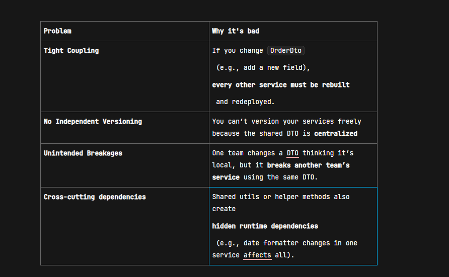
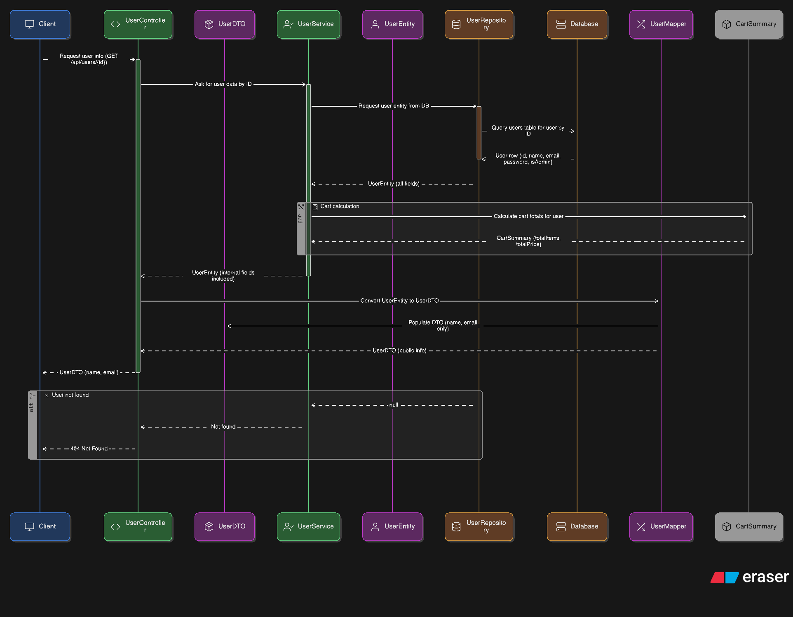

# Code Decode Case studies and there answers

> "Most developers think if they split their application into multiple modules and deploy them t67k,as separate services, they've built microservices. But in reality, they're just building
> 
> 
> **distributed monoliths**
> 

> "Today, lets break down 6 core mistakes that turn well-intentioned microservices into tightly coupled messes — and how to fix them. If we doing even 2 out of these 6, we are already in trouble."
> 

### **1. What is a Microservice REALLY?**

- A **microservice** is an **independently deployable**, **loosely coupled**, and **domain-driven component** that handles one business responsibility.
- A real microservice:
    - Has its own **data storage**
    - Communicates with others through **well-defined APIs**
    - Can fail **without breaking** the entire system
    - Can be **deployed independently**

Common misconception:

> "Just splitting code and putting it in different folders or deploying it in different Docker containers doesn’t mean you’ve implemented microservices."
> 

---

### **2. SIX MISTAKES THAT TURN MICROSERVICES INTO MONOLITHS**

Let’s go deep into each mistake:

### **Mistake 1: Shared Database Between Services**

This is the number one mistake. If your services are connecting to the **same physical database or schema**, you’ve completely killed the independence.

**Example:**

- Service A updates a customer record.
- Service B also directly queries or modifies the same customer table.

This violates **data ownership** and **encapsulation**.

**Solution:**

- Each service must own its data.
- If data needs to be shared, use **APIs** or **asynchronous messaging**.

**Optional Code Snippet:**

Instead of:

```jsx
-- Both services hitting same table
SELECT * FROM customer WHERE id = 101;
```

Service A should expose:

```jsx
@GetMapping("/customers/{id}")
public CustomerDto getCustomer(@PathVariable Long id) {
    return customerService.getCustomer(id);
}
```

And Service B should call Service A via HTTP or messaging.

### **Mistake 2: Synchronous Communication Everywhere**

If every service calls another service **synchronously**, then one slow service **slows down your entire system**.

**Example:**
 Service A → Service B → Service C

If C goes down, A and B are blocked.

**Solution:**

- Use **asynchronous messaging** (Kafka, RabbitMQ) wherever possible.
- Implement **circuit breakers** using Resilience4j or Hystrix.
- Always have a **fallback** strategy.

**Code Snippet:**

```jsx
@CircuitBreaker(name = "inventoryService", fallbackMethod = "fallbackInventory")
public String checkInventory() {
    return restTemplate.getForObject("http://inventory-service/api/check", String.class);
}

public String fallbackInventory(Throwable t) {
    return "Inventory status unknown";
}
```

### **Mistake 3: Shared DTOs and Utility Libraries**

When services depend on a **shared DTO project or utility JAR**, it creates **tight coupling**.

**Why it’s wrong:**

- Any change in one service's DTO can break another service.
- You can't version services independently.

**Fix:**

- Define DTOs in each service.
- If structure must be reused, define **external API contracts** (OpenAPI, JSON Schema).



“In microservices, your DTO is your *contract*, and contracts should be explicit — not shared Java classes that break everything when someone sneezes.”

---

### **Mistake 4: Centralized Auth Logic or Business Rules**

Putting authentication/authorization or business rules in a shared service (like an AuthService used by all) introduces **central dependency**.

This becomes a **single point of failure**.

**Fix:**

- Use decentralized JWT or OAuth2 (tokens contain claims, not logic).
- Services should verify tokens locally (e.g., via signature), not call auth server each time.

### **Mistake 5: Lack of Bounded Context and Domain Thinking**

If your services are split based on **technical layers** (like UserService, EmailService), instead of **business capabilities** (like Order, Payment, Shipment), then you’re doing it wrong.

**Example of wrong design:**

- NotificationService → handles all emails, SMS, etc.
- UserService → handles user data

Now every service depends on NotificationService, creating bottlenecks.

**Correct design:**

- Each domain (like OrderService) should be responsible for **its own notifications**.

This aligns with **DDD (Domain-Driven Design)** principles.

We use a shared utility library for low-level email/SMS logic (`EmailSender`, `SmsSender`), but keep the actual notification trigger inside the owning microservice (Order, Payment, User). That way, we balance reuse with autonomy.

---

### **Mistake 6: Deployment and Scaling Tied Together**

If all services are deployed together or scaled together, it’s not microservices.

**You’re still tied to the same CI/CD pipeline, same versioning, same load balancer.**

**Fix:**

- Each service should have its own pipeline and can be scaled independently.

Example:

- Product catalog service gets 1000x more traffic → scale that alone.

---

### **3. CODE EXAMPLES FOR MISTAKES (5–6 mins)**

Let’s go deeper into two examples with real Java/Spring Boot snippets:

### **A. Shared DTO Anti-pattern**

Let’s say you have this DTO used in both OrderService and PaymentService:

```jsx
public class OrderDto {
    private Long id;
    private Double amount;
    private String status;
}
```

If PaymentService changes it to add a field:

```jsx
private String paymentMethod;
```

Now OrderService is broken unless rebuilt.

**Correct way:**
 Each service should define its own DTO even if they look similar.

In OrderService:

```jsx
public class OrderResponse {
    private Long id;
    private Double amount;
}
```

In PaymentService:

```jsx
public class OrderPaymentRequest {
    private Long orderId;
    private String paymentMethod;
}
```

Keep boundaries clean.

#### **B. Circuit Breaker and Resilience**

```jsx
@Service
public class InventoryClient {

    @CircuitBreaker(name = "inventoryService", fallbackMethod = "fallbackInventory")
    public Inventory checkInventory(Long productId) {
        return restTemplate.getForObject("http://inventory-service/api/inventory/" + productId, Inventory.class);
    }

    public Inventory fallbackInventory(Long productId, Throwable ex) {
        Inventory inv = new Inventory();
        inv.setAvailable(false);
        return inv;
    }
}
```

This prevents a chain failure across services if Inventory Service is down.

### **4. FINAL SUMMARY AND ACTION CHECKLIST**

> If your services do any of these:
> 
- Share databases
- Use shared DTOs
- Call each other synchronously without fallback
- Depend on central logic
- Are deployed/scaled together
- Violate bounded context

> Then you’ve built a
> 
> 
> **distributed monolith**
> 

---

### **Your Action Plan:**

1. Do a health check of your current architecture.
2. Ask: “Can I deploy this service independently?”
3. Implement circuit breakers and async messaging.
4. Break dependencies – both code and runtime.
5. Respect DDD boundaries.

**7 Java Collections Hacks That Instantly Upgrade Your Code!**

## **Audience Problem:**

Most Java developers stick to outdated patterns—manual looping, verbose condition checks, and boilerplate data filtering. This wastes time, adds bugs, and kills productivity. This video shows modern, elegant alternatives using Collections APIs.

---

# 7 High-Impact Java Collection Hacks

---

## **Hack 1: Replace Manual Filtering with `stream().filter()`**

**Before:**

```jsx
List<String> names = Arrays.asList("John", "Jane", "Code", "Decode");
List<String> filtered = new ArrayList<>();
for (String name : names) {
    if (name.startsWith("J")) {
        filtered.add(name);
    }
}
```

### After:

```jsx
List<String> filtered = names.stream()
.filter(name -> name.startsWith("J"))
.collect(Collectors.toList());
```

### Theory:

Manual filtering is error-prone and verbose. Using `stream().filter()` makes the code more readable, expressive, and functional. It also supports chaining and parallelism.

---

## **Hack 2: Convert List to Map Using `Collectors.toMap()`**

**Before:**

```jsx
Map<Integer, String> map = new HashMap<>();
for (Person p : people) {
    map.put(p.getId(), p.getName());
}
```

###  After:

```jsx
Map<Integer, String> map = people.stream()
.collect(Collectors.toMap(Person::getId, Person::getName));
```

### Theory:

Avoid unnecessary looping. `Collectors.toMap()` is concise, readable, and great for mapping objects by a key (like ID).

---

## **Hack 3: Group by Field Using `Collectors.groupingBy()`**

### Before:

computeIfAbsent:  is used to **compute and insert a value for a key if that key is not already present (or maps to null)**.
 If the key already has a value, it simply **returns the existing value** without modifying the map.

```jsx
Map<String, List<Employee>> deptMap = new HashMap<>();
for (Employee emp : employees) {
    deptMap.computeIfAbsent(emp.getDept(), k -> new ArrayList<>()).add(emp);
}
```

For each `emp` in the `employees` collection:

- `emp.getDept()` obtains the department of that employee.
- `computeIfAbsent(key, mappingFunction)` checks if `deptMap` already has a non-null value for that department key.
    - If **absent** (or mapped to `null` ), it calls the lambda `k -> new ArrayList<>()` to create a new `ArrayList<Employee>` , puts it into the map under that department, and returns it.
    - If **present**, it simply returns the existing list.
- `.add(emp)` then adds the current employee to the list for their department.

Bad code

```jsx
for (Employee emp : employees) {
    String dept = emp.getDept();
    List<Employee> list = deptMap.get(dept);
    if (list == null) {
        list = new ArrayList<>();// empty
        deptMap.put(dept, list);
    }
    list.add(emp);
}
//code - CS, Decode , CS
```

### After:

```jsx
Map<String, List<Employee>> deptMap = employees.stream()
.collect(Collectors.groupingBy(Employee::getDept));
```

### Theory:

Grouping logic is often messy. `groupingBy()` lets you do it declaratively in a single line, and is highly readable.

---

## **Hack 4: Replace Nested Loops with `flatMap()`**

**Before:**

```jsx
List<String> allTasks = new ArrayList<>();
for (Project p : projects) {
    for (Task t : p.getTasks()) {
        allTasks.add(t.getTitle());
    }
}
```

### After:

```jsx
List<String> allTasks = projects.stream()
.flatMap(p -> p.getTasks().stream())
.map(Task::getTitle)
.collect(Collectors.toList());
```

### Theory:

Nested loops clutter logic. `flatMap()` is powerful for flattening streams of collections and simplifies hierarchical data extraction.

---

## **Hack 5: Eliminate `null` Checks with `Optional.ofNullable().ifPresent()`**

**Before:**

```jsx
if (user != null && user.getEmail() != null) {
    sendEmail(user.getEmail());
}
```

### After:

```jsx
Optional.ofNullable(user)
.map(User::getEmail)
.ifPresent(this::sendEmail);
```

### Theory:

`Optional` is more than syntactic sugar. It promotes null safety and encourages functional programming.

---

## **Hack 6: Use `computeIfAbsent()` to Avoid Contains + Put**

**Before:**

```jsx
if (!map.containsKey(key)) {
    map.put(key, new ArrayList<>());
}
map.get(key).add(value);
```

### After:

```jsx
map.computeIfAbsent(key, k -> new ArrayList<>()).add(value);
```

### Theory:

This is the Collections framework at its smartest. No need to check keys before inserting. One line does it all.

---

## **Hack 7: Use `removeIf()` for Conditional Deletion**

**Before:**

```jsx
Iterator<String> it = list.iterator();
while (it.hasNext()) {
    if (it.next().isEmpty()) {
        it.remove();
    }
}
```

### After:

```jsx
list.removeIf(String::isEmpty);
```

### Theory:

Avoid manual iterator usage and mutation. `removeIf()` is concise, safe, and easier to understand.

---

## BONUS Hack: Immutable Collections

```jsx
List<String> immutableList = List.of("A", "B", "C");
Map<String, Integer> immutableMap = Map.of("One", 1, "Two", 2);
```

### Theory:

`List.of(...)`  and `Map.of(...)`  (since Java 9) create **immutable** (actually unmodifiable and structurally fixed) collections.

Once created, **you cannot add, remove, or change** elements. Any attempt to mutate throws `UnsupportedOperationException` .

These collections are **thread-safe** for concurrent read access without further synchronization because their state never changes.

**STOP! You’re Probably Using DTOs, Entities & POJOs WRONG!**

This tiny confusion leads to **tight coupling, security leaks, and messy code** when your app grows.

“Here’s what most developers do:

- Create an **Entity** for the database.
- Use the SAME class for the API.
- Maybe call it a POJO, maybe a DTO… who knows?

But then one day, you add a new DB field like `isAdmin`, and suddenly your API is leaking internal details to the client.

Why? Because you mixed up **POJO, DTO, and Entity** without knowing their real purpose.”

**What’s a POJO?**

- Plain Old Java Object.
- Just a simple object with fields + getters/setters.
- No business rules, no framework annotations. *(Example: a simple `Car`*  *class with name + color)*

**What’s an Entity?**

- A POJO with **JPA/Hibernate annotations** for persistence.
- Represents a table in the database. *(Example: `@Entity class UserEntity`* *)*

**What’s a DTO?**

- A POJO used ONLY to **transfer data** between layers or API calls.
- Often a subset of Entity fields, shaped for the client. *(Example: `UserDTO`*  *with only `name`*  *& `email`* *)*

| **Aspect**+++ | **POJO**+ | **Entity**+ | **DTO**+ |
| --- | --- | --- | --- |
| **Meaning**+ | Plain Old Java Object | A POJO mapped to DB with JPA/Hibernate | POJO used only to transfer data |
| **Purpose**+ | Generic Java object for logic/data | Represents a 
**database table** | Represents 
**API/request/response**
 data |
| **Annotations**+ | No framework annotations | `@Entity`, `@Table`, `@Id` etc | Usually  or sometimes @JsonProperty |
| **Coupling**+ | Independent | Tied to 
**DB schema** | Tied to 
**API contract** |
| **Example**+ | Car {color, speed} | UserEntity {id, email, password} | UserDTO {name, email} |
| **Used In**+ | Anywhere | Persistence layer | API layer |

### **Real-World Scenario:** Online Shopping App

You have a **User** in your app.

- **Database Table:** `users`
- **API:** `/api/users` (should return only public info)
- **Internal Business Logic:** Some calculations on the user’s cart

Now let’s see how **POJO, Entity, and DTO** fit in.

---

**1. ENTITY – for Database Persistence**

```jsx
@Entity
@Table(name = "users")
public class UserEntity {

    @Id
    @GeneratedValue(strategy = GenerationType.IDENTITY)
    private Long id;

    private String name;
    private String email;
    private String password;  // Sensitive

    private boolean isAdmin;  // Internal only

    // getters/setters
}
```

- **When do you use it?** Inside the **Repository** and **Service layer** to interact with the database.
- **Why not return this in API?** It leaks **password** and **internal fields (like isAdmin)** Any DB schema change will break your API

 **2. DTO – for API Layer**

```jsx
public class UserDTO {

    private String name;
    private String email;

    // NO password, NO admin flag → safe for clients

    // getters/setters
}
```

- **When do you use it?**
    - When **sending data** to the client (Response DTO)
    - When **accepting input** from client (Request DTO)
- **Where is it used?**
    - In your **Controller** layer
    - Keeps **API contract** stable even if DB changes

### **3. POJO – for Generic Business Logic**

```jsx
public class CartSummary {

    private int totalItems;
    private double totalPrice;

    // Just a simple Java object (POJO) for calculations
}
```

- **When do you use it?** Anywhere internally when you just need a **plain object** for calculations, caching, or logic.
    - It’s **not tied to DB**
    - It’s **not tied to API**

Example: `CartSummary` is NOT stored in DB, NOT sent as-is in API → it’s just a helper object.

 **Putting it ALL Together**

```jsx
@RestController
@RequestMapping("/api/users")
public class UserController {

    @Autowired
    private UserService userService;

    @GetMapping("/{id}")
    public ResponseEntity<UserDTO> getUser(@PathVariable Long id) {
        UserEntity userEntity = userService.findById(id);

        // Convert Entity → DTO
        UserDTO dto = UserMapper.toDto(userEntity);

        return ResponseEntity.ok(dto);
    }
}
```

**UserMapper Example:**

```jsx
public class UserMapper {
    public static UserDTO toDto(UserEntity entity) {
        UserDTO dto = new UserDTO();
        dto.setName(entity.getName());
        dto.setEmail(entity.getEmail());
        return dto;
    }
}
```

### When You Use What?

- Entity: Only for persistence (DB operations)
- DTO: Only for API request/response
- POJO: Anywhere for simple data holding or business logic

---

### Flow in Real Life:

Client → Controller → DTO → Service → Entity → Repository → DB
 DB → Repository → Entity → Service → DTO → Controller → Client

### Mini Analogy

- Entity = Database table (raw data)
- DTO = Parcel you send to the customer (only what’s needed)
- POJO = Just a box you use internally for organizing things (not exposed)

---

**Mistake #1: Treating POJOs & DTOs as the Same**

- *“A DTO is a POJO, but not all POJOs are DTOs!”*
- POJO is generic. DTO is for a **specific purpose: data transfer**.

**Fix:** Be intentional – name them clearly (`UserDTO`, `UserEntity`).

---

**Mistake #2: Exposing Entities Directly**

- Returning your JPA Entity from REST API leaks internal fields like `passwordHash` or `roles` .
- Plus, **DB changes force API changes**.

**Fix:** Always convert Entity → DTO before exposing it.

---

**Mistake #3: Overloading One Class for Everything**

“If you’re exposing your JPA Entities directly in your REST APIs… or if you think POJOs and DTOs are the SAME… STOP! You’re doing it WRONG!

- Some devs use **one class as Entity, DTO & POJO all at once** → tightly coupled code.
- Changing DB = breaking API = messy refactoring.

**Fix:**
 Keep a clean flow:
 **Controller → DTO → Service → Entity → Repository**

**Mistake #4: Manual Mapping Hell**

- Copy-pasting fields manually → boilerplate, human errors.

**Fix:** Use **MapStruct** or **ModelMapper**:

```jsx
@Mapper
interface UserMapper {
  UserDTO toDto(UserEntity entity);
}
```

To write clean, scalable Spring Boot apps:

- Keep Entities private for persistence
- Use DTOs for APIs
- Use POJOs for internal business logic or utility objects
- And automate mapping with tools like MapStruct”



**Java Fullstack Interview Questions**

# Java core

**What makes a class immutable and why use immutability?**

## What makes a class immutable?

An **immutable class** is one whose instances cannot be changed after creation. Once the object is created, its state (field values) cannot be modified.

Key rules for making a class immutable:

1. **Mark the class as `final`** → Prevents subclassing, which could add mutability.
2. **Make all fields `private`**  **and `final`** → `private` prevents direct access, `final` ensures they can’t be reassigned.
3. **No setters** → Do not provide methods that change field values after object creation.
4. **Initialize all fields in the constructor** → Ensures the object’s state is fully set at creation time.
5. **Defensive copies for mutable fields** → If your class has fields like `Date` or `List` , don’t expose them directly. Example: return a copy in the getter, and copy inputs in the constructor.
6. **Don’t allow methods to modify state**  → Every method should return a new object instead of altering the current one.

---

### Example of an immutable class:

---

```java
public final class Person {
    private final String name;
    private final int age;

    public Person(String name, int age) {
        this.name = name;
        this.age = age;
    }

    // No setters
    public String getName() { return name; }
    public int getAge() { return age; }

    // If change needed, return new object
    public Person withAge(int newAge) {
        return new Person(this.name, newAge);
    }
}
```

## Real-time usages of immutability:

### 1. **Java `String` class**

- Immutable for **security** (e.g., passwords, class loading) and **caching**.
- If mutable, someone could alter the value after authentication — huge security risk.

```java
String password = "admin123";
authenticate(password);
password.setCharAt(0, 'x'); // Imagine this was possible
```

---

### 2. **Concurrent Applications**

- Multiple threads can read the `balance` without risk of corruption.
- Example: `Money` or `Balance` objects in financial systems are immutable, avoiding race conditions.

```java
Money balance = new Money(100);
Money updated = balance.add(50); // returns new object
```

---

### 3. **Caching & Collections**

- Immutables work well as **keys in hash-based collections** (`HashMap` , `HashSet` ).Example: `String` and wrapper classes (`Integer` , `Long` , etc.) are immutable.If keys were mutable, hash codes could change → maps would break.

---

### 4. **Domain-driven Design (DDD)**

- **Value Objects** like `Address` , `Money` , `Coordinates` are modeled as immutable for consistency.

```java
Address addr = new Address("221B Baker Street", "London");
// If you need to change city
Address newAddr = new Address(addr.getStreet(), "Manchester");
```

Keeps business rules predictable and prevents side-effects.

---

### 5. **Functional Programming (Java 8+)**

- Streams and lambdas process immutable data safely without side effects.

```java
List<Integer> nums = List.of(1, 2, 3);
List<Integer> squared = nums.stream()
                            .map(n -> n * n)
                            .toList(); // immutable result

```

Prevents accidental modification while processing in pipelines.

---

### 6. **Configuration & Constants**

- Objects like **application configuration, environment variables, API keys** must never change once loaded.
- Example: Spring Boot `@ConfigurationProperties` often uses immutable classes for reliability.

---

In short: **Immutability gives safety, simplicity, and reliability at the cost of flexibility. That’s why core Java classes like `String`, `Integer`, `LocalDate` are immutable.**

---

# Spring Boot & Microservices

**How do you structure a Spring Boot microservice for maintainability?**

---

## 1. **Follow a Standard Layered Architecture**

A clean separation of concerns makes code easier to read, test, and extend:

```java
com.example.orderservice
┣ 📂 config         # Configuration classes (Beans, Security, Swagger, etc.)
┣ 📂 controller     # REST Controllers (API layer)
┣ 📂 service        # Business logic
┣ 📂 repository     # Data access (JPA/Mongo repositories)
┣ 📂 model          # Entities / DTOs
┣ 📂 exception      # Custom exceptions, global handlers
┣ 📂 util           # Common utilities
┣ 📂 mapper         # Converters (Entity ↔ DTO)
┗ Application.java  # Main Spring Boot class
```

Benefits: Each layer has a single responsibility. New developers can find things easily.

---

## 2. **Use DTOs and Mappers**

- Don’t expose your JPA entities directly in REST APIs.
- Use **DTOs (Data Transfer Objects)** and mapping tools like **MapStruct**.

```java
public class OrderDTO {
    private Long id;
    private String customerName;
    private BigDecimal amount;
}
```

This keeps your API contract **stable** even if your database model changes.

---

## 3. **Centralized Exception Handling**

Use `@ControllerAdvice` with `@ExceptionHandler` to handle errors consistently.

```java
@RestControllerAdvice
public class GlobalExceptionHandler {
    @ExceptionHandler(ResourceNotFoundException.class)
    public ResponseEntity<String> handleNotFound(ResourceNotFoundException ex) {
        return ResponseEntity.status(HttpStatus.NOT_FOUND).body(ex.getMessage());
    }
}
```

---

## 4. **Externalize Configuration**

- Keep configs in `application.yml` or config server (Spring Cloud Config).
- Don’t hardcode URLs, secrets, or DB credentials.
- Use profiles: `application-dev.yml` , `application-prod.yml` .

---

## 5. **Use Dependency Injection Properly**

- Rely on **interfaces**, not implementations.
- Example: `OrderService` interface with `OrderServiceImpl` .
- Makes testing and swapping implementations easier.

---

## 6. **Logging & Monitoring**

- Use **SLF4J + Logback** for structured logging.
- Correlate logs using `traceId` /`spanId` (via Sleuth or custom MDC).
- Expose health and metrics with **Spring Boot Actuator**.

---

## 7. **Testing Strategy**

- Unit Tests → JUnit + Mockito.
- Integration Tests → `@SpringBootTest` , Testcontainers for DB.
- Contract Tests → Ensure microservice APIs remain backward compatible.

---

## 8. **API Documentation**

- Use **Swagger/OpenAPI** (`springdoc-openapi` ) for documenting endpoints.
- Keeps consumer teams aligned with your API.

---

## 9. **Database Layer Best Practices**

- Use `repository` package for Spring Data JPA / Mongo repositories.
- Avoid business logic in repositories.
- Keep transactions in the **service layer**, not controllers.

---

## 10. **Modularization for Large Microservices**

- If service grows, split into **modules** (`core` , `api` , `persistence` ).
- Prevents “big-ball-of-mud” architecture.

---

# Summary

**Maintainability in Spring Boot microservices** comes from:

- Clean **package-by-layer structure**
- DTOs & mappers for API stability
- Centralized **exception handling**
- **Externalized configs** for flexibility
- Proper **logging, monitoring, and testing**
- **Documentation** with Swagger
- Following SOLID principles and keeping **business logic isolated** in services

---

**How do you handle configuration across environments in Spring Boot?**

---

# Handling Configuration Across Environments in Spring Boot

## 1. **Profiles (`application-{profile}.yml`)**

Spring Boot supports profiles out of the box.

- Create **separate config files** per environment:

```java
# application.yml
spring:
  profiles:
    active: dev   # default profile

# application-dev.yml
spring:
  datasource:
    url: jdbc:mysql://localhost:3306/devdb
    username: devuser
    password: devpass

# application-prod.yml
spring:
  datasource:
    url: jdbc:mysql://prod-db:3306/proddb
    username: produser
    password: ${DB_PASSWORD}   # externalized
```

- Activate with:
    - Command-line: `-spring.profiles.active=prod`
    - Environment variable: `SPRING_PROFILES_ACTIVE=prod`

**Best for environment-specific configs** (DB URL, logging levels, etc.).

---

## 2. **Externalized Configuration**

Never hardcode secrets. Spring Boot can read properties from:

- **Environment variables**
- **Command-line args**
- **System properties**
- **Config files outside the jar**

Example: Place `application-prod.yml` next to the jar and override defaults without rebuilding.

---

## 3. **Spring Cloud Config Server** (for distributed systems)

- Centralized configuration management.
- Stores configs in a Git repo, so all microservices fetch from one place.
- Example:

```java
# bootstrap.yml (client microservice)
spring:
  application:
    name: order-service
  cloud:
    config:
      uri: http://config-server:8888
      profile: prod
```

- Config server serves:order-service-prod.yml
order-service-dev.yml
- Supports **dynamic refresh** (`/actuator/refresh` ) without restart.

Great for **multiple microservices** with consistent config.

---

## 4. **Secrets Management**

- Use vaults instead of hardcoding sensitive configs.
- Options:
    - **Spring Cloud Vault**
    - **AWS Secrets Manager**
    - **Kubernetes Secrets** (if deployed on K8s)

Example with Spring Cloud Vault:

```java
spring:
cloud:
  vault:
    uri: http://vault-server:8200
    authentication: token
    token: ${VAULT_TOKEN}
```

---

## 5. **Kubernetes / Docker Config**

- For containerized deployments:
    - Use **ConfigMaps** for environment configs.
    - Use **Secrets** for passwords and tokens.
    - Mount them as environment variables or externalized files.

Example deployment.yaml:

```java
env:
- name: SPRING_PROFILES_ACTIVE
  value: prod
- name: DB_PASSWORD
  valueFrom:
    secretKeyRef:
      name: db-secrets
      key: password
```

---

## 6. **Best Practices**

✔️ Keep **common configs** in `application.yml`, and override only differences in `application-{profile}.yml`.
 ✔️ Store **sensitive configs in secrets managers**, not git.
 ✔️ For **multiple microservices**, use a centralized config server.
 ✔️ Prefer **environment variables** in cloud-native deployments.
 ✔️ Use **Spring Boot Actuator** to verify which configs are loaded.

# Summary

- **Profiles** → Switch configs per environment (`application-dev.yml` , `application-prod.yml` ).
- **Externalized config** → Override without rebuilding.
- **Spring Cloud Config Server** → Centralized management for microservices.
- **Secrets Manager / Vault** → Secure handling of sensitive info.
- **Kubernetes/Docker** → ConfigMaps + Secrets for containerized deployments.

In short:
 **Use profiles for small apps, Config Server + Vault for enterprise microservices, and environment variables for cloud-native deployments.**

**Explain how to call REST APIs from Angular and handle errors/retries.**

# Calling REST APIs in Angular + Handling Errors & Retries

---

## 

## 1. **Use `HttpClient` Service**

Angular provides `HttpClient` (from `@angular/common/http`) for HTTP calls.

- Import `HttpClientModule` in `AppModule` :

```java
import { HttpClientModule } from '@angular/common/http';

@NgModule({
  imports: [HttpClientModule]
})
export class AppModule {}

```

`import { HttpClientModule } from '@angular/common/http';`  → brings in Angular’s HTTP functionality.

`@NgModule({ imports: [HttpClientModule] })`  → registers the module so you can use **`HttpClient`**  in your components/services.

**Purpose:** Enables making HTTP requests (GET, POST, etc.) throughout your Angular app.

## 2. **Create a Service for API Calls**

Encapsulate API logic inside services for maintainability.

```java
import { Injectable } from '@angular/core';
import { HttpClient } from '@angular/common/http';
import { Observable } from 'rxjs';

@Injectable({ providedIn: 'root' })
export class UserService {
  private baseUrl = 'https://api.example.com/users';

  constructor(private http: HttpClient) {}

  getUsers(): Observable<User[]> {
    return this.http.get<User[]>(this.baseUrl);
  }

  getUserById(id: number): Observable<User> {
    return this.http.get<User>(`${this.baseUrl}/${id}`);
  }

  createUser(user: User): Observable<User> {
    return this.http.post<User>(this.baseUrl, user);
  }
}
```

- **`@Injectable({ providedIn: 'root' })`** → Makes this service **globally available** for dependency injection.
- **`HttpClient`** → Injected to perform HTTP requests.
- **`baseUrl`** → Base API endpoint for user-related operations.
- **Methods:**
    - `getUsers()` → GET request to fetch all users (`Observable<User[]>` ).
    - `getUserById(id)` → GET request to fetch a single user by ID (`Observable<User>` ).
    - `createUser(user)` → POST request to create a new user (`Observable<User>` ).
- **Returns `Observable`** → You can subscribe or use `async` pipe to handle responses.

**Purpose:** Provides a reusable, centralized service for all **user-related HTTP operations** in the Angular app.

## 3. **Handling Errors with RxJS `catchError`**

Use RxJS operators to handle errors in a centralized way.

```java
import { catchError } from 'rxjs/operators';
import { throwError } from 'rxjs';

getUsers(): Observable<User[]> {
  return this.http.get<User[]>(this.baseUrl).pipe(
    catchError(err => {
      console.error('Error fetching users', err);
      return throwError(() => new Error('Failed to load users'));
    })
  );
}
```

### What’s happening

1. **`this.http.get<User[]>(this.baseUrl)`**
    - Sends an HTTP GET request to fetch all users.
    - Returns an **Observable** of `User[]` .
2. **`.pipe(catchError(...))`**
    - Adds an **error-handling operator** from RxJS.
    - If the HTTP request fails (network error, 404, etc.), `catchError` intercepts it.
3. **`catchError(err => { ... })`**
    - Logs the original error to the console.
    - Returns a new Observable using `throwError` , which emits a **custom error** (`Failed to load users` ) to subscribers.

### Key Points

- **Purpose:** Gracefully handle HTTP errors without crashing the app.
- **Subscriber sees:** The Observable emits an error, which you can handle using `.subscribe({ next, error })` or `async` pipe with `catchError` .
- **RxJS `throwError(() => new Error(...))`** → Recommended modern syntax for creating error Observables.

## 4. **Retry Mechanism with `retry()`**

Use RxJS `retry` or `retryWhen` for transient failures.

```java
import { retry } from 'rxjs/operators';

getUsers(): Observable<User[]> {
  return this.http.get<User[]>(this.baseUrl).pipe(
    retry(3), // retry up to 3 times
    catchError(err => throwError(() => new Error('API failed after retries')))
  );
}
```

### What’s happening

1. **`this.http.get<User[]>(this.baseUrl)`**
    - Sends an HTTP GET request to fetch all users.
    - Returns an **Observable** of `User[]` .
2. **`.pipe(retry(3), catchError(...))`**
    - **`retry(3)`** → If the HTTP request fails, Angular/RxJS will **automatically retry up to 3 times** before failing.
    - **`catchError`** → If all retries fail, it intercepts the error and emits a **custom error** Observable.

### Key Points

- **Retry logic** → Useful for transient errors like network issues.
- **Custom error** → Lets components know the request failed in a controlled way.
- **Observable stream** → Components can handle the error with `.subscribe({ next, error })` or `async` pipe.

## 5. **Using Interceptors (Centralized Error Handling & Retries)**

For cleaner code, use `HttpInterceptor`.

```java
import { Injectable } from '@angular/core';
import {
  HttpInterceptor, HttpRequest, HttpHandler, HttpEvent, HttpErrorResponse
} from '@angular/common/http';
import { Observable, throwError } from 'rxjs';
import { catchError, retry } from 'rxjs/operators';

@Injectable()
export class ApiInterceptor implements HttpInterceptor {
  intercept(req: HttpRequest<any>, next: HttpHandler): Observable<HttpEvent<any>> {
    return next.handle(req).pipe(
      retry(2), // retry twice before failing
      catchError((error: HttpErrorResponse) => {
        if (error.status === 401) {
          // handle unauthorized globally
          console.error('Unauthorized! Redirecting to login...');
        }
        return throwError(() => error);
      })
    );
  }
}
```

## What it does

1. **Implements `HttpInterceptor`**
    - Interceptors sit **between your app and the backend API**.
    - They can **modify requests** or **handle responses/errors** globally.
2. **`intercept(req, next)`**
    - `req` → The outgoing HTTP request.
    - `next.handle(req)` → Passes the request to the next handler (usually the backend).
    - Returns an **Observable of `HttpEvent<any>`** .
3. **`pipe(retry(2), catchError(...))`**
    - **`retry(2)`** → Automatically retries the request **up to 2 times** if it fails.
    - **`catchError`** → Handles any error after retries.
4. **Custom error logic**

```java
if (error.status === 401) {
  console.error('Unauthorized! Redirecting to login...');
}
```

- Detects **HTTP 401 Unauthorized** errors.
- Can trigger **global handling**, e.g., logging out the user or redirecting to login.

5, **`throwError(() => error)`**

- Re-throws the error so that the component or service that made the request can also handle it.

- Detects **HTTP 401 Unauthorized** errors.
- Can trigger **global handling**, e.g., logging out the user or redirecting to login.

5, **`throwError(() => error)`**

- Re-throws the error so that the component or service that made the request can also handle it.

## Why use an interceptor?

- **Centralized error handling** → No need to repeat `catchError` in every service.
- **Automatic retries** → Can handle transient network issues globally.
- **Request/response modifications** → e.g., adding auth tokens or headers.

Register in `app.module.ts`:

```java
providers: [
  { provide: HTTP_INTERCEPTORS, useClass: ApiInterceptor, multi: true }
]
```

6. **Consuming API in Components**

```java
@Component({...})
export class UserListComponent implements OnInit {
  users: User[] = [];
  errorMsg = '';

  constructor(private userService: UserService) {}

  ngOnInit(): void {
    this.userService.getUsers().subscribe({
      next: data => this.users = data,
      error: err => this.errorMsg = err.message
    });
  }
}
```

**Observable subscription** → Essential because `HttpClient`  returns Observables.

**Handles success & error** → Makes the UI reactive to API results.

**Runs in `ngOnInit()`**  → Ensures data is fetched **after component initialization**.

---

# Summary

- Use Angular **`HttpClient`** for API calls.
- Encapsulate API logic inside **services**.
- Handle errors with **RxJS `catchError`** .
- Retry transient failures with **`retry()`** .
- Centralize logic (auth, logging, retries) using **interceptors**.
- In components, **subscribe** with proper error handling.

In short:
 **Services manage API logic, Interceptors handle cross-cutting concerns, RxJS operators manage errors & retries.**

# Databases / MySQL

**When to use NoSQL vs relational DB for parts of a full-stack app?**

# NoSQL vs Relational Database (RDBMS) in a Full-Stack App

---

## 1. **Relational Database (RDBMS)**

**Examples:** MySQL, PostgreSQL, MariaDB, Oracle

**Characteristics:**

- **Structured schema** → tables with columns and types
- **ACID transactions** → strong consistency
- **Joins & complex queries** → relational operations
- **Fixed schema** → changing schema requires migrations

**Best Use Cases:**

1. **Transactional data** → e.g., banking transactions, order processing
2. **Data with relationships** → e.g., customers → orders → payments
3. **Reports & analytics** → complex SQL queries, joins
4. **Data integrity critical** → constraints, foreign keys

**Example:**

```java
Users table
Orders table
Payments table
```

- Use **RDBMS** for order/payment microservices to ensure **consistency**.

---

## 2. **NoSQL Database**

**Examples:** MongoDB (document), Cassandra (wide-column), Redis (key-value), Neo4j (graph)

**Characteristics:**

- **Schema-less / flexible schema**
- **Horizontal scalability** → handle huge data easily
- **Eventual consistency** (most types)
- Optimized for **specific access patterns** (document, key-value, graph)

**Best Use Cases:**

1. **Unstructured or semi-structured data** → JSON logs, user profiles
2. **High-traffic, read/write heavy apps** → caching, analytics
3. **Hierarchical or nested data** → document DB like MongoDB
4. **Rapid schema evolution** → agile product development

**Example:**

```java
{
  "userId": 1,
  "name": "Alice",
  "preferences": {"theme": "dark", "notifications": true},
  "recentActivities": ["login", "viewed_product"]
}
```

- Store **user activity logs**, **chat messages**, or **config/preferences** in NoSQL.

---

## 3. **Hybrid Approach in Full-Stack Apps**

Most modern apps use **both**, depending on requirements:

| Part of App+++ | DB Choice+ | Reason+ |
| --- | --- | --- |
| Authentication & Payments+ | RDBMS | Strong consistency, ACID transactions |
| User Profiles & Preferences+ | NoSQL (MongoDB) | Flexible schema, nested JSON data |
| Logging / Analytics+ | NoSQL (Elasticsearch, MongoDB) | High write volume, fast retrieval |
| Caching+ | NoSQL (Redis) | Extremely fast key-value access |
| Social / Relationships+ | NoSQL (Graph DB) | Traversing connections efficiently |

## 4. **Guidelines for Choosing**

- **Consistency-critical + structured data** → RDBMS
- **Flexible, evolving, hierarchical, or high-volume data** → NoSQL
- **Performance/caching needs** → NoSQL in-memory store (Redis)
- **Analytics/reporting** → Often RDBMS or specialized analytical DB

---

### Summary

- **RDBMS:** Strong consistency, structured, relational, transactional
- **NoSQL:** Flexible, scalable, semi-structured, optimized for specific access patterns
- **Hybrid approach:** Use both for a scalable, maintainable full-stack app

---

# Testing, CI/CD & DevOps (3)

**How would you set up CI/CD for a Java + Angular microservices project?**

---

## 1. **Version Control**

- Use **Git** (GitHub, GitLab, Bitbucket).
- Organize code:root/
┣ backend/ (Spring Boot microservices)
┣ frontend/ (Angular app)
┗ README.md
- Use **feature branches** + **Pull Requests** for code reviews.

---

## 2. **Continuous Integration (CI)**

### Tools: Jenkins, GitHub Actions, GitLab CI, CircleCI

**CI Steps:**

1. **Checkout code** → pull latest commits
2. **Build backend** → compile Java, run unit tests (`mvn clean install` or `gradle build` )
3. **Build frontend** → compile Angular app (`ng build --prod` )
4. **Run tests** →
    - Backend → JUnit, Mockito
    - Frontend → Karma/Jasmine, Cypress (optional)
5. **Static code analysis** → SonarQube for code quality
6. **Build Docker images** → tag images with commit SHA or version

**Example GitHub Actions Workflow:**

```java
name: CI
on:
  push:
    branches: [main]
jobs:
  build:
    runs-on: ubuntu-latest
    steps:
    - uses: actions/checkout@v3
    # Build backend
    - name: Set up JDK
      uses: actions/setup-java@v3
      with:
        java-version: '17'
    - run: mvn clean install -f backend/pom.xml
    # Build frontend
    - name: Setup Node
      uses: actions/setup-node@v3
      with:
        node-version: '20'
    - run: npm install --prefix frontend
    - run: npm run build --prefix frontend
    # Run backend tests
    - run: mvn test -f backend/pom.xml
```

## 3. **Continuous Delivery / Deployment (CD)**

### Tools: Jenkins, GitHub Actions, ArgoCD, Spinnaker, AWS CodePipeline

**CD Steps:**

1. **Push Docker images** → Docker Hub / ECR / GCR
2. **Deploy to environment** → dev/staging/prod:
    - Kubernetes (preferred for microservices)
    - Docker Compose (local/dev)
    - VM deployment (less common)
3. **Run smoke/integration tests** → verify deployment
4. **Approval gate** → staging → prod

**Example Kubernetes Deployment Flow:**

- Each microservice has a `deployment.yaml` and `service.yaml` .
- CI pushes new Docker images.
- CD updates Kubernetes deployments using `kubectl apply` or ArgoCD auto-sync.

---

## 4. **Environment Separation**

- **Dev** → automatic deploy after each commit
- **Staging** → manual approval or after passing all tests
- **Prod** → gated deploy, blue-green or canary deployment

Use environment variables or ConfigMaps/Secrets for configs.

## 5. **Best Practices**

- **Automate everything** → builds, tests, deployments
- **Fail fast** → stop pipeline on test or lint failures
- **Version artifacts** → tag Docker images with commit SHA
- **Use infrastructure as code** → Helm, K8s manifests, Terraform
- **Separate CI/CD pipelines** for backend and frontend (or orchestrate together)
- **Monitor deployments** → health checks, logs, alerts

---

## 6. **Optional Enhancements**

- **Rollback support** → automatically revert to previous version on failure
- **Canary deployment** → deploy gradually to prod users
- **Static code security analysis** → SonarQube, Snyk
- **Unit + Integration + E2E tests** → ensure full-stack stability

---

### Summary

| Stage+++ | Tool / Action+ | Description+ |
| --- | --- | --- |
| VCS+ | Git | Code versioning, PRs |
| CI+ | Jenkins/GitHub Actions | Build backend & frontend, run tests, code analysis |
| Artifact+ | Docker | Package microservices & Angular app |
| CD+ | ArgoCD / K8s | Deploy Docker images to dev/staging/prod |
| Monitoring+ | Prometheus/Grafana | Ensure service health post-deploy |

In short:

1. **CI:** Build + Test + Dockerize
2. **CD:** Deploy → Test → Promote
3. **Automation & monitoring** ensure reliability

---

## **Frontend–Backend Integration Questions**

**How does an Angular application typically communicate with a Spring Boot backend?**

# Angular → Spring Boot Communication

Angular and Spring Boot typically communicate via **REST APIs over HTTP**.

---

## 1. **HTTP Requests from Angular**

- Angular uses **`HttpClient`** (from `@angular/common/http` ) to send HTTP requests.
- Methods supported: `GET` , `POST` , `PUT` , `PATCH` , `DELETE` .
- Requests are usually **JSON-based**.

**Example Angular Service**

```java
import { Injectable } from '@angular/core';
import { HttpClient } from '@angular/common/http';
import { Observable } from 'rxjs';

export interface User {
  id: number;
  name: string;
}

@Injectable({ providedIn: 'root' })
export class UserService {
  private baseUrl = 'http://localhost:8080/api/users';

  constructor(private http: HttpClient) {}

  getUsers(): Observable<User[]> {
    return this.http.get<User[]>(this.baseUrl);
  }

  createUser(user: User): Observable<User> {
    return this.http.post<User>(this.baseUrl, user);
  }
}
```

## 2. **REST Controller in Spring Boot**

Spring Boot exposes endpoints using `@RestController`:

```java
@RestController
@RequestMapping("/api/users")
public class UserController {

    @GetMapping
    public List<User> getUsers() {
        return userService.getAllUsers();
    }

    @PostMapping
    public User createUser(@RequestBody User user) {
        return userService.saveUser(user);
    }
}
```

- Angular sends **HTTP request → JSON payload → backend**
- Spring Boot **parses JSON into Java objects** (`@RequestBody` )
- Spring Boot responds with **JSON → Angular parses it**

---

## 3. **Handling Cross-Origin Requests (CORS)**

- Angular runs on `localhost:4200` , backend on `localhost:8080` → CORS required.
- Enable in Spring Boot:

```java
@CrossOrigin(origins = "http://localhost:4200")
@RestController
@RequestMapping("/api/users")
public class UserController { ... }
```

Or globally in `WebMvcConfigurer` :

```java
@Configuration
public class WebConfig implements WebMvcConfigurer {
    @Override
    public void addCorsMappings(CorsRegistry registry) {
        registry.addMapping("/**").allowedOrigins("http://localhost:4200");
    }
}
```

## 4. **Data Flow**

1. Angular service calls **HTTP method**
2. Request goes to Spring Boot **REST controller**
3. Controller calls **service layer → repository**
4. Repository fetches data from **database**
5. Controller returns **JSON response**
6. Angular subscribes to response → updates UI

---

## 5. **Best Practices**

- Use **services** in Angular to encapsulate API calls.
- Use **DTOs** in Spring Boot to separate API from internal entities.
- Handle **errors** in Angular with `catchError` and global interceptors.
- Use **environment files** for backend URLs (`environment.ts` vs `environment.prod.ts` ).
- Use **RxJS** operators for retries, transformations, and error handling.

---

## 6. **Optional Enhancements**

- **JWT authentication** → Angular sends `Authorization` header → Spring Boot validates token.
- **Pagination / Sorting / Filtering** → backend exposes query params → Angular passes them in HTTP request.
- **WebSockets / SSE** → for real-time updates (optional).

### Summary

- Angular communicates with Spring Boot **over HTTP using REST APIs**.
- **JSON** is the standard data format.
- **HttpClient** in Angular ↔ **@RestController** in Spring Boot.
- Handle **CORS, errors, and authentication** properly.
- Keep API calls **centralized in services** for maintainability.

---

**What is CORS and how would you resolve CORS errors during integration?**

**CORS (Cross-Origin Resource Sharing)** is a **browser security feature** that restricts web pages from making requests to a **different domain, protocol, or port** than the one that served the web page.

- Example:
    - Angular app → `http://localhost:4200`
    - Spring Boot backend → `http://localhost:8080`
    - Browser considers this a **cross-origin request**.

**Without proper CORS headers, the browser blocks the request**.

---

# How to Resolve CORS Errors in Angular + Spring Boot

## 1. **Enable CORS in Spring Boot Controllers**

Add `@CrossOrigin` at the controller or method level:

```java
@RestController
@RequestMapping("/api/users")
@CrossOrigin(origins = "http://localhost:4200")
public class UserController { ... }
```

- `origins` → allowed frontend URL(s)
- Can also allow all: `@CrossOrigin(origins = "*")` (not recommended for production)

## 2. **Enable Global CORS Configuration**

If multiple controllers need CORS:

```java
@Configuration
public class WebConfig implements WebMvcConfigurer {
    @Override
    public void addCorsMappings(CorsRegistry registry) {
        registry.addMapping("/**") // allow all endpoints
                .allowedOrigins("http://localhost:4200")
                .allowedMethods("GET","POST","PUT","DELETE")
                .allowCredentials(true);
    }
}
```

## 3. **Spring Security + CORS**

If using Spring Security, you must allow CORS there too:

```java
@EnableWebSecurity
public class SecurityConfig extends WebSecurityConfigurerAdapter {
    @Override
    protected void configure(HttpSecurity http) throws Exception {
        http.cors().and()
            .csrf().disable()
            .authorizeRequests()
            .anyRequest().authenticated();
    }

    @Bean
    public CorsConfigurationSource corsConfigurationSource() {
        CorsConfiguration configuration = new CorsConfiguration();
        configuration.setAllowedOrigins(List.of("http://localhost:4200"));
        configuration.setAllowedMethods(List.of("GET","POST","PUT","DELETE"));
        configuration.setAllowCredentials(true);
        UrlBasedCorsConfigurationSource source = new UrlBasedCorsConfigurationSource();
        source.registerCorsConfiguration("/**", configuration);
        return source;
    }
}
```

## 4. **Frontend Considerations**

- Make sure **Angular uses the correct backend URL** in `environment.ts` .
- Example:

```java
export const environment = {
  production: false,
  apiUrl: 'http://localhost:8080/api'
};
```

- Avoid **bypassing CORS with proxies in production**; backend should handle it.

---

## 5. **Other Tips**

- Preflight requests: Browsers send **OPTIONS request** for certain methods (`PUT` , `DELETE` , custom headers). Backend must handle these.
- Avoid  for credentials in production; use specific origins.
- CORS issues **cannot be solved in frontend alone** — it’s a backend configuration problem.

### Summary

- **CORS**: Browser security that blocks cross-origin requests by default.
- **Angular → Spring Boot**: Likely cross-origin (`localhost:4200` → `localhost:8080` ).
- **Fix it**:
    1. `@CrossOrigin` on controllers
    2. Global `WebMvcConfigurer` config
    3. Spring Security CORS config (if using security)
- **Never try to bypass in frontend** — it only works in dev via proxy.

---

# CORS in Containerized / Pod Environments

### Scenario:

- **Angular frontend** deployed in a pod:
    - URL: `http://frontend-app.default.svc.cluster.local` (Kubernetes service)
- **Spring Boot backend** deployed in a different pod:
    - URL: `http://user-service.default.svc.cluster.local/api/users`

Even though both are inside the same cluster, **the browser still sees this as cross-origin** if you expose the frontend to users via an ingress:

- Frontend URL: `https://myapp.example.com`
- Backend URL: `https://api.example.com`

Browser sees:

```java
Origin: https://myapp.example.com
Request to: https://api.example.com → cross-origin!
```

Without proper CORS headers, the browser will block API calls.

## How to handle it

**1. Spring Boot Controller / Global CORS**

```java
@Configuration
public class WebConfig implements WebMvcConfigurer {
    @Override
    public void addCorsMappings(CorsRegistry registry) {
        registry.addMapping("/**")
                .allowedOrigins("https://myapp.example.com")  // frontend ingress URL
                .allowedMethods("GET","POST","PUT","DELETE")
                .allowCredentials(true);
    }
}
```

- Here, `allowedOrigins` is the **public URL of the frontend** that the user accesses.
- This works for both **dev pods** and **prod pods behind ingress**.

2. **Example Flow in Kubernetes**

```java
[User Browser]
     |
     | GET https://myapp.example.com
     v
[Angular Frontend Pod] (nginx/ng build) 
     |
     | HTTP GET https://api.example.com/api/users
     v
[Spring Boot Backend Pod]
     |
     | Response JSON + CORS headers
     v
[Browser accepts response]
```

- The backend pod must **return CORS headers**, otherwise the browser blocks the response.
- This applies even if **pods are in the same cluster** — because browsers enforce **cross-origin rules based on URL the user sees**, not internal pod networking.

---

---

### 4. **Takeaways**

1. **CORS is always relevant when frontend and backend are served from different origins**, regardless of localhost or pods.
2. **In containerized microservices**, browser sees **ingress hostnames** as the origin.
3. Proper CORS configuration prevents **blocked requests** in production.
4. For **multi-environment deployments** (dev/staging/prod), maintain environment-specific allowed origins

---

**How do you handle different environments (dev, test, prod) when making API calls from Angular to backend?**

# Handling Different Environments in Angular

Angular provides **environment files** to manage environment-specific configurations.

---

## 1. **Environment Files**

By default, Angular generates:

```java
src/environments/
├── environment.ts         → development (dev)
├── environment.prod.ts    → production
```

You can create additional ones, e.g., `environment.test.ts`.

### Example:

**`environment.ts` (dev)**

```java
export const environment = {
  production: false,
  apiUrl: 'http://localhost:8080/api'  // local backend
};
```

**`environment.test.ts`** 

```java
export const environment = {
  production: false,
  apiUrl: 'https://test-api.example.com/api' // test/staging backend
};
```

**`environment.prod.ts`** 

```java
export const environment = {
  production: true,
  apiUrl: 'https://api.example.com/api'  // production backend
};
```

2. **Use Environment Variables in Services**

```java
import { Injectable } from '@angular/core';
import { HttpClient } from '@angular/common/http';
import { Observable } from 'rxjs';
import { environment } from '../environments/environment';

@Injectable({ providedIn: 'root' })
export class UserService {
  private baseUrl = environment.apiUrl + '/users';

  constructor(private http: HttpClient) {}

  getUsers(): Observable<User[]> {
    return this.http.get<User[]>(this.baseUrl);
  }
}
```

- Angular will automatically use the **correct `environment`**  **file** depending on the build.

---

## 3. **Angular Build Configuration**

Specify which environment file to use when building:

```java
# Development
ng serve --configuration=development

# Test / Staging
ng build --configuration=test

# Production
ng build --configuration=production
```

In `angular.json`, you can define:

```java
"configurations": {
  "production": {
    "fileReplacements": [
      {
        "replace": "src/environments/environment.ts",
        "with": "src/environments/environment.prod.ts"
      }
    ]
  },
  "test": {
    "fileReplacements": [
      {
        "replace": "src/environments/environment.ts",
        "with": "src/environments/environment.test.ts"
      }
    ]
  }
}
```

## 4. **Optional: Dynamic Environment at Runtime**

- For containerized deployments, sometimes the backend URL is not known at build time.
- You can fetch environment variables at runtime using a JSON config file served with the frontend.

**Example:** `assets/config.json`

```java
{
  "apiUrl": "https://api.example.com/api"
}
```

Load it in `app.module.ts` or a service before making HTTP calls.

---

## 5. **Best Practices**

1. **Never hardcode URLs in services**. Always use `environment.apiUrl` .
2. **Use different environment files for dev/test/prod**.
3. **Combine with CORS configuration** on the backend for each environment.
4. **For containerized apps**, environment files + runtime configs help with dynamic backend URLs.

---

### Summary

- Angular **environment files** allow you to define API endpoints per environment.
- **Services use `environment.apiUrl`** to make calls.
- **Build configuration** determines which environment is used (`-configuration=production/test` ).
- For **dynamic pods or cloud deployments**, consider runtime config files.

**How do you debug integration issues between Angular and Spring Boot?**

# Debugging Integration Issues Between Angular and Spring Boot

Integration issues usually happen when **frontend cannot communicate with backend** properly.

---

## 1. **Check the Network**

- Open **browser developer tools** → Network tab.
- Verify:
    - The frontend is sending the **request to the correct URL**.
    - Request **method** (`GET` , `POST` , etc.) matches backend endpoint.
    - Response **status code** (`200` , `404` , `500` , etc.).
    - Response **body** — is it JSON as expected?

**Common errors:**

- `404` → endpoint URL mismatch
- `401/403` → authentication/authorization issue
- `0` or CORS error → blocked by browser

## 2. **Check CORS Issues**

- If browser logs:→ Check Spring Boot CORS configuration:Access to XMLHttpRequest at 'http://backend/api' from origin 'http://localhost:4200' has been blocked by CORS policy

```java
@CrossOrigin(origins = "http://localhost:4200")
@RestController
@RequestMapping("/api/users")
public class UserController { ... }
```

- For production: use **frontend ingress URL** in `allowedOrigins` .

---

## 3. **Check Backend Logs**

- Spring Boot logs provide real insight:
    - Did request **reach the controller**?
    - Any exceptions thrown in **service or repository layer**?
    - Check for **binding errors** if JSON payload doesn’t match Java DTO.

Example log:

```java
HTTP 400 Bad Request: JSON parse error
```

→ Means frontend payload doesn’t match backend model.

## 4. **Validate API Contract**

- Ensure frontend expects the same **response structure** as backend sends.
- Mismatched field names or data types can break Angular.
- Use **Postman / cURL** to test backend separately:

```java
curl -X GET http://localhost:8080/api/users
```

Compare JSON response with what Angular expects.

## 5. **Check Frontend Code**

- Verify **HttpClient URLs** use `environment.apiUrl` .
- Confirm **request headers**:
    - Content-Type: `application/json`
    - Authorization headers (JWT, tokens) if required
- Example of sending headers:

```java
this.http.get<User[]>(`${environment.apiUrl}/users`, {
  headers: { Authorization: `Bearer ${token}` }
});
```

## 6. **Debug with Breakpoints**

- **Angular:** Use Chrome/VSCode debugger
    - Check what request is being sent
    - Check the data returned
- **Spring Boot:** Set breakpoints in controllers/services
    - Verify request mapping
    - Inspect DTOs

---

## 7. **Check Proxy/Environment Config**

- During dev: Angular uses `ng serve` → may need **proxy config** to forward API calls:

`proxy.conf.json`

```java
{
  "/api": {
    "target": "http://localhost:8080",
    "secure": false
  }
}
```

Run with:

```java
ng serve --proxy-config proxy.conf.json
```

- Ensures dev frontend can call backend without CORS issues.

---

## 8. **Use Logging and Observables**

- In Angular, subscribe and log:

```java
this.userService.getUsers().subscribe({
  next: data => console.log('Users:', data),
  error: err => console.error('API Error:', err)
});
```

- Helps catch errors returned from backend.

---

## 9. **Optional Tools**

- **Postman / Insomnia** → test API independently
- **Swagger/OpenAPI** → verify endpoints match frontend expectations
- **WireShark / Fiddler** → inspect HTTP traffic if needed

### Summary

| Step+++ | What to Check+ | Tools+ |
| --- | --- | --- |
| Network+ | URL, HTTP method, status code | Browser DevTools |
| CORS+ | Access-Control-Allow-Origin headers | Backend config |
| Backend logs+ | Exceptions, request mapping | Spring Boot logs |
| API contract+ | JSON fields & types | Postman, cURL |
| Frontend+ | HttpClient URLs, headers | Angular debugger |
| Proxy/env+ | Correct API URL per environment | Angular proxy, environment.ts |
| Observables+ | Error handling/logging | console.log |

---

**Key principle:**

> Most Angular ↔ Spring Boot integration issues are
> 
> 
> **either CORS, URL mismatch, or payload mismatch**
> 

**Deployment related**

**How do you typically deploy an Angular frontend and a Spring Boot backend in Kubernetes?**

# Deploying Angular Frontend + Spring Boot Backend in Kubernetes

We typically deploy them as **separate pods and services**, optionally using **Ingress** for routing.

---

## 1. **Containerize the Applications**

### Backend (Spring Boot)

- Create a `Dockerfile` :

```java
# Build stage
FROM maven:3.9.3-eclipse-temurin-17 AS build
WORKDIR /app
COPY pom.xml .
COPY src ./src
RUN mvn clean package -DskipTests

# Run stage
FROM eclipse-temurin:17-jdk
WORKDIR /app
COPY --from=build /app/target/backend.jar ./backend.jar
EXPOSE 8080
ENTRYPOINT ["java","-jar","backend.jar"]
```

Build Docker image:

```java
docker build -t myorg/backend:1.0 .
docker push myorg/backend:1.0
```

### Frontend (Angular)

- Build production version:

```java
ng build --configuration=production
```

Serve using Nginx in Docker:

```java
FROM nginx:alpine
COPY ./dist/frontend /usr/share/nginx/html
COPY ./nginx.conf /etc/nginx/conf.d/default.conf
EXPOSE 80
```

Example `nginx.conf` :

```java
server {
    listen 80;
    server_name localhost;
    root /usr/share/nginx/html;
    index index.html;
    location / {
        try_files $uri /index.html;
    }
    location /api/ {
        proxy_pass http://backend-service:8080/api/;
    }
}
```

Build & push image:

```java
docker build -t myorg/frontend:1.0 .
docker push myorg/frontend:1.0
```

## 2. **Kubernetes Manifests**

**Backend Deployment & Service**

```java
apiVersion: apps/v1
kind: Deployment
metadata:
  name: backend
spec:
  replicas: 2
  selector:
    matchLabels:
      app: backend
  template:
    metadata:
      labels:
        app: backend
    spec:
      containers:
      - name: backend
        image: myorg/backend:1.0
        ports:
        - containerPort: 8080

---
apiVersion: v1
kind: Service
metadata:
  name: backend-service
spec:
  selector:
    app: backend
  ports:
  - port: 8080
    targetPort: 8080
  type: ClusterIP
```

Frontend Deployment & Service

```java
apiVersion: apps/v1
kind: Deployment
metadata:
  name: frontend
spec:
  replicas: 2
  selector:
    matchLabels:
      app: frontend
  template:
    metadata:
      labels:
        app: frontend
    spec:
      containers:
      - name: frontend
        image: myorg/frontend:1.0
        ports:
        - containerPort: 80

---
apiVersion: v1
kind: Service
metadata:
  name: frontend-service
spec:
  selector:
    app: frontend
  ports:
  - port: 80
    targetPort: 80
  type: ClusterIP
```

3. **Ingress (Optional, for external access)**

```java
apiVersion: networking.k8s.io/v1
kind: Ingress
metadata:
  name: app-ingress
  annotations:
    nginx.ingress.kubernetes.io/rewrite-target: /
spec:
  rules:
  - host: myapp.example.com
    http:
      paths:
      - path: /
        pathType: Prefix
        backend:
          service:
            name: frontend-service
            port:
              number: 80
      - path: /api
        pathType: Prefix
        backend:
          service:
            name: backend-service
            port:
              number: 8080
```

- Browser requests `myapp.example.com` → routed to frontend.
- `/api` requests → routed to backend.

---

## 4. **Environment Configurations**

- Use **Angular environment files** or runtime config to point to backend URL:

```java
export const environment = {
  production: true,
  apiUrl: 'https://myapp.example.com/api'
};
```

- CORS headers in backend must allow requests from frontend host.

---

## 5. **Scaling & Maintenance**

- **Replicas:** 2+ for each deployment.
- **Horizontal Pod Autoscaler (HPA):** scale pods based on CPU/memory.
- **Secrets/ConfigMaps:** store environment variables like DB URL, API keys.
- **Monitoring:** Prometheus + Grafana or any cloud provider monitoring.

---

### Summary

| Component+++ | Kubernetes Resource+ | Notes+ |
| --- | --- | --- |
| Angular Frontend+ | Deployment + Service + optional Ingress | Serve static files via Nginx |
| Spring Boot Backend+ | Deployment + Service | Expose REST APIs, CORS enabled |
| Routing+ | Ingress | Frontend 
 and backend 
 paths |
| Config+ | Environment files / ConfigMaps | Manage dev/staging/prod URLs |

---

In short:

1. **Dockerize frontend & backend**
2. **Deploy each as separate pods/services**
3. **Use ingress or service discovery** for routing
4. **Configure environment-specific URLs and CORS**

**Why do we usually deploy frontend and backend in separate pods instead of the same pod?**

# Why Deploy Frontend and Backend in Separate Pods?

Deploying **Angular frontend** and **Spring Boot backend** in separate pods is standard practice in Kubernetes/microservices for several reasons:

---

## 1. **Independent Scaling**

- Frontend and backend often have **different resource requirements**.
    - Example:
        - Angular frontend (static assets served via Nginx) → CPU/memory light
        - Spring Boot backend → CPU-heavy for business logic and DB calls
- **Separate pods allow scaling individually** using Kubernetes **replicas or HPA**.

```java
Frontend: 3 replicas (static content, high user load)
Backend: 5 replicas (heavy API processing)
```

## 2. **Independent Deployment & Updates**

- Frontend and backend are **built separately** and **released independently**.
- Example:
    - Update Angular UI → deploy frontend pods only
    - Update Spring Boot API → deploy backend pods only
- Reduces risk and downtime.

---

## 3. **Isolation and Fault Tolerance**

- If **frontend crashes**, backend continues running and serving API (for other clients or apps).
- If backend crashes, frontend pods can still serve cached or static content.
- Limits blast radius of failures.

---

## 4. **Technology/Runtime Differences**

- Frontend → served via **Nginx / HTTP server / CDN**
- Backend → runs **Java JVM**
- Running them in the **same container/pod** would require multiple processes in one pod, which is **against Kubernetes best practices**.

## 5. **Resource Management**

- Separate pods allow **fine-grained resource limits and requests** in Kubernetes.
    - Frontend: `cpu: 100m` , `memory: 128Mi`
    - Backend: `cpu: 500m` , `memory: 1Gi`
- Sharing a pod would force compromises.

---

## 6. **Better Observability & Monitoring**

- Separate pods → separate **logs, metrics, and alerts**
- Easier to troubleshoot frontend vs backend issues

---

## 7. **Supports Microservices Architecture**

- Backend often consists of **multiple microservices**.
- Frontend can communicate with **many backend services** via APIs.
- Each service in its own pod → **loose coupling**, easier CI/CD, better maintainability.

---

### Summary Table

| Reason+++ | Benefit+ |
| --- | --- |
| Independent Scaling+ | Scale frontend & backend separately |
| Independent Deployment+ | Faster UI updates without touching backend |
| Isolation / Fault Tolerance+ | Crashes in one pod don’t affect the other |
| Runtime Differences+ | Frontend (Nginx) vs Backend (JVM) |
| Resource Management+ | Allocate CPU/memory efficiently |
| Observability+ | Separate logs and monitoring |
| Microservices Alignment+ | Backend services independently managed |

---

**Key principle:**

> In Kubernetes, each container/pod should ideally run **a single responsibility**
> 
> 
> **Frontend and backend have different responsibilities, lifecycles, and resource needs,  so they are deployed separately.**
> 

**How would you debug if frontend pod cannot reach backend pod?**

# Debugging Frontend Pod Cannot Reach Backend Pod in Kubernetes

If your **Angular frontend pod cannot reach Spring Boot backend pod**, it’s usually a **networking, DNS, or service configuration issue**.

---

## 1. **Check Backend Service**

- Make sure the backend pod is running:

```java
kubectl get pods
kubectl get svc
```

Verify **Service exists** and has a **ClusterIP**:

```java
kubectl get svc backend-service
```

Example output:

```java
NAME             TYPE        CLUSTER-IP      PORT(S)
backend-service  ClusterIP   10.96.123.45    8080/TCP
```

## 2. **Check Pod-to-Pod Connectivity**

- Enter frontend pod:

```java
kubectl exec -it <frontend-pod-name> -- /bin/sh
```

- Test connectivity to backend **service name**:

```java
curl http://backend-service:8080/api/users
```

- If it fails:
    - Check **service name / port**
    - Check **namespace**: default vs custom namespace. Use `backend-service.namespace.svc.cluster.local` if cross-namespace.

---

## 3. **Check Environment / URLs**

- Ensure frontend uses the **correct backend URL** from environment variables:

```java
export const environment = {
  apiUrl: 'http://backend-service:8080/api'
};
```

- **Do not use localhost** — inside a pod, `localhost` points to the pod itself, not backend pod.

---

## 4. **Check DNS Resolution in Cluster**

- Inside frontend pod:

```java
nslookup backend-service
ping backend-service
```

If DNS fails, check **CoreDNS** pods:

```java
kubectl get pods -n kube-system
```

## 5. **Check Network Policies**

- If you have **NetworkPolicies** enabled, ensure frontend pod is allowed to access backend pod on port 8080.
- Example:

```java
apiVersion: networking.k8s.io/v1
kind: NetworkPolicy
metadata:
  name: allow-frontend-to-backend
spec:
  podSelector:
    matchLabels:
      app: backend
  ingress:
  - from:
    - podSelector:
        matchLabels:
          app: frontend
    ports:
    - protocol: TCP
      port: 8080
```

## 6. **Check Ingress / Reverse Proxy**

- If you are routing through **Ingress or Nginx**, make sure the **backend path** is correctly configured.
- Example in `nginx.conf` for Angular frontend:

```java
location /api/ {
    proxy_pass http://backend-service:8080/api/;
}
```

## 7. **Check Logs**

- Backend logs: `kubectl logs <backend-pod>` → check if requests are hitting the backend.
- Frontend logs (if using server-side proxy like Nginx): check container logs for connection errors.

## 8. **Optional Debugging Tools**

- `kubectl port-forward` → test API locally:

```java
kubectl port-forward svc/backend-service 8080:8080
curl http://localhost:8080/api/users
```

- `kubectl describe svc backend-service` → verify endpoints.
- `kubectl describe pod <frontend-pod>` → check env variables and networking info.

### Summary Checklist

| Step+++ | What to Verify+ |
| --- | --- |
| Backend Service+ | Pod running, Service exists, correct port |
| Pod Connectivity+ |  |
| Environment+ | Frontend uses correct backend URL |
| DNS+ |  |
| NetworkPolicy+ | Allows traffic between pods |
| Ingress / Proxy+ | Path correctly routed |
| Logs+ | Backend receives requests, frontend shows errors |

---

**Key principle:**

> In Kubernetes, pods **cannot use [localhost](http://localhost) to reach other pods. Useservice names+namespace network policies**
> 

---

**How do you propagate errors from the backend to frontend gracefully?**

---

# Java core (6)

1. **Explain the differences between `==`**  **and `.equals()`**  **in Java.***What to listen for:* reference vs logical equality, null-safety, when to override equals/hashCode. *Outline:* `==` compares references; `.equals()` compares logical equality (class-dependent). Always override `hashCode()` when overriding `equals()` ; handle nulls and `instanceof` .
2. **What makes a class immutable and why use immutability?***What to listen for:* final fields, no setters, defensive copies. Benefits: thread-safety, simpler reasoning. *Outline:* `final` class/fields, private fields, constructor initialization, no setters, return copies for mutable internals.
3. **Explain Java memory model basics: stack vs heap, GC generations.***What to listen for:* local variables on stack, objects on heap, young/old generations and GC pauses. *Outline:* stack: method frames; heap: objects; GC collects young generation frequently, promotes objects, discuss minor/major GC and ways to tune (brief).
4. **What are checked vs unchecked exceptions? When would you use each?***What to listen for:* compile-time enforcement vs runtime; API design tradeoffs. *Outline:* Checked must be declared/handled (e.g., `IOException` ), unchecked extend `RuntimeException` . Use checked for recoverable problems; unchecked for programming errors.
5. **Describe concurrency primitives in Java (synchronized, volatile, locks, concurrent collections).***What to listen for:* memory visibility (volatile), mutual exclusion (synchronized), `ReentrantLock` , `ConcurrentHashMap` . *Outline:* `synchronized` for mutual exclusion, `volatile` for visibility of single reads/writes, `Lock` for advanced locking, `java.util.concurrent` for high-performance structures.
6. **How do you profile and diagnose a Java performance issue in production?***What to listen for:* metrics, thread dumps, heap dumps, profilers, replicating issue, safe production sampling. *Outline:* gather metrics (CPU, memory, GC), capture thread/heap dump, analyze with tools (jstack, jmap, VisualVM, async-profiler), add tracing/metrics, make targeted fix.

---

# Spring Boot & Microservices (10)

1. **What does Spring Boot auto-configuration do and how does it work?***What to listen for:* `@EnableAutoConfiguration` , `spring.factories` /`spring-boot-autoconfigure` . *Outline:* Boot scans classpath and applies sensible defaults via auto-configuration classes; override with properties or user config.
2. **How do you structure a Spring Boot microservice for maintainability?***What to listen for:* layered packages, DTOs, service interfaces, domain vs infra separation, config management. *Outline:* separate controllers/services/repositories, use DTOs and mappers, externalize config, small single-responsibility services.
3. **Explain designing a REST API in Spring Boot — best practices.***What to listen for:* proper HTTP verbs/status codes, DTOs, validation, idempotence, pagination, HATEOAS if needed. *Outline:* use correct verbs, return meaningful status codes, validate inputs (`@Valid` ), use pagination, document with OpenAPI.
4. **How do you manage service-to-service communication (sync vs async)?***What to listen for:* tradeoffs of HTTP/REST/gRPC vs messaging (Kafka/RabbitMQ), consistency patterns. *Outline:* sync for simple req/resp (REST, gRPC), async for decoupling/capacity (message brokers), consider retry/backoff, idempotency.
5. **What are circuit breakers, and why use them?***What to listen for:* resilience patterns to avoid cascading failures, example frameworks (Resilience4j, Hystrix legacy). *Outline:* detect failing downstream, open circuit to fail fast, reset after interval; metrics/control via Resilience4j.
6. **How would you secure microservices (auth/authz, tokens)?***What to listen for:* OAuth2/JWT, token validation, scopes/roles, API gateway as enforcement point. *Outline:* use JWT/OAuth2 for identity, validate tokens in each service or via gateway, rotate keys, use TLS, least privilege.
7. **Explain how you would do distributed tracing and observability.***What to listen for:* tracing (OpenTelemetry), metrics (Prometheus), logs (structured), correlation IDs. *Outline:* instrument code with OpenTelemetry/Zipkin; export metrics to Prometheus; correlate with request id; use Grafana dashboards.
8. **How do you handle configuration across environments in Spring Boot?***What to listen for:* profiles, externalized config, config servers (Spring Cloud Config), secrets management. *Outline:* use `application-{profile}.yml` , env vars, HashiCorp Vault or cloud secret managers, central config server for many services.
9. **Explain strategies for versioning REST APIs.***What to listen for:* URI versioning vs header versioning vs content negotiation, backward compatibility. *Outline:* prefer backward-compatible changes, use URI or header/versioned contracts, deprecate old versions with clear migration path.
10. **How would you design and test database transactions in distributed microservices?***What to listen for:* distributed transactions not recommended, SAGA pattern, compensation, idempotency. *Outline:* avoid 2PC; use SAGA (choreography or orchestration), design compensating actions, ensure idempotent operations.

---

# Angular & Frontend (7)

1. **Explain Angular component lifecycle hooks and when you’d use them.***What to listen for:* `ngOnInit` , `ngOnChanges` , `ngAfterViewInit` , cleanup in `ngOnDestroy` . *Outline:* `ngOnInit` for init logic, `ngOnChanges` for input changes, `ngAfterViewInit` for child view access, `ngOnDestroy` for unsubscribing.
2. **How do you manage state in a medium-sized Angular app?***What to listen for:* when to use services vs NgRx vs simpler local state, pros/cons. *Outline:* use services + RxJS for lightweight, NgRx or Akita for complex state and time-travel/debugging, avoid over-engineering.
3. **How do change detection strategies work and when to use `OnPush`** **?***What to listen for:* default vs OnPush, immutability benefits, performance gains. *Outline:* default checks whole tree; `OnPush` checks only on input change or observable emits—use with immutable data to improve perf.
4. **How do you optimize frontend performance (Angular)?***What to listen for:* lazy loading, AOT, bundle splitting, trackBy, minimize bindings. *Outline:* AOT compilation, lazy load modules, use `trackBy` in `ngFor` , avoid heavy watchers, prune third-party libs.
5. **Explain how to call REST APIs from Angular and handle errors/retries.***What to listen for:* `HttpClient` , RxJS operators (`retry` , `catchError` ), interceptors for auth. *Outline:* `HttpClient` + services, use interceptors for auth and error handling, use `retryWhen` for transient failures.
6. **How do you test Angular components & services?***What to listen for:* unit tests (Karma/Jest), TestBed, component harnesses, e2e (Cypress/Playwright). *Outline:* unit tests with TestBed, mocks for services, e2e for flows; use component harnesses and snapshot testing where useful.
7. **When would you use SSR (Angular Universal) or not?***What to listen for:* SEO, first paint improvements vs added complexity. *Outline:* SSR for SEO or perceived perf on initial load; otherwise client-side rendering for simpler apps.

---

# Databases / MySQL (4)

1. **Design a normalized schema for a typical e-commerce order system and explain indexing choices.***What to listen for:* normalization, foreign keys, indexes for queries (orders by customer/date), avoiding over-indexing. *Outline:* tables: users, products, orders, order_items; add indexes on `order.customer_id` , `order.created_at` , composite indexes for common queries.
2. **Explain transaction isolation levels and how they affect concurrency (MySQL).***What to listen for:* READ UNCOMMITTED, READ COMMITTED, REPEATABLE READ (MySQL default), SERIALIZABLE and phenomena (dirty read, phantom, non-repeatable). *Outline:* MySQL default `REPEATABLE READ` avoids non-repeatable reads but can still have phantom rows; choose based on consistency vs concurrency.
3. **How do you optimize slow SQL queries?***What to listen for:* use EXPLAIN, indexes, avoid SELECT *, proper joins, query rewrite, caching. *Outline:* `EXPLAIN` plan, add indexes, rewrite queries, denormalize when required, caching layer for hot reads.
4. **When to use NoSQL vs relational DB for parts of a full-stack app?***What to listen for:* data shape, consistency needs, query patterns. *Outline:* use relational for transactional/ACID needs; NoSQL for large-scale, schema-less, denormalized read-heavy workloads.

---

# Testing, CI/CD & DevOps (3)

1. **How would you set up CI/CD for a Java + Angular microservices project?***What to listen for:* build, test, containerization, artifact repo, deployment pipelines. *Outline:* pipeline: lint → unit tests → build (Maven/Gradle + Angular CLI) → build Docker images → push to registry → run integration tests → deploy via Helm/Argo/Flux; gating and rollbacks.
2. **How do you design integration and contract tests between frontend and backend?***What to listen for:* contract testing (Pact), API mocks, integration test environments. *Outline:* use contract testing to ensure API compatibility, run integration tests in CI with staging services or test containers.
3. **What logging and monitoring would you put in place for production?***What to listen for:* structured logs, correlation IDs, metrics, alerting, dashboards. *Outline:* JSON logs to ELK/EFK, metrics to Prometheus, tracing via OpenTelemetry, alert rules in PagerDuty/opsgenie, dashboards in Grafana.

---

# Architecture & Soft skills (4)

1. **Walk me through designing a “chat” or “notification” feature end-to-end.***What to listen for:* choice of realtime tech (WebSocket/Socket.io), persistence, scaling, offline delivery. *Outline:* WebSocket for realtime, fallback to polling, store events in DB/queue, use message broker for fan-out, handle offline via durable queue.
2. **How do you prioritize technical debt vs feature delivery?***What to listen for:* risk-based approach, ROI, incremental refactor, scheduling tech debt sprints. *Outline:* quantify risk & cost, allocate % of sprint to debt, backlog grooming, quick wins vs large refactors with feature flagging.
3. **Describe a time you had to debug a production incident — what steps did you take?***What to listen for:* calm, methodical incident response, RCA, postmortem. *Outline:* gather facts, mitigate impact, restore service, capture evidence (logs/metrics), root cause analysis, preventive actions.
4. **How do you evaluate whether a candidate is a good full-stack hire in a 45-minute loop?***What to listen for:* balance between depth and breadth, practical coding task, system-design conversation. *Outline:* 15 min live coding focused on backend/frontend, 15 min architecture/design, 10 min testing/ops, 5 min culture/communication.

## **Frontend–Backend Integration Questions**

1. **How does an Angular application typically communicate with a Spring Boot backend?***Listen for:* REST APIs, JSON over HTTP, `HttpClient` in Angular, CORS configuration.
2. **What is CORS and how would you resolve CORS errors during integration?***Listen for:* browser restriction, configuring `@CrossOrigin` in Spring Boot, using proxy in Angular during dev.
3. **How do you handle different environments (dev, test, prod) when making API calls from Angular to backend?***Listen for:* environment.ts in Angular, externalized config in Spring Boot, avoiding hardcoded URLs.
4. **What are common security challenges when integrating frontend and backend?***Listen for:* protecting APIs, JWT/OAuth2, CSRF, HTTPS, token expiration handling on frontend.
5. **How would you design authentication flow between Angular frontend and Spring Boot backend?***Listen for:* login endpoint → JWT issued → store in local/session storage → attach token in `Authorization` header → backend validates → refresh tokens.
6. **How do you propagate errors from the backend to frontend gracefully?***Listen for:* structured error responses (status codes + messages), Angular interceptors, user-friendly UI messages.
7. **What strategies do you use for API versioning and how does it affect the frontend?***Listen for:* `/api/v1/...` , backward compatibility, frontend adapting to breaking changes.
8. **How do you ensure consistent data contracts between Angular and Spring Boot?***Listen for:* DTOs, shared OpenAPI/Swagger specs, contract testing (e.g., Pact).
9. **How do you handle pagination and filtering in an integrated system?***Listen for:* backend provides paginated endpoints with params (`?page=1&size=10` ), frontend builds UI with results + metadata (total count).
10. **How do you secure API keys or sensitive configurations in Angular apps?***Listen for:* never store secrets in frontend, backend proxies calls, use environment variables only for non-sensitive info.
11. **What challenges occur with session management in SPAs like Angular when backend is stateful?***Listen for:* stateless JWT preferred, session cookies issues, handling expiry & re-login flow.
12. **How do you manage file uploads from Angular to Spring Boot?***Listen for:* `multipart/form-data` , Angular `FormData` , Spring Boot `MultipartFile` , handling large file sizes, validation.
13. **How would you implement real-time updates between Angular and Spring Boot?***Listen for:* WebSockets (SockJS, STOMP), Server-Sent Events, polling fallback, challenges with scalability.
14. **What’s your approach when the frontend shows stale data but backend is updated?***Listen for:* cache invalidation, ETag/If-Modified-Since headers, websockets, refreshing strategy in frontend.
15. **How do you debug integration issues between Angular and Spring Boot?***Listen for:* using browser dev tools, Postman/Insomnia to test APIs separately, checking Spring Boot logs, enabling CORS logs, proxy debugging.

**How does an Angular application typically communicate with a Spring Boot backend?***Listen for:* REST APIs, JSON over HTTP, `HttpClient`  in Angular, CORS configuration.

**What is CORS and how would you resolve CORS errors during integration?***Listen for:* browser restriction, configuring `@CrossOrigin`  in Spring Boot, using proxy in Angular during dev.

**How do you handle different environments (dev, test, prod) when making API calls from Angular to backend?***Listen for:* environment.ts in Angular, externalized config in Spring Boot, avoiding hardcoded URLs.

**What are common security challenges when integrating frontend and backend?***Listen for:* protecting APIs, JWT/OAuth2, CSRF, HTTPS, token expiration handling on frontend.

**How would you design authentication flow between Angular frontend and Spring Boot backend?***Listen for:* login endpoint → JWT issued → store in local/session storage → attach token in `Authorization`  header → backend validates → refresh tokens.

**How do you propagate errors from the backend to frontend gracefully?***Listen for:* structured error responses (status codes + messages), Angular interceptors, user-friendly UI messages.

**What strategies do you use for API versioning and how does it affect the frontend?***Listen for:* `/api/v1/...` , backward compatibility, frontend adapting to breaking changes.

**How do you ensure consistent data contracts between Angular and Spring Boot?***Listen for:* DTOs, shared OpenAPI/Swagger specs, contract testing (e.g., Pact).

**How do you handle pagination and filtering in an integrated system?***Listen for:* backend provides paginated endpoints with params (`?page=1&size=10` ), frontend builds UI with results + metadata (total count).

**How do you secure API keys or sensitive configurations in Angular apps?***Listen for:* never store secrets in frontend, backend proxies calls, use environment variables only for non-sensitive info.

**What challenges occur with session management in SPAs like Angular when backend is stateful?***Listen for:* stateless JWT preferred, session cookies issues, handling expiry & re-login flow.

**How do you manage file uploads from Angular to Spring Boot?***Listen for:* `multipart/form-data` , Angular `FormData` , Spring Boot `MultipartFile` , handling large file sizes, validation.

**How would you implement real-time updates between Angular and Spring Boot?***Listen for:* WebSockets (SockJS, STOMP), Server-Sent Events, polling fallback, challenges with scalability.

**What’s your approach when the frontend shows stale data but backend is updated?***Listen for:* cache invalidation, ETag/If-Modified-Since headers, websockets, refreshing strategy in frontend.

**How do you debug integration issues between Angular and Spring Boot?**

**How do you typically deploy an Angular frontend and a Spring Boot backend in Kubernetes?***Listen for:* Angular built into static files → served via Nginx pod; Spring Boot packaged as Docker image → deployed as pod/service; expose via Ingress or API Gateway.

**Why do we usually deploy frontend and backend in separate pods instead of the same pod?***Listen for:* separation of concerns, independent scaling, rolling updates, fault isolation.

**How do you handle communication between Angular (frontend pod) and Spring Boot (backend pod) in Kubernetes?***Listen for:* service discovery (ClusterIP, LoadBalancer), Ingress, DNS-based resolution inside cluster, API Gateway.

**How do you configure frontend to call backend when URLs differ (CORS issues in pods)?***Listen for:* CORS headers in backend, reverse proxy (Ingress/Nginx) to route requests, avoid exposing multiple origins.

**How do you manage environment-specific configurations (dev/test/prod) in frontend and backend deployments?***Listen for:* Angular `environment.ts`  replaced at build time; Spring Boot profiles; Kubernetes ConfigMaps & Secrets.

**What strategies do you use for zero-downtime deployments in microservices + frontend apps?***Listen for:* rolling updates, blue-green deployment, canary releases, Kubernetes readiness/liveness probes.

**How do you handle static frontend files (Angular build) in production?***Listen for:* deploy via CDN (CloudFront, Akamai) or Nginx pod, versioning for cache busting, Kubernetes volume mounts if needed.

**What challenges occur when frontend and backend are deployed in different namespaces or clusters?***Listen for:* network policies, cross-namespace communication, ingress configuration, authentication, DNS resolution.

**How do you secure backend APIs when exposed to frontend via Ingress?***Listen for:* TLS termination at Ingress, authentication at API gateway, role-based access, rate limiting.

**How would you debug if frontend pod cannot reach backend pod?***Listen for:* check service DNS resolution, curl from pod, check ingress logs, look at network policies, firewall rules.

**How do you ensure logs and monitoring are unified across frontend and backend pods?***Listen for:* centralized logging (ELK/EFK, Loki), Prometheus metrics, distributed tracing (Jaeger/OpenTelemetry).

**If backend deployment is scaled to 5 pods, how does frontend ensure correct routing?***Listen for:* Kubernetes Service load balances across pods, sticky sessions only if required, backend must be stateless.

# Angular & Frontend

**Explain Angular component lifecycle hooks and when you’d use them.**

# Angular Component Lifecycle Hooks

Each Angular component goes through a **well-defined lifecycle** — creation → rendering → updates → destruction. Lifecycle hooks let you **tap into these phases**.

---

## 1. **`ngOnChanges(changes: SimpleChanges)`**

- Called **right after Angular sets (or updates) any `@Input()` properties**.
    - This is the **first hook Angular can call**, since input values must be known before the component initializes.
    - Even if only the initial value is passed from the parent, Angular treats it as a "change" and triggers this hook.
- Runs **before `ngOnInit`** and every time inputs are updated.

Use case: React when parent passes new data.

```java
@Input() userId!: number;

ngOnChanges(changes: SimpleChanges) {
  if (changes['userId']) {
    this.fetchUser(changes['userId'].currentValue);
  }
}
```

## 2. **`ngOnInit()`**

- Called **once** after the first `ngOnChanges` .
- Ideal for initialization logic (fetching data, setting up defaults).
- By this time, all inputs are set.
- Good place for initialization logic that depends on inputs.

Use case: Load data when component is created.

That’s why Angular calls `ngOnChanges` (to let the child know what inputs it received/changed) → then `ngOnInit` (to let the child set itself up with stable input data).

```java
ngOnInit() {
  this.loadUsers();
}
```

## 3. **`ngDoCheck()`**

- Called **on every Angular change detection cycle** (not just when inputs change).
- Angular’s change detection runs frequently (e.g., user events, HTTP responses, timers, etc.), so `ngDoCheck()` may fire **many times**.
- Gives you a hook to write **custom change detection logic**, especially when Angular’s default **reference-check** (shallow check) is not enough.

Use case: Detect deep object mutations that `ngOnChanges` won’t catch.

```java
ngDoCheck() {
  if (this.previousValue !== this.data.value) {
    console.log('Custom change detected!');
    this.previousValue = this.data.value;
  }
}
```

### Why not always rely on `ngOnChanges`?

- `ngOnChanges` only runs when the **reference of an `@Input()`** property changes.
- If you mutate a complex object/array **without replacing its reference**, `ngOnChanges` won’t trigger.

### Use Case for `ngDoCheck`

- Detecting **deep mutations** or manual checks.

```java
@Component({
  selector: 'child-comp',
  template: `{{user?.name}} - {{user?.age}}`
})
export class ChildComponent implements DoCheck {
  @Input() user!: { name: string, age: number };
  private prevAge?: number;

  ngDoCheck() {
    if (this.user?.age !== this.prevAge) {
      console.log('Age changed (detected by ngDoCheck)');
      this.prevAge = this.user?.age;
    }
  }
}
```

Here:

- If parent does `this.user.age = 40` , Angular won’t trigger `ngOnChanges` .
- But `ngDoCheck` will catch it since it runs every detection cycle.

### In short

- **`ngOnChanges`** → Shallow, runs only on input reference changes.
- **`ngDoCheck`** → Deep/custom, runs *always* during change detection.

Triggers for a change detection cycle

Angular’s change detection runs when:

- **Any event** happens (click, keyup, input, etc.)
- **Async tasks finish** (Promises, `async/await` , `setTimeout` , `setInterval` )
- **HTTP calls complete**
- **Observable emits** (if subscribed inside template via `async` pipe, etc.)
- **Parent component updates inputs**

Each of these can cause Angular to re-run change detection → and therefore call `ngDoCheck()`.

### Key point

- **Always called during change detection** (even if nothing changed).
- Angular itself doesn’t “detect” deep changes in objects.
- You use `ngDoCheck` to **write your own detection logic**.

In short:  `ngDoCheck` = “I (Angular) finished default change detection, now it’s your turn if you want to check something deeper.”

## 4. **`ngAfterContentInit()`**

- Called once after Angular projects external content (`<ng-content>` ) into the component.

Use case: Act after projected content is available.

### First, what is `<ng-content>`?

- `<ng-content>` is Angular’s way of **content projection** (like a placeholder).
- It lets a parent pass custom HTML into a child component’s template.

```java
@Component({
  selector: 'card',
  template: `
    <div class="card">
      <ng-content></ng-content>
    </div>
  `
})
export class CardComponent {}
```

Parent

```java
<card>
  <p>This is projected into the card!</p>
</card>
```

Rendered:

```java
<div class="card">
  <p>This is projected into the card!</p>
</div>
```

### Where does `ngAfterContentInit` fit?

- When Angular first inserts that `<p>` into `<ng-content>` ,
- It calls **`ngAfterContentInit()`** inside the `CardComponent` .
- This ensures you can now safely access or manipulate the projected content.

Example

```java
@Component({
  selector: 'child-comp',
  template: `
    <div>
      <h3>Child component:</h3>
      <ng-content></ng-content>
    </div>
  `
})
export class ChildComponent implements AfterContentInit {
  ngAfterContentInit() {
    console.log('ngAfterContentInit: projected content is ready');
  }
}
```

Parent:

```java
<child-comp>
  <p>Hello from parent!</p>
</child-comp>
```

Console output:

```java
ngAfterContentInit: projected content is ready
```

### Important distinction

- **`ngAfterContentInit`** → for projected content (`<ng-content>` , stuff parent sends *into child*).
- **`ngAfterViewInit`** → for the child’s own view (its own template + child components).

Think of it like:

- **Content hooks** → deal with things the **parent put inside**.
- **View hooks** → deal with things the **component itself owns**.

**Summary:**

- `ngAfterContentInit` fires **once**, after `<ng-content>` is filled.
- Use it if your component needs to know when **projected content** is available.
- If you need to run logic when **the component’s own view** (template) is initialized, use `ngAfterViewInit` .

## 5. **`ngAfterContentChecked()`**

- Called after every check of projected content.

Use case: Respond to changes in `<ng-content>`.

## What is `ngAfterContentChecked()`?

- A lifecycle hook in Angular.
- Called **every time Angular runs change detection** and checks the **projected content** (`<ng-content>` ).
- It runs **after**:
    1. `ngAfterContentInit()` (first time only)
    2. On **every subsequent change detection cycle** thereafter.

### Example with `<ng-content>`

Child component:

```java
@Component({
  selector: 'child-comp',
  template: `
    <div>
      <h3>Child component:</h3>
      <ng-content></ng-content>
    </div>
  `
})
export class ChildComponent implements AfterContentInit, AfterContentChecked {
  ngAfterContentInit() {
    console.log('ngAfterContentInit: content projected first time');
  }

  ngAfterContentChecked() {
    console.log('ngAfterContentChecked: content checked in CD cycle');
  }
}
```

Parent:

```java
<child-comp>
  <p>{{message}}</p>
</child-comp>

<button (click)="message = 'Updated message!'">Update</button>
```

### What happens in console:

Initial load:

```java
ngAfterContentInit: content projected first time
ngAfterContentChecked: content checked in CD cycle
```

Click the button (change detection runs again):

```java
ngAfterContentChecked: content checked in CD cycle
```

### Key difference from `ngAfterContentInit`

- `ngAfterContentInit` → Runs **once**, when content is first projected.
- `ngAfterContentChecked` → Runs **every time** change detection re-checks that projected content (may happen many times).

---

### Use case

- When you need to react **every time the projected content changes**.
- Example: updating calculations, logging, validating, or triggering child logic when parent-projected content updates.

---

### Analogy

- **`ngAfterContentInit`** → "The guest (content) has arrived for the first time."
- **`ngAfterContentChecked`** → "I keep checking on the guest every time there’s an update in the house."

**Summary**:

- `ngAfterContentChecked` is called **after every check of projected content** during change detection.
- It pairs with `ngAfterContentInit` :
    - Init → runs once
    - Checked → runs on every cycle

## So how is `ngDoCheck()` different from `ngAfterContentChecked()`?

- **`ngDoCheck()`**
    - Called very early in the cycle, after Angular’s default input check.
    - Meant for **custom change detection logic** (e.g., deep object comparisons).
    - Doesn’t care whether it’s about content, view, or inputs — it’s global to the component.
- **`ngAfterContentChecked()`**
    - Called **after Angular has finished checking projected content** (`<ng-content>` ).
    - Runs in every change detection cycle too, but specifically signals: “Angular has checked the **content projection area**.”
    - Useful if you need to run logic that depends on the **final projected content state**.

---

## Analogy

Imagine hosting a party

- **`ngDoCheck`** → You walk around the whole house every few minutes to check if anything changed.
- **`ngAfterContentChecked`** → You specifically check the **guest area** (`<ng-content>` ) every time, after guests have been attended to.

## 6. **`ngAfterViewInit()`**

- Called once after the component’s **view and child views** are initialized.

Use case: Access `@ViewChild` or `@ViewChildren` safely.

```java
## 6. `**ngAfterViewInit()**` 
- Called once after the component’s **view and child views** are initialized.
 Use case: Access `@ViewChild` or `@ViewChildren` safely.

```

## 7. **`ngAfterViewChecked()`**

- Called after every check of the component’s view.

Use case: Perform operations after Angular updates the DOM.

---

## 8. **`ngOnDestroy()`**

- Called just before Angular destroys the component.

Use case: Clean up (unsubscribe from Observables, detach event listeners, stop timers).

```java
ngOnDestroy() {
  this.subscription.unsubscribe();
  clearInterval(this.timer);
}
```

# Lifecycle Order (common ones)

1. `ngOnChanges` → (if @Input present)
2. `ngOnInit`
3. `ngDoCheck`
4. `ngAfterContentInit` → `ngAfterContentChecked`
5. `ngAfterViewInit` → `ngAfterViewChecked`
6. `ngOnDestroy`

---

# Summary

- **`ngOnChanges`** → Respond to input property changes.
- **`ngOnInit`** → Initialization (API calls, defaults).
- **`ngDoCheck`** → Custom change detection.
- **`ngAfterContentInit/Checked`** → Work with projected content.
- **`ngAfterViewInit/Checked`** → Work with child views / DOM.
- **`ngOnDestroy`** → Cleanup (unsubscribe, clear timers).

In real projects:

- Use `ngOnInit` for setup,
- `ngOnDestroy` for cleanup,
- `ngAfterViewInit` for DOM access,
- `ngOnChanges` when working with `@Input` .