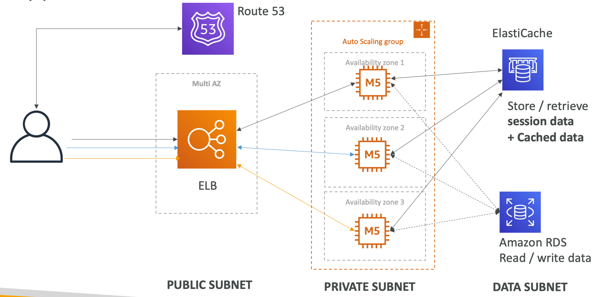
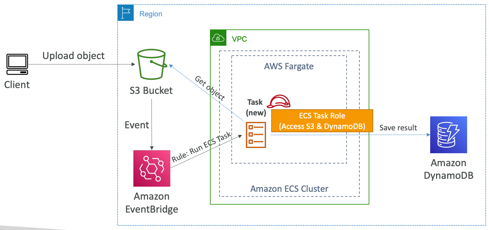
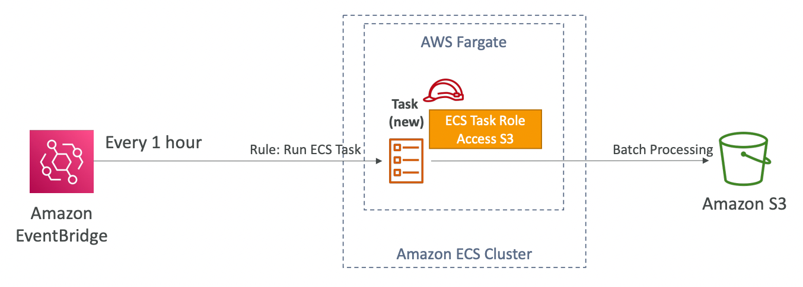
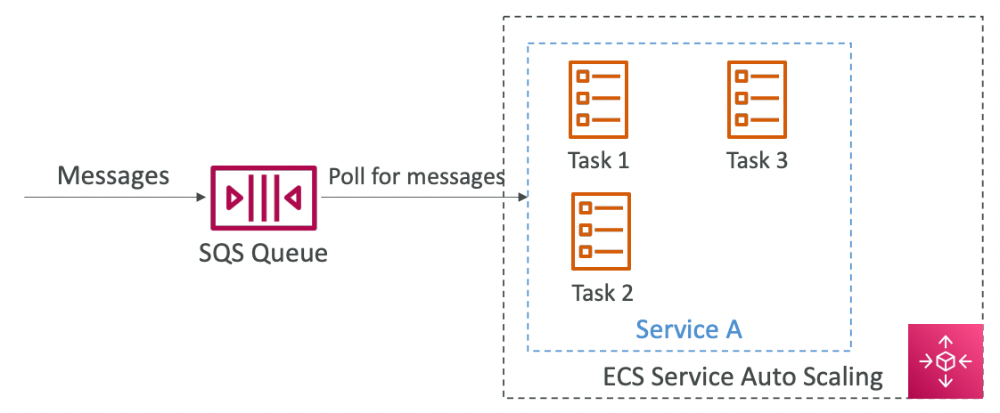
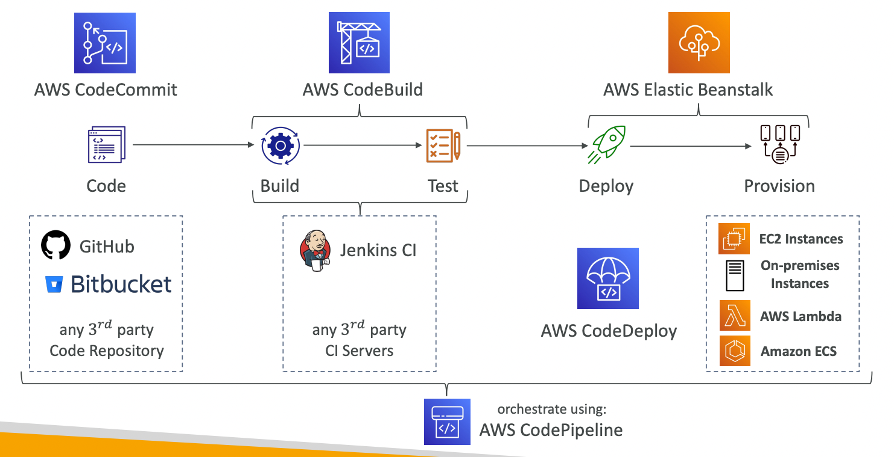
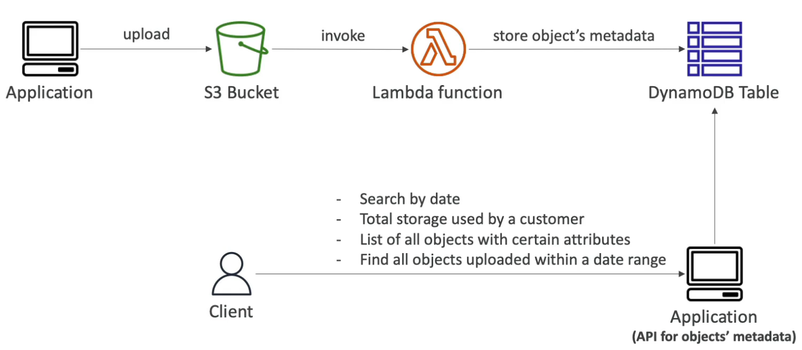
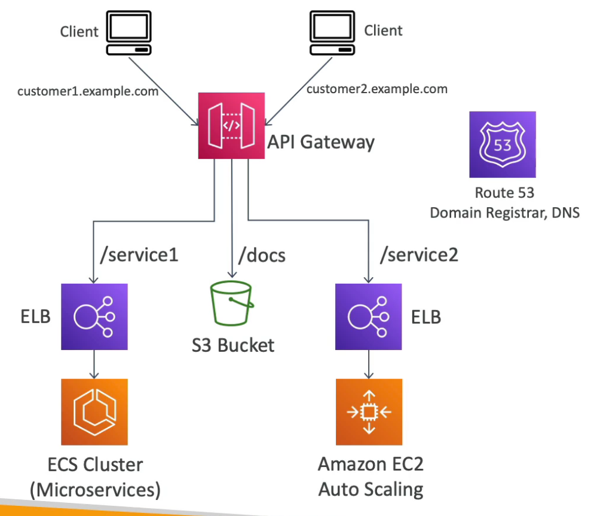
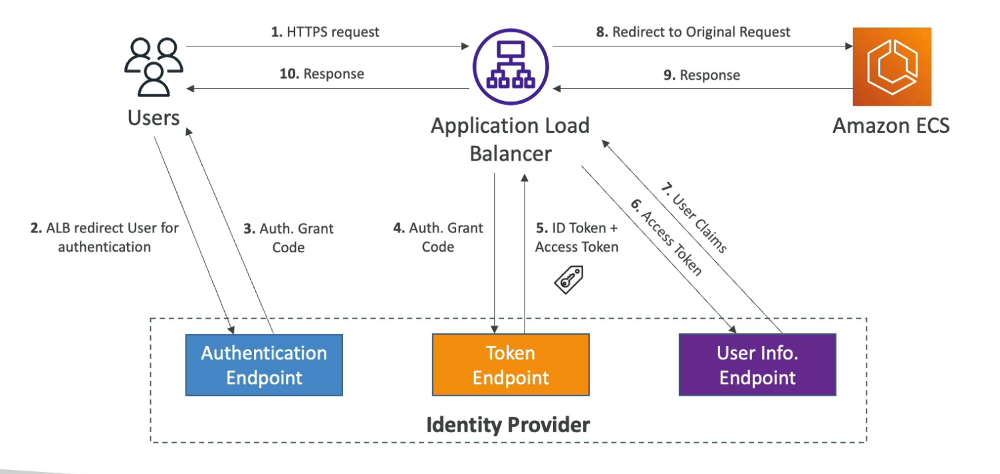

# Architecture Diagrams

- 3-tier Web Application
    
    The application and data tier utilize different private subnets while the ELB is put in a public subnet.
    
    
    
- Serverless image processing using ECS Fargate
    
    Instead of using Lambda functions, we can run an ECS task on an EB event.
    
    
    
- Run scheduled jobs on ECS
    
    
    
- Asynchronous Job processing using SQS and ECS
    
    The ECS service will auto-scale on the queue length.
    
    
    
- Tech Stack for CICD
    
    
    
- Indexing S3 Objects Metadata
    
    Store objects’ metadata in S3 to query later.
    
    
    
- API Gateway as a single interface to all the resources
    
    
    
- Authentication at ALB using an OIDC compliant IDP
    
    