# Amazon ECS

---

## Intro

- AWS managed container orchestration platform
- Integrates with ALB for load balancing to ECS tasks
- EFS is used as persistent multi-AZ shared storage for ECS tasks
- It doesn't automatically handle resource provisioning, balancing load, auto-scaling, monitoring, and placing your containers across your cluster. Use **Elastic Beanstalk** for that.

## Launch Types

### EC2 Launch Type

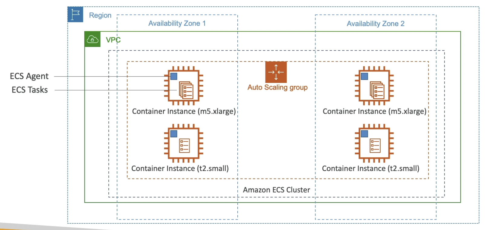

- **Not Serverless**
- Containers run on underlying EC2 instances
- ECS takes care of launching & stopping containers (ECS tasks)
- You must provision & maintain EC2 instances (use ASG)
- **EC2 instances have ECS agent running on them as a docker container**
- Inside a VPC spanning multiple AZ, there is an ECS cluster spanning multiple AZ. Inside the ECS cluster, there will be an ASG responsible for launching container instances (EC2). On every EC2 instance, ECS agent will be running (happens automatically if you choose the AMI for ECS when launching the instance) which registers these instances to the ECS cluster. This will allow the ECS cluster to run Docker containers (ECS tasks) on these instances.

<aside>
💡 The ECS configuration is present in the `/etc/ecs/ecs.config` file in the EC2 instances. To modify properties such as the ECS cluster to which this instance should attach to, modify this file in the instance or in the user data of ASG.

</aside>

### Fargate Launch Type

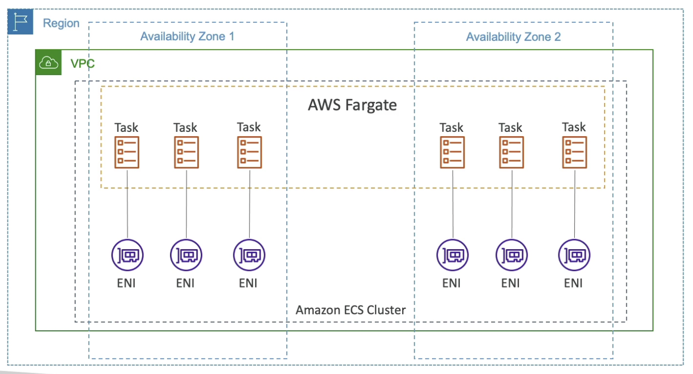

- **Serverless**
- No need to provision infrastructure
- No need to worry about infrastructure scaling
- ECS launches the required containers based on the CPU / RAM needed (**we won’t know where these containers are running**)
- VPC and ECS cluster are setup the same way as in EC2 launch type, but instead of using ASG with EC2 instances, we have a Fargate cluster spanning multiple AZ. The Fargate cluster will run ECS tasks anywhere within the cluster and attach an ENI (private IP) to each task. So, if we have a lot of ECS tasks, **we need sufficient free private IPs**.

## IAM Roles for ECS Tasks

- **EC2 Instance Profile** (IAM role for the EC2 instance)
    - Used by the ECS agent to:
        - Make API calls to ECS service
        - Send container logs to CloudWatch
        - Pull Docker image from ECR
- **Task Execution Role**
    - Allows ECS tasks to access AWS resources
    - Each task can have a separate role
    - **Use different roles for the different ECS Services**
    - Task Role is defined in the task definition
    - Use `taskRoleArn` parameter to assign IAM policies to ECS Task Execution Role
    - Ex. Reference sensitive data in **Secrets Manager** or **SSM Parameter Store**

## ECS Services

- An ECS Service is a **collection of long-running ECS tasks** (eg. web application) that perform the same function
- We can use ALB to send requests to these tasks
- **Service CPU Usage** or the **SQS queue length** for a service are used for scaling

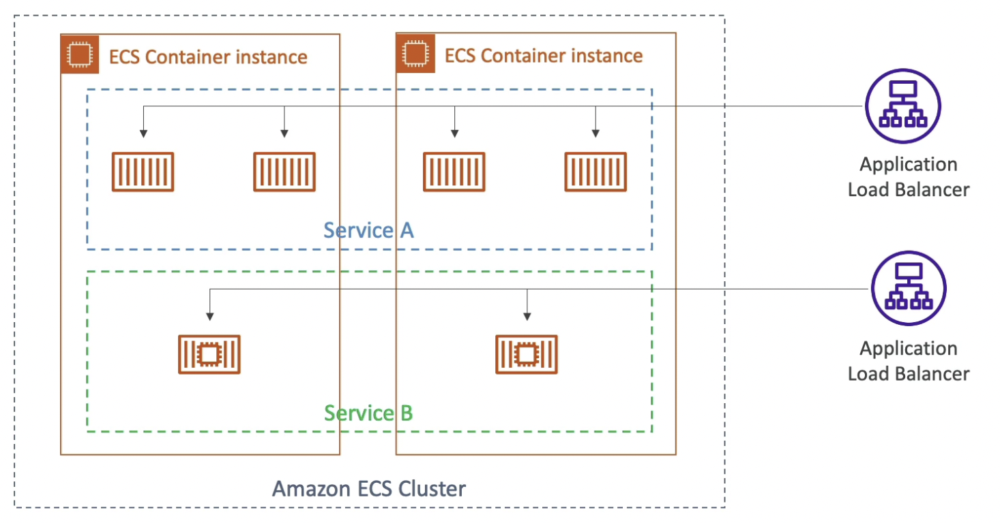

## Load Balancing

### **EC2 Launch Type**

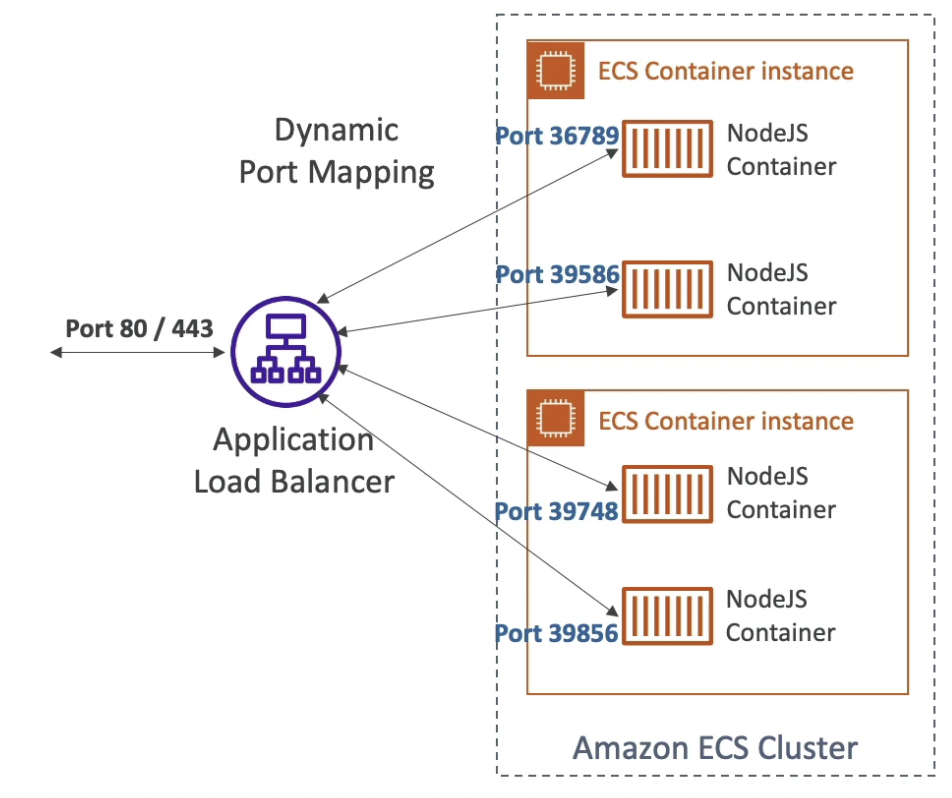

- For every container, the container port is mapped to a random free port on the host (instance). So the application running inside that container will be reached by the ALB on that random port. Set the host port as 0 for this to work.
- **Dynamic Host Port Mapping** - Once the ALB is registered to a service in the ECS cluster, it will automatically find the right port on the EC2 Instances. This only works with ALB, not CLB.
- You **must allow on the EC2 instance’s security group any port from the ALB security group** because it may attach on any port

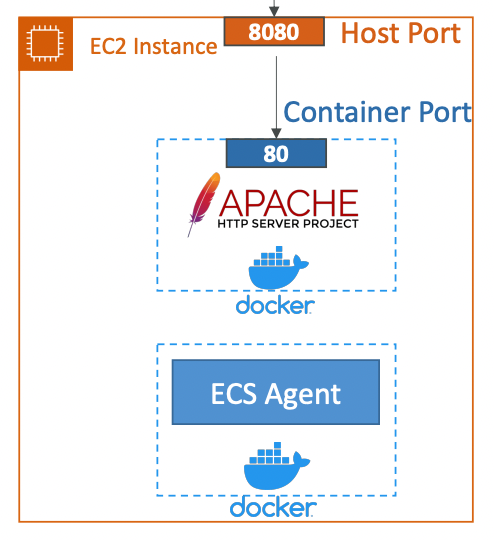

### **Fargate Launch Type**

- **Each task has a unique IP but the same container port**
- The ALB connects to each task directly on its IP and container port since these containers are not run on a defined host (instance).
- You **must allow on the ENI’s security group the task port from the ALB security group**

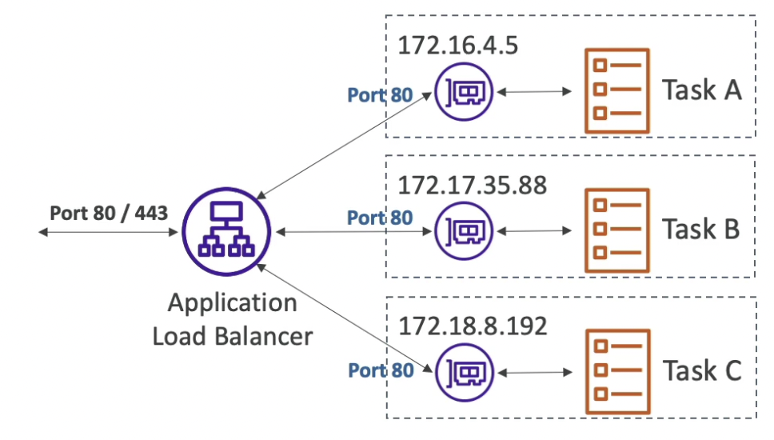

## Rolling Updates

- **Minimum healthy percentage** - determines how many tasks, running the current version, we can terminate while staying above the threshold
- **Maximum percentage** - determines how many new tasks, running the new version, we can launch while staying below the threshold

Min: 50% and Max: 100% and starting number of tasks 4

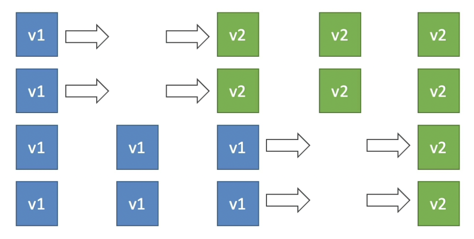

Min: 100% and Max: 150% and starting number of tasks 4

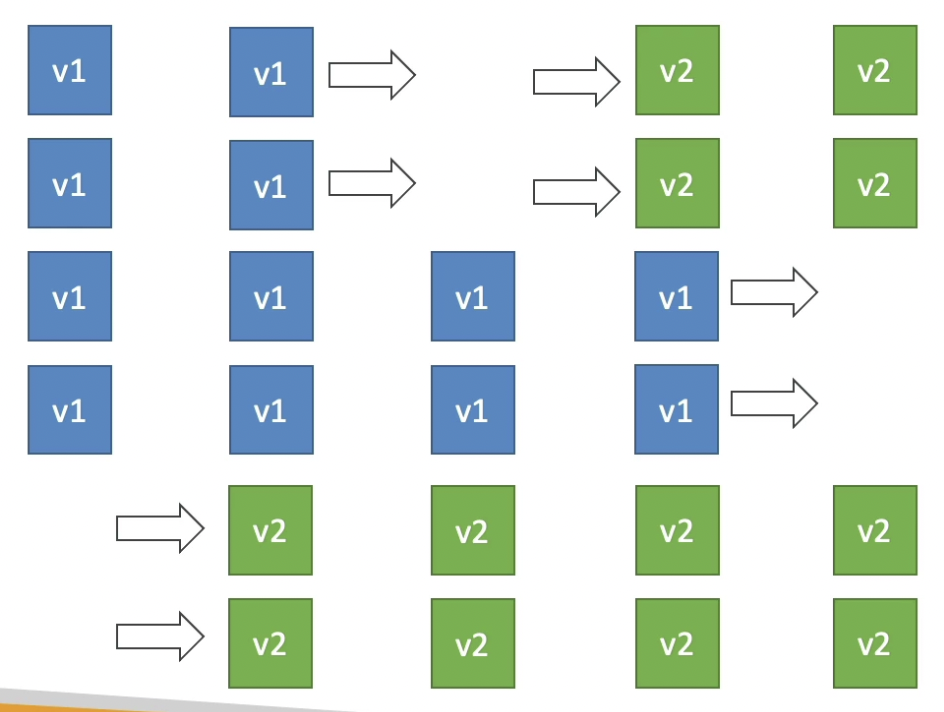

## Secrets in ECS tasks

- Store the secrets in Secrets Manager or Parameter Store and encrypt them using KMS
- Reference the secrets in container definition with the name of the environment variable
- Create an **ECS task execution role** and reference it with your task definition, which allows access to both KMS and the Parameter Store/Secrets Manager.
- Supported for both EC2 and Fargate launch types

## Bind Mounts

- **Shared volume between multiple containers** running the same application (same definition file).
- Bind mount lifecycle
    - EC2 Tasks: lifecycle of EC2 instances since the volumes exist on the host
    - Fargate Tasks: lifecycle of the ECS task [20 GiB (default) - 200 GiB]

## Shared File System in ECS

- **EFS can be mounted as a shared file system between ECS tasks**
- Works for both EC2 and Fargate launch types
- ECS Fargate + EFS ⇒ serverless

## ECS Service Auto Scaling

- Auto scale the number of ECS tasks in a service
- **AWS Application Auto Scaling** can be used to scale on metrics:
    - ECS Service Average CPU Utilization
    - ECS Service Average Memory Utilization
    - ALB Request Count Per Target
- The above metrics can be used to setup target tracking or step scaling for ECS tasks. Scheduled scaling can also be used.
- Easier to setup on Fargate launch type because we don’t have to scale the underlying resource.
- For EC2 launch type, auto-scaling EC2 instances:
    - Using ASG to scale out based on CPU utilization
    - **ECS Cluster Capacity Provider** - automatically scales out EC2 instances when the service is missing capacity.

## Task Definition

- Analogous to Docker Compose
- Tells ECS how to run the docker containers
- **Only 1 IAM Role can be defined per Task Definition.** All the tasks within a service will assume that role.
- Environment variables in Task Definitions
    - Hardcoded (defined in the task definition file)
    - Referenced from Parameter Store
    - Referenced from Secrets Manager
    - Imported as Environment Files from S3 bucket

## Task Placement

This is to be decided only in EC2 launch type. 

### Task Placement Strategy

- **Binpack**
    - Fill up an instance (in terms of CPU or memory) and only then provision a new instance.
    - Minimize cost (number of instances)
    - Example: Binpack on memory

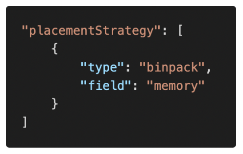

- **Random**
    - Randomly select an instance to place the task.

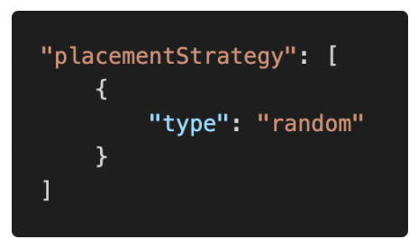

- **Spread**
    - Spread the tasks on a parameter
    - Maximize availability
    - Example: spread on AZ

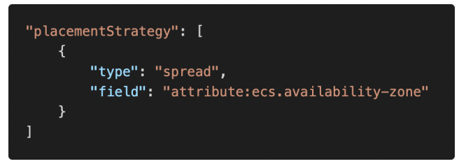

- Task placement strategy can be mixed such as spread on AZ and binpack on memory:

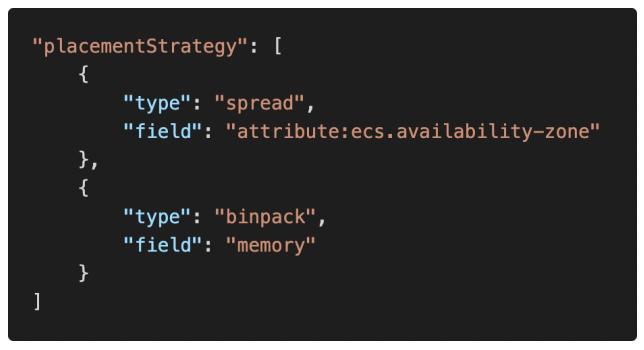

### Task Placement Constraints

- `distinctInstance` - place each task on a different instance
- `memberOf` - place task on instances that satisfy an expression (eg. only on T2 family of instances)

## Troubleshooting Steps

- Verify that the Docker daemon is running on the container instance.
- Verify that the container agent is running on the container instance.
- Verify that the IAM instance profile has the necessary permissions.

## Misc

- You can use EventBridge to run Amazon ECS tasks when certain AWS events occur. Ex: set up a CloudWatch Events rule that runs an Amazon ECS task whenever a file is uploaded to an S3 bucket.
- For tracing, create a Docker image that runs the X-Ray daemon, upload it to a Docker image repository, and then deploy it to your Amazon ECS cluster. Configure the task definition file to allow your application to communicate with the daemon container.
- Use **advanced container definition parameters** to define environment variables for a task.