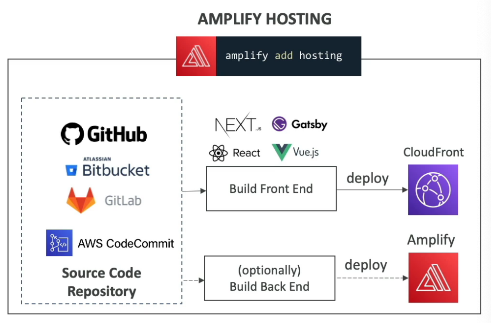
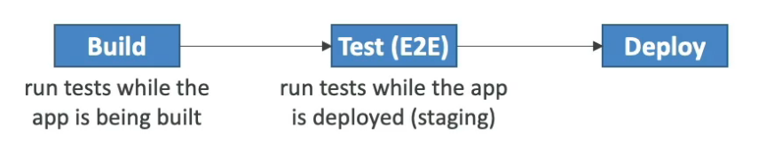

# Amplify

---

## Intro

- Used to build mobile and web applications
- `amplify init` - initialize an amplify project
- Provides features such as data storage, authentication, ML, etc. (all powered by AWS services)
- Provides front-end libraries with ready to use components for popular frameworks like React, Vue, Flutter, etc.

## Offerings

- **Amplify Studio**: Visually build a full-stack app (front-end Ul and backend)
- **Amplify CLI**: Configure an Amplify backend with a guided CLI workflow
- **Amplify Libraries**: Connect your app to existing AWS services
- **Amplify Hosting**: Host web apps via the AWS **CDN**

## Auth

- Provides authentication out of the box (`amplify add auth`)
- Leverages [Cognito](cognito.md)
- Supports MFA, Social Sign-in (federated identities), Account Recovery, etc.
- Provides pre-built UI components to integrate in the front-end
- Provides fine-grained authorization

## GraphQL API & Data Store

- Provides **GraphQL API using AppSync** and DynamoDB as the data store (`amplify add api`)
- Work with data locally with automatic synchronization to the cloud (offline and real-time capabilities)
- Visual data modeling using Amplify Studio

## Hosting

- Host web applications (`amplify add hosting`)
- Support for CICD, PR Reviews, Custom Domains, Monitoring, etc.
- Competing with services like **Netlify** and **Vercel**.

## Testing

- **Run unit tests during the build phase** (defined as test step in `amplify.yml`)
- Run **end-to-end tests during the test phase** before deploying the app in production environment (app is deployed in the testing environment)
    - Integrated with **Cypress** E2E testing framework (allows to generate UI report for the tests)

