# API Gateway

---

## Intro

- Serverless REST APIs with **TLS termination** (all of the APIs created with API Gateway expose **HTTPS** endpoints only)
- API versioning
- Multiple environment (dev, test, prod)
- Request throttling
- Authentication and Authorization
- Supports API keys
- Supports **WebSocket**
- Cache API responses
- Generate SDK and API specifications
- Swagger / OpenAPI config supported (import or export)
- Transform and validate requests and responses
- Firewall can be implemented using Web Application Firewall (WAF)

## Integration

### Integration Types

- `MOCK` - API gateway returns a mock (hardcoded) response (useful in development)
- `AWS_PROXY` (Lambda Proxy)
    - Incoming request from the client is **proxied to the lambda function** as a JSON event (request specific params like status code is automatically handled by API gateway)
    - Used to create serverless REST APIs
    - **Cannot modify the request & response in API gateway** (no mapping template)
    - The entire processing of request happens in the Lambda function
    
    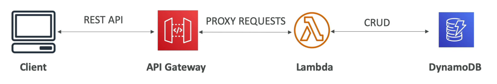
    
- `AWS`
    - To integrate with AWS resources or a Lambda function (custom integration)
    - Can modify integration requests and responses using **mapping templates**
- `HTTP_PROXY`
    - Incoming request is proxied to any HTTP backend
    - **Request & response cannot be modified** (no mapping template)
    - Option to add HTTP headers in the request (eg. API key)
    
    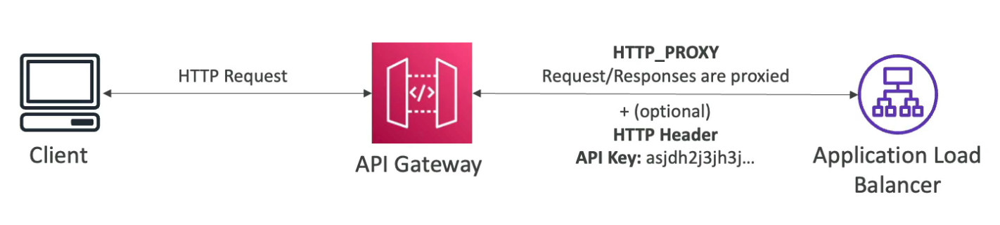
    
- `HTTP`
    - To integrate with any HTTP endpoint
    - Can modify integration requests and responses using **mapping templates**
    
    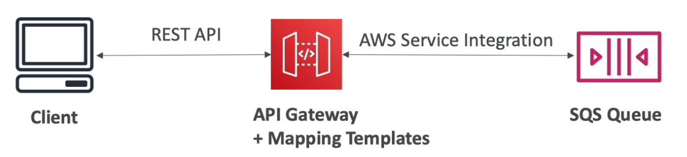
    

### Mapping Templates

- Used to modify requests and responses
    - Modify query string parameters
    - Modify body content
    - Add headers
- Uses **Velocity Template Language (VTL)**
- `Content-Type` must be `application/json` or `application/xml`
- Example: Exposing a SOAP backend as a REST API
    
    Use mapping template to convert requests and responses between JSON and XML.
    
    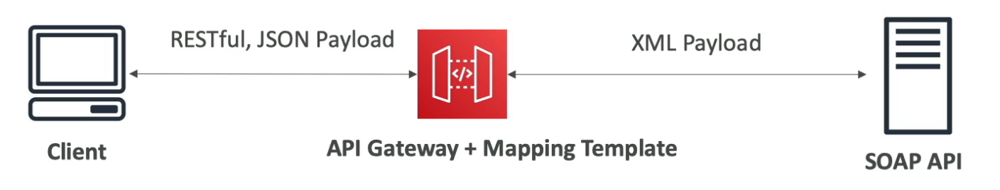
    

## Endpoint Types

- **Edge-Optimized** (default)
    - For global clients
    - Requests are routed through the CloudFront edge locations (improves latency)
    - The API Gateway lives in only one region but it is accessible efficiently through edge locations
- **Regional**
    - For clients within the same region
    - Could manually combine with your own CloudFront distribution for global deployment (this way you will have more control over the caching strategies and the distribution)
- **Private**
    - Can only be accessed within your VPC using an **Interface VPC endpoint** (ENI)
    - Use resource policy to define access

## Deployments

- Deploy the API to get the API Gateway endpoint
- If you make changes to the API, a new version is internally created. You need to deploy the API for the changes to take effect.
- **Versions (changes) are deployed to stages** (no limit on the number of stages)
- Metrics and logs are separate for each stage
- Each stage has independent configuration and can be rolled back to any version (the whole history of deployments to a stage is kept)
- Handling breaking changes using multiple stages
    
    We want to create a new version of the application which involves breaking changes at the API level. In this case, we can deploy a new stage (v2) and build our new application there. Since multiple stages can co-exist, we can have both the versions working and once all the users have migrated to v2, we can bring down v1. 
    
    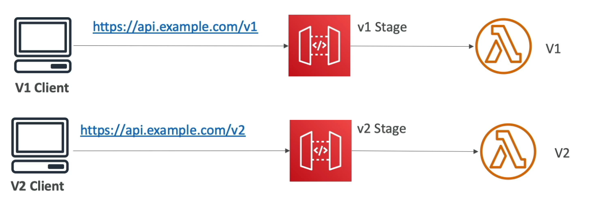
    

### Stage Variables

- Environment variables for API gateway
- Can be changed without redeploying the API
- Stage variables are passed to **context** object in lambda functions
- Format to access stage variables in API gateway - `${stageVariables.variableName}`
- Example: Stage variables to point to Lambda Aliases
    
    Stage variables can be used to point to different Lambda aliases. Each stage points to a different lambda alias depending on the value of a stage variable. To shift traffic, we can modify the alias weights without making changes to the API gateway.
    
    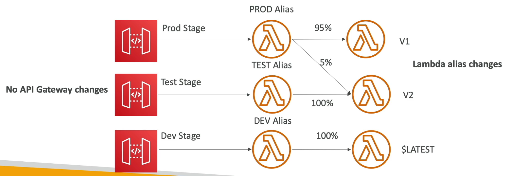
    
    The lambda function in API gateway - `<function-name>:${stageVariables.variableName}`
    
    
    
    This will require adding resource-based policies on all the aliases to allow the API gateway to invoke them.
    
    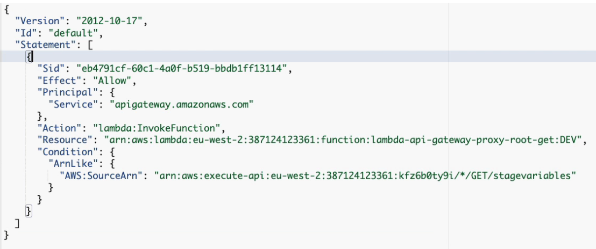
    
    For every stage, create a stage variable with the value as name of the alias it should point to. 
    
    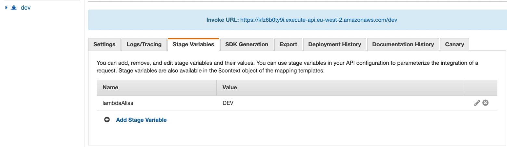
    

### Canary Deployment

- Use a **canary stage** with the new application version
- Can override stage variables for Canary deployment

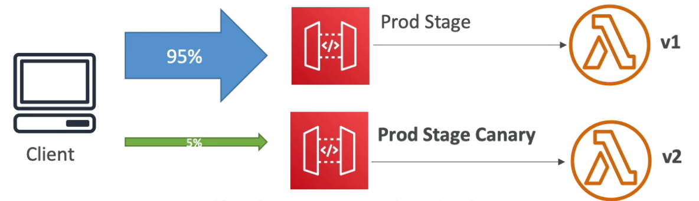

## OpenAPI Spec

- Define REST APIs as configuration (YAML or JSON)
- Also allows to import AWS specific parameters and extensions
- Export as OpenAPI spec to generate SDK for clients
- API schema can also be defined in the OpenAPI spec
    - Allows API gateway to validate incoming requests for correct schema
    - Returns 400 status code if the validation fails
    - Reduces unnecessary calls to the backend
    - Examples
        
        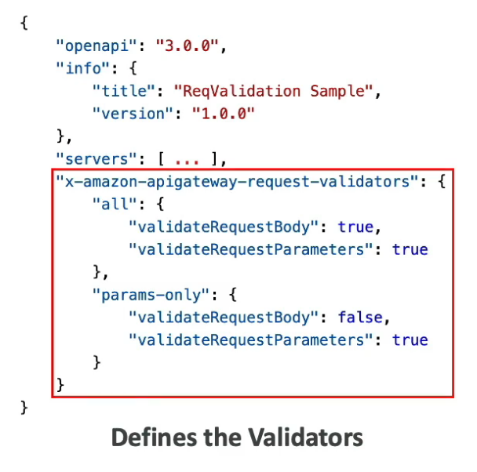
        
        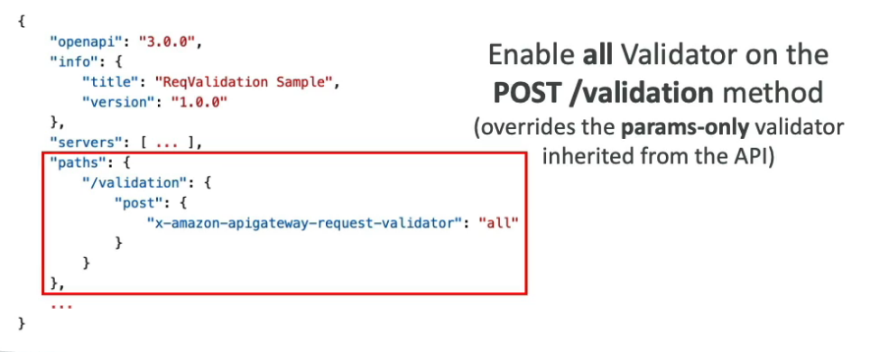
        
        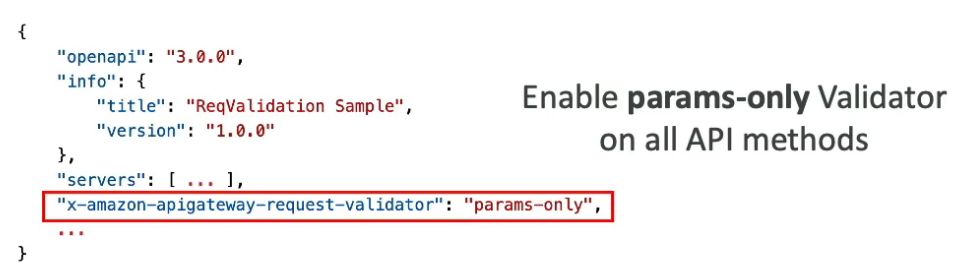
        

## Caching API Responses

- Reduces the number of calls made to the backend
- **TTL: 0 s - 1 h (default 300 sec)**
- Caching at the stage level
- Ability to override cache settings at the method level
- Cache capacity: 0.5 GB - 237 GB
- Cache can be encrypted
- Caching is expensive (use only in production)

### Cache Invalidation

- Invalidate the entire cache from console
- Clients can invalidate the cache for a request by adding a header `Cache-Control: max-age=0` in the request. This will send the request to the backend and update the cache with the response.
    
    Recommended to impose an IAM policy to allow only the clients to invalidate the cache. Without an IAM policy or Authorization Disabled, anyone can invalidate the cache.
    
    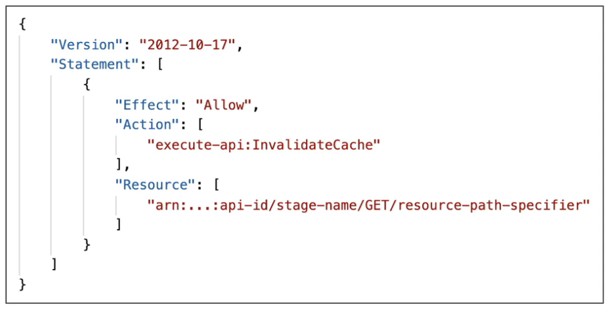
    
- Tick the `Require authorization` checkbox to only allow authorized clients to invalidate the cache.

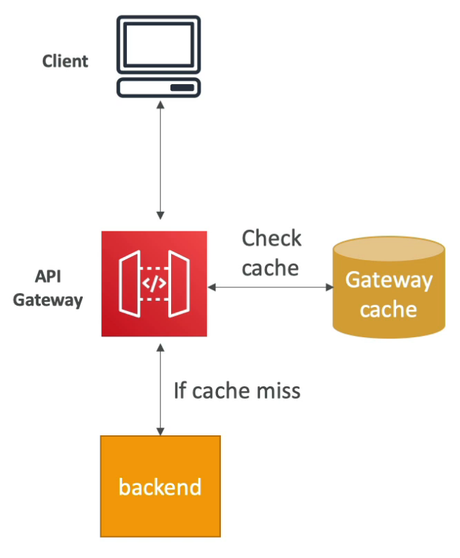

## Usage Plans

- Used to monetize the APIs
    - Which clients can access what stages and methods
    - Throttling and quota limits for each client
- Clients use API keys to access the APIs (passed in `X-API-Key` header)
- Throttling limits are applied for each API key
- Clients are billed based on the API calls using their API keys

### Steps to setup a Usage Plan

- Create the API and deploy them to the right stages
- Generate API keys and distribute them to the customers
- Create a usage plan with the desired throttle and quota limits
- **Associate** API stages and **API keys with the usage plan** using `CreateUsagePlanKey` API

## Observability

### Logging

- Logs contain the request and response passing through API gateway
- **Can be enabled at the stage level**
- Can override the logging settings at the API level
- Sent to CloudWatch logs (set Log Level: `ERROR`, `DEBUG`, `INFO`)
- Two types of logs:
    - **Execution Logs**: log requests, responses, etc.
    - **Access Logs**: who accessed the API and how

### Tracing

- Enable X-Ray to trace API calls

### Metrics

- Metrics are available at the stage level
- Can enable detailed metrics
- Key metrics:
    - `CacheHitCount` & `CacheMissCount`
    - `Count` - request count within a period
    - `IntegrationLatency` - how long the backend takes to reply to the API gateway
    - `Latency` - how long client had to wait to get a response from API gateway (includes integration latency and other API Gateway overheads such as authorization)
    - `4XXError` - client side error count
    - `5XXError` - server sider error count

## Performance

- **Max timeout: 29 sec**
- Throttling limit - 10,000 req/sec across all APIs (account level soft limit)
    - `429 Too Many Requests` error in case of throttling
    - If one API is getting too many requests, it can throttle other APIs
    - Set stage limits or method limits to prevent overuse
    - Create a usage plan to throttle per customer

## Cross Origin Resource Sharing (CORS)

- Enable if you will receive API calls from another domain
- The response of pre-flight request must contain `Access-Control-Allow-Origin` header to allow the cross-origin client to make API calls.
- When the integration type is proxy-based, the responses are proxied to the client without modification by API gateway. So, CORS needs to be handled by the backend itself.
- For non-proxy integrations, CORS can be handled by API gateway.
- `MaxAgeSeconds` specifies the TTL used by browser to cache pre-flight response
- The client-side JS in the website (`www.example.com`) wants to make an API call to the backend hosted via API gateway at `api.example.com`. The browser will first make a pre-flight request to the backend asking what methods are allowed for `www.example.com`. If CORS is enabled, API gateway will allow the required methods.
    
    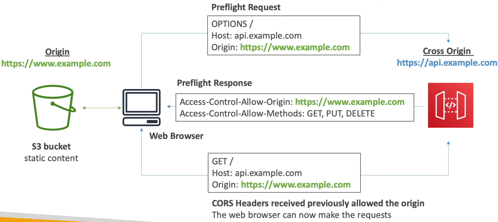
    

## TLS Termination

- TLS certificates can be referenced from ACM
- Edge-Optimized endpoint → certificate must be in `us-east-1`
- Regional endpoint → certificate must be in the same region as API Gateway
- Must setup CNAME or A-alias record in Route 53 to point to the API gateway endpoint

## User Authentication

### IAM

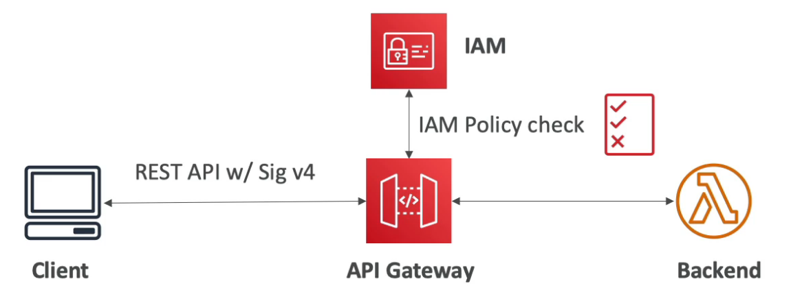

- IAM User or Role for authentication
- IAM Policy applied to principals for authorization (access control)
- Fully integrated with API gateway (no custom implementation needed)
- Good to provide access within AWS
- Leverages **SigV4** to sign the credentials in the header
- **Resource-based policies** can be used to allow the following access to API gateway
    - IAM Users and Roles in another account (cross-account access)
    - IP Addresses
    - VPC Endpoint

### Cognito User Pools (CUP)

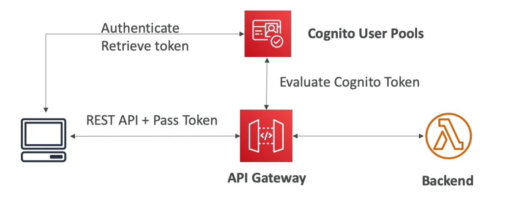

The client first authenticates themselves to CUP and get the token. They pass the token along with the request to API gateway. API gateway verifies the token with Cognito before forwarding the request to the backend.

- Cognito is AWS managed identity provider. It fully manages user lifecycle and expires tokens automatically.
- Fully integrated with API gateway (no custom implementation needed)
- **Only provides authentication** (access to the API) (authorization needs to be managed in the backend)
- Good to provide access to external users

### Lambda Authorizer

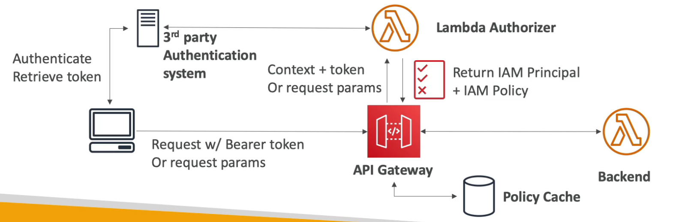

The client authenticates themselves to a 3rd party IDP and retrieve the token. The token is passed along with the request to the API gateway. The lambda authorizer takes the token, decodes it and determines the required IAM permissions. It can optionally verify the token with the IDP. The lambda authorizer then creates an IAM principal and policy granting the required permissions.

- Custom authorization logic (manual integration)
- Authentication is handled externally
- Authorization is performed by the lambda function
- Enable caching the result of authorization (recommended)
- Recommended to use this and not just rely on API keys for enhanced security.
- Two types:
    - **Token-based Lambda authorizer** (Token Authorizer) uses JWT or OAuth **for 3rd party authentication system**
    - **Request parameter-based Lambda authorizer** (Request Authorizer) receives the caller's identity in a combination of headers, query string parameters, stageVariables, and `$context` variables.

## API Types

### **REST**

- Standard APIs that we mostly create
- Supports resource-based policy
- **Does not support OIDC and OAuth 2.0 natively**

### **HTTP**

- **Low-latency** & cost effective **proxies** to Lambda or any HTTP endpoint (no data mapping)
- Supports OIDC and OAuth 2.0
- No usage plans and API keys
- Does not support resource-based policies
- **Cheaper than REST APIs**

### **WebSocket**

- 2 - way communication between the client and the server
- Connection is persistent and stateful
- Used in real-time chat application, collaboration platforms, multiplayer games and financial trading platforms.
- The backend can be anything (AWS services or any HTTP endpoint)
- Establishing a WebSocket Connection
    
    The client sends a request to the WebSocket url (`wss://[some-uniqueid].execute-api.[region].amazonaws.com/[stage-name]`) of API gateway. This establishes a persistent connection between the client and the API gateway. The API gateway calls a Lambda function (`onConnect`) and passes the connectionId which is then stored in DynamoDB (stateful).
    
    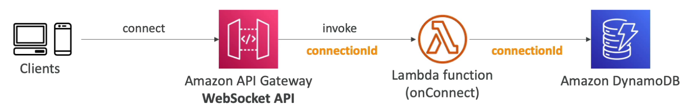
    
- Client → Server Messaging
    
    Once the WebSocket connection is established, the client can keep on sending messages (frames) to the server on the same WebSocket URL through the same persistent connection. The sent frames will invoke another lambda function to perform the desired action.
    
    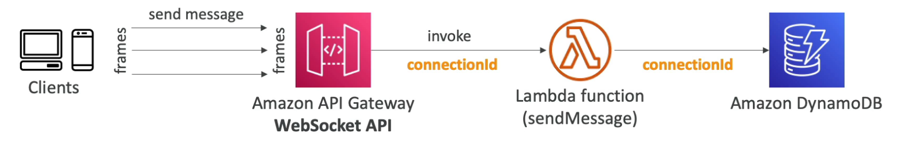
    
- Server → Client Messaging
    
    A lambda function can make an HTTP POST request (signed by SigV4) to the **Connection URL** (WebSocket URL + `/@connections/[connectionId]`) to send messages to the client through the API gateway.
    
    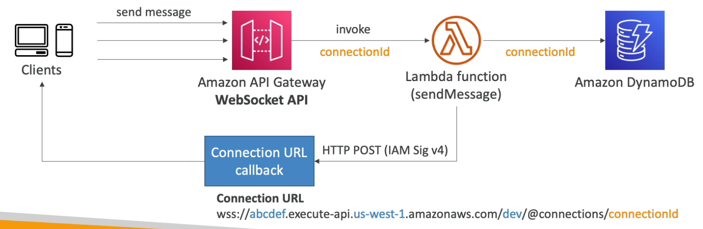
    
- Operations on WebSocket Connection URL (WebSocket URL + `/@connections/[connectionId]`)
    - `POST` - Send a message from the Server to the connected WS Client
    - `GET` - Get the latest connection status of the connected WS Client
    - `DELETE` - Disconnect the connected Client from the WS connection
- **Routing**: Incoming JSON messages from the client are routed to different backend based on the **Route Key Table** (defined in API gateway). We can specify route selection expression to route based on a field in the JSON message. If no match, it is sent to the `$default` route.