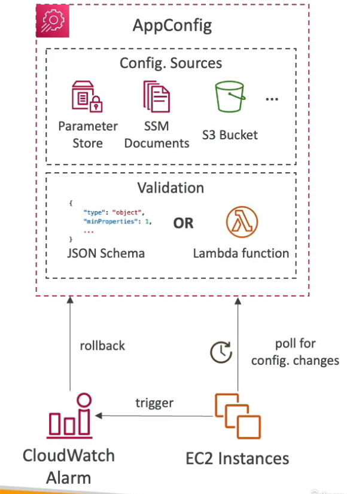

# AppConfig

- Used to **separate configuration from the application**
- Deploy dynamic configuration changes without redeploying application
- Used for apps running on EC2, Lambda, ECS, EKS, etc.
- Use cases: **feature flags** to enable or disable a feature, **dynamic IP blocklist**, etc.
- Gradually deploy the configuration changes and rollback if issues occur
- **Validate configuration** changes before deployment using:
    - **JSON Schema** (syntactic check)
    - **Lambda Function** - run code to perform validation (semantic check)

