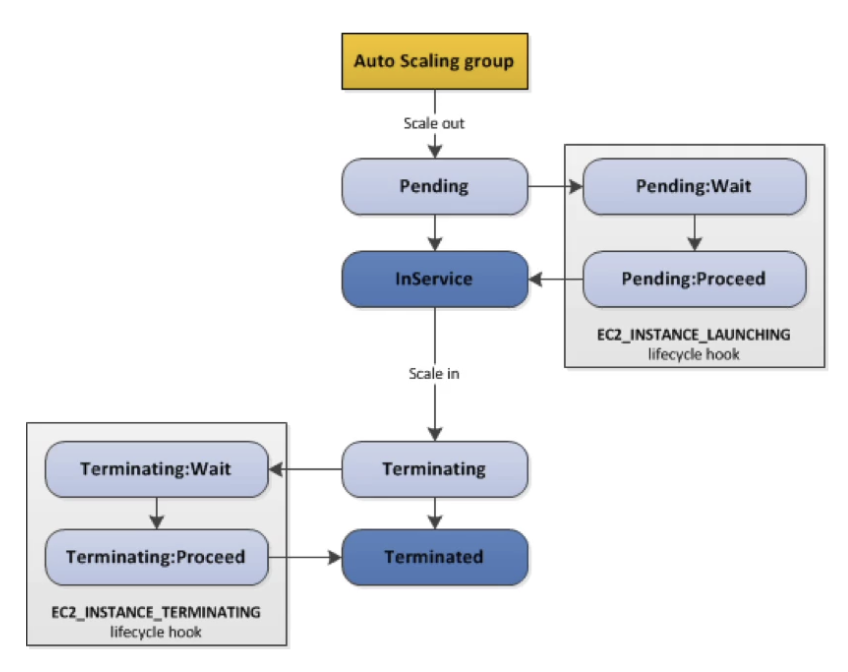

# ASG

---

## Intro

- Regional Service (cannot span multiple regions)
- Supports Multi AZ
- Automatically add or remove instances (scale horizontally) based on the load
- Free (pay for the underlying resources)
- IAM roles attached to an ASG will get assigned to the launched EC2 instances
- ASG can terminate instances marked as unhealthy by an ELB (and hence replace them)

<aside>
💡 If you have an ASG with running instances and you delete the ASG, the instances will be terminated and the ASG will be deleted.

</aside>

## Scaling Policies

- **Scheduled Scaling**
    - Scale based on a schedule
    - Used when the load pattern is predictable
- **Simple Scaling**
    - Scale to certain size on a CloudWatch alarm
    - Ex. when CPU > 90%, then scale to 10 instances
- **Step Scaling**
    - Scale incrementally in steps using CloudWatch alarms
    - Ex. when CPU > 70%, then add 2 units and when CPU < 30%, then remove 1 unit
    - Specify the **instance warmup time** to scale faster
- **Target Tracking Scaling**
    - ASG maintains a CloudWatch metric and scale accordingly (automatically creates CW alarms)
    - Ex. maintain CPU usage at 40%
- **Predictive Scaling**
    - Historical data is used to predict the load pattern using ML and scale automatically

## Launch Configuration & Launch Template

- Defines the following info for ASG
    - AMI (Instance Type)
    - EC2 User Data
    - EBS Volumes
    - Security Groups
    - SSH Key Pair
    - Min / Max / Desired Capacity
    - Subnets (where the instances will be created)
    - Load Balancer (specify which ELB to attach instances)
    - Scaling Policy
- **Launch Configuration** (legacy)
    - Cannot be updated (must be re-created)
    - **Does not support Spot Instances**
- **Launch Template** (newer)
    - Versioned
    - Can be updated
    - **Supports both On-Demand and Spot Instances**
    - Recommended by AWS

## Scaling Cooldown

- After a scaling activity happens, the ASG goes into cooldown period (**default 300 seconds**) during which it does not launch or terminate additional instances (ignores scaling requests) to allow the metrics to stabilize.
- Use ready-to-use AMI to launch instances faster to be able to reduce the cooldown period

## Health Checks

- By default, ASG uses the EC2 status check (not the ELB health check). This could explain why some instances that are labelled as unhealthy by an ELB are still not terminated by the ASG.
- To prevent ASG from replacing unhealthy instances, suspend the **ReplaceUnhealthy** process type.

<aside>
💡 When an instance is unhealthy, ASG creates a new scaling activity for terminating the unhealthy instance and then terminates it. Later, another scaling activity launches a new instance to replace the terminated instance.

</aside>

## Termination Policy

- Select the AZ with the most number of instances
- Delete the instance with the oldest launch configuration
- Delete the instance which is closest to the next billing hour

## Rebalancing AZs

ASG ensures that the group never goes below the minimum scale. Actions such as changing the AZ for the group or explicitly terminating or detaching instances can lead to the ASG becoming unbalanced between AZs. In such cases, ASG compensates by **rebalancing** the AZs by **launching new instances before terminating the old ones**, so that rebalancing does not compromise the performance or availability of the application.

## Lifecycle Hooks

- Used to perform extra steps before launching or terminating an instance. Example:
    - Install some extra software or do some checks (during pending state) before declaring the instance as "in service"
    - Before the instance is terminated (terminating state), extract the log files
- **Without lifecycle hooks, pending and terminating states are avoided**

## Instance Refresh

- `StartInstanceRefresh` API call to update the instances to the latest launch template (doesn’t happen automatically if we just update the launch template)
- Can specify **minimum healthy percentage** (for rolling update)
- Can specify **warm-up time** (how long to wait for the new instances to become ready to use)