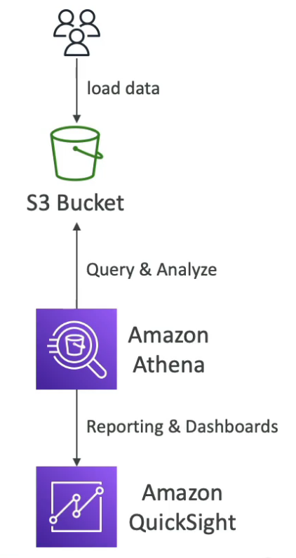
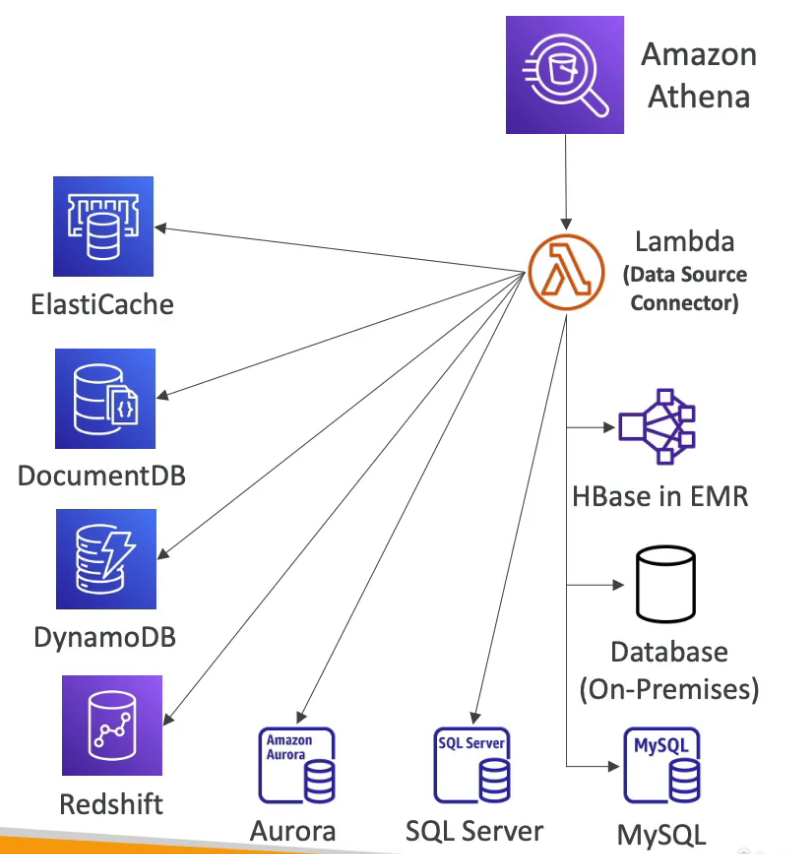

# Athena

## Intro

- **Serverless** query service to **perform analytics on data stored in S3**
- Uses **SQL** language to query the files
- **Runs directly on S3** (no copying needed)
- Output stored in S3
- Built on **Presto** engine
- Supports CSV, JSON, ORC, AVI and Parquet file formats
- Integrates with **QuickSight** for reporting & dashboards

## Performance Improvement

- Use compressed or columnar data for cost-savings (due to less scan)
    - **Apache Parquet** or **ORC** file format is recommended (use **Glue** to convert data to these formats)
- Compress data for faster retrievals
- Partition datasets in S3 hierarchically for easy querying
- Use fewer large files (> 128 MB) instead of many small files for faster processing

## Federated Query

- Run **SQL queries on data stored in any data source** (relational, non-relational, object, custom data sources on AWS or on-premise)
- Uses **Data Source Connectors** that runs on AWS Lambda to run federated queries on these data sources.

## Misc

- The `MSCK REPAIR TABLE` command scans Amazon S3 for Hive compatible partitions that were added to the file system after the table was created. It compares the partitions in the table metadata and the partitions in S3. If new partitions are present in S3, it adds those partitions to the metadata and to the Athena table. It can work better than DDL commands if have more than a few thousand partitions and DDL is facing **timeout issues.**