# CloudFormation

---

## Intro

- Infrastructure as Code (IaC) - version control, easy replication
- Supports most AWS services
- Declarative programming
- Free, pay for the underlying resources
- CloudFormation stacks are isolated from each other
- Deleting a stack deletes every single resource or artifact created by that stack.

## Templates

- **Templates are uploaded and referenced from S3**. To update a template, we cannot edit the previous version. We need re-upload a new version of the template and CloudFormation will find out what needs to be modified to reach the desired state.
- Deploying Templates
    - Manual - editing templates in the **CloudFormation Designer (GUI)**
    - Automated - editing templates in a YAML file and using CLI to deploy the templates (recommended for automation)

### Resources

- **Mandatory field**
- Resource types are of the form `AWS::aws-product-name::data-type-name`
- Template contents are static (no dynamic code generation allowed)

### Parameters

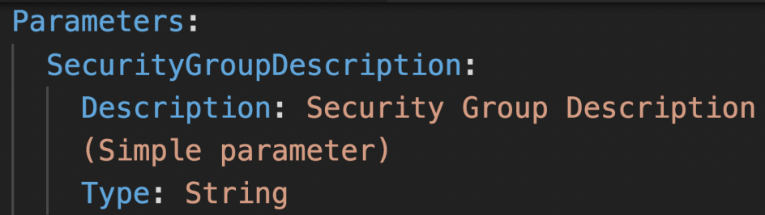

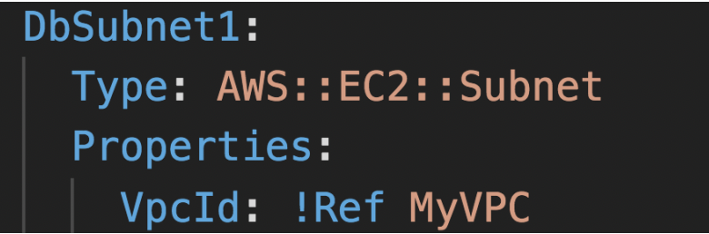

- Dynamic input variables in CloudFormation templates. When deploying the template, the user will be asked to enter values for the defined parameters.
- Parameters can be referenced using `!Ref`
- Parameters can be modified without having to re-upload the template
- AWS creates some default parameters (**Pseudo Parameters**) that can be used in the template.
    
    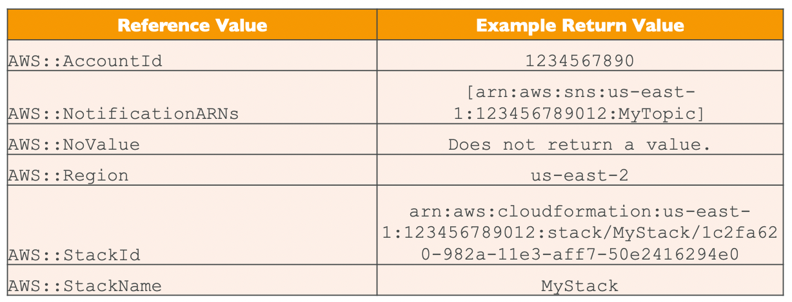
    
- Supported parameter types:
    
    ```
    String – A literal string
    
    Number – An integer or float
    List<Number> – An array of integers or floats
    
    CommaDelimitedList – An array of literal strings that are separated by commas
    
    AWS::EC2::KeyPair::KeyName – An Amazon EC2 key pair name
    
    AWS::EC2::SecurityGroup::Id – A security group ID
    AWS::EC2::Subnet::Id – A subnet ID
    AWS::EC2::VPC::Id – A VPC ID
    
    List<AWS::EC2::VPC::Id> – An array of VPC IDs
    List<AWS::EC2::SecurityGroup::Id> – An array of security group IDs
    List<AWS::EC2::Subnet::Id> – An array of subnet IDs
    ```
    
- All the parameters are independent of each other.

### Mappings

- Static variables hardcoded in the template
- Mappings are great when the value can be deduced from variables such as Region, AZ, AWS Account ID, etc.
- `Fn::FindInMap` or `!FindInMap` is used to fetch the value from a map
    
    `!FindInMap [MapName, TopLevelKey, SecondLevelKey]` (always this syntax)
    
- Example: Select the AMI based on the region and architecture
    
    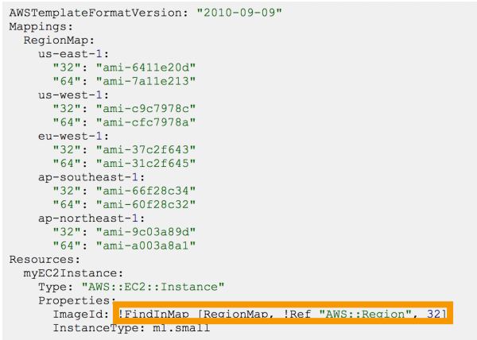
    

### Outputs

- Export output values after the stack creation (optional)
- Exported outputs can be imported by other CloudFormation stacks using `!ImportValue` function along with their export names.
- Exported output name must be unique within the region.
- We cannot delete a stack if its outputs are being referenced by another stack
- Example: In the network template, export the SSH security group and import them in other stacks to apply to EC2 instances.

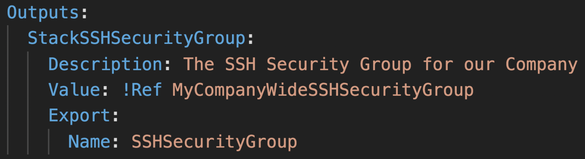

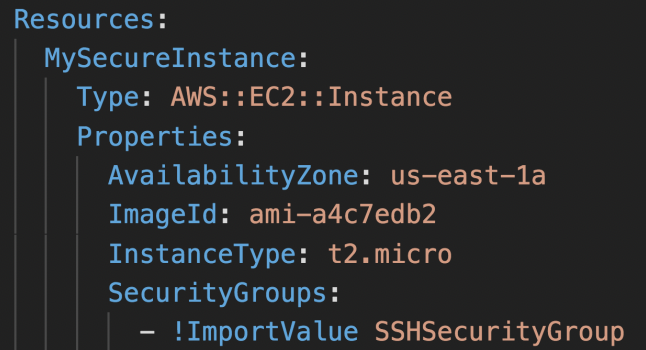

### Conditions

- Control the creation of **resources** or **outputs** based on a condition
- **Conditions cannot be used within the Parameters section**
- Conditions can reference other conditions for nesting
- Supported functions: And, Or, Not, Equals, If
- Example: `CreateProdResources` will be True only if `EnvType` is `prod`.
    
    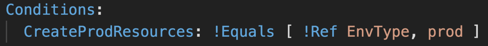
    
    MountPoint resource will be created only if `CreateProdResources` is True.
    
    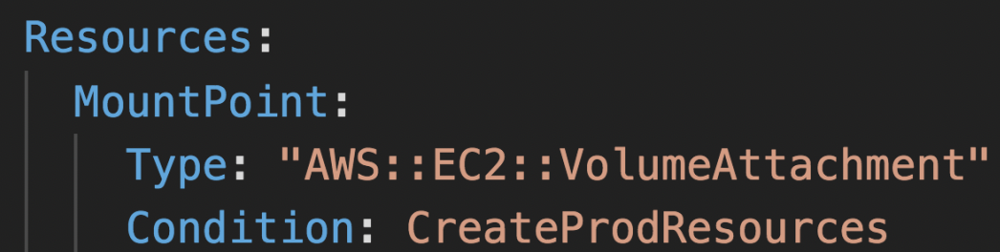
    

### Intrinsic Functions

- `Ref` - returns the ID of a resource or value of a parameter
    
    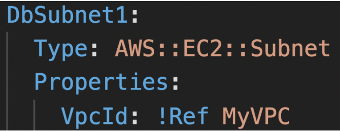
    
- `GetAtt` - get an attribute of a resource
    
    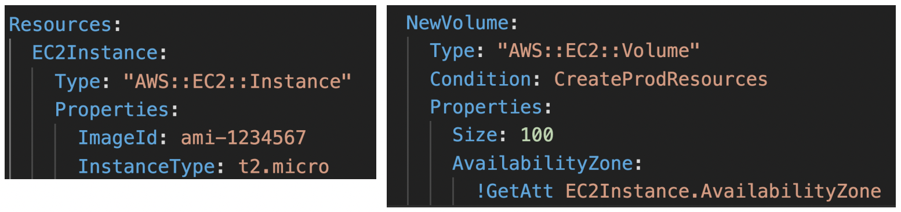
    
- `FindInMap` - get a value from a mapping
    
    
    
- `ImportValue` - import exported outputs from other templates
    
    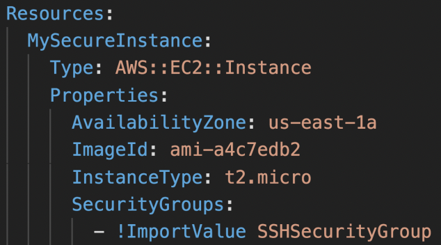
    
- `Join` - join comma-delimited list of values
    
    `!Join [ ":", [a, b, c] ]` ⇒ `"a:b:c"`
    
- `Sub` - substitute variables with a string

## Rollbacks

- Two methods:
    - **Rollback all stack resources (default)** - rollback the entire stack to the last known stable state (deletes everything in the failed stack)
    - **Preserve successfully provisioned resources** - resources that were successfully provisioned will be preserved, failed resources will be rolled back to the last known stable state
- During stack creation, rolling back to the previous state means deleting the entire stack.
- During stack update, rolling back to the previous state will delete the failed stack and bring up the previous version.

## ChangeSets

When we upload a new template to update a stack, ChangeSets show what changes are going to happen to the stack, before creating the stack. If we want to modify the template, we can do that at this stage. Once we are happy, we can execute the change set for the stack to update.

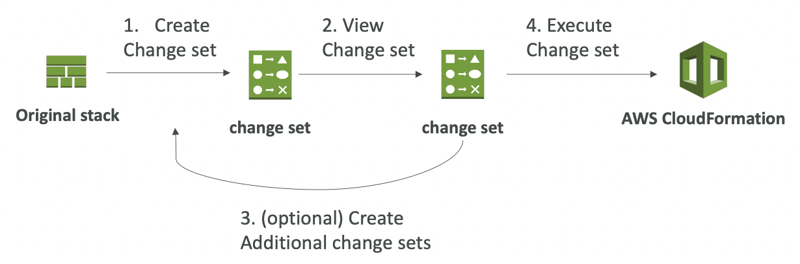

## Nested Stack

- Allow us to reuse repeated patterns or common components across multiple stacks (**best practice**).
- To update a nested stack, always update the parent (root stack) first
- **Cross Stacks are used when stacks have different lifecycles** (export a value from a stack and import it in other stacks) whereas **Nested Stacks are used when the components can be reused**.


Above: cross stack
Below: nested stack

## StackSets

- Used to create, update or delete stacks across **multiple accounts or regions** with a single operation.
- Admin account creates StackSets. Trusted accounts can create, update or delete stack instances from StackSets.

## Drift

- CloudFormation doesn’t prevent against manual configuration changes to the stack. This causes drift in the stack.
- Feature to detect drift in the stack (Select a stack → Action → Detect Drift)
- Shows what is the expected and actual configuration of drifted resources
- Not all resources are supported yet

## Stack Notifications

- Enable SNS integration when creating a stack to **send stack events to an SNS topic**
- A lambda function can be used to filter for specific events and perform some action (eg. send an email whenever the stack rolls back)

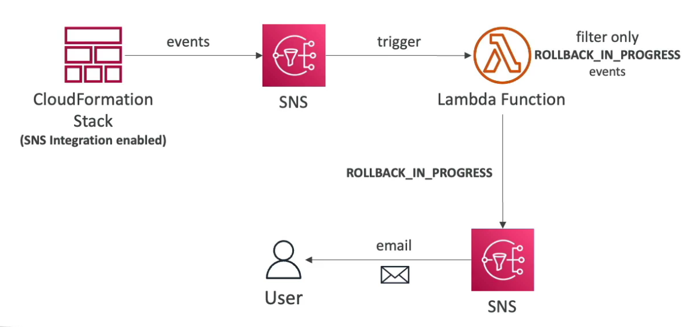

## Stack Policies

- By default, all update actions are allowed to all the resources during a stack update
- **Stack Policy defines the update actions that are allowed or denied on specific resources during stack update**
- Helps protect some resources from unintentional updates
- When you create a stack policy, all update operations on all the stack resources are denied. You need to explicitly allow update operations on the resources.
- Example: allow updates on all resources except the production database
    
    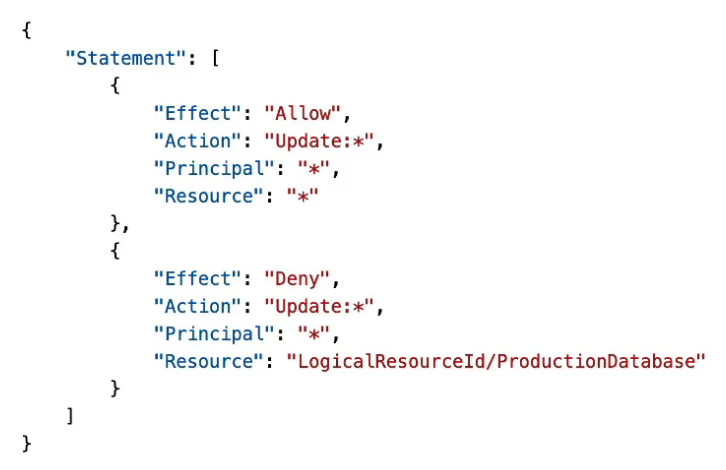
    

## Misc

- If the stack is stuck in a `DELETE_FAILED` state because some resource failed to be deleted, modify the template to retain the resource and manually delete it after the deployment.