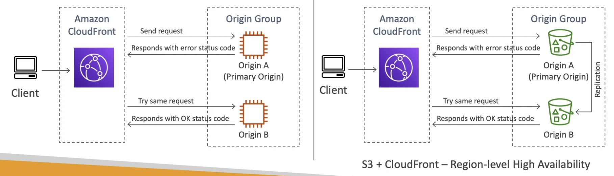
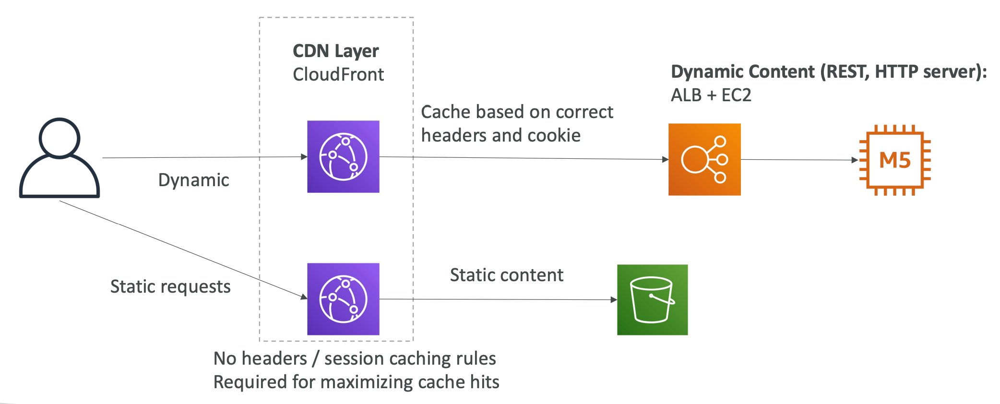
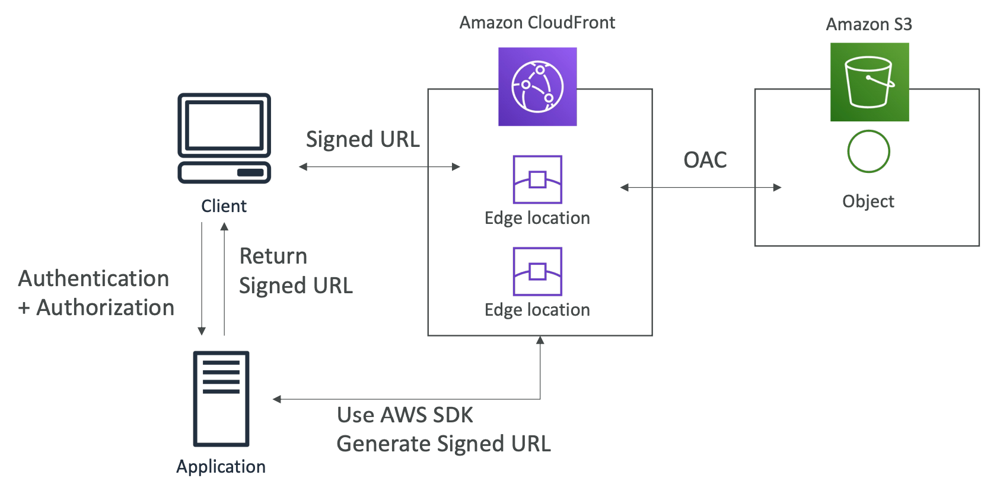
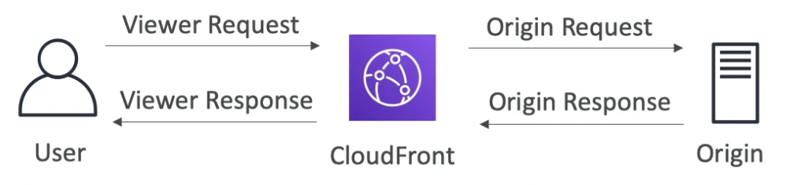
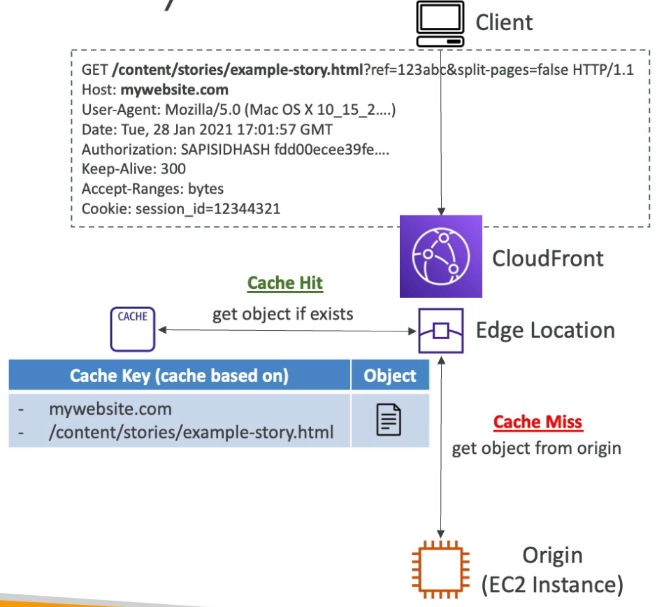
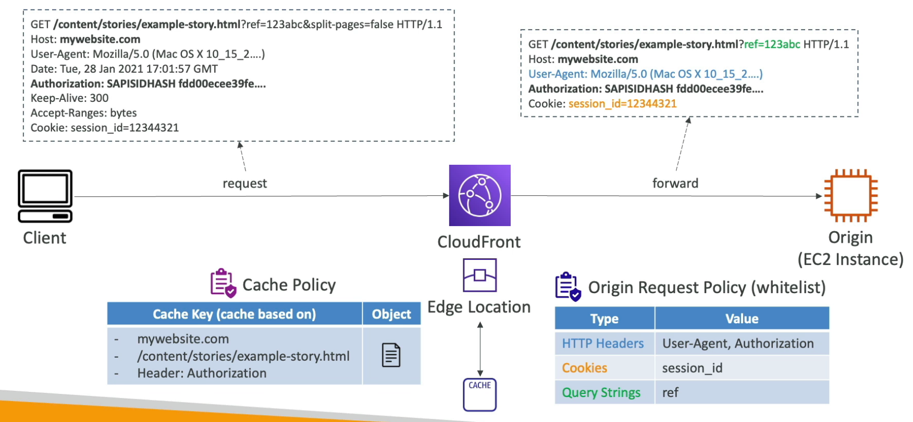
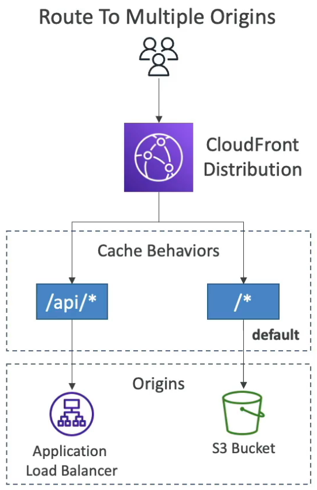
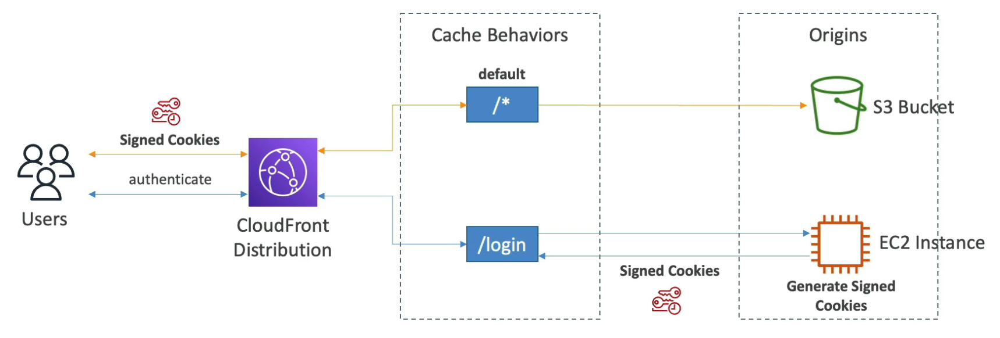
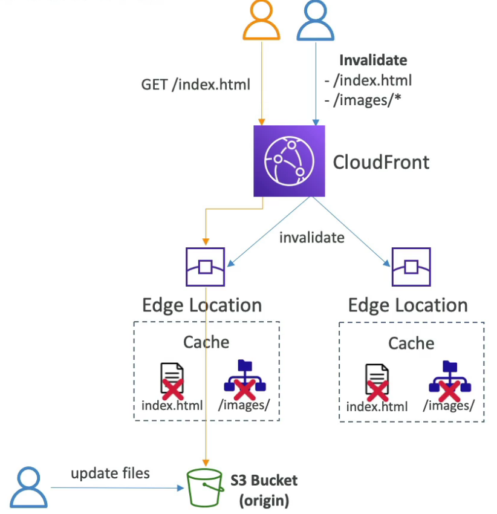
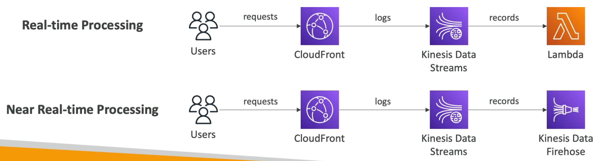

# CloudFront

---

## Intro

- Global CDN that caches content at edge locations, reducing load at the origin
- **TTL (0 sec - 1 year)** can be set by the origin using headers
- Supports **Server Name Indication (SNI)** to allow SSL traffic to multiple domains
- **CloudFront Geo Restriction** can be used to allow or block countries from accessing a distribution.
- **Edge Locations are present outside the VPC** so the origin's SG must be configured to allow inbound requests from the list of public IPs of all the edge locations.
- Supports HTTP/RTMP protocol (**does not support UDP protocol**)
- In-flight encryption using **HTTPS** (**from client all the way to the origin**)
- To block a specific IP at the CloudFront level, deploy a WAF on CloudFront

## Origin

- **S3 Bucket**
    - For distributing static files
    - **Origin Access Identity (OAl) or Origin Access Control (OAC)** allows the S3 bucket to only be accessed by CloudFront
    - Can be used as ingress to upload files to S3 (transfer acceleration)
- **Custom Origin** (for HTTP) - need to be publicly accessible on HTTP by public IPs of edge locations
    - EC2 Instance
    - ELB
    - S3 Website (may contain client-side script)
    - On-premise backend

<aside>
💡 To restrict access to ELB directly when it is being used as the origin in a CloudFront distribution, create a VPC Security Group for the ELB and use AWS Lambda to automatically update the CloudFront internal service IP addresses when they change.

</aside>

## Pricing

- Price Class All: all regions (best performance)
- Price Class 200: most regions (excludes the most expensive regions)
- Price Class 100: only the least expensive regions

## Origin Groups

- Consists of a **primary** and a **secondary** origin (can be in **different regions**)
- Automatic failover to secondary
- Provides **region-level** high availability
- Use when getting 504 (gateway timeout) error
- CloudFront routes all incoming requests to the primary origin, even when a previous request failed over to the secondary origin. It only sends requests to the secondary origin after a request to the primary origin fails.
- CloudFront fails over to the secondary origin only when the HTTP method of the viewer request is `GET`, `HEAD`, or `OPTIONS`.

## Field-level Encryption

- Sensitive information sent by the user is encrypted at the edge close to user which can only be decrypted by the web server (intermediate services can't see the encrypted fields)
- **Asymmetric Encryption** (public & private key)
- Max 10 encrypted field

## Static and Dynamic Distributions

**By separating the static and dynamic content** (creating different distributions)**, we can maximize the cache hit in CloudFront.** All the static content will be cached as no caching rules are needed to cache static content. Whereas, dynamic content will be cached based on headers and cookies in the request.

## Signed URL / Cookies

- Used to **make a CloudFront distribution private** (distribute to a subset of users)
- Signed URL ⇒ access to individual files
- Signed Cookies ⇒ access to multiple files
- Whenever we create a signed URL / cookie, we attach a policy specifying:
    - URL / Cookie Expiration (TTL)
    - **IP ranges** allowed to access the data
    - Trusted signers (which AWS accounts can create signed URLs)
- **How signed URL is generated**
    
    
    
    1. The client authenticates and authorizes to the application. 
    2. The application uses AWS SDK to generate the signed URL
    3. The application gives the signed URL to the client to access the private resource
- **Trusted Key Group** signer is the recommended way of configuring CloudFront to use signed URLs or cookies. It is not recommended to create a CloudFront key-pair in an AWS account and access it at the root level.
- The signer uses its private key to sign the URL or cookies, and CloudFront uses the public key to verify the signature.

### CloudFront Signed URL

- Allow access to a path in the distribution, no matter what the origin is.
- Uses account-wide key-pair (managed by the root user)
- **Can apply filtering rules** by IP, path, date and expiration

### S3 Pre-signed URL

- Uses the IAM key of the person signing the URL. Anyone with the pre-signed URL has the same rights as the person signing it.
- **No filter rules can be applied**

## CloudFront Functions

- Lightweight functions written in **JS** deployed at edge locations
- **Sub-ms startup times**
- High throughput: **millions or requests/second**
- For high scale, **latency sensitive CDN customizations**
- Can modify **Viewer Request** and **Viewer Response** only
    
    
    
- Native feature of CloudFront (code managed within CloudFront)
- Use cases (require < 1ms compute time):
    - URL rewrites or redirects
    - **Cache key normalization**: transform request attributes (headers, cookies, query strings, URL) to create an optimal cache key
    - **Header manipulation**: insert/modify/delete HTTP headers in the request or response
    - **Request authentication & authorization**: create and validate user-generated tokens (e.g. JWT) to allow/deny requests

### CloudFront Function vs Lambda@Edge

## Cache Key

- **A unique identifier for each object in the cache**
- If the same cache key is created from subsequent requests, the cached content will be returned.
- **Default**: hostname + resource portion of the URL
- Can enhance the cache key (making it more complex) by adding other elements of the request (HTTP headers, cookies, query strings) using **Cache Policies**

## Cache Policy

- Controls how the caching mechanism works in CloudFront
- Include in cache key:
    - **HTTP Headers**: `None` or `Whitelist`
    - **Cookies**: `None` or `Whitelist` or `Include All-Except` or `All`
    - **Query Strings**: `None` or `Whitelist` or `Include All-Except` or `All`
- **The fewer items in the cache key, the better the caching performance.**
- **Controls the TTL** (can also be controlled by the origin using `Cache-Control` header or `Expires` header)
- Predefined managed cache policies or create your own
- All HTTP headers, cookies, and query strings included in the Cache Key are automatically included in origin requests

## Origin Request Policy

- Controls what should be included in the origin request without including them in the cache key
    - **HTTP Headers**: `None` or `Whitelist` or `All`
    - **Cookies**: `None` or `Whitelist` or `All`
    - **Query Strings**: `None` or `Whitelist` or `All`
- Can add CloudFront HTTP headers and custom headers to origin requests that were not present in the viewer request.
- Predefined managed origin request policies or create your own

## Cache Behaviors

- **Configure cache differently based on the path pattern in the request** (eg. route to different origins or origin groups based on the path pattern in the request)
- `/*` is the default cache behavior (always processed at the end to find more specific pattern matches beforehand)
- **Configure different Cache Policy and Origin Request Policy for different cache behaviors**
- Validate requests differently for each cache behavior (eg. only allow requests at `/api` if they have access token in the header)
- Example: Sign in page
    
    User logs in at `/login` and gets back signed cookies. Configure the cache policy for default cache behavior to only accept requests if they have signed cookies.
    

## Cache Invalidation

- If the content is updated at the origin, we can invalidate the cache at all the edge locations using `CreateInvalidation` API.
- Can invalidate the entire cache, a single file or all the files at a given path.
- **Cache invalidation is not cost-effective** (need to pay extra for invalidation requests)
- For a cost effective solution, version your objects using the path or filename and update the application to pull the new version.

## Real-time Logs

- Send CloudFront logs in real-time to KDS
- Used to monitor and analyze CDN performance
- **Sampling rate**: percentage of requests logged
- Can log specific fields and **cache behaviors**

## TLS Encryption

- **Origin Protocol Policy**: used to enable SSL between the distribution and the origin
- **Viewer Protocol Policy**: used to enable SSL between the client (user) and the distribution
- TLS termination takes place at the distribution level. If the distribution - origin connection needs to be encrypted, another TLS connection is established.

## Misc

- You cannot directly integrate Cognito User Pools with CloudFront distribution as you have to create a separate Lambda@Edge function to accomplish the authentication via Cognito User Pools.