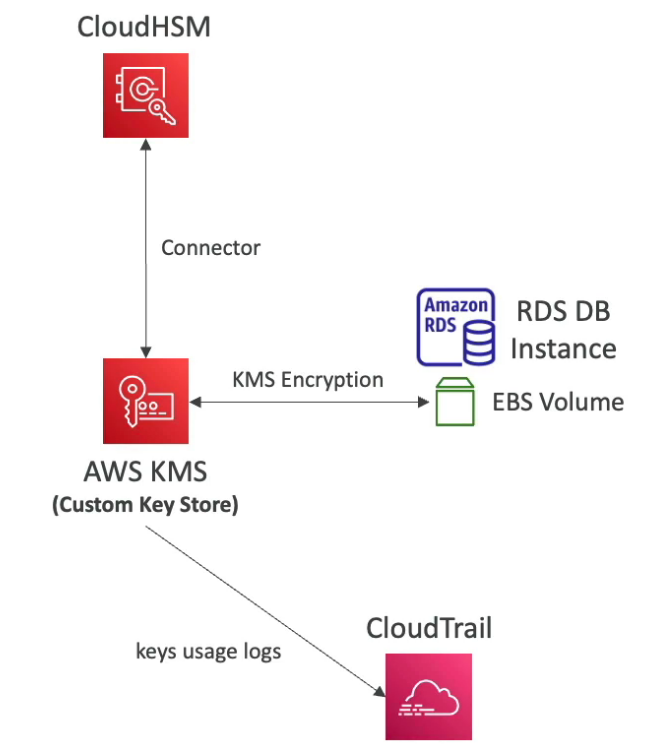
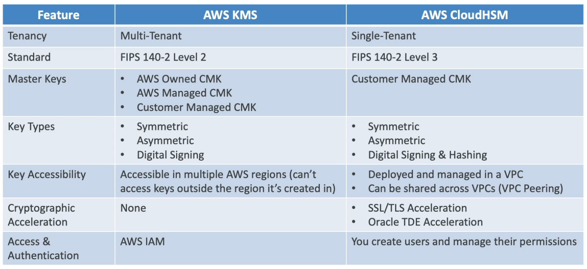

# CloudHSM

- AWS provisions **dedicated encryption hardware** (Hardware Security Module)
- Use when you want to manage encryption keys completely
- HSM device is stored in AWS (tamper resistant, FIPS 140-2 Level 3 compliance)
- **Supports both symmetric and asymmetric encryption**
- Good option to use with **SSE-C** encryption
- CloudHSM clusters are spread across **Multi AZ (high availability)**
- **Redshift supports CloudHSM** for database encryption and key management
- IAM permissions are required to perform CRUD operations on HSM cluster
- **CloudHSM Software** is used to manage the keys and users (in KMS, everything is managed using IAM)

- Can be integrated with KMS so that KMS uses CloudHSM internally

## CloudHSM vs KMS

