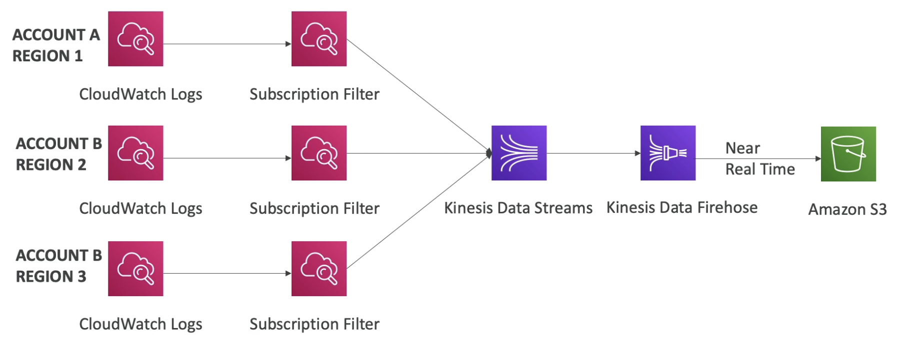
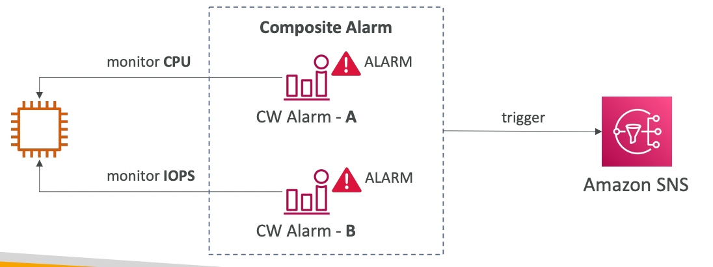
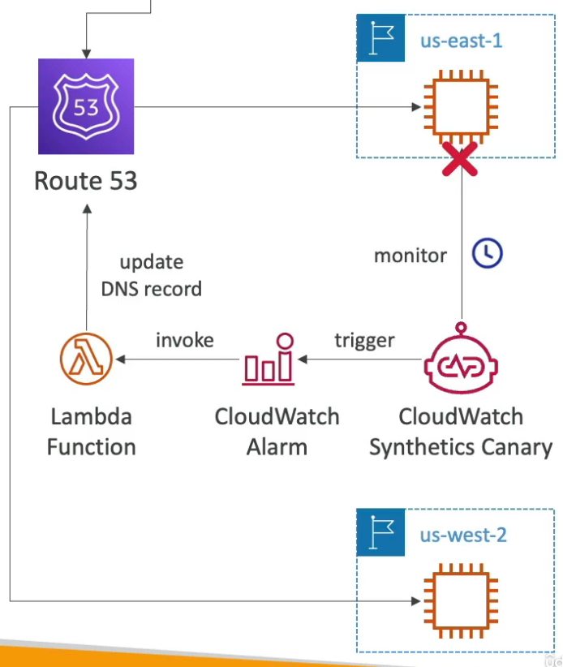

# CloudWatch

---

## Intro

- **Serverless** logging and monitoring for AWS services and application

## Metrics

- Variables to monitor in CloudWatch
- Dimension is an attribute of a metric (instance id, environment, etc.)
- Up to **30 dimensions per metric**
- Segregated by namespaces (which AWS service they monitor)

### Custom Metrics

- Define and send your own custom metrics to CloudWatch using `PutMetricData` ****API
- Metric resolution (`StorageResolution` API) - frequency of sending metric data
- **Standard: 1 min**
- **High Resolution: 1 sec** (higher cost)
- Accepts metric data points **two weeks in the past and two hours in the future**

### EC2 Monitoring

- Must run a **CloudWatch agent** on instance to push system **metrics and logs** to CloudWatch. Instance role (IAM) must allow the instance to push logs to CloudWatch.
- EC2 instances have metrics **every 5 minutes**
- With **detailed monitoring** (for a cost), you get metrics **every 1 minute** (can be enabled using `aws ec2 monitor-instances` command)
- Use detailed monitoring if you want to react faster to changes (eg. scale faster for your ASG)
- **Available metrics in CloudWatch**:
    - CPU Utilization
    - Network Utilization
    - Disk Performance
    - Disk Reads/Writes
- **Custom metrics**:
    - Memory utilization (memory usage)
    - Disk swap utilization
    - Disk space utilization
    - Page file utilization
- CloudWatch agent can be used for logging on premises servers too

## Dashboards

- Setup custom dashboards for quick access to key metrics and alarms
- **Dashboards are global** (allows to **monitor services across accounts & regions**)
- Dashboards can be shared with people who don’t have an AWS account (public, email address, 3rd party SSO provider through Cognito)

## Logs

- Used to store application logs
- Log Groups represent an application sending logs to CW
- Log Streams represent instances within applications or log files or containers
- Logs Expiration: never expire (default), 30 days, etc.
- Logs can be sent to:
    - S3 buckets (exports)
    - Kinesis Data Streams
    - Kinesis Data Firehose
    - Lambda functions
    - ElasticSearch
- **Metric Filters** can be used to filter expressions and use the count to trigger CloudWatch alarms. They are not retro-active:
    - find a specific IP in the logs
    - count occurrences of “ERROR” in the logs
- **Cloud Watch Logs Insights** can be used to query logs and add queries to CloudWatch Dashboards
- To stream logs in real-time, apply a **Subscription Filter** on logs
- Logs can take up to **12 hours to become available for exporting to S3** (not real-time). To store logs in real time in S3, use a subscription filter to stream logs to KDS and then to KDF which will then write the logs to S3.
- Logs from multiple accounts and regions can be aggregated using subscription filters
    
    
    

<aside>
💡 Metric Filters are a part of CloudWatch Logs (not CloudWatch Metrics)

</aside>

## Alarms

- Alarms are used to trigger notifications for CW metrics based on **Metric Filters**
- Various options to trigger alarm (sampling, %, max, min, etc.)
- **An alarm monitors a single CW metric**
- Alarm States:
    - OK
    - INSUFFICIENT_DATA
    - ALARM
- Configuration:
    - **Period**: length of time (seconds) to evaluate the metric to create a data point for the alarm (**min 10 sec** for high resolution custom metric)
    - **Evaluation Period**: number of the most recent periods (data points) to consider when determining the alarm state
    - **Datapoints to Alarm**: number of data points within the evaluation period that must be breached to cause the alarm to go into `ALARM` state
- **Targets**:
    - Stop, Terminate, Reboot, or Recover an EC2 Instance
    - Trigger Auto Scaling Action (ASG)
    - Send notification to SNS
- **Composite Alarms** monitor multiple other alarms with AND/OR conditions to generate a new alarm. This is helpful to reduce alarm noise by creating complex composite alarms. Example: send an SNS notification when both CPU and IOPS are above 90% utilization.
    
    
    

### EC2 Instance Recovery on Alarm

- CloudWatch **alarm** to automatically recover an EC2 instance if it becomes **impaired**
- **Terminated instances cannot be recovered**
- After the recovery, the following are retained
    - Placement Group
    - Public IP
    - Private IP
    - Elastic IP
    - Instance ID
    - Instance metadata
- After the recovery, **RAM contents are lost**

## Events

- Cron to create events on a schedule
- **Uses default event bus (custom & partner event buses are not supported)**

## Logs Encryption

- CloudWatch logs can be encrypted at the **log group level** by associating a KMS key with it.
- Must be done using CloudWatch Logs API (cannot be done through the console)
- APIs
    - `associate-kms-key` - associate a KMS key with an existing log group
    - `create-log-group` - create a log group and associate a KMS key with it

## Synthetics Canary

- Monitoring tool that runs configurable scripts on production to reproduce what your customers do to find issues before them.
- Can invoke APIs and store the latency data
- Can check UI functionalities with screenshots (has a headless Google Chrome browser)
- Script must be written in **NodeJS** or **Python**
- **Integrates with CloudWatch alarm** (which can trigger a Lambda function to redirect users to another instance of the application running the previous version)

- Can run once or on a schedule

### Blueprints

- **Heartbeat Monitor** - load URL, store screenshot and an HTTP archive file
- **API Canary** - test basic read and write functions of REST APls
- **Broken Link Checker** - check all links inside the URL that you are testing
- **Visual Monitoring** - compare a screenshot taken during a canary run with a baseline
screenshot
- **Canary Recorder** - used with **CloudWatch Synthetics Recorder** (record your
actions on a website and automatically generates a script for that)
- **GUI Workflow Builder** - verifies that actions can be taken on your webpage (e.g.
test a webpage with a login form)