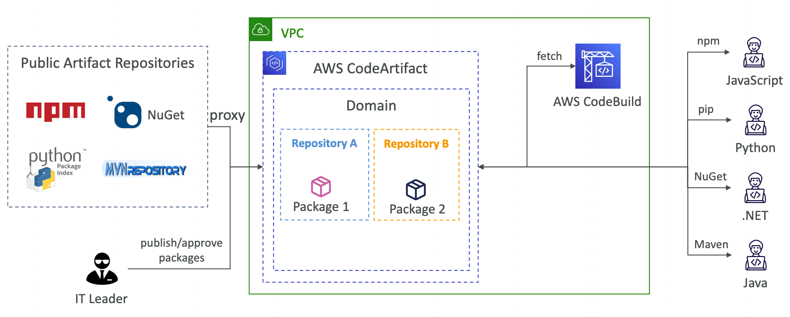
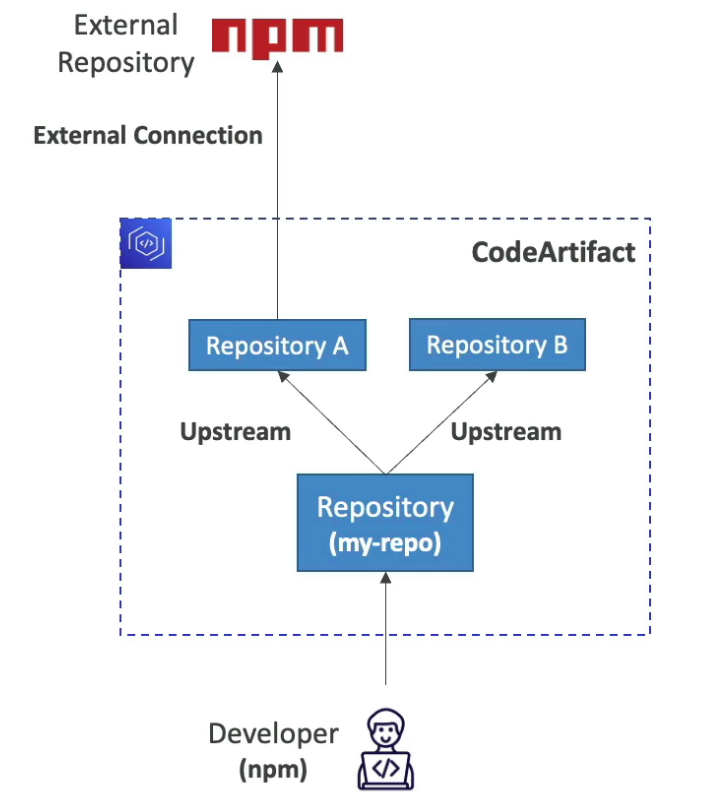
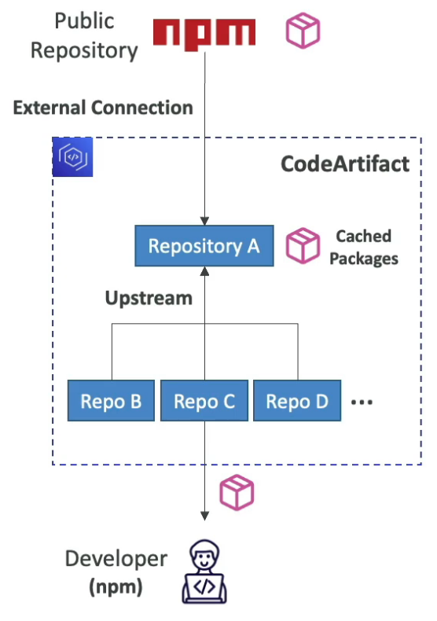
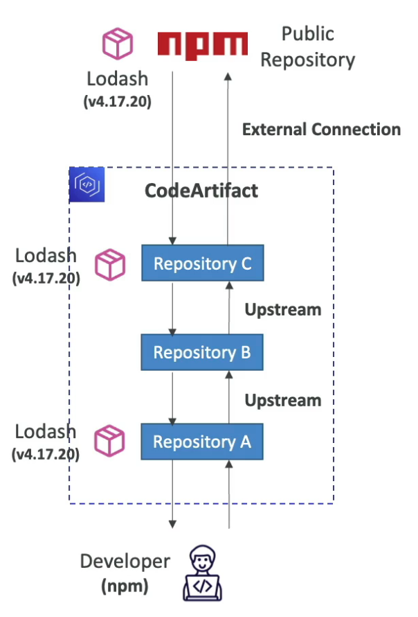
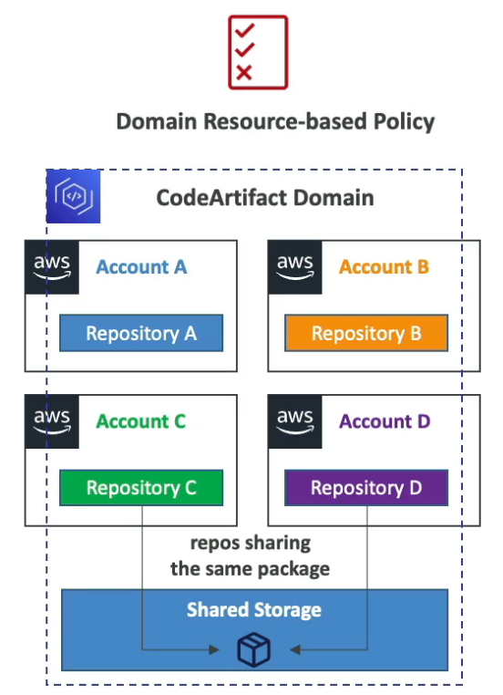

# CodeArtifact

---

## Intro

- AWS managed **artifact management service** or storing and retrieving software dependencies that our application requires to run.
- Works with dependency management tools like Maven, Gradle, npm, yarn, twine, pip and NuGet.
- Developers and CodeBuild can retrieve dependencies straight from CodeArtifact.
- **Artifacts (dependencies) live inside the VPC**

## Workflow

- CodeArtifact proxies requests to public artifact repositories and caches publicly available artifacts. So, even if the artifact is deleted from the public repository, it will still be available in CodeArtifact.
- Custom artifacts can also be hosted on CodeArtifact
- Developers and CodeBuild fetch all the artifacts from a single source

## Upstream Repositories

- A CodeArtifact repository can have other CodeArtifact repositories as Upstream Repositories. This allows the developer to access the packages contained in multiple repositories from a single repository endpoint.
- A repository can have **max 10 upstream repositories**
- A repository can only have one external connection with a public repository. Artifacts fetched from public repositories will be cached (stored in the domain and have reference to the artifact) at the CodeArtifact repository connected to it.

## Retention

- If a requested package (artifact) is found in an upstream repo, a reference to it is stored in the downstream repo closest to the developer (who requested the package).
- If the package is fetched from a public repo, a reference to it will be stored in the repo connected to the external repo.
- Intermediate repos that were involved in resolving the package do not store reference to the package.
- The package cached in the downstream repo is not affected by changes to the package in the upstream repository.

## Domains

- Single shared storage for all the repositories across multiple accounts.
- **De-duplicated storage**: Artifacts are stored only once in the shared storage of the domain and repositories only store references to these artifact. The artifacts are not duplicated across repositories.
- **Fast copying**: when a repository pulls an artifact from an upstream repository, it only copies the metadata (containing the reference to the artifact stored in the domain).
- **Easy sharing across repositories and teams**: all the assets and the metadata in a domain are encrypted with a single KMS key

- **Domain Resource-based Policy**: domain administrator can apply policy across the domain such as:
    - Restricting which accounts have access to repositories in the domain
    - Who can configure connections to public repositories to use as sources of packages