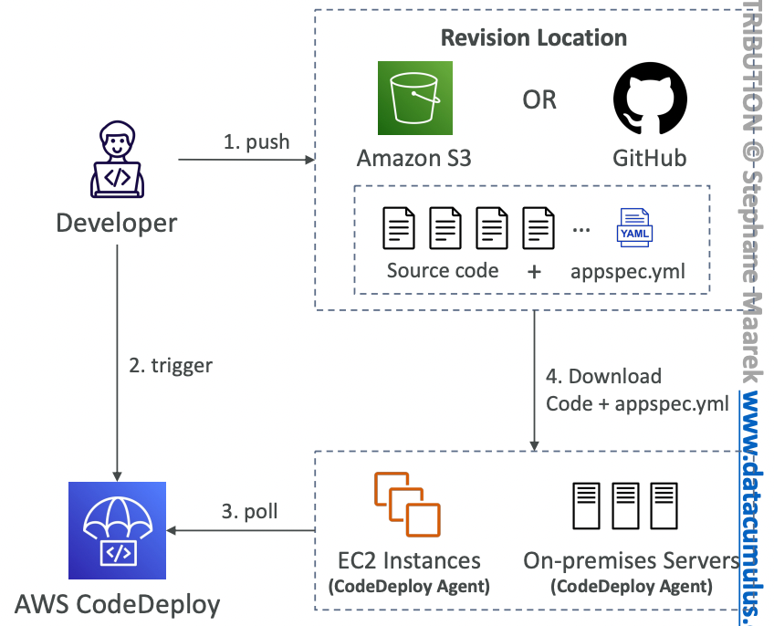
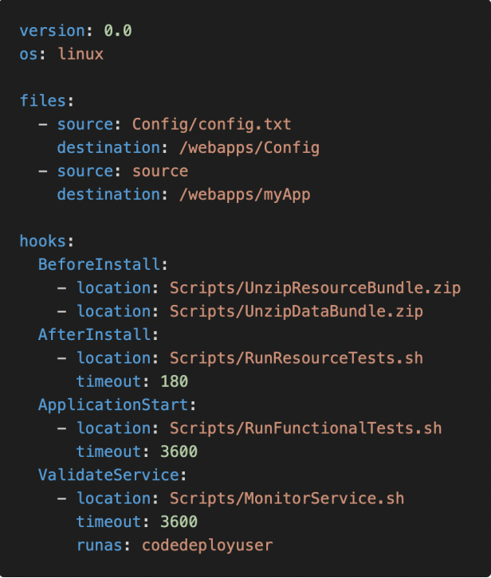
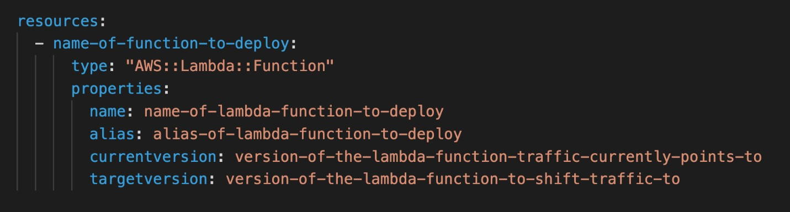
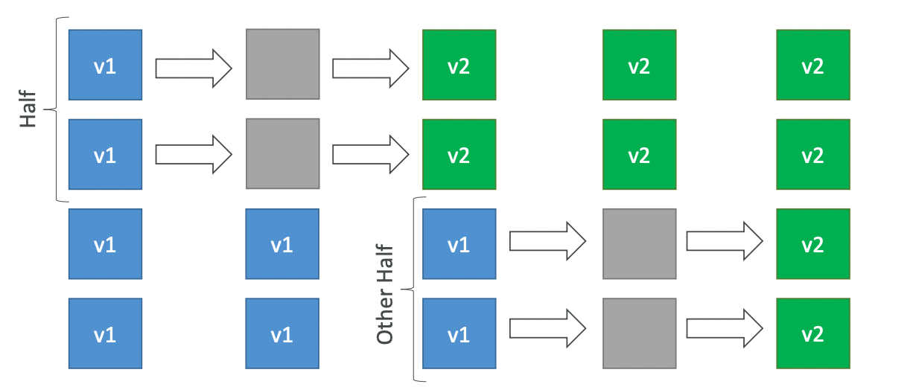

# CodeDeploy

---

## Intro

- **AWS managed CD server** to automatically deploy the latest version of the application.
- To use CodeDeploy, we first need to create an Application (in CodeDeploy console) with the correct compute platform configured. Then, create a Deployment Group with the compute resource tagged. Then, we can create a deployment with the correct application build artifact.

## Components

- Application - the build artifact (archived) we want to deploy
- **Compute Platform** - what platform the application will be deployed to
    - EC2 or On-Premises (**CodeDeploy Agent** must be installed)
    - AWS Lambda
    - Amazon ECS
- Deployment Configuration - set of deployment rules for successful deployment
    - EC2/On-premises - specify the minimum number of healthy instances for the deployment
    - AWS Lambda or Amazon ECS - specify how traffic is routed to your updated versions
- **Deployment Group** - group of tagged EC2 instances (allows to deploy gradually, ex: first deploy to `dev`, then `test` and then `prod`)
- **IAM Instance Profile** - give EC2 instances the permissions to access S3 or GitHub
- **Application Revision** = build artifact + `appspec.yaml` file
- **Service Role** - IAM Role for CodeDeploy to perform operations on EC2 instances, ASGs, ELBs for deployment
- Target Revision - the most recent revision that you want to deploy to a Deployment Group

## Workflow

- The developer or CI server builds and pushes the application revision (build artifact + `appspec.yaml`) on S3 or GitHub.
- The developer triggers a new deployment in CodeDeploy.
- The CodeDeploy Agent running on the compute resource continuously polls CodeDeploy to check if a new deployment needs to be done.

- The build artifact and `appspec.yaml` are downloaded to the compute resource and the CodeDeploy Agent runs the deployment instructions mentioned in `appspec.yaml`.

## `appspec.yaml`

- Specifies how the build artifact should be deployed.
- Should be present at the root of the bundle.
- `files` - what to copy from S3 or GitHub into the deployment server
- `hooks` - set of instructions to deploy the new application version:
    - **ValidateService** (checks if the application is running properly after installation)
- Can have timeouts in any step (hook)
- `hooks` section for EC2 instances is shown to the right.

- Order of hooks for different compute resources
    - Lambda: BeforeAllowTraffic > AfterAllowTraffic
    - EC2: BeforeInstall → AfterInstall → ApplicationStart → ValidateService
    - ECS: BeforeInstall → AfterInstall → AfterAllowTestTraffic → BeforeAllowTraffic → AfterAllowTraffic
- The content in the `resources` section varies, depending on the compute platform of your deployment. For Lambda functions, it has `name`, `alias`, `currentversion` and `targetversion`.
    
    
    

## Deployment Type

It is the method used to deploy the application to a Deployment Group.

- **In-place Deployment** - supports EC2, On-Premise Server
    - **One at a time - one EC2 instance at time, if one instance fails then deployment stops**
    - **Half at a time - 50% healthy instances even if the deployment fails**
    - **All at once - quick but has downtime (good for dev)**
    - **Custom - specify the minimum percentage of healthy hosts**
- **Blue/Green Deployment** - supports EC2 instances, AWS Lambda, and Amazon ECS

<aside>
💡 Lambda functions don’t support in-place deployment

</aside>

## Failures & Rollbacks

- Once deployment fails, EC2 instances stay in failed state
- New deployments will first be deployed to failed instances
- To rollback, redeploy old deployment or enable automated rollback on failures
- If a rollback happens, CodeDeploy redeploys the last known good revision with a new deployment ID (does not restore to a previous version).

## Troubleshooting

- `InvalidSignatureException` - the date or time in CodeDeploy (AWS) does not match that in the EC2 instance where the application is to be deployed
- If the deployment fails on EC2, check deployment log files at `/opt/codedeploy-agent/deployment-root/deployment-logs/codedeploy-agent-deployments.log`