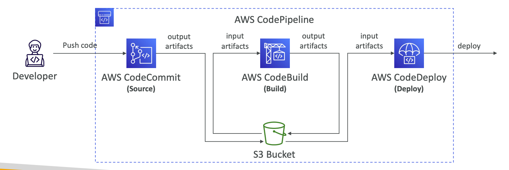
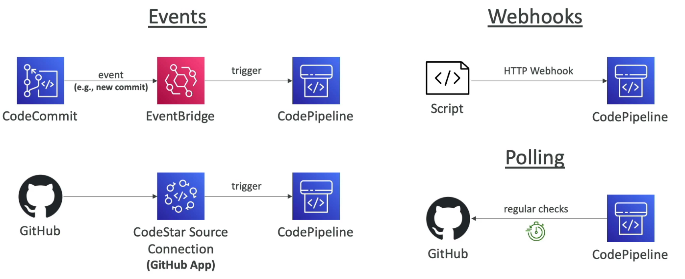
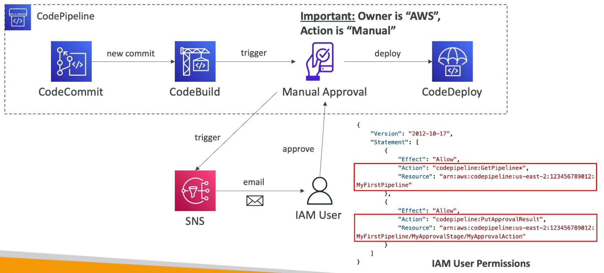
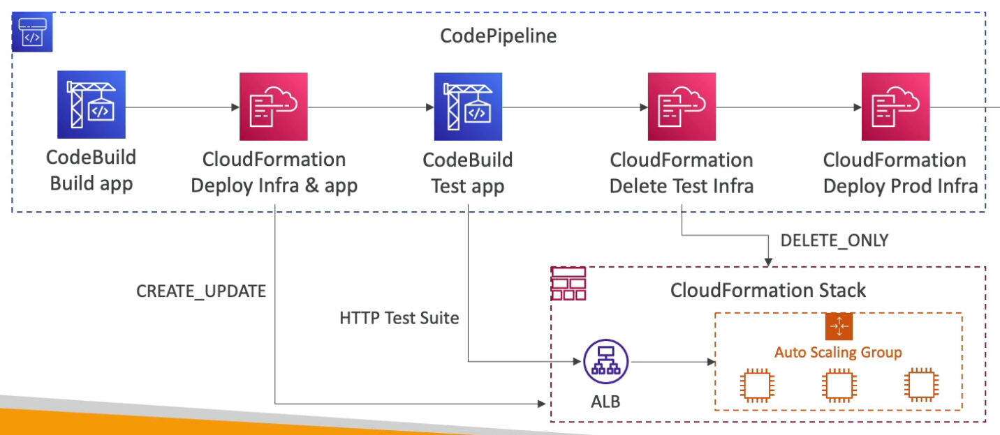

# CodePipeline

---

## Intro

- **Visual Workflow to orchestrate CICD pipelines.** Pipeline can be edited when needed to add or remove stages.
- **Each stage in the pipeline creates an artifact which is stored in S3** (**Artifact Store**). The next stage uses this artifact as input.
    
    
    
- When using [CodeCommit](codecommit.md) as the source, there are two ways to trigger the pipeline:
    - Trigger the pipeline on a CW Event for repository change (recommended)
    - CodePipeline polling the repository for changes
- **Within a stage, we have action groups where actions can run sequentially or in parallel.** Example, we can create a sequential action groups within a stage to ask for manual approval before deploying the application to prod environment.

## Troubleshooting

- **Events are generated in EventBridge (CW Events) for changes in the state of a pipeline**. Eg. invoke a lambda function to send a notification to the admin if the pipeline fails.
- Status of the pipeline can be viewed in the CodePipeline console
- If CodePipeline can’t perform an action, check IAM permissions on the Service Role (IAM Role for CodePipeline)
- CloudTrail can be used to check for denied API calls

## Events vs Webhooks vs Polling

- **Events**
    - **Default and recommended way**
    - Code change in CodeCommit generates an EB event which triggers CodePipeline.
    - For a version control application outside of AWS (eg. GitHub), need to use **CodeStar Source Connection** to trigger the CodePipeline on event from GitHub.
- **Webhooks**
    - Older method
    - CodePipeline provides a webhook URL which can be used to trigger CodePipeline with a payload
- **Polling**
    - CodePipeline regularly polls the version control application for changes (inefficient)

## Manual Approval

- Manual approval can be defined at any stage of the pipeline
- **For manual approval, the owner must be AWS**
- We can setup an SNS topic to send an email to the user for manual approval.
- The user must have `codepipeline:GetPipeline*` permission to view the pipeline and `codepipeline:PutApprovalResult` permission to approve the pipeline.

## CloudFormation Integration

CloudFormation can be integrated with CodePipeline to create a test stack and delete it after the tests have been run. If all the tests pass, another CloudFormation step can deploy the app on production.