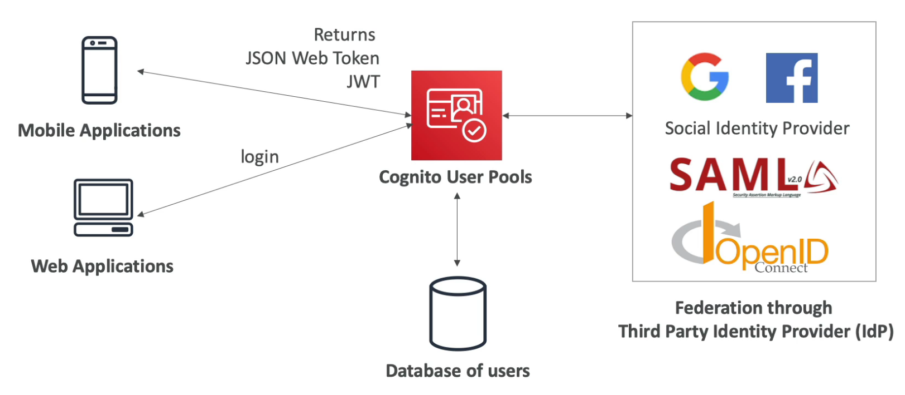
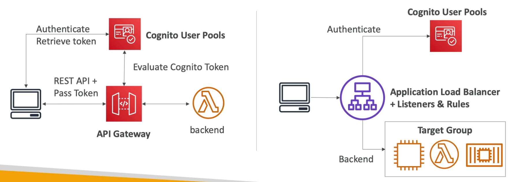
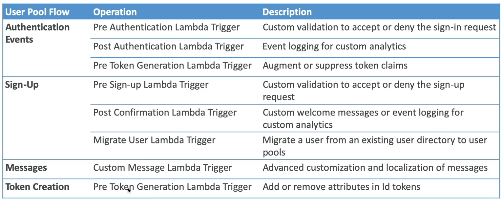
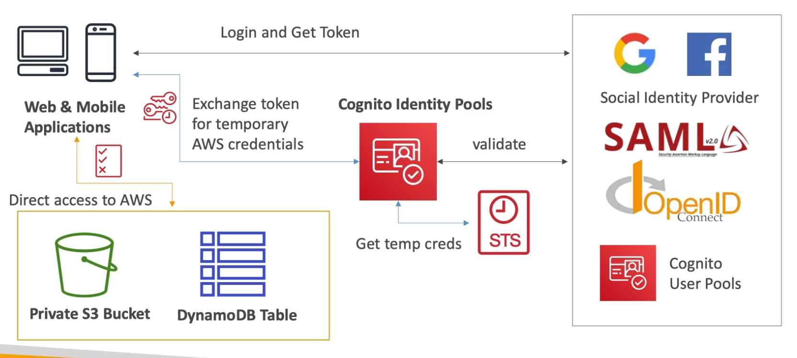
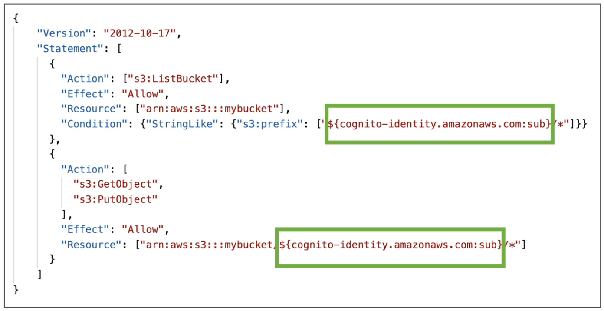
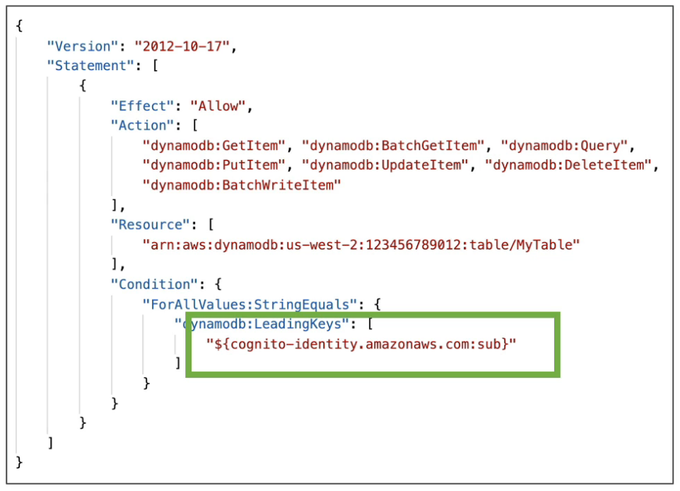

# Cognito

---

# Cognito User Pools (CUP) - Authentication

- **Serverless** OIDC-compliant identity provider (provides sign in functionality for app users)
- Returns JWT (used to verify the identity of the user)
- **MFA support**
- **Supports Federated Identities** allowing users to authenticate via third party identity provider like Facebook, Google, SAML, etc.
- Seamless integration with **API Gateway** & **ALB** for authentication
    
    
    

### **Cognito Hosted UI**

- AWS created login and signup page (can be customized using images and CSS)
- To host the hosted UI on a custom domain, we must create an ACM certificate in `us-east-1`

### **Lambda Triggers**

CUP can invoke lambda functions **synchronously** on certain events

### Adaptive Authentication

- If enabled, **sign-in attempts may be blocked or require MFA if they seem suspicious**
- Cognito examines each sign-in attempt and generates a risk score
- In case of compromised credentials, there is email and phone verification
- Logged in CloudWatch

### ALB Integration

- **Must use an HTTPS listener**
- Authentication can be done using CUP or **any OIDC compliant IDP**

# Cognito Identity Pools (CIP) - Authorization

- **Provides temporary credentials** (using STS) to users, after they have been authenticated, so they can access AWS resources.
- Use CUP or any OIDC compliant IDP for authentication
- Allows unauthenticated guest access
- Example use case: provide **temporary access to write to an S3 bucket** after authenticating the user via FaceBook (using CUP identity federation)

### Access Management

- We can create default IAM roles for authenticated and guest users (2 default roles)
- Create rules to choose the IAM role for each user based on user ID
- IAM roles must have a **trust policy** of CIP
- IAM policies for each role can be customized for each user using **policy variables**.
    - Example: allowing users access to only their own folder (prefix) in S3
        
        
        
    - Example: allowing users access to only their items in DynamoDB
        
        
        

# Misc

- Cognito lets you save end user data in datasets containing key-value pairs. This data is associated with an Amazon Cognito identity, so that it can be accessed across logins and devices. To sync this data between the Amazon Cognito service and an end user’s devices, invoke the `synchronize` method. Each dataset can have a maximum size of 1 MB. You can associate up to 20 datasets with an identity.
- Cognito supports **developer authenticated identities** to obtain unique identifiers for application users.
- When a user signs in to an application using their username and password, Cognito generates a unique **Cognito ID** for that user. This ID is used to track the user's session and to provide secure access to AWS resources.