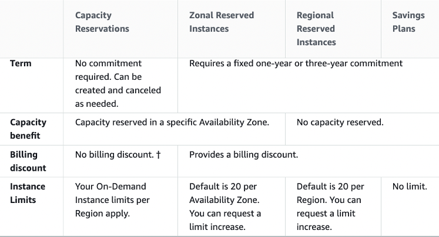
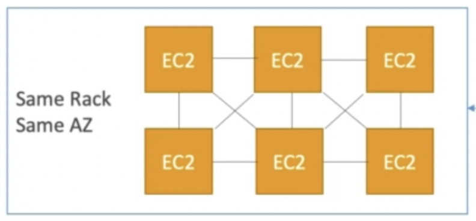
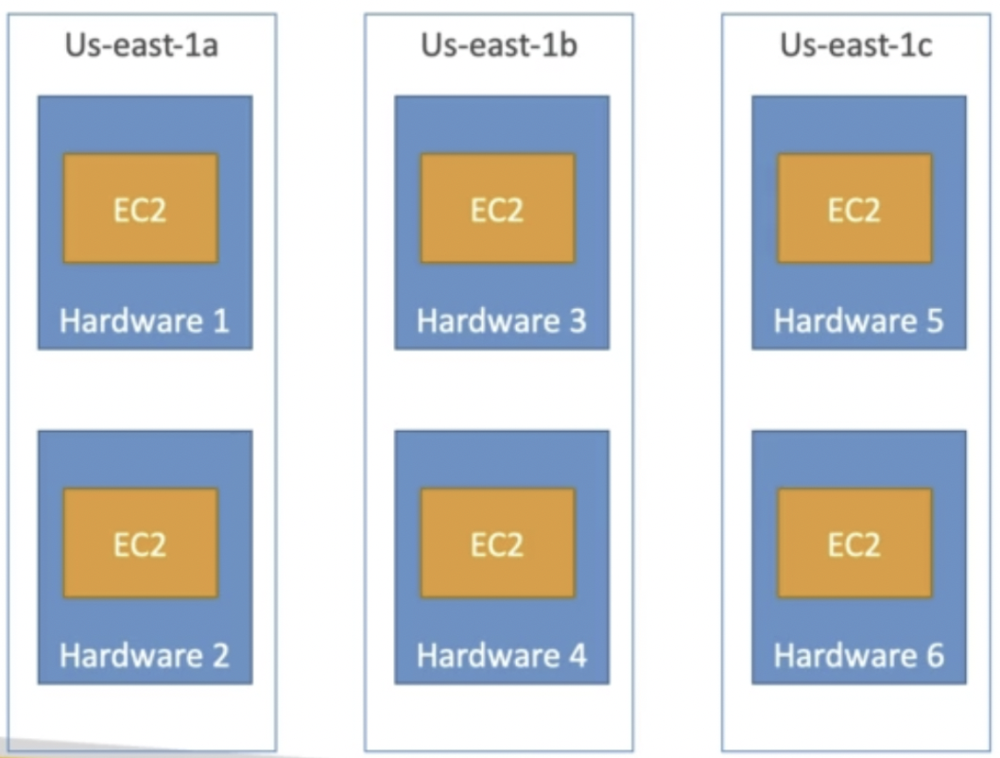
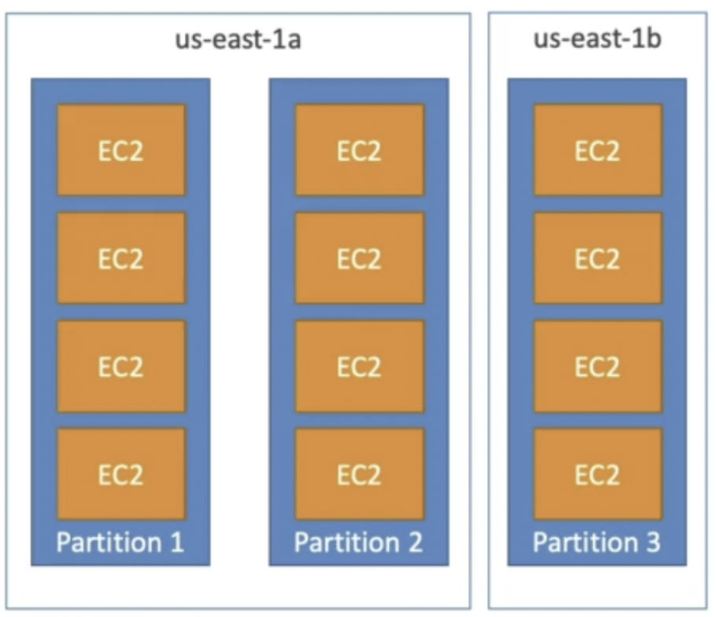

# EC2

---

## Intro

- Regional Service
- **Infrastructure as a Service (IaaS)**
- Stopping & Starting an instance may change its public IP but not its private IP
- **AWS Compute Optimizer** recommends optimal AWS Compute resources for your workloads
- There is a vCPU-based On-Demand Instance soft limit per region

## User Data

- Bootstrap script (runs on the first launch)
- Used to automate **dynamic** boot tasks (that cannot be done using AMIs)
    - Installing updates
    - Installing software
    - Downloading common files from the internet
- Runs with the **root user privilege**

## Instance Classes

- **General Purpose**
    - Great for a diversity of workloads such as **web servers** or **code repositories**
    - Balance between compute, memory & networking
- **Compute Optimized**
    - Great for compute intensive tasks
        - Batch Processing
        - Media Transcoding
        - HPC
        - Gaming Servers
- **Memory Optimized**
    - Great for **in-memory databases** or **distributed web caches**
- **Storage Optimized**
    - Great for storage intensive tasks (accessing local databases)
        - OLTP systems
        - Distributed File System (DFS)

## Security Groups

- **Only contain Allow rules**
- External firewall for EC2 instances (applied on ENI, if a request is blocked by SG, instance will never know)
- Security groups rules can reference a resource by IP or Security Group
- Default SG
    - inbound traffic from the same SG is allowed
    - all outbound traffic is allowed
- New SG
    - all inbound traffic is blocked
    - all outbound traffic is allowed
- A security group can be attached to multiple instances and vice versa
- Bound to a VPC (and hence to a region)
- Recommended to maintain a separate security group for SSH access
- Blocked requests will give a **504 Timeout** error

## Elastic Network Interface (ENI)

- ENI is a virtual network card that **gives a private IP to an EC2 instance**
- A primary ENI is created and attached to the instance upon creation and will be deleted automatically upon instance termination.
- We can create additional ENIs and attach them to an EC2 instance to access it via multiple private IPs.
- We can detach & attach ENIs across instances
- **ENIs are tied to the subnet** (and hence to the AZ)

## Instance Profile

- Never enter AWS credentials into the EC2 instance, instead attach IAM Roles to the instances (instance profile)
- Steps to create an instance profile for an EC2 instance and add a role to it
    - `aws iam create-instance-profile`
    - `aws iam add-role-to-instance-profile`
    - `aws ec2 associate-iam-instance-profile`

## Purchasing Options

### On-demand Instances

- Pay per use (no upfront payment)
- Highest cost
- No long-term commitment
- Recommended for short-term, uninterrupted and **unpredictable** workloads

### Standard Reserved Instances

- Reservation Period: 1 year or 3 years
- Recommended for steady-state applications (like database)
- **Sell unused instances** on the Reserved Instance Marketplace

### Convertible Reserved Instances

- Can change the instance type
- Lower discount
- **Cannot sell unused instances** on the Reserved Instance Marketplace

### Scheduled Reserved Instances

- reserved for a time window (ex. everyday from 9AM to 5PM)

### Spot Instances

- Work on a bidding basis where you are willing to pay a specific max hourly rate for the instance. Your instance will get interrupted if the spot price increases your bidding price.
- The behavior for spot instance interruption can be **stop**, **hibernate** or **terminate**. It cannot be **reboot**.
- **Spot blocks** are designed not to be interrupted
- Good for workloads that are resilient to failure
    - Distributed jobs (resilient if some nodes go down)
    - Batch jobs

### Dedicated Hosts

- Server hardware is allocated to a specific company (not shared with other companies)
- **3 year reservation** period
- Billed per host (expensive)
- Useful for software that have **BYOL (Bring Your Own License)** or for companies that have strong regulatory or compliance needs

### Dedicated Instances

- Instances running on a **dedicated hardware for an AWS account**.
- Both dedicated and non-dedicated instances of an account can be running on the dedicated hardware
- Billed per instance
- No control over instance placement
- Cheaper than Dedicated Host

### Zonal Reserved Instances

- Reserve capacity in an AZ to launch EC2 instances when needed
- Can reserve for a recurring schedule (ex. everyday from 9AM to 5PM)
- **No need for 1 or 3-year commitment** (independent of billing discounts)
- Need to specify the following to create capacity reservation:
    - AZ
    - Number of instances
    - Instance attributes
- **Regional reserved instances don’t provide capacity reservations**

### Reserved Capacity and Instance Comparison

## Spot Instances

### Spot Requests

- **One-time**: Request once opened, spins up the spot instances and the request closes.
- **Persistent**:
    - Request will stay disabled while the spot instances are up and running.
    - It becomes active after the spot instance is interrupted.
    - If you stop the spot instance, the request will become active only after you start the spot instance.
- You can only cancel spot requests that are open, active, or disabled.
- Cancelling a Spot Request does not terminate instances. You must first cancel a Spot Request, and then terminate the associated Spot Instances.

### Spot Fleets

- Combination of spot and on-demand instances (optional) that tries to **optimize for cost or capacity**
- **Launch Templates must be used to have on-demand instances in the fleet**
- Can consist of instances of different classes
- Strategies to allocate Spot Instances:
    - **lowestPrice** - from the pool with the lowest price (cost optimization, short workload)
    - **diversified** - distributed across all pools (great for availability, long workloads)
    - **capacityOptimized** - pool with the optimal capacity for the number of instances

## Elastic IP

- **Static Public IP** that you own as long as you don't delete it
- Can be attached to an EC2 instance (even when it is stopped)
- Soft limit of 5 elastic IPs per account
- Doesn’t incur charges as long as the following conditions are met (EIP behaving like any other public IP randomly assigned to an EC2 instance):
    - The Elastic IP is associated with an Amazon EC2 instance
    - The instance associated with the Elastic IP is running
    - The instance has only one Elastic IP attached to it

## Placement Groups (Placement Strategies)

- **Cluster Placement Group (optimize for network)**
    - All the instances are placed on the same hardware (same rack)
    - Pros: Great network (10 Gbps bandwidth between instances)
    - Cons: If the rack fails, all instances will fail at the same time
    - Used in **HPC** (minimize inter-node latency & maximize throughput)

- **Spread Placement Group (maximize availability)**
    - Each instance is in a separate rack (physical hardware)
    - Supports Multi AZ
    - Up to 7 instances per AZ per placement group (ex. for 15 instances, need 3 AZ)
    - Used for critical applications

- **Partition Placement Group (balance of performance and availability)**
    - Instances in a partition share rack with each other
    - If the rack goes down, the entire partition goes down
    - Up to 7 partitions per AZ
    - Used in **big data** applications (Hadoop, HDFS, HBase, Cassandra, Kafka)

<aside>
💡 If you receive a capacity error when launching an instance in a placement group that already has running instances, stop and start all of the instances in the placement group, and try the launch again. Restarting the instances may migrate them to hardware that has capacity for all the requested instances.

</aside>

## Instance States

- **Stop**
    - EBS root volume is preserved
- **Terminate**
    - EBS root volume gets destroyed
- **Hibernate**
    - Hibernation saves the contents from the instance memory (RAM) to the EBS root volume
    - EBS root volume is preserved
    - The instance boots much faster as the OS is not stopped and restarted
    - When you start your instance:
        - EBS root volume is restored to its previous state
        - RAM contents are reloaded
        - Processes that were previously running on the instance are resumed
        - Previously attached data volumes are reattached and the instance retains its instance ID
    - Should be used for applications that take a long time to start
    - **Not supported for Spot Instances**
    - Max hibernation duration = **60 days**
- **Standby**
    - Instance remains attached to the ASG but is temporarily put out of service (the ASG doesn't replace this instance)
    - Used to install updates or troubleshoot a running instance

## EC2 Nitro

- Newer virtualization technology for EC2 instances
- Better networking options (enhanced networking, HPC, IPv6)
- Higher Speed EBS (64,000 EBS IOPS max on Nitro instances whereas 32,000 on non-Nitro)
- Better underlying security

## vCPU & Threads

- vCPU is the total number of concurrent threads that can be run on an EC2 instance
- Usually 2 threads per CPU core (eg. 4 CPU cores ⇒ 8 vCPU)

## Amazon Machine Image (AMI)

- AMIs are the image of the instance after installing all the necessary OS, software and configuring everything.
- It boots much faster because the whole thing is pre-packaged and doesn’t have to be installed separately for each instance.
- Good for static configurations
- **Bound to a region** (can be copied across regions)

<aside>
💡 When the new AMI is copied from region A into region B, it automatically creates a snapshot in region B because AMIs are based on the underlying snapshots.

</aside>

## EC2 Classic & ClassicLink

- Instances run in single network shared with other customers (this is how AWS started)
- **ClassicLink** allows you to link EC2-Classic instances to a VPC in your account

## Billing

- **Reserved instances will be billed regardless of their state** (billed for a reserved period)
- **On-demand instances in `stopping` state when preparing to hibernate will be billed**
- If an instance is running, it will be billed
- In all the other cases, an instance will not be billed
- **Burstable performance instances** (T3, T3a, and T2 families), are designed to provide a baseline level of CPU performance with the ability to burst to a higher level when required by your workload.
- Burstable instances use a credit system to manage CPU performance. When the instance is idle or not using its full CPU capacity, it earns CPU credits. When the instance needs more CPU performance than its baseline, it can use these credits to "burst" above its baseline and provide the needed performance. ****Example: for a T2.micro instance in a new AWS account (< 1 year old), burst performance will cost nothing as it will consume the credits from the free tier.

## Run Command

- Systems Manager **Run Command** lets you remotely and securely **manage the configuration** of your **managed instances**. A *managed instance* is any EC2 instance that has been configured for **Systems Manager**.
- Run Command enables you to **automate common administrative tasks** and perform ad-hoc configuration changes at scale.
- You can use Run Command from the **AWS Console**, the AWS CLI, AWS Tools for Windows PowerShell, or the AWS SDKs. Run Command is offered at no additional cost.

## Instance Tenancy

- **Default**: Instance runs on shared hardware
- **Dedicated**: Instance runs on single-tenant hardware
- **Host**: Instance runs on dedicated host

<aside>
💡 Tenancy of an instance can only be changed from host to dedicated or dedicated to host after the instance has been launched. Dedicated instance tenancy takes precedence over Default instance tenancy.

</aside>

## Troubleshooting

- The following are a few reasons why an instance might immediately terminate:
    - You’ve reached your EBS volume limit.
    - An EBS snapshot is corrupt.
    - The root EBS volume is encrypted and you do not have permissions to access the KMS key for decryption.
    - The instance store-backed AMI that you used to launch the instance is missing a required part.

### EC2 Instance Metadata

- EC2 instances can get metadata about them @ http://169.254.169.254/latest/meta-data. This API is internally available to the EC2 instances.
- It allows the instances to get the metadata without using an IAM role.
- **IAM role can be retrieved from the metadata but not the IAM policy.**

<aside>
💡 When you have an IAM role attached to your EC2 instance and you run AWS CLI commands from inside this instance, AWS CLI uses instance metadata to get temporary credentials.

</aside>

## SSH Access

- SSH keys can be used to securely SSH into public EC2 instances
- **Can generate a public key from the private key if the public key gets misplaced but not the other way around.**
- SSH keys can be reused across regions:
    1. Generate a public SSH key (.pub) file from the private SSH key (.pem) file.
    2. Set the AWS Region you wish to import to.
    3. Import the public SSH key into the new Region.