# Elastic Beanstalk

---

## Intro

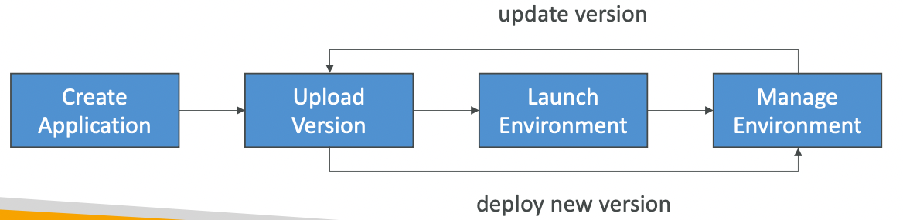

- **PaaS** which provides platform for developers to write and easily deploy code. It automatically creates the necessary infrastructure (EC2, ELB, SG, etc.) in AWS.
- Good for non-serverless applications
- Automatically handles capacity provisioning, load balancing, scaling, application health monitoring, instance configuration, etc. but **we have full control over the configuration.**
- **Free** (pay for the underlying resources spawned by Beanstalk)
- Supports versioning of application code
- Can create multiple environment (dev, test, prod)
- Supports the deployment of web applications from **Docker** containers and automatically handles load balancing, auto-scaling, monitoring, and placing containers across the cluster.
- Supports pretty much any programming language and even Docker containers.
- Beanstalk CLI helps manage the applications from CLI.
- Beanstalk uses CloudFormation under the hood to provision resources.

## Components

- **Application**: collection of Beanstalk components (environment, versions, config, etc.)
- **Application Version**: version of your application code
- **Environment**: collection of AWS resources running an application version
    - Environments are created under the application
    - Only 1 application version can be running at a time in an environment
    - Can create multiple environments (dev, test, prod) with separate configurations inside an application

## Web Server & Worker Environment Tier

- Web Environment (Web Server Tier): clients requests are directly handled by EC2 instances through a load balancer.
- Worker Environment (Worker Tier): clients’s requests are put in a SQS queue and the EC2 instances will pull the messages to process them. Scaling depends on the number of SQS messages in the queue.

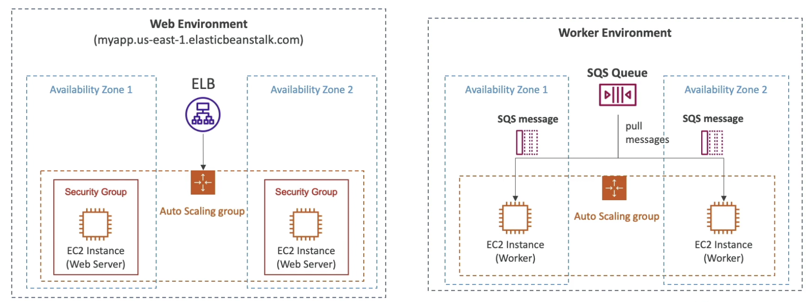

## Deployment Modes

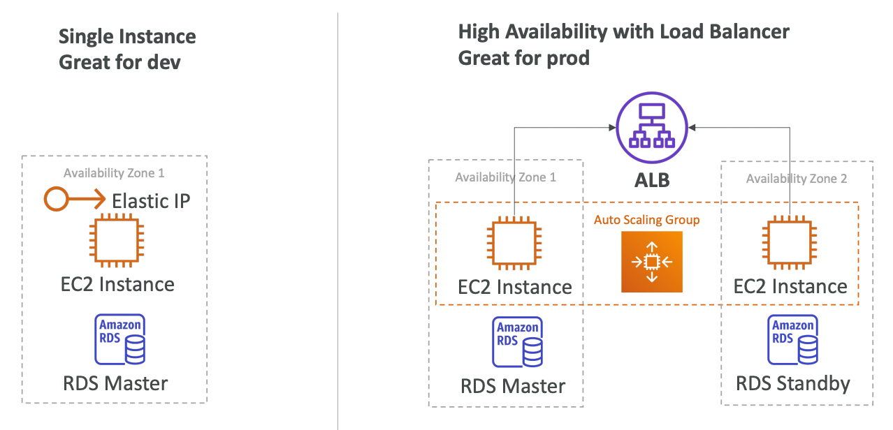

## Lifecycle Policy

- Lifecycle policy to phase out old versions based on:
    - **Days** (delete versions older than x days)
    - **Count** (keep latest x versions)
- Up to 1000 application version deployed simultaneously
- Option to retain the old version’s source bundle in S3

## EB Extensions

- Configure EB environment through config files
- Config files should be present in `.ebextensions/` directory in the root of the source code
- Config files should have `.config` extension and should be in YAML or JSON format
- Lifecycle of resources managed by EB Extensions are tied to the EB environment
- Through EB Extensions, we have the ability to add resources (RDS, ElastiCache, etc.) through CloudFormation, which cannot be done from the EB console.

## EB Cloning

- Clone an **environment** with the **same configuration**
- Useful to deploy a test version of your application
- Data present in DB will not be cloned, only the configuration will be cloned
- After cloning an environment, we can change the configuration

## EB Migration

- **If some change cannot be done in an environment** (eg. changing the load balancer type), **we need to migrate our environment.**
- Steps for migration
    - Create a new application environment with the same configuration except the required change (cannot clone)
    - Perform a CNAME swap or Route 53 update to route all traffic to the new environment

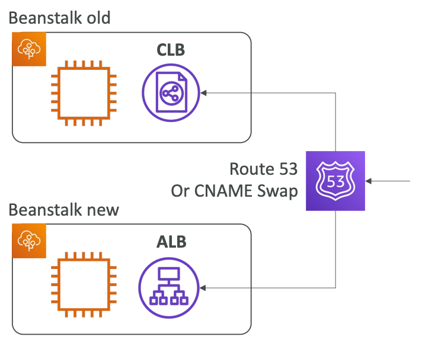

### Decoupling DB from EB Environment

- **Production environments should not have DB as a part of the environment as its lifecycle gets tied to the environment.**

- Steps to decouple an RDS DB already present in an EB environment:
    - Create a snapshot of the DB (for safety)
    - Go to RDS console → Protect RDS from deletion
    - Create a new EB environment without RDS and connect the application to the existing RDS (using connection string passed in the environment variable)
    - Perform a CNAME swap or Route 53 update to route all traffic to the new environment
    - Terminate the old environment (RDS won’t be deleted)
    - Delete CF stack (which is in `DELETE_FAILED` state)

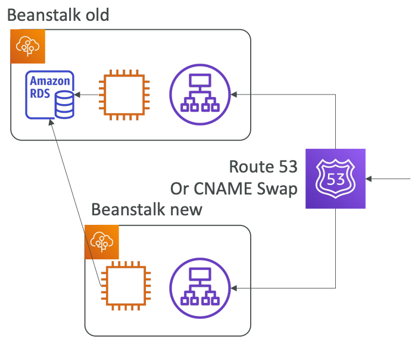

## Running containerized applications on EB

### Single Container

- **Running the application as a single container does not use orchestration solutions like ECS.** It runs it directly on an EC2 instance.
- Need to provide either:
    - `Dockerfile` - EB will build and run the Docker container (doesn’t require a pre-built docker image in a container repository)
    - `Dockerrun.aws.json` (v1) - describes where the prebuilt Docker image is along with how to run it (ports, volumes, etc.)

### Multi Container

- **Running the application in a multi-container setup creates an ECS cluster along with task definition and executions.** It also provisions ELB in **high availability mode**.
- Runs multiple containers in each EC2 instance.
- Requires `Dockerrun.aws.json` (v2) at the root of the source code. It is used by EB to generate the ECS task definition.
- The Docker images must be pre-built and stored in a container repository.

## HTTPS on Elastic Beanstalk

- TLS certificate can be loaded on to the load balancer in either of the two ways:
    - From the EB console under load balancer configuration
    - In the `.ebextensions/securelistener-alb.config` file
- SSL cert can be provisioned using ACM or CLI
- Must configure a SG rule to allow incoming traffic on port 443

## Redirect HTTP to HTTPS on Beanstalk

- Can be done in either of two ways:
    - Configure EC2 instances to redirect HTTP to HTTPS
    - Configure ALB with a rule (preferred)
- Health Checks should not be redirected

## Custom Platform

- If your app’s language is incompatible with Beanstalk and does not use Docker, we can use Beanstalk and need to create a custom platform.
- Steps to create custom platform:
    - Define an AMI using `Platform.yaml` file
    - Build the platform using **Packer** (open-source tool to create AMIs)

## Deployment options for Update

### All at once

- Bring down the old version and then bring up the new version
- **Downtime**
- Fastest deployment
- No additional cost

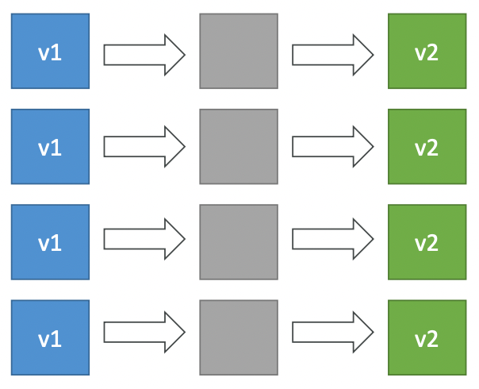

### Rolling updates

- Update a portion of applications in buckets
- Application can be running below capacity
- Long deployment
- No additional cost

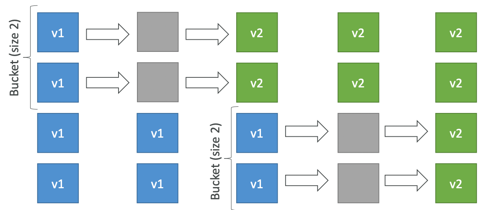

### Rolling with additional batches

- Run rolling updates while adding a bucket size (batch) of new applications that will be removed after deployment.
- Application can be running above capacity (small additional cost)
- Long deployment
- Good for prod environment

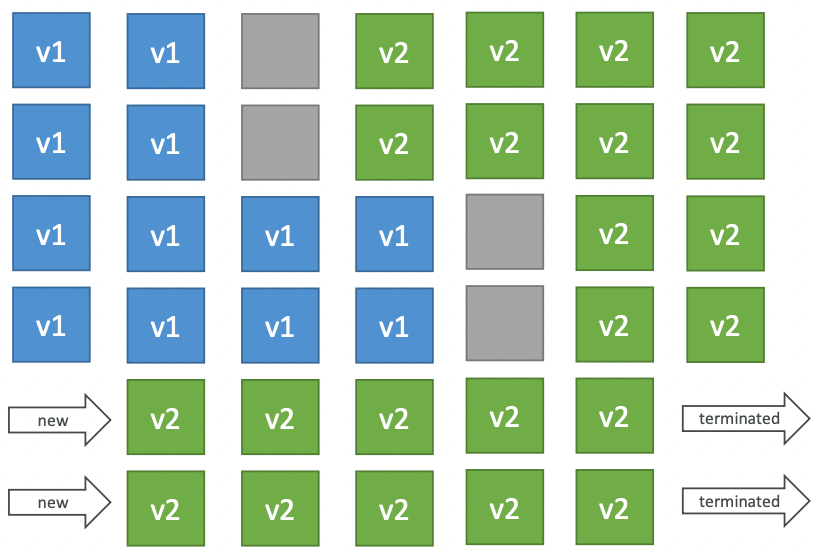

### Immutable

- New version is deployed to new instances on a temporary ASG. The instances in the temporary ASG are moved to the current ASG. The instances running the old application version in the current ASG are terminated and the temporary ASG is discarded.
- Longest deployment
- Zero downtime
- High cost (double capacity needed)
- **Quick rollback** (just delete the temporary ASG)

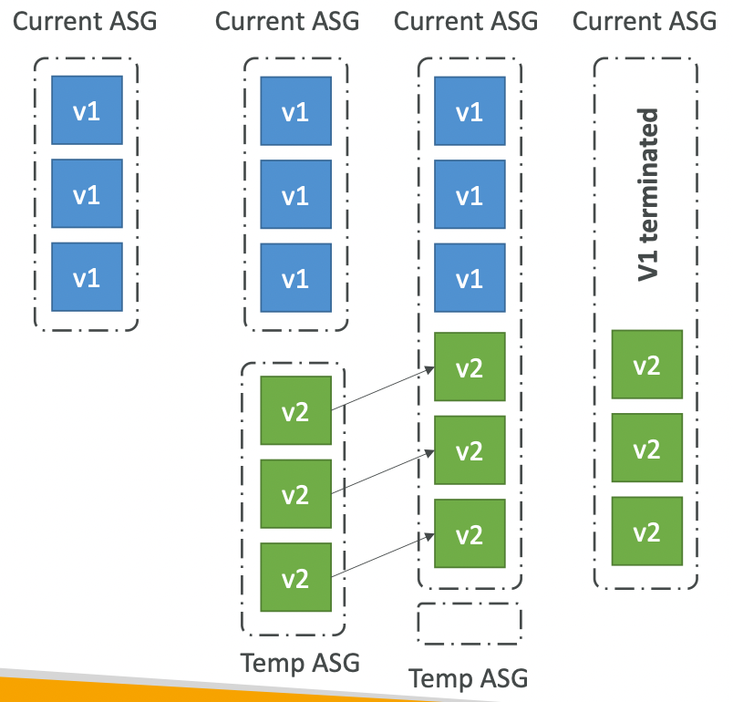

### Blue / Green

- Create an environment with new application version. Send a small amount of traffic to the new application version (environment) using **Route53 weighted routing** policy. If the new version is working fine, direct all the traffic to the new version (using Application URL swap which internally does a CNAME swap in Route53) and delete the old application environment.
- Zero downtime
- High cost (double capacity needed)
- Not directly available in Beanstalk

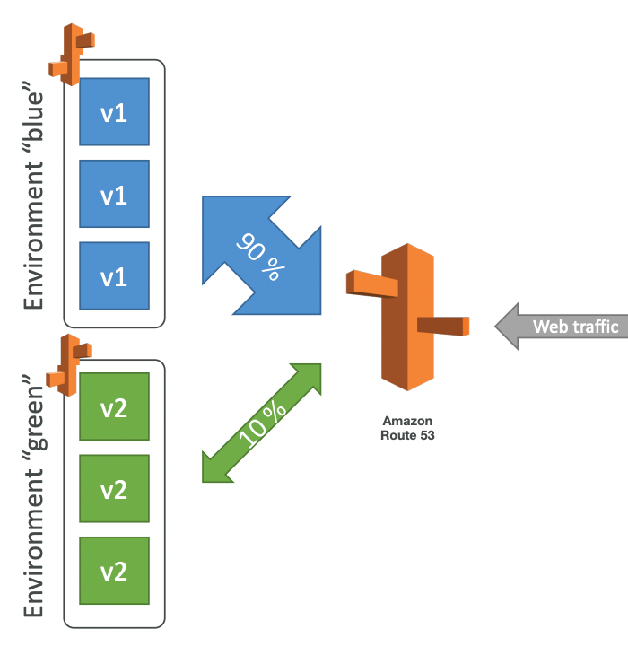

## Deployment Comparisons

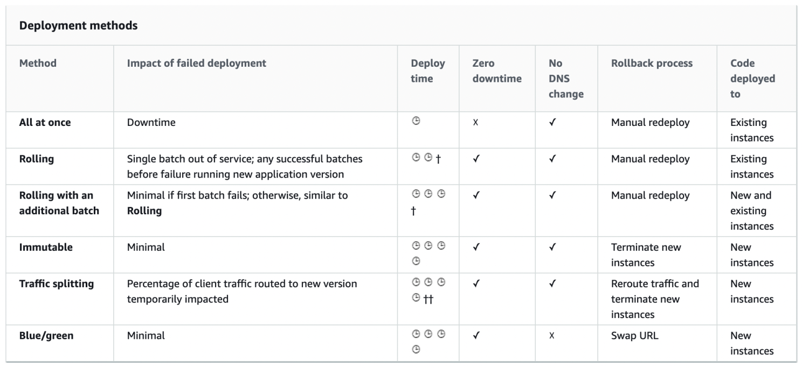

## Misc

- To deploy a new application version through the console, you'll need to upload a source bundle that meets the following requirements:
    - Consist of a **single** ZIP file or WAR file
    - Not exceed 512 MB
    - Not include a parent folder or top-level directory (subdirectories are fine)
- To deploy a worker application that processes periodic background tasks, the application bundle must include a `cron.yaml` file.
- EBS can configure EC2, CloudWatch and ALB. It cannot configure **Lambda** or CloudFront.
- Environment variables can be defined in `env.yaml` present in the root of the source bundle.
- To deploy a new version of the application, package your application as a `zip` or `war` file and deploy it using `eb deploy` command.
- To migrate an EB environment between accounts, create a saved configuration in the first account and download it to your local machine. Make the account-specific parameter changes and upload to the S3 bucket in second account. From Elastic Beanstalk console, create an application from **Saved Configurations**.