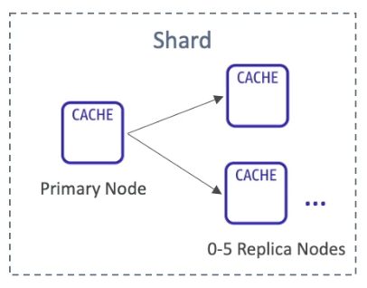
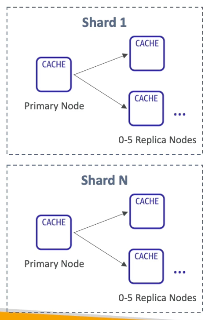
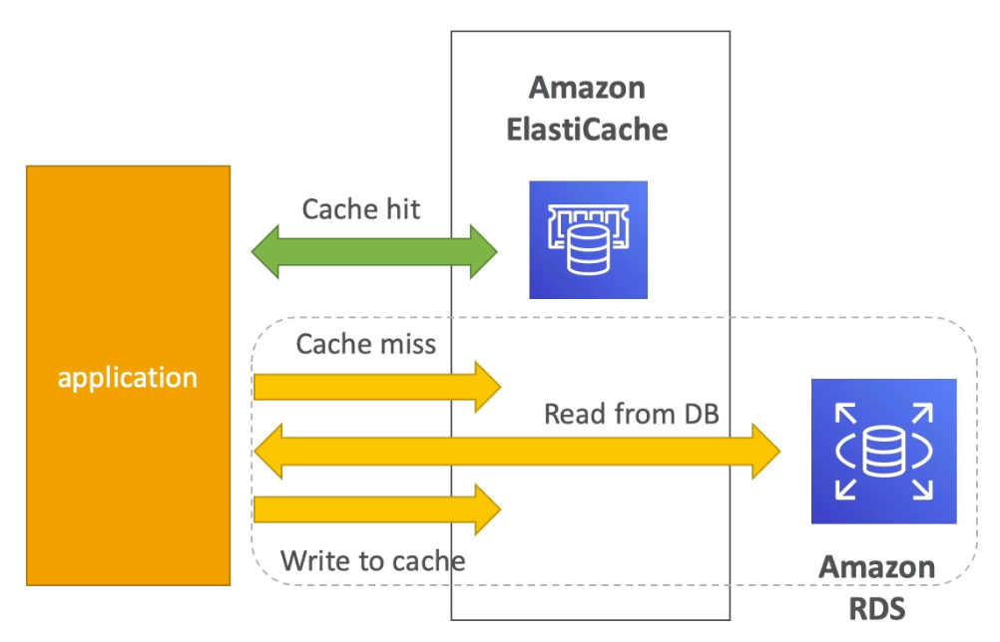
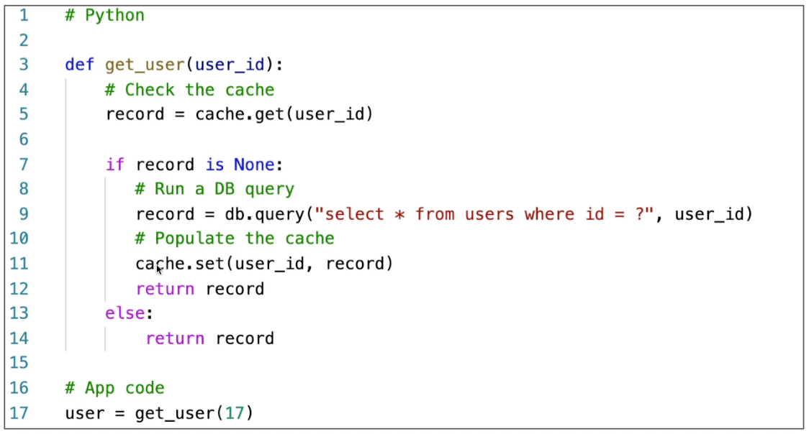
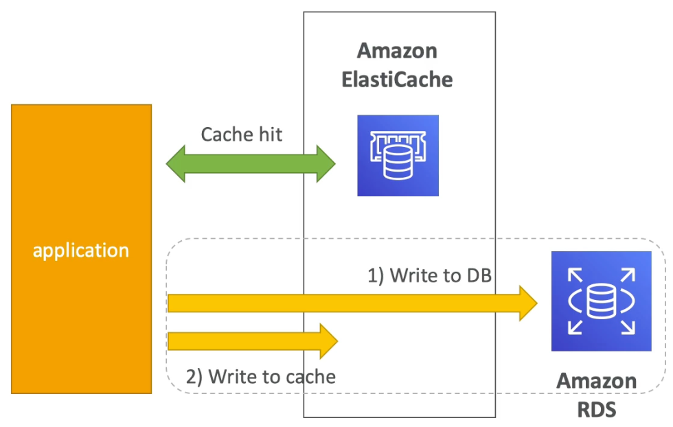
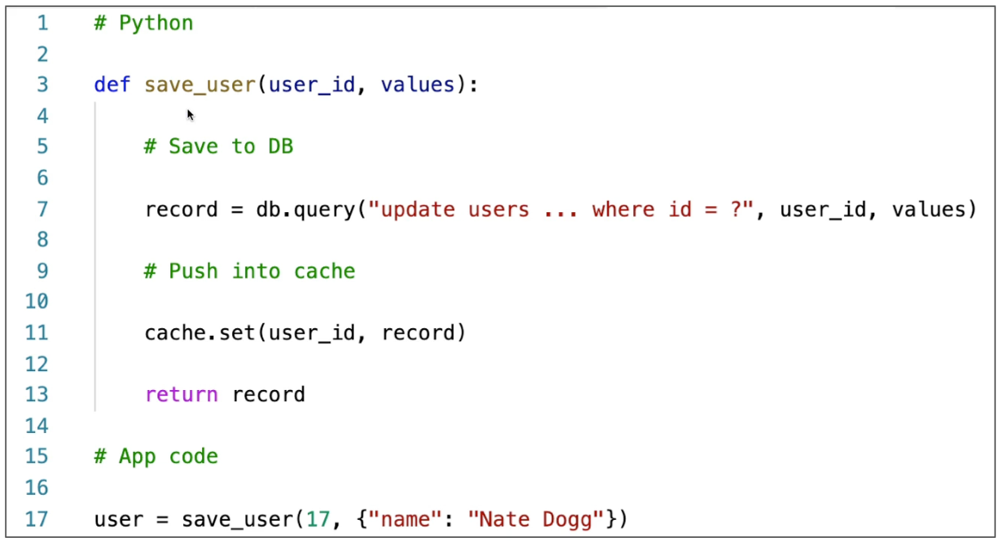

# ElastiCache

---

## Intro

- Regional Service (all the nodes in the cluster must be in the same region)
- AWS managed caching service
- **In-memory key-value store** with **sub-millisecond latency**
- Need to provision EC2 instances (nodes for the cluster)
- **Makes the application stateless** because it doesn’t have to cache locally
- **Using ElastiCache requires heavy application code changes**
- Usage:
    - **DB Cache** (lazy loading): cache read operations on a database (reduced latency)
    - **Session Store**: store user's session data like cart info (allows the application to remain stateless)
    - **Global Data Store**: store intermediate computation results

## Redis vs Memcached

| Redis | Memcached |
| --- | --- |
| In-memory data store | **Distributed** memory object cache |
| Read Replicas (for scaling reads & HA) | No replication |
| Backup & restore | No backup & restore |
| **Single-threaded** | **Multi-threaded** |
| **HIPAA compliant** | **Not HIPAA compliant** |
| Data is stored in an in-memory DB which is replicated | Data is partitioned across multiple nodes (sharding) |
| **Redis Sorted Sets** are used in realtime Gaming Leaderboards |  |
| Good for auto-completion |  |
| **Multi-AZ support with automated failover** (disaster recovery) |  |
| Encryption at rest and in transit | Encryption in transit only  |

## Security & Access Management

- Network security is managed using **Security Groups**
- At rest encryption using KMS
- In-flight encryption using SSL
- Use **Redis Auth** to authenticate to ElastiCache for Redis
- Memcached supports SASL-based authentication

## Modes of ElastiCache Replication for Redis

### Cluster Mode Disabled

- **1 primary node and up to 5 read-replicas** **(asynchronous replication)**. Writes can occur only at the primary node. Reads can occur at any node including the primary node.
- **No sharding** (1 shard only) - every node has complete data
- **Helpful for scaling read performance**
- **Automated failover** - if the primary node fails, one of the read-replicas will take over as the new master
- Supports multi-AZ for failover in case an entire AZ is down

### Cluster Mode Enabled

- **Sharding** - every node has partial data
- **Each shard has 1 primary and up to 5 read-replicas** **(asynchronous replication)**
- Sharding is helpful for scaling writes
- Read-replicas are helpful for scaling reads
- **Requires multi-AZ** for failover in case an entire AZ is down
- Up to **500 nodes per cluster**
    - 500 shards without replication (no read-replica)
    - 250 shards with 1 master and 1 replica
- You cannot manually promote any of the replica nodes to primary.
- You can only change the structure of a cluster, the node type, and the number of nodes by restoring from a backup.

## Design patterns for implementing caching

### Lazy Loading / Cache-Aside / Lazy Population

The application reads the data from the cache first. If it is present in the cache (cache hit), the application gets it immediately. If it’s not (cache miss), the application reads it from the DB, and writes it to the cache for later reads. This is used to optimize reads on the cache and is the first thing you should implement as a part of caching. ****This is good when we have a **small cache size and we only want to cache the data that is actively fetched** from the database.

**Pros**

- Only the data requested from the DB is cached. The cache will not contain unused data.
- Cache failures are not fatal, they just lead to increased latency of fetching the data from the DB.

**Cons**

- **Cached data can become stale** (outdated)
- Cache miss results in 3 network RTT delay which affects user experience

### Write Through

Whenever there’s a change to some data in the DB (write), write the data to cache. **This is done on top of lazy loading to optimize cache writes.** This enables **faster reads at the cost of longer writes.**

The cache and the DB cannot be updated at the same time via a single atomic operation as these are two separate systems. The cache must be updated or invalidated after writing to the DB.

**Pros**

- **Cache always contains up to date data** (no stale data)
- Each write takes up 2 network RTT delay which is better than 3 RTT delay during cache miss reads in case of lazy loading.

**Cons**

- Data that doesn’t change in the DB doesn’t get cached. Solution is to implement lazy loading alongside write through.
- **Cache churn** - most of the cached data will never be read

<aside>
💡 Lazy loading can be combined with Write through to optimize cache reads and writes.

</aside>

## Cache Eviction

The cache has a limited size and therefore the old or unused data must be removed to make room for new data. This is called as cache eviction. It occurs in 3 ways:

- Delete the item explicitly
- Delete the least recently used (LRU) data
- Use TTL for the data stored in cache

If too many cache evictions occur, you should consider scaling up/out your cache.