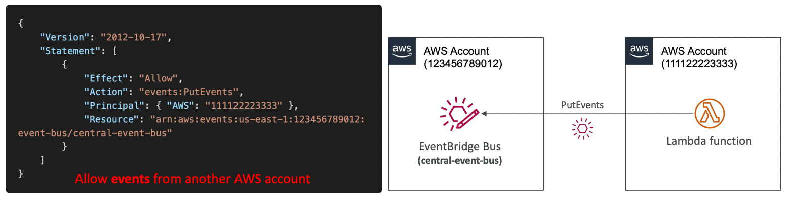
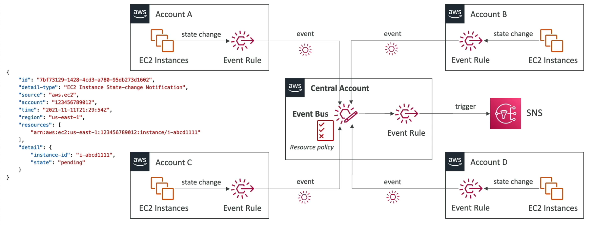

# EventBridge

---

## Intro

- Extension of CloudWatch Events
- Event buses types:
    - **Default event bus**: events from AWS services are sent to this
    - **Custom Event bus**: for your own applications
    - **Partner event bus**: receive events from external SaaS applications
- Event Rules: how to process the events
- **Event buses support cross-account access using Event Bus Policy**
- **Cron Jobs**: when creating an EB rule, we can select “Schedule” instead of event pattern to trigger an event based on a cron expression.
- Can archive events (all or based on a filter) sent to an event bus to replay later

<aside>
💡 EventBridge is recommended for decoupling applications that reacts to events from third-party SaaS applications.

</aside>

## Schema Registry

- Defines how the data is structured in the event bus
- Schema can be **versioned**

## Event Bus Policy

- Manage permissions for an event bus
- Useful to allow or deny events from another AWS account or region

## Multi-account Aggregation

The target for an event rule in an account can be an event bus in another account. The target event bus needs to have an event bus policy, allowing other accounts to send events into it. This way, a central event bus can be used to aggregate events from multiple accounts. 

## Misc

- EventBridge delivers a near real-time stream of system events that describe changes in AWS resources. Using simple rules that you can quickly set up, you can match events and route them to one or more target functions or streams.