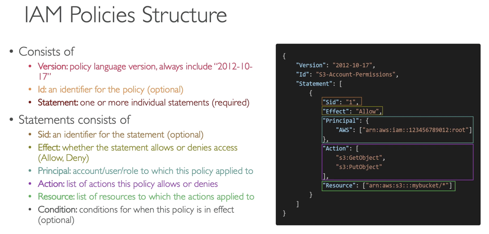
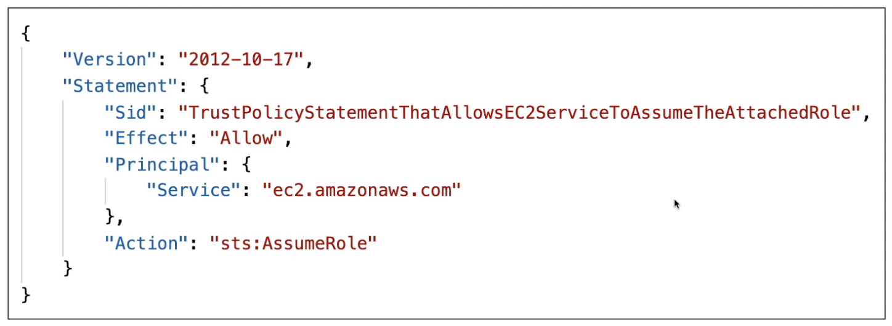
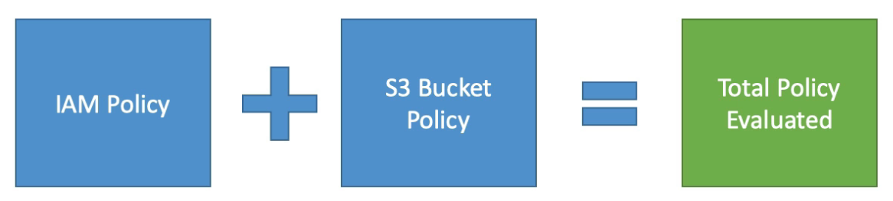
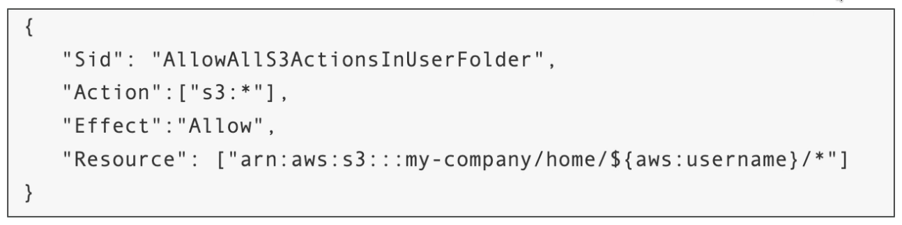
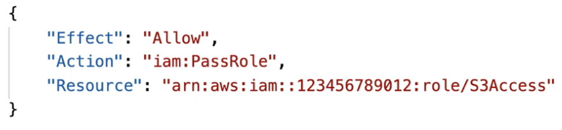

# IAM

---

## Intro

- Global Service (IAM entities like roles can be used in any region without recreation)
- **IAM Query API** can be used to make direct calls to the IAM web service (using access key ID and secret access key for authentication)
- By default, IAM users do not have access to the AWS Billing and Cost Management console.
- The following policy types only limit permissions (cannot grant permissions)
    - Service Control Policy (SCP)
    - Permission Boundary
- SMS-based MFA is available only for IAM users, not for the root user.

## Users & Groups

- Groups are collections of users and have policies attached to them
- **Groups cannot be nested**
- User can belong to multiple groups
- User doesn't have to belong to a group
- **Root User** has full access to the account
- **IAM User** has limited permission to the account
- You should log in as an IAM user with **admin access** even if you have root access. This is just to be sure that nothing goes wrong by accident.
- Only users and services can assume a role (not groups).
- A new IAM user created using the AWS CLI or AWS API has no AWS credentials.

<aside>
💡 **IAM Groups cannot be identified as principal in an IAM policy.**

</aside>

## Policies

- Policies are JSON documents that outline permissions for users, groups or roles
- Two types
    - **User based policies**
        - IAM policies define which API calls should be allowed for a specific user
    - **Resource based policies**
        - Control access to an AWS resource
        - Grant the specified principal permission to perform actions on the resource and define under what conditions this applies
- An IAM principal can access a resource if the user policy ALLOWS it OR the resource policy ALLOWS it AND there’s no explicit DENY.
- Follow **least privilege principle** for IAM Policies
- Policy Structure
    
    
    

### Policy Types

- **AWS Managed Policy**
    - Maintained by AWS (updated as new APIs are added)
    - Good for administrators
- **Customer Managed Policy**
    - Created and managed by us
    - Best practice (allow us to have fine-grained access control)
    - Version controlled (can rollback)
- **Inline Policy**
    - Policy directly applied to an IAM principal (tied to a single principal)
    - 1 - 1 relationship, cannot be reused
    - Max 2KB in size (cannot specify a lot of permissions)
    - No versioning
    - Policy is deleted if the IAM principal is deleted

### Trust Policies

- Defines which principal entities (accounts, users, roles, federated users) can assume the role
- An IAM role is both an identity and a resource that supports resource-based policies.
- The **IAM service supports only one type of resource-based policy** called a **role trust policy**, which is **attached to an IAM role**.
- Every IAM Role has a **Trust Policy** specifying which IAM principals can assume that role.
    
    Example: Trust Policy for a role that only allows EC2 instances to assume that role
    
    
    

## Roles

- Collection of policies for AWS services

<aside>
💡 If you are going to use an IAM Service Role with Amazon EC2 or another AWS service that uses Amazon EC2, you must store the role in an instance profile. **When you create an IAM service role for EC2, the role automatically has EC2 identified as a trusted entity.**

</aside>

### Service-Linked Roles

- A service-linked role is a pre-defined IAM role that is linked directly to an AWS service, not a resource. It includes all the permissions that the service requires to call other AWS services on your behalf.

## Protect IAM Accounts

- **Password Policy**
    - Used to enforce standards for password
        - password rotation
        - password reuse
    - Prevents **brute force** attack
- **Multi Factor Authentication (MFA)**
    - Both root user and IAM users should use MFA

## Reporting Tools

### **Credentials Report**

- lists all the users and the status of their credentials (MFA, password rotation, etc.)
- **account level** - used to audit security for all the users

### **Access Advisor**

- shows the service permissions granted to a user and when those services were last accessed
- **user-level**
- used to revise policies for a specific user

## Access Keys

- Need to use access keys for AWS CLI and SDK
- Don't share access keys with anyone (every user can generate their own access keys)
- Access keys are only shown once and if you lose them you need to generate a new access key
- Access Key ID ~ username
- Secret Access Key ~ password
- If access keys are compromised, invalidate the access keys by deleting them.

## Best Practices

- Use root account only for account setup
- 1 physical user = 1 IAM user
- Enforce MFA for both root and IAM users
- Never share lAM credentials & Access Keys
- Use groups to assign permissions to users
- Use standalone policies instead of inline policies
- Delete (don’t generate) access keys for the root user
- Rotate access keys periodically
- Use Temporary Security Credentials (IAM Roles) instead of long-term access keys
- Don't embed access keys directly into code
- Use different access keys for different applications
- Delete unused or compromised access keys
- The root account should only be accessible by one admin user with MFA

## Policy Simulator

- Online tool that allows us to check what API calls an IAM User, Group or Role is allowed to perform based on the permissions they have.

## Permission Boundaries

- Set the maximum permissions an IAM entity can get
- **Can be applied to users and roles (not groups)**
- Used to ensure some users can’t escalate their privileges (make themselves admin)

## Policy Evaluation

- **If there’s an explicit deny on an action, the final decision after evaluating the Policy will be deny even if another policy allows it.**
- **The union of IAM Policies and Resource-based Policies make up the Total Policy.** Example: even if we remove the IAM policy of a user that was allowing it access to an S3 bucket but the bucket policy allows it, the final decision will be allow.
    
    
    

## Dynamic Policies

- Leverage variables in the Policy document
- Example: an IAM policy to grant users access to their own home folders in S3
    
    
    

## Passing a Role to a Service

- To pass a Role to an AWS service, to assume, requires `iam:PassRole` permission for the user. The user should also have `iam:GetRole` permission to view the role being passed.
    
    **Example**: Passing a role to EC2 instances to allow access to S3. The EC2 instance can assume that role and perform the required action. The below policy allows the principal to pass `S3Access` role to any service that can assume that role.
    
    
    

- Roles can only be passed to those services that are allowed to assume that role (specified in the role’s **Trust Policy**)

## IAM Principals

- Any principal
    
    `"Principal": "*"` or `"Principal": { "AWS": "*" }`
    
- Any user or role in the account
    
    `"Principal": { "AWS": "123456789012" }` or 
    `"Principal": { "AWS": "arn:aws:iam::123456789012:root" }`
    
- An IAM User
`"Principal": { "AWS": "arn:aws:iam::123456789012:user/user-name" }`
- An IAM Role 
`"Principal": { "AWS": "arn:aws:iam::123456789012:role/role-name" }`
- An assumed role
`"Principal": { "AWS": "arn:aws:sts::123456789012:assumed-role/role-name/role-session-name" }`
- Federated identity
`"Principal": { "Federated": "cognito-identity.amazonaws.com" }`
`"Principal": { "Federated": "arn:aws:iam::123456789012:saml-provider/provider-name" }`
- AWS Services
    
    ```yaml
    "Principal": {
    	"Service": [
    		"ecs.amazonaws.com",
    		"elasticloadbalancing.amazonaws.com"
    	]
    }
    ```
    

## Cross-account Access

To grant access to a resource in account A to users in account B:

1. The account A administrator creates an IAM role and attaches a permissions policy that grants permissions on resources in account A to the role.
2. The account A administrator attaches a trust policy to the role that identifies account B as the principal who can assume the role.
3. The account B administrator delegates the permission to assume the role to any users in account B.

## Misc

- **IAM roles and resource-based policies delegate access across accounts only within a single partition.** For example, assume that you have an account in US West (N. California) in the standard `aws` partition. You also have an account in China (Beijing) in the `aws-cn` partition. You can't use an Amazon S3 resource-based policy in your account in China (Beijing) to allow access for users in your standard AWS account.