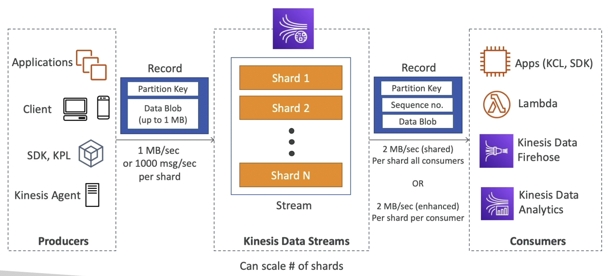
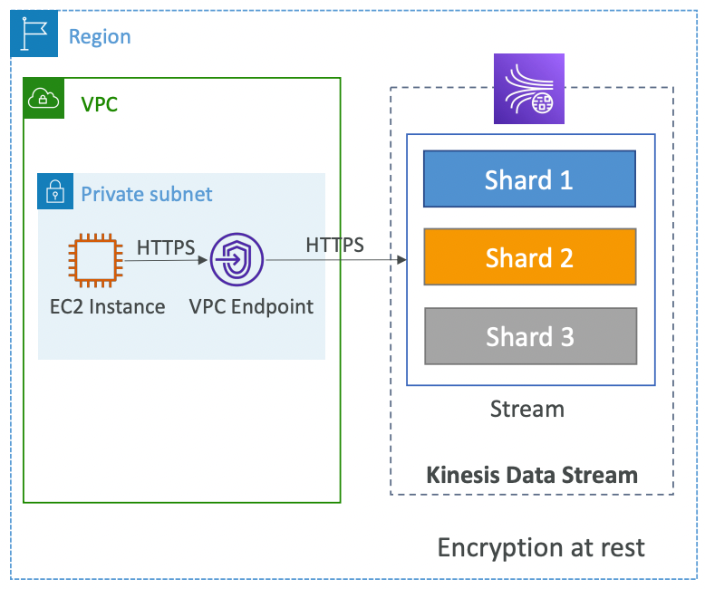
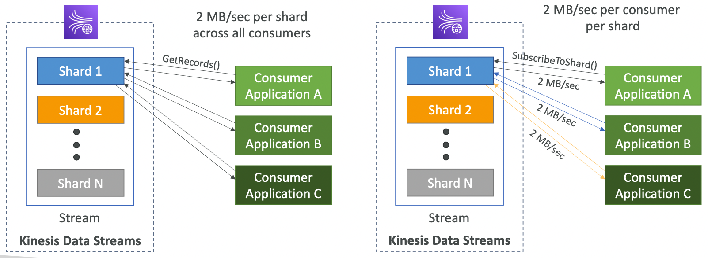
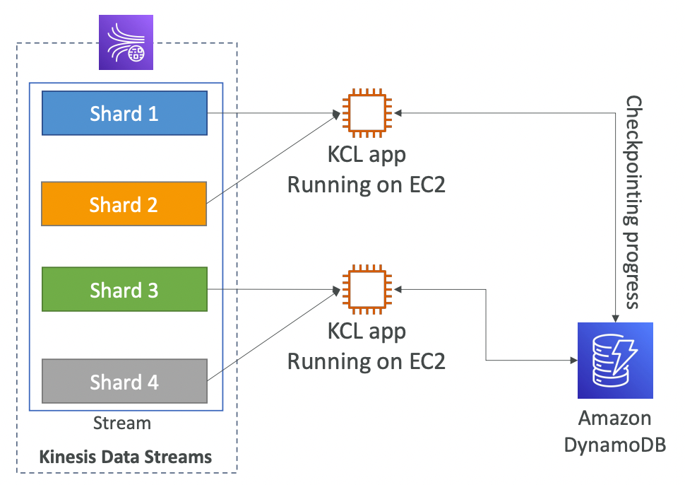
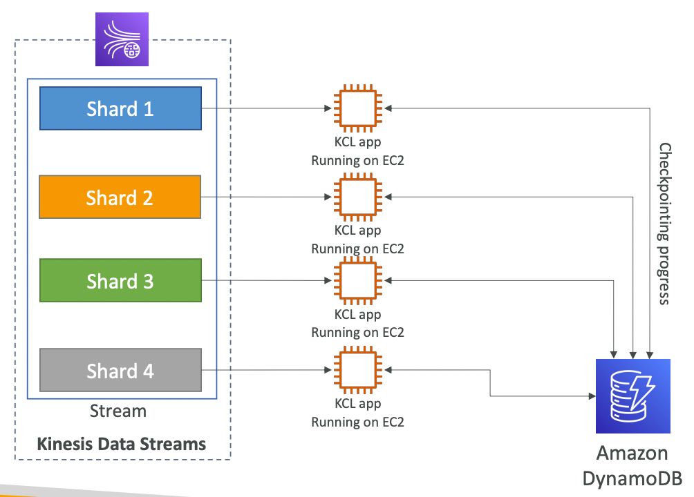
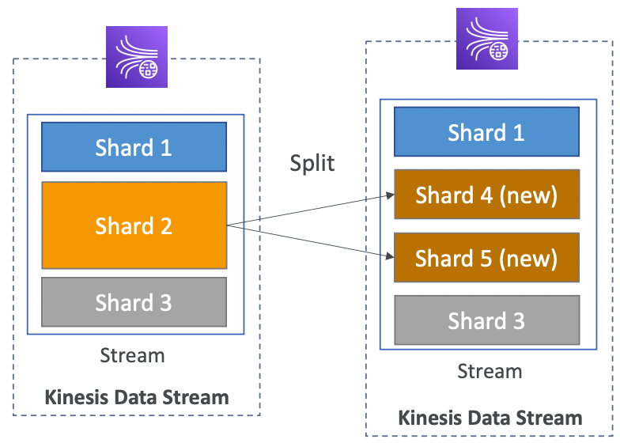
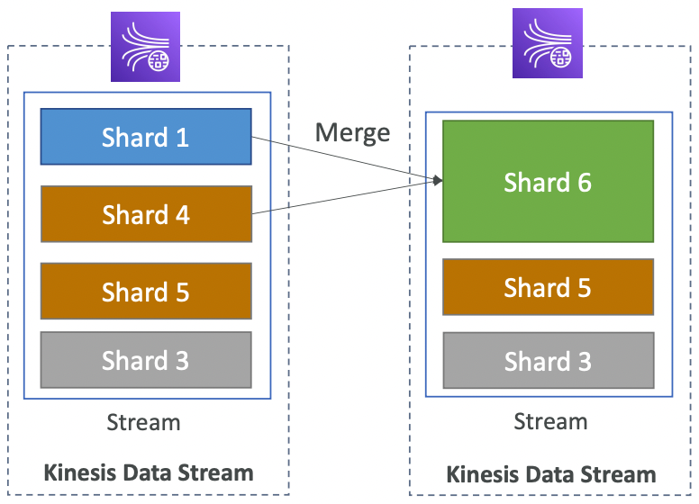
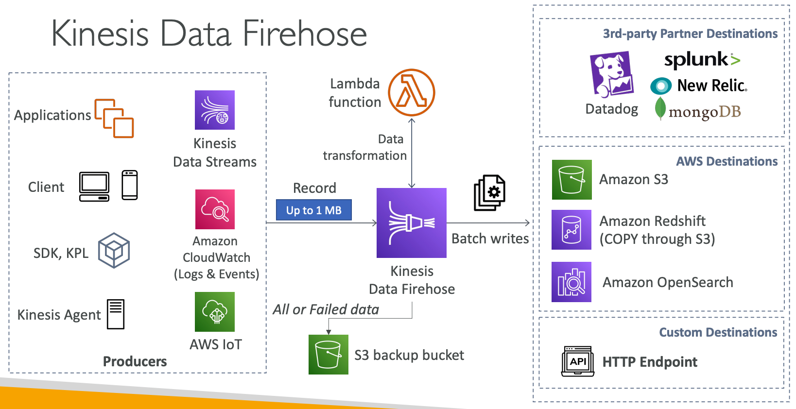
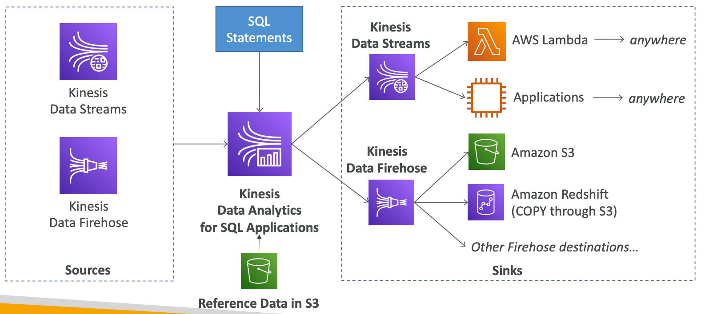
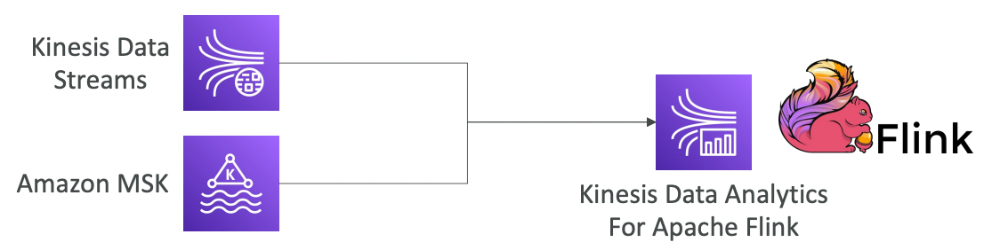

# Kinesis

---

# Kinesis Data Stream (KDS)

## Intro

- Real-time data streaming service
- **Used to ingest data in real time directly from source**
- **Not Serverless**
- **Data Retention: 1 day (default) to 365 days**
- A record consists of a **partition key** and data blob (**max 1MB**)
- **Once data is inserted in KDS, it can’t be modified or deleted (immutability)**
- Records will be ordered in each shard
- Producers use SDK, Kinesis Producer Library (KPL) or **Kinesis Agent** to publish records
- Consumers use SDK or Kinesis Client Library (KCL) to consume the records
- Ability to re-process (**replay**) data

### **Capacity Modes**

- **Provisioned**
    - Publishing: 1MB/sec per shard or 1000 msg/sec per shard
    - Consuming:
        - **Shared**: 2MB/sec per shard (throughput shared between all consumers)
        - **Enhanced Fanout**: 2MB/sec per shard per consumer (dedicated throughput for each consumer)
    - Throughput scales with shards (**manual scaling**)
    - Pay per shard provisioned per hour
- **On-demand**
    - No need to provision or manage the capacity (shards)
    - Default capacity provisioned - **4 MB/sec or 4000 records/sec**
    - Scales automatically based on observed throughput peak during the last 30 days
    - Pay per stream per hour & data in/out per GB

## Security

- **KDS is present outside the VPC.** VPC endpoints can be used to access Kinesis from within the VPC.
- Access control for producing/consuming using IAM
- In-flight encryption using HTTPS
- **Server-side at-rest encryption** using KMS or client-side encryption

## Producers

- Producers can be:
    - **AWS SDK** - simple producer
    - **Kinesis Producer Library (KPL)** - handles batching, compression and retries
    - **Kinesis Agent** - uses KPL to stream log files
- `PutRecord` API is used to publish a record in KDS
- **Batching** in `PutRecord` API **reduces cost and increases throughput** (automatically done by KPL)
- Partition key is passed through a hashing function to determine the shard. Use a well distributed field in the data as the partition key to avoid **hot partition** where most of the data is sent to a single shard.
- Going above the throughput limit (1 MB/s or 1000 records/sec) for any shard will cause `ProvisionedThroughputExceeded` exception. Possible solutions:
    - Retries with exponential backoff
    - Ensure the partition key is well distributed
    - Split the shards (increase number of shards)
- **Use KPL to achieve high write throughput in KDS**
- Embed a primary key within the record to handle duplicate records on the consumer side

## Consumers

- Consumers can be:
    - AWS Lambda
    - Kinesis Data Analytics
    - Kinesis Data Firehose
    - Custom Consumer (AWS SDK) – consume at a low level (need to manage complexities)
    - Kinesis Client Library (KCL) - consume at a high level (complexities already managed)

### Classic (Shared) Consumer

- Read throughput: 2 MB/sec per shard
shared across all consumers
- **Consumers poll data from KDS** using
`GetRecords` API call (**pull-based**)
- Good for small number of consumers
- Limit of 5 `GetRecords` API calls/sec per shard
- Latency ~200 ms (polling)
- Low cost
- Returns up to 10 MB or up to 10,000 records then throttle for 5 seconds

### Enhanced Fan-Out Consumer

- Read throughput: 2 MB/sec per shard
dedicated for each consumer
- **Consumers subscribe to a shard** using `SubscribeToShard` API. KDS pushes data to consumers (**push-based**)
- Good for large number of consumers
- Latency ~ 70 ms (event driven)
- High cost
- Default soft limit of 5 consumers per data stream

### Lambda as Consumer

- Supports classic and enhanced fan-out
- Can read records in batches (configure using batch size and batch window)
- Can process up to 10 batches per shard simultaneously
- Automatic retries on error until success or data expires in KDS

## Kinesis Client Library (KCL)

- A **Java** library that helps read record from KDS with **distributed applications** sharing the read workload
- **Maximum number of KCL instances = number of shards**
- **KCL checkpoints the read progress into DynamoDB** (the application running KCL needs the IAM permissions)
- By checkpointing in DynamoDB, KCL instances of an application track each other to divide the shards among themselves.
- KCL can run on any compute resource (cloud or **on-premise**)
- Records are read in order at the shard level
- Versions:
    - KCL 1.x (supports shared consumer)
    - KCL 2.x (supports shared & enhanced fan-out consumer)

## Shard Splitting

- Split a **hot shard** (high traffic) into 2 shards
- Increases the stream capacity by equivalent of adding 1 shard
- The old shard is closed and will be deleted when the data in it expires
- Can’t split more than 2 shards in a single operation

## Shard Merging

- Merge two **cold shards** (low traffic) into a single shard
- Decreases the stream capacity by equivalent of removing 1 shard
- Old shards are closed and will be deleted when the data in them expires
- Can’t merge more than 2 shards in a single operation

# Kinesis Data Firehose (KDF)

- Used to load streaming data into a target location
- **Serverless**
- **Writes data in batches efficiently (near real time)**
    - **Buffer size** (size of the batch) - **1 MB to 128MB (default 5MB)**
    - **Buffer interval** (how long to wait for buffer to fill up) - **60s to 900s (default 300s)**
    - Greater the buffer size, higher the write efficiency, longer it will take to fill the buffer
- **Can ingest data in real time directly from source**
- **Auto-scaling**
- Destinations:
    - AWS: Redshift, S3, **OpenSearch**
    - 3rd party: Splunk, MongoDB, DataDog, NewRelic, etc.
    - Custom HTTP endpoint
- Pay for data going through Firehose (no provisioning)
- **Custom data transformation using Lambda functions** (not supported in KDS)
- **No replay capability** (does not store data like KDS)

# Kinesis Data Analytics (KDA)

## KDA for SQL

- Perform **real-time analytics on Kinesis streams** using **SQL**
- Creates streams from SQL query response
- **Cannot ingest data directly from source** (ingests data from **KDS** or **KDF**)
- **Auto-scaling**
- **Serverless**
- Pay for the data processed (no provisioning)
- Use cases:
    - Time-series analytics
    - Real-time dashboards
    - Real-time metrics

## KDA for Apache Flink

- Use Flink (Java, Scala or SQL) to process and analyze streaming data (advanced querying capability)
- Can ingest data from **KDS** or **MSK** (to ingest data from KDF, use KDA for SQL)
- Used to run Apache Flink application on a managed cluster on AWS
    - provisioning compute resources, parallel computation, automatic scaling
    - application backups (implemented as checkpoints and snapshots)

# Kinesis Video Streams

- Capture, process and store video streams