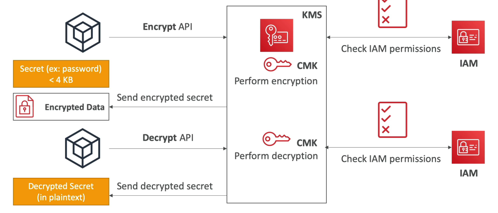
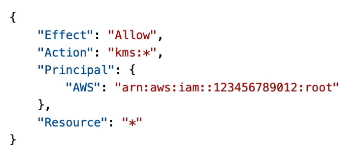
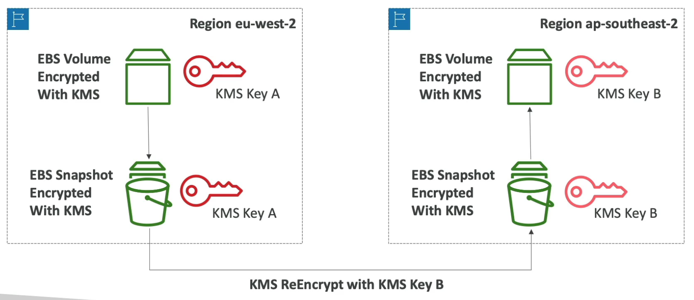
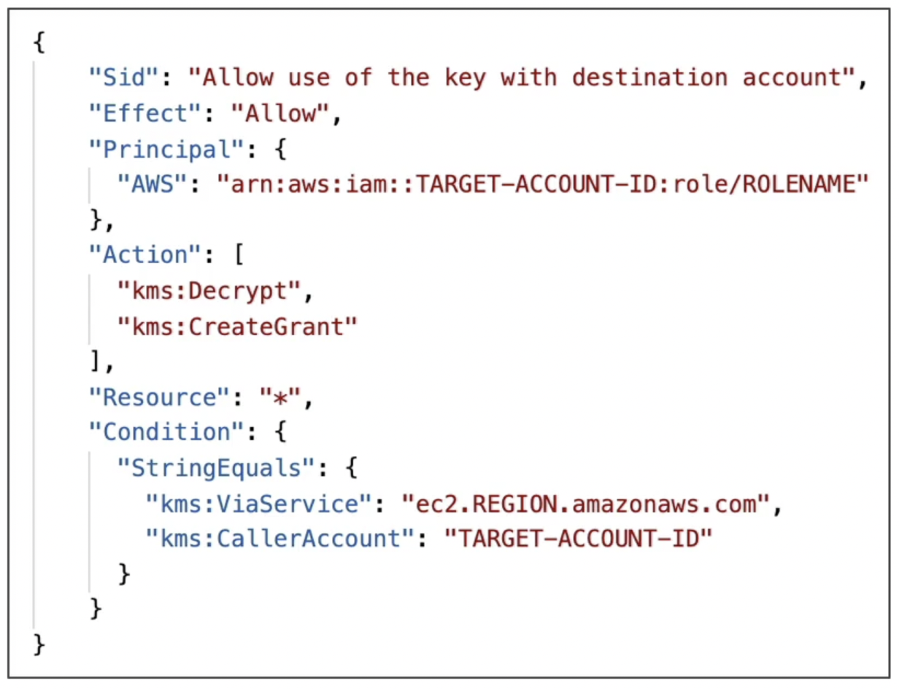
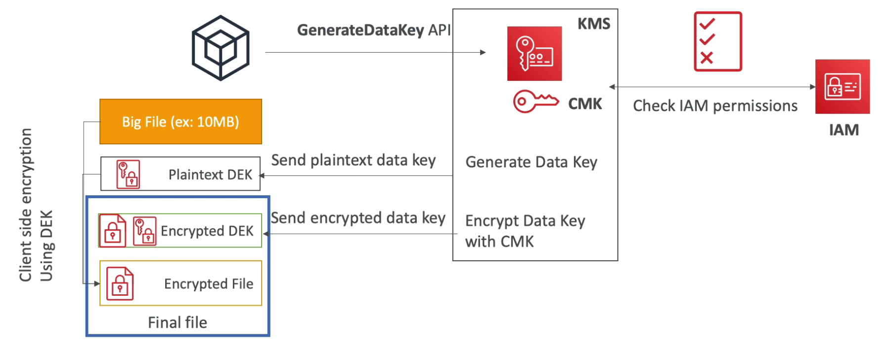
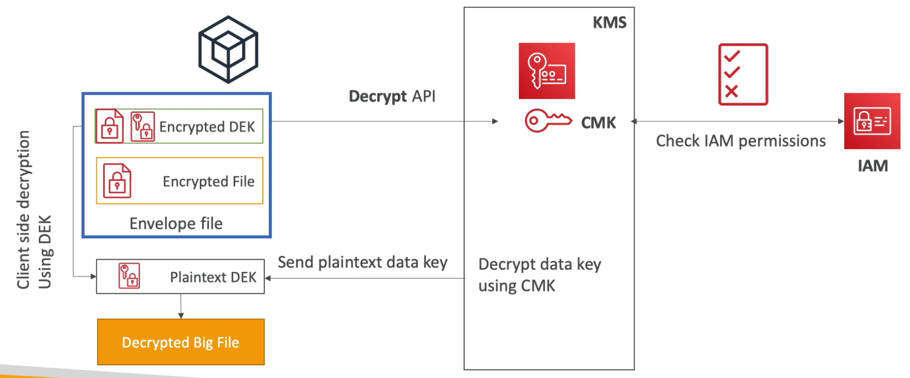

# KMS

---

## Intro

- **Regional service (keys are bound to a region)**
- Provides encryption and decryption of data and manages keys required for it
- Encrypted secrets can be stored in the code or environment variables
- **Encrypt up to 4KB of data per API call (if data > 4 KB, use envelope encryption)**
- Integrated with lAM for authorization
- Audit key usage with CloudTrail
- Need to set **IAM Policy & Key Policy** to allow a user or role to access a KMS key (encrypt or decrypt data using the key)
    
    
    
- Pay for the number of API calls made to KMS
- **Does not support versioning of keys** (cannot get back the old key)

## KMS Keys (formerly Customer Master Key)

### Symmetric keys

- AES-256 encryption
- **Must call KMS API to encrypt data**
- Necessary for Envelope Encryption
- Two types:
    - **AWS Managed Keys** (free)
        - Default KMS key for each supported service
        - Fully managed by AWS (cannot view, rotate or delete them)
        - Automatic yearly rotation
    - **Customer Managed Keys** (1$ per month)
        - Generated in KMS
            - Optional automatic yearly rotation
        - Generated and imported from outside
            - Must be 256-bit symmetric key
            - Not recommended
            - Manual rotation only
        - Deletion has a waiting period (**pending deletion state**) between **7 - 30 days** (default 30 days). The key can be recovered during the pending deletion state.

### Asymmetric Keys

- Public (Encrypt) and Private Key (Decrypt) pair
- Used for Encrypt/Decrypt, or Sign/Verify operations
- The public key is downloadable, but you can’t access the Private Key unencrypted
- **No need to call the KMS API to encrypt data** (data can be encrypted by the client)
- **Not eligible for automatic rotation** (use manual rotation)
- Use case: encryption outside of AWS by users who can’t call the KMS API

## Key Policies

- **Cannot access KMS keys without a key policy attached to them**

### **Default Key Policy**

- Created by default if you don’t provide a custom key policy
- Full access to the key for any user or role in the account (most permissible)
    
    
    

### **Custom Key Policy**

- **Can only be applied to customer owned keys**
- Define users, roles that can access the KMS key
- Define who can administer the key
- Useful for **cross-account access** of your KMS key

## Cross-region Encrypted Snapshot Migration

- Create an encrypted snapshot of the EBS volume (can be decrypted by the same key)
- Copy the encrypted snapshot to another region with **re-encryption option** using a new key in the new region (keys are bound to a region)
- Restore the EBS volume in the new region.

## Cross-account Encrypted Snapshot Migration

- Attach a Key Policy to the main key to authorize access to an IAM role in the target account (cross-account access)
    
    
    
- Share the encrypted snapshot with the new account
- In the target account, create a copy of the snapshot (decryption will use the main key)
- Encrypt it with a new KMS Key in the target account

## Envelope Encryption

### Encryption Phase

To encrypt a file larger than 4 KB, we call the `GenerateDataKey` API which returns a **Data Encryption Key (DEK)** in both plaintext and encrypted form (using the KMS key specified in the command, requires the user to have IAM permissions to encrypt using the KMS key). The DEK (symmetric) is used to **encrypt the large file client-side**. Then, an envelope is created which contains the encrypted file as well as the encrypted DEK. The data is now encrypted and the the plaintext DEK can be discarded. 

### Decryption Phase

The encrypted DEK (< 4 KB) is extracted from the envelope and passed to the `Decrypt` API which returns the decrypted DEK (only if the user has permissions to use the KMS key to decrypt data). The plaintext DEK is then used to **decrypt the large file client-side**.

## APIs

- `Encrypt` - encrypt up to 4 KB of data
- `GenerateDataKey` - generate a unique **symmetric** DEK for **Envelope Encryption** (returns both plaintext and encrypted data key using the KMS key specified in the command)
- `GenerateDataKeyWithoutPlaintext` - generate a DEK to use in the **future** (returns the encrypted DEK only)
- `Decrypt` - decrypt up to 4 KB of data (could be DEK)
- `GenerateRandom` - generate a random byte string.

## AWS Encryption SDK

- **Implements Envelope Encryption** (difficult to implement manually)
- Available in Java, Python, C, JS and also as a CLI tool
- **Data Key Caching**
    - Re-use data keys (DEK) (instead of generating them for each encryption)
    - **Reduces the number of API calls to KMS** (cheaper) but not as secure as generating distinct data keys for each encryption.
    - Leverages `LocalCryptoMaterialsCache` feature

## Limits

- All cryptographic operations within the AWS account that leverage keys managed by KMS (eg. SSE-KMS) share the same request quota (on a per second basis)
- Exceeding the request quota gives `ThrottlingException` (status code: 400). Possible solutions:
    - Exponential backoff
    - For `GenerateDataKey`, **enable DEK Caching** in Encryption SDK
    - Request quota increase
- Example: if a lot of objects are being uploaded to an S3 bucket with SSE-KMS, there can be performance degradation due to KMS API throttling.

## Supported Key Operations

- Create symmetric and asymmetric keys
- Import your own symmetric key
- Create both symmetric and asymmetric data key pairs
- Define which IAM users and roles can manage keys
- Define which IAM users and roles can use keys to encrypt and decrypt data
- Choose to have keys that were generated by the service to be automatically rotated on an annual basis.
- **Temporarily disable keys** so they cannot be used by anyone
- **Re-enable disabled keys**
- **Schedule deletion of keys**
- **Audit key usage** using CloudTrail