# Lambda

---

## Intro

- Function as a Service (FaaS)
- Serverless
- Auto-scaling
- Pay per request (number of invocations) and compute time
- Free tier: 1,000,000 requests and 400,000 GBs of compute time
- Supported runtime
    - NodeJS
    - Python
    - Java
    - C#
    - Golang
    - Ruby
    - Any other language using Custom Runtime API (example Rust)
    - Docker containers

## Performance & Limits

- RAM: 128MB (default) - 10 GB (1 MB increments)
- Disk capacity (`/tmp`): 512 MB (free) - 10 GB
- Cannot configure vCPU count directly, increase RAM to increase vCPU count
    - RAM = 1,792 MB ⇒ vCPU = 1
    - For vCPU > 1, need to use multi-threading to take advantage of multiple cores
- Timeout: default 3s, max 15 mins (900s)
- Environment variables: max 4 KB
- Deployment
    - Compressed: max 50 MB
    - Uncompressed: max 250 MB (for more use `/tmp`)

## Cold Start

- To minimize partial cold start time, minimize the time taken to execute the code outside the lambda handler by:
    - Reducing the deployment package size
    - Increasing computing power (by increasing the allocated memory)

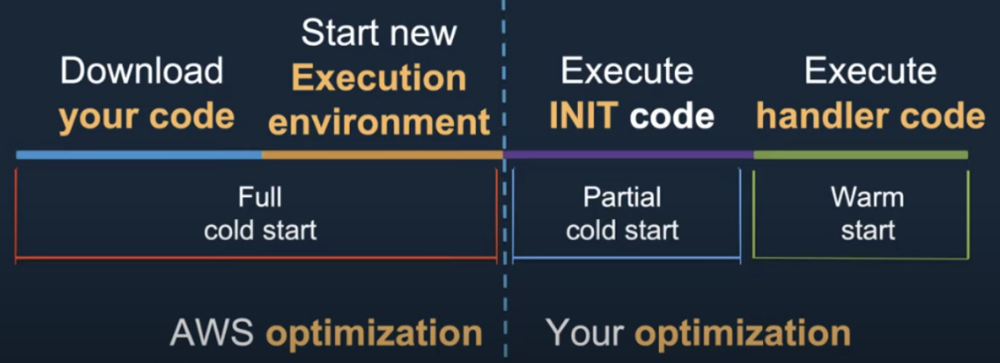

## Access Control

- IAM permissions to control API access to Lambda
- Resource-based policies to allow other services to invoke the lambda function

## Synchronous Invocation

- The caller invokes the lambda function and waits for it to return the result
- Error handling (retries, exponential backoff, etc) must be done by the caller
- Invoking a lambda function using CLI or SDK results in synchronous invocations by default. To invoke explicitly, set `invocation-type` to `RequestResponse`
- Some services that invoke the lambda function synchronously
    - Invoked by user
        - ALB
        - API Gateway
        - CloudFront (Lambda@Edge)
        - S3 Batch
    - Invoked by service
        - Cognito
        - Step Functions
        - **SQS** (through event source mapping)

## Asynchronous Invocation

- The caller just invokes the lambda function and does not wait for the result. Can send many events and let lambda process them.
- The event is put in an event queue from which the lambda function reads
- Invoking a lambda function asynchronously returns **status code 202 (lambda function invoked)**. We don’t know if the processing was successful or not.
- For asynchronous invocation, set `invocation-type` to `Event`

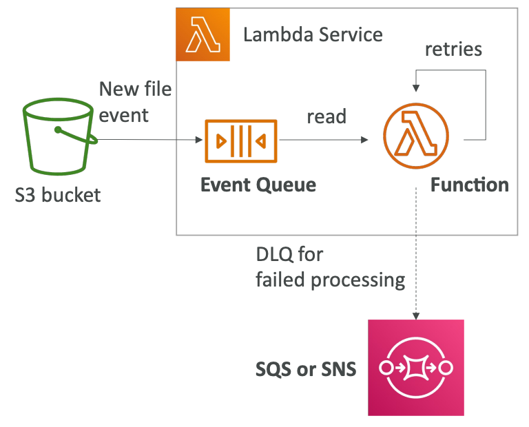

- Error handling is done by the lambda function
    - Retries: 0 - 2
    - Exponential Backoff: 1 min (first retry), 2 min (second retry)
    - Can setup DLQ (SQS queue or an SNS topic) **on the lambda function** to send failed events after retries. Need to provide IAM permissions to the lambda to write to DLQ.
    - Retries lead to duplicate logs in CW
    - Make sure the event processing is **idempotent** (not affected by retries)
- Some services that invoke the lambda function asynchronously
    - S3 (S3 notifications)
    - **SNS**
    - EventBridge (events in event buses)
    - CodeCommit (Code Commit Trigger: new branch, new tag, new push)
    - CodePipeline (invoke a Lambda function during the pipeline)

## Event Source Mapping

- **Lambda needs to poll the service to get records for processing** (required when the following services are configured as the trigger for lambda function)
    - Kinesis Data Streams (KDS)
    - DynamoDB Streams
    - SQS queues (Standard and FIFO)
- When we configure the lambda function to work with the above services, an event source mapping is created internally which repeatedly polls the service to get a batch of data and **invoke the lambda function synchronously with an event batch**.
- Need to attach IAM permissions to the Lambda role to read from the appropriate service.

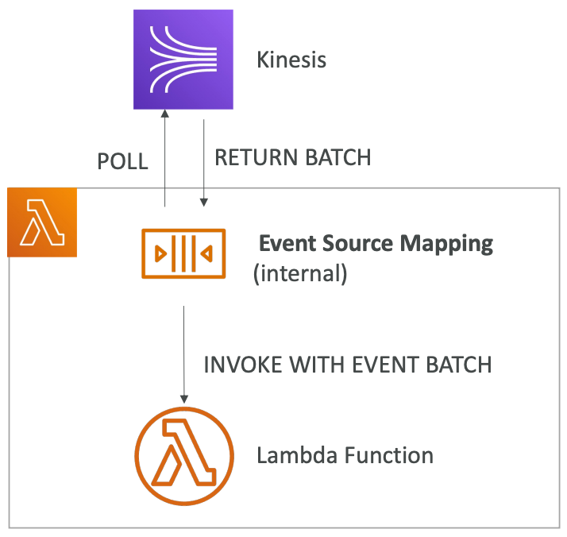

<aside>
💡 **Event Source Mapping is a process internal to Lambda.** It is managed by the Lambda service but is not directly run inside the Lambda function.

</aside>

There are two kinds of event source mappers:

### **Streams**

- Used for KDS and DynamoDB streams as Lambda trigger
- The event source mapping creates an iterator for each shard. Items within a shard will be processed in order but items across shards might not be processed in order.
- The iterator can be configured where to read from:
    - Trim Horizon (beginning of the shard)
    - At timestamp
    - Latest
- **Processed records aren’t removed from the stream** and can be viewed by other consumers.
- For low traffic streams, process the records in batches for each shard using batch window (time to wait for the batch to fill up)
    - 1 lambda per shard
    - In order processing for each shard
- For high traffic streams, process multiple batches (partitioned using partition key) in parallel at the shard level
    - Max 10 batches per shard (10 lambdas per shard)
    - In order processing for each partition key
    
    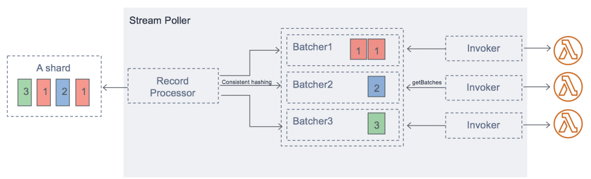
    
- Error Handling
    - **If an error occurs while processing a batch, the entire batch is reprocessed until the processing succeeds or items in the batch expire.**
    - Processing for the affected shard is paused until the error is resolved (to ensure that batches are processed in order).
    - Event source mapping can be configured to:
        - Discard old events (send to a **destination**)
        - Restrict the number of retries
        - Split the batch on error (process the batch partially) (work around Lambda timeout issue)

### Queues

- Used for SQS as Lambda trigger
- Event source mapping uses **long polling** to poll the queue for messages.
- **Batch size**: 1 - 10 messages
- Recommended to set message visibility timeout to 6x lambda function timeout
- FIFO Queues
    - In-order processing
    - Lambda scales to the number of group IDs
- Standard Queues
    - Processing not necessarily in order
    - Lambda scales up to process items in the queue as quickly as possible (adds 60 more instances per minute)
    - Up to 1000 batches of messages processed simultaneously

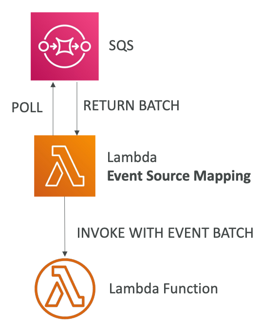

- **When an error occurs, items within the batch are returned to the queue** and might be processed in a different grouping than the original batch.
- The event source mapping might receive the same item multiple times, even if no function error occurred. So the processing should be **idempotent**.
- **Lambda deletes messages from the queue after they're processed successfully.**
- **DLQ needs to be set on the queue, not the Lambda function** because DLQ for Lambda is only for asynchronous invocations.
- Lambda destination can be used for failures

## Integration with ALB

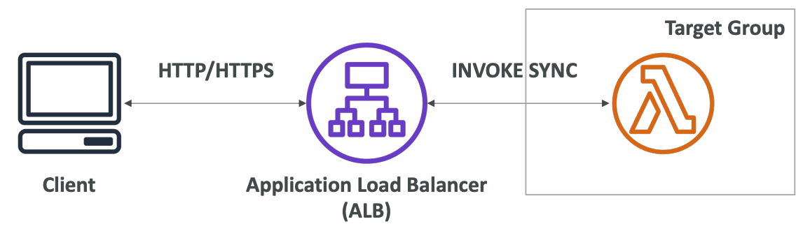

- ALB is used to expose a lambda function as an HTTP/HTTPS endpoint
- Lambda function must be registered in a target group
- ALB converts the HTTP request into a JSON event to invoke the lambda synchronously. It also converts the response from Lambda back into HTTP response to return to the client.
- Multi-value headers support in ALB
    
    If **multi-value header setting in the target group** is enabled, **HTTP headers** and **query string parameters** with the same key but different values are converted to arrays in the JSON event.
    
    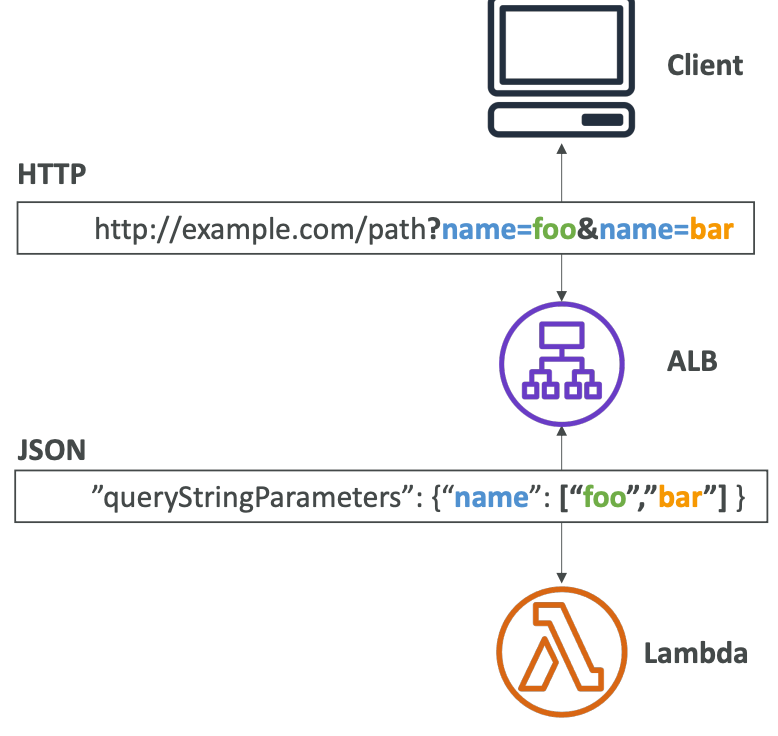
    

## Event and Context Objects

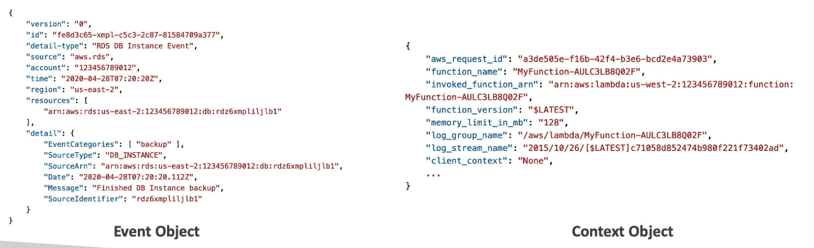

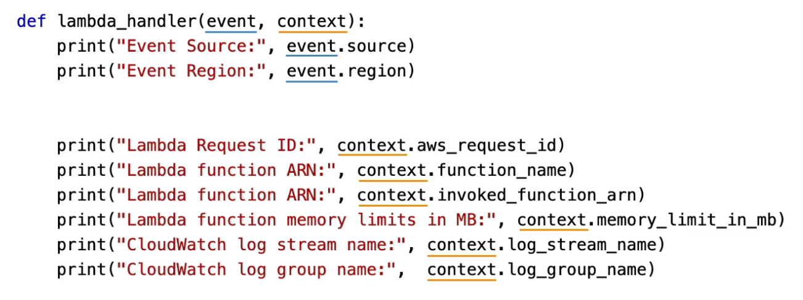

**Event Object**

- JSON formatted event (data for the function to process)
- Lambda runtime converts the event to an object based on the language (e.g. dict type in Python)

**Context Object**

- JSON document available to the function at runtime which provides metadata about the function, invocation and runtime environment
- Contains the name of log stream

## Destinations

- Configure the lambda function to send information regarding the invocations and results of **asynchronous invocations** or **synchronous invocations through event source mapping** (successful or failed) to a destination.
- Successful invocations are sent to destination immediately but failed invocations are retried before sending to the destination.
- Can send successful and failed invocations to different destinations.
- **Destination is recommended over DLQ** (as it supports more destinations)
- Destination for asynchronous invocations of Lambda function:
    - SQS
    - SNS
    - Lambda
    - Event bus

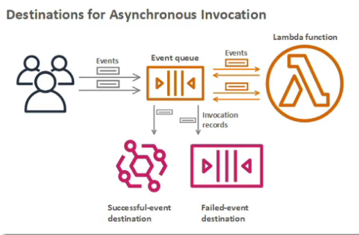

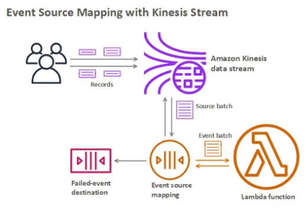

- Destination for discarded event batches in **Stream type Event Source Mapping**:
    - SQS
    - SNS

## Access Control

### Lambda Execution Role

- IAM role for Lambda functions
- Best practice: one execution role per function
- When using event source mapping, the Lambda function needs IAM permissions in the execution role to poll another service for events.
- Commonly used managed policies for Lambda:
    - `AWSLambdaBasicExecutionRole` - Send logs to CloudWatch.
    - `AWSLambdaKinesisExecutionRole` - Read from Kinesis
    - `AWSLambdaDynamoDBExecutionRole` - Read from DynamoDB Streams
    - `AWSLambdaSQSQueueExecutionRole` - Read from SQS queues
    - `AWSLambdaVPCAccessExecutionRole` - Deploy Lambda function in VPC
    - `AWSXRayDaemonWriteAccess` - Upload trace data to X-Ray

### Resource-based Policy

- Used to allow other services to invoke the lambda function
- When a service like S3 triggers a lambda function, the resource-based policy for that lambda function gives it access.
- An IAM principal can access Lambda if the IAM policy attached to the principal authorizes it or the resource-based policy authorizes.

### Cross Account Access

You can give a Lambda function created in one account ("account A") permissions to assume a role from another account ("account B") to access resources such as DynamoDB or S3 bucket. You need to create an execution role in Account A. Then you need to create a role in account B that the Lambda function in account A assumes to gain access to the cross-account DynamoDB table. Make sure that you modify the trust policy of the role in Account B to allow the execution role of Lambda to assume this role. Finally, update the Lambda function code to add the `AssumeRole` API call.

## Environment Variables

- Environment variables (key-value pairs) for Lambda
- **No limit on the number of environment variables**
- **Max total size of all environment variables = 4 KB**
- Lambda adds some system environment variables by default
- Can be used to store parameters (config) and secrets (encrypt using Lambda key or CMK in KMS)
- **Lambda encrypts environment variables at rest by default.**
- **Encryption helpers:** encrypt environment variables client side, before sending them to Lambda. This enhances security further by preventing secrets from being displayed unencrypted in the Lambda console, or in function configuration.

## Observability

### Logging & Monitoring

- Lambda automatically sends logs to CW using `AWSLambdaBasicExecutionRole` policy
- Lambda automatically sends metrics to CW
    - Invocations, duration, concurrent execution
    - Error count, success rate, throttles
    - Async delivery failures
    - Iterator age (how much the lambda is lagging when reading from a stream)

### Tracing

- Enable **Active Tracing** in Lambda configuration (runs X-Ray daemon)
- Instrument your code with X-Ray SDK
- Ensure Lambda function has `AWSXRayDaemonWriteAccess` policy (automatically added when Active Tracing is enabled)
- Environment variables used by the X-Ray SDK (automatically configured)
    - `AWS_XRAY_DAEMON_ADDRESS`: the X-Ray Daemon ip-address:port
    - `_X_AMZN_TRACE_ID`: contains the tracing header
    - `AWS_XRAY_CONTEXT_MISSING`: by default, LOG_ERROR

## Lambda@Edge

- Run lambda function, written in **NodeJS or Python**, at edge locations by attaching them to CloudFront distributions
- Minimizes latency (globally available)
- Throughput: **thousands of requests/second**
- Can be used to modify Viewer and Origin Request and Response
    
    
    
- Create functions in `us-east-1` ⇒ CloudFront replicates to the edge locations

### Lambda@Edge vs CloudFront Functions

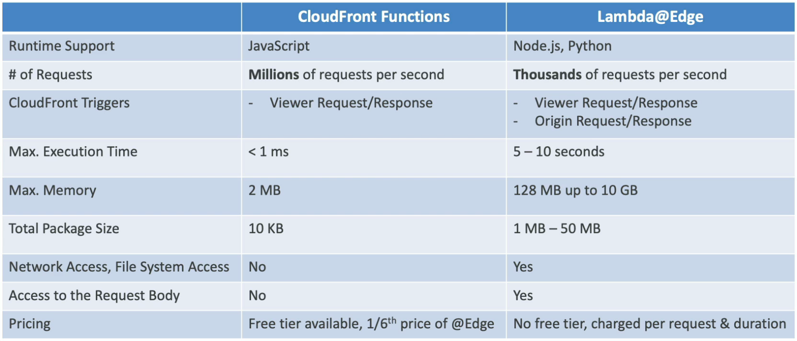

## Networking

- By default, Lambda functions are launched outside your VPC (in an AWS owned VPC). So, it cannot access resources within your VPC.

- To deploy a lambda in your VPC
    - Configure the VPC ID and Subnets
    - Create a **security group for the lambda function**
- Deploying a Lambda function within a VPC internally creates ENIs within the subnets configured, with the lambda security group attached to them. To create ENIs, Lambda function needs `AWSLambdaENIManagementAccess` policy (need to configure manually).
- A lambda function deployed in a public subnet of a VPC does not have internet access or a public IP.

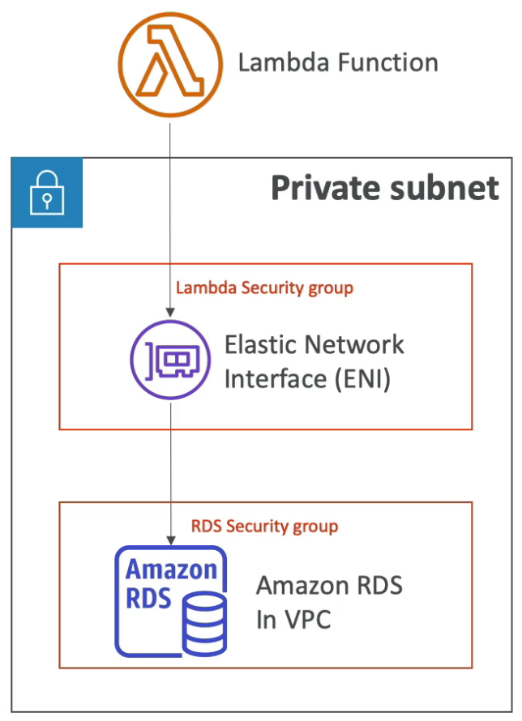

- To have internet access, deploy the lambda in a private subnet with a NAT gateway (in a public subnet). In this setting, AWS services outside the VPC can be accessed by the lambda function without traversing the public internet using VPC endpoints.

<aside>
💡 Irrespective of how Lambda is deployed, it will always be able to send logs to CloudWatch without any additional configuration.

</aside>

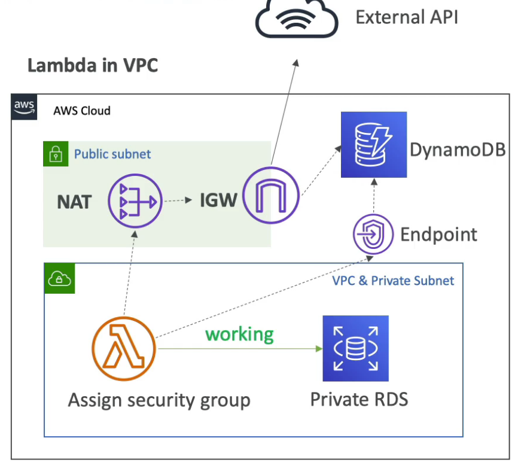

## Execution Context

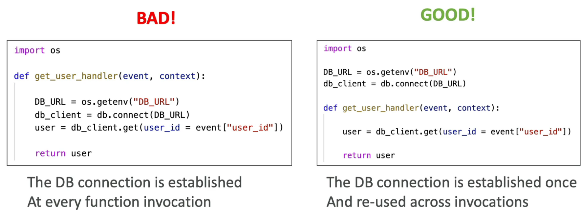

- Temporary runtime environment that runs the code outside of the Lambda handler
- Used to initialize external dependencies of the lambda handler
    - Create DB connections
    - Start web servers
    - Initialize SDKs
- Execution context is maintained as long as that instance of lambda function lives in anticipation of another invocation. If the same lambda instance (if it is still alive) is invoked again, it will reuse the execution context to save time.
- `/tmp` directory is included in the execution context
    - can be used as a transient cache across invocations
    - free up to 512 MB, max 10 GB
- **Best practice**: anything that takes time should be moved outside of the event handler (into execution context)

## Storage Options

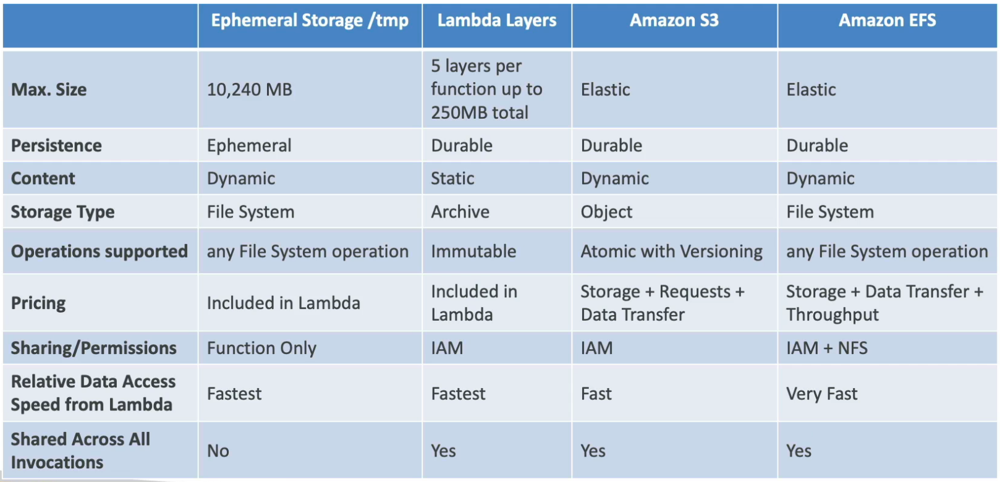

### EFS Mounting

- **Lambda functions must be running within the VPC**
- Configure Lambda to mount EFS to a local directory during initialization
- **Must leverage EFS Access Points**
- Limitations: each lambda instance creates a connection with EFS (watch out for connection limits)

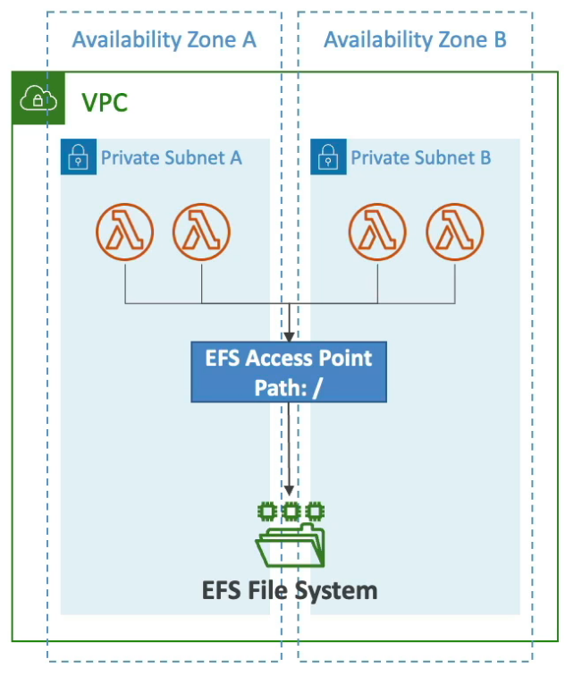

## Concurrency

- Concurrency soft limit across account: 1000 (can be raised by opening a support ticket)
- **Reserved concurrency**: concurrency hard limit for a lambda function
    - Recommended to reserve (limit) concurrency for every lambda function.
    - With unreserved concurrency, a function can throttle other functions.
    - To throttle a function, set its reserved concurrency to 0
- Each request over the concurrency limit will throttle
    - Synchronous invocation → return **ThrottleError 429**
    - Asynchronous invocation → retry (up to 6 hours) with exponential backoff (1 sec - 5 min)
- **Provisioned concurrency**:  keep some lambda functions warm to prevent cold start
    - Specified number of lambda functions will be ready to serve requests at all times
    - **Application Auto Scaling** can control the provisioned concurrency on a schedule or based on a target metric.
- Required Concurrency = `invocations_per_sec` x `avg_execution_time`
- If the concurrency requirements are above the limit for the account, contact AWS to increase the quota.
- **Unreserved concurrency cannot go below 100**, so that functions that do not have reserved concurrency limits can still process requests. So, if your total account limit is 1000, you are limited to allocating 900 reserved concurrency to individual functions combined.

## Deployment

### Packaging Dependencies

- Code and dependencies need to be packaged into a zip file and uploaded directly to Lambda if less than 50 MB, otherwise upload to S3 and download to `/tmp`.
- Native libraries need to be compiled on Amazon Linux
- AWS SDK is installed by default on Lambda (no need to package it)

### Lambda Layers

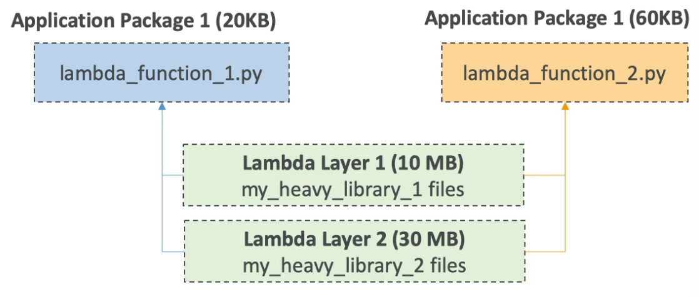

- Used to **separate dependencies from the application code** to reuse them
- Allow the application package to be small
- Lambda layers can be referenced by multiple functions
- Additional feature: **support custom runtimes** (allows Lambda functions to run any programming language)
- Up to 5 layers per function (max 250 MB total)

### Deployment with CloudFormation

- Simple code (Python or NodeJS) **without dependencies** can be written directly in the CloudFormation template
    
    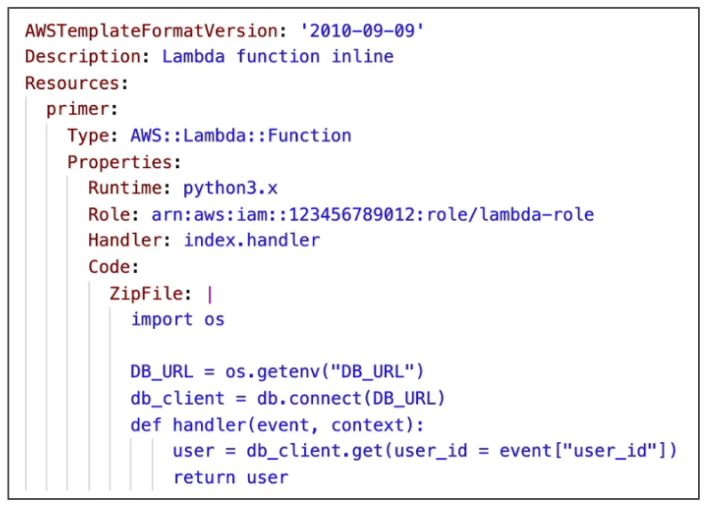
    
- Reference the zip file stored in S3
    - `S3ObjectVersion` is required only if the bucket is versioned (recommended)
    - CloudFormation will only update (redeploy) the function if either `S3Bucket` , `S3Key` or `S3ObjectVersion` changes in the template.
    
    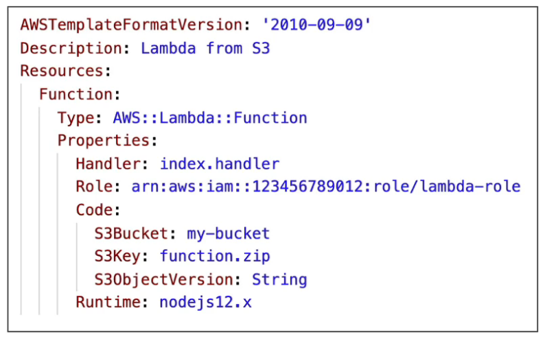
    
- Deploy a lambda function in multiple AWS accounts
    
    The zipped lambda code is in an S3 bucket in account 1. Bucket policy will be used in account 1 to allow accounts 2 and 3 to access the zipped lambda code. Also, the CloudFormation templates in account 2 and 3 need to have an execution role to allow reading the contents of the bucket at the desired location.
    
    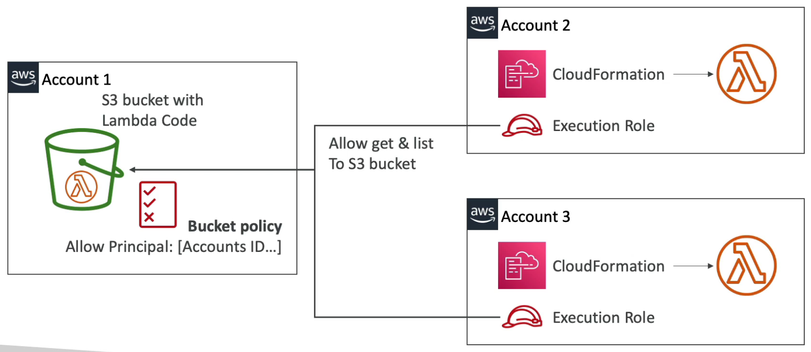
    

### Traffic-shifting with CodeDeploy

- Automatically increases the percentage of traffic (x) going to the new version until 100%
- Integrated within the SAM framework
- **Pre & Post Traffic Hooks** to check the health of Lambda function after traffic shift. If something fails, CodeDeploy will rollback the deployment to the old version.

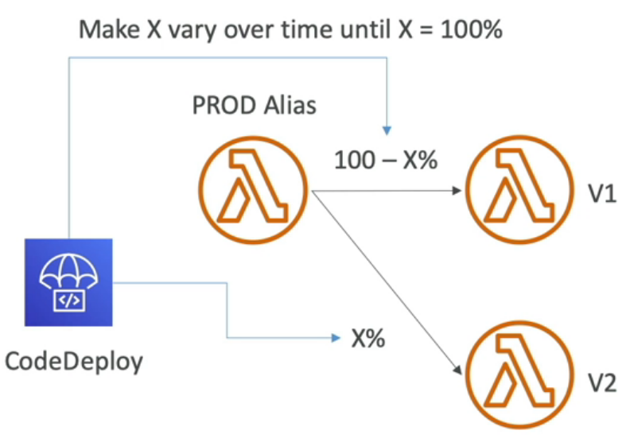

- Traffic-shifting strategies:
    - **AllAtOnce** - change to 100% immediately
    - **Linear** - grow traffic at regular intervals
        - `Linear10PercentEvery3Minutes` - increase traffic by 10% every 3 mins
    - **Canary** - try a small percentage, then 100%
        - `Canary10Percent5Minutes` - try 10% for 5 minutes

- `AppSpec.yml` can be used for deploying a new version of Lambda function
    - `Name` - name of the function
    - `Alias` - name of the alias that needs to be updated
    - `CurrentVersion` - current version
    - `TargetVersion` - new version

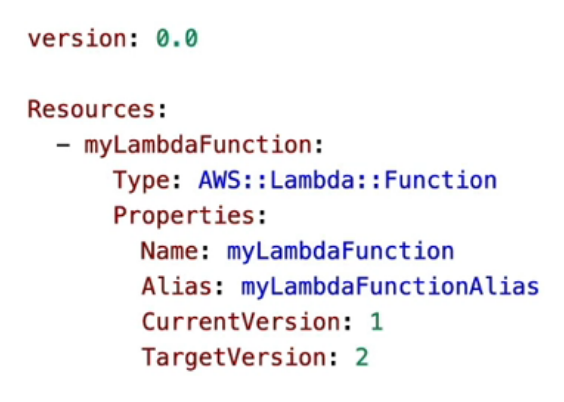

## Lambda Container Images

- Docker images up to **10 GB** in size from ECR can be deployed on Lambda.
- Base image (in `Dockerfile`) must implement the **Lambda Runtime API**. Base images are available for **Python**, **NodeJS**, **Java**, **.NET**, **Go** and **Ruby**.
- We can create custom images, as long as they implement the Lambda Runtime API.
    
    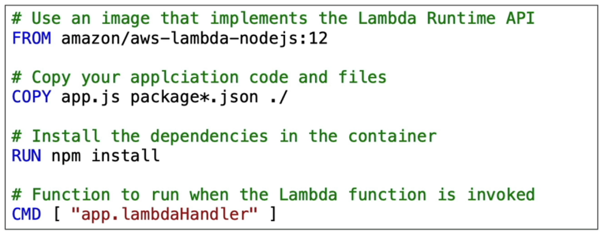
    
- Built container images can be tested locally using **Lambda Runtime Interface Emulator**
- Ease of shipping FaaS code as container images
- The lambda function and the ECR repo must be in the same AWS account.
- Best practices for building container images:
    - Use AWS-provided Base Images as they are stable and cached by Lambda service
    - Multi-Stage Builds: copy the built artifact and discard the build stage
    - Build from Stable to Frequently Changing layers as we go down the `Dockerfile`
    - Use a Single Repository for Functions with Large Layers (to take advantage of layer caching in Docker)

## Versions

- When we work on a Lambda function we work on its unpublished version `$LATEST` (mutable) which always has the latest code and configuration.
- When we publish a Lambda function, we create an **immutable version** of the function. We cannot modify the code or configuration of a lambda version. We must create a new incremental version.
- Each version gets a unique ARN and is independents of other immutable versions and the `$LATEST` version.
- Old versions of the Lambda function can also be accessed.

## Aliases

- **Pointers to Lambda function versions** (mutable)
- They provide a **stable endpoint** (does not keep changing with version)
- Multiple aliases can be created (eg. dev, test, prod), each pointing to a different version
- Canary deployment by assigning weights to different lambda versions for an alias
- **Aliases cannot reference other aliases**

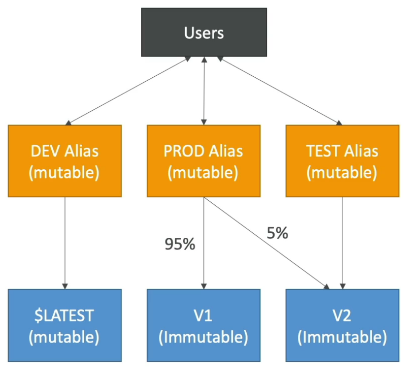

## Function URL

- **HTTPS endpoints for Lambda functions** (without using an API gateway or ALB)
- Function URL can only be generated for `$LATEST` (unpublished function version) and aliases. **It cannot be generated for published function versions.**
- A unique **static URL** is generated for each alias or `$LATEST` which can only be accessed from public internet.

### Security

- To access the URL from another domain, need to configure CORS
- **Resource-based policy -** control which accounts / CIDR / IAM principals can access the URL
    - Auth type: `NONE` - allow public and unauthenticated access
        
        <aside>
        💡 The function will be publicly accessible without requiring any additional authentication. However, **you still need to write custom authorization logic to verify the signature provided in the HTTP headers and ensure that the request is coming from a valid user.**
        
        </aside>
        
        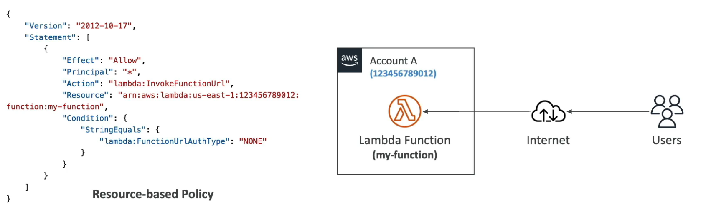
        
    - Auth type: `AWS_IAM` - use IAM to authenticate and authorize requests
        - Principal’s identity based policy is also evaluated (Principal should have `lambda:InvokeFunctionUrl` permission)
        - For same account access, either resource based or identity based policy should allow
        - For cross account access, both resource based and identity based policy should allow
        
        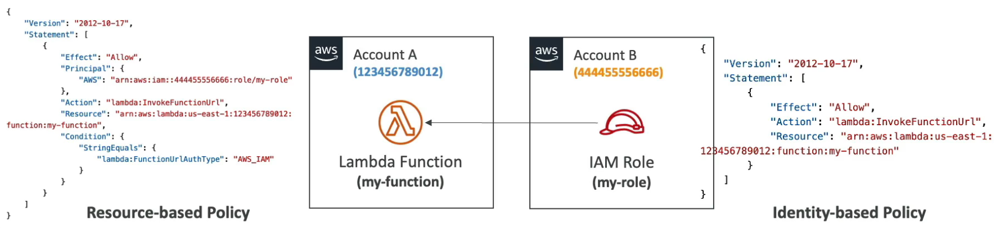
        

## Profiling using CodeGuru

- CodeGuru Profiler is integrated with Lambda to provide runtime performance
- Supported for Java and Python runtimes
- Just enable from the console
    - CodeGuru profiler is added to the function as a Lambda layer
    - Required environment variables are populated
    - `AmazonCodeGuruProfilerAgentAccess` policy is attached to the lambda function