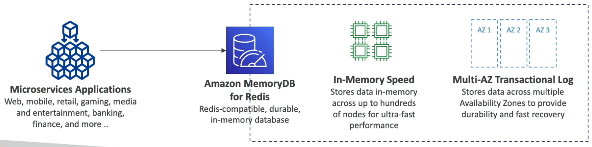

# MemoryDB for Redis

- Durable **in-memory DB with Redis-compatible API**
- Ultra-fast (160 millions req/sec)
- **Multi-AZ transaction log** (durability and fast recovery)
- Seamless scaling from 10 GB to 100 TB