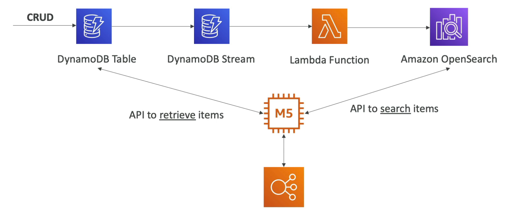
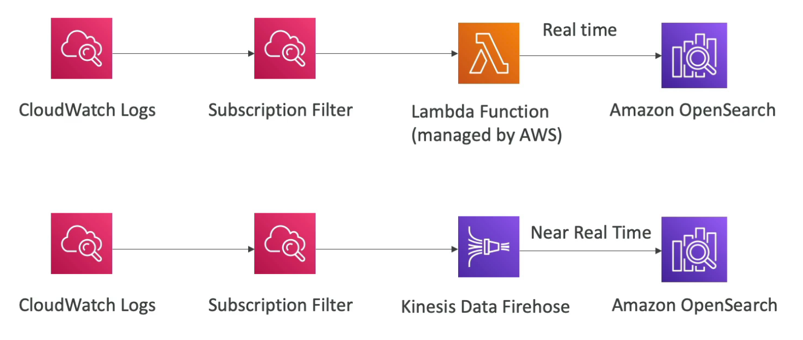
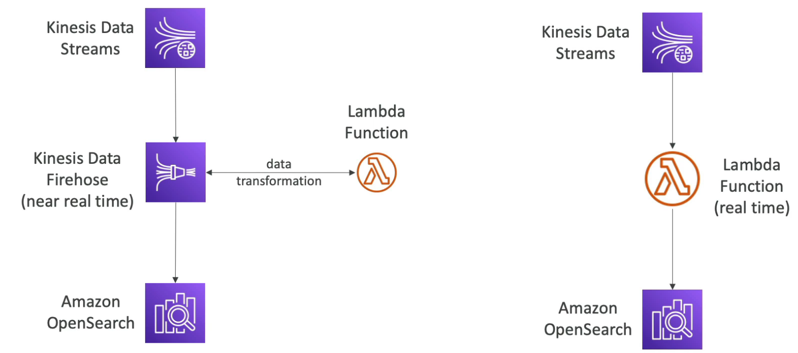

# OpenSearch

---

## Intro

- Successor to ElasticSearch (renamed due to some licensing issues)
- Used in combination with a database to perform **enhanced search operations on the database** (can search on any field, even supports **partial matches)**
- **Need to provision a cluster of instances** (pay for provisioned instances) (**not serverless**)
- Comes with **OpenSearch Dashboard** for visualization
- **Does not support SQL** (has its own query language)
- Supports **Multi-AZ**
- Used in Big Data
- Security through IAM, Cognito, KMS and TLS

## Patterns

### OpenSearch on DynamoDB

OpenSearch provides features like search on any column or partial matches and returns the item IDs that will be used to fetch items from the main table.

### OpenSearch on CloudWatch Logs

Subscription filter is used to get logs in real time which can be pushed in real time using a Lambda function or near real time using KDF. This provides advanced search capabilities on the logs.

### OpenSearch on Kinesis

