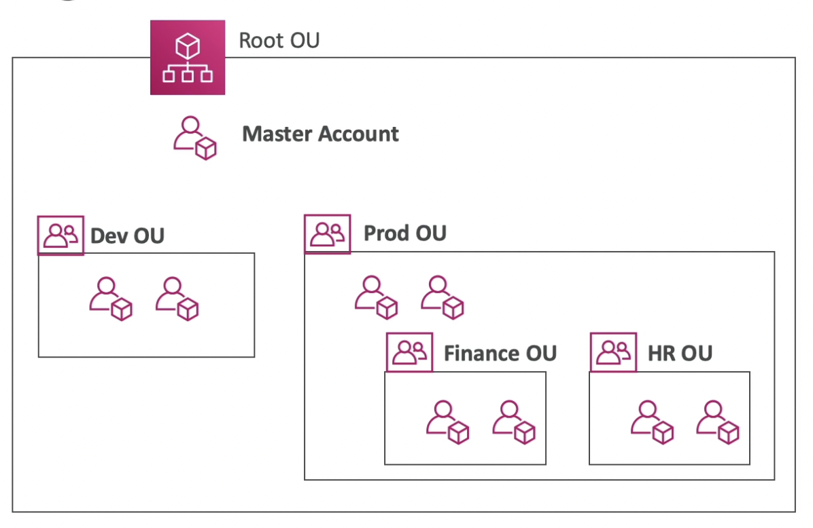

# Organizations

---

## Intro

- **Global service**
- Manage multiple AWS accounts under an organization
    - one master account
    - multiple member accounts
- **An AWS account can only be part of one organization**
- **Consolidated Billing** across all accounts (lower cost)
- Pricing benefits from aggregated usage of AWS resources
- API to automate AWS account creation (on demand account creation)
- Establish Cross Account Roles for Admin purposes where the master account can assume an admin role in any of the children accounts

## Organizational Units (OU)

- Folders for grouping AWS accounts of an organization (can be nested)

## Service Control Policies (SCP)

- **Whitelist or blacklist IAM actions at the OU or Account level**
- **Does not apply to the Master Account**
- Applies to all the Users and Roles of the member accounts, including the root user. So, if something is restricted for that account, even the root user of that account won’t be able to do it.
- SCP can be configured as either:
    - **Allow List**: actions are denied by default, specify allowed actions
    - **Deny List**: actions are allowed by default, specify denied actions
- **Does not apply to service-linked roles**
- **Explicit Deny** has the highest precedence

## Migrating Accounts between Organizations

- To migrate member accounts from one organization to another
    1. Remove the member account from the old organization
    2. Send an invite to the member account from the new organization
    3. Accept the invite from the member account
- To migrate the master account
    1. Remove the member accounts from the organizations using procedure above
    2. Delete the old organization
    3. Repeat the process above to invite the old master account to the new org