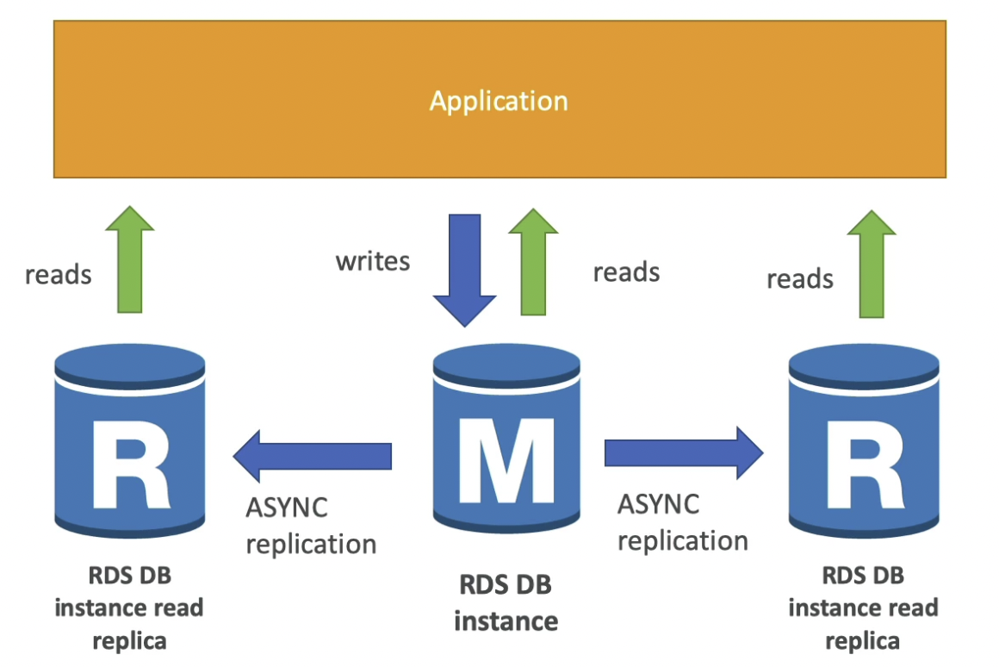
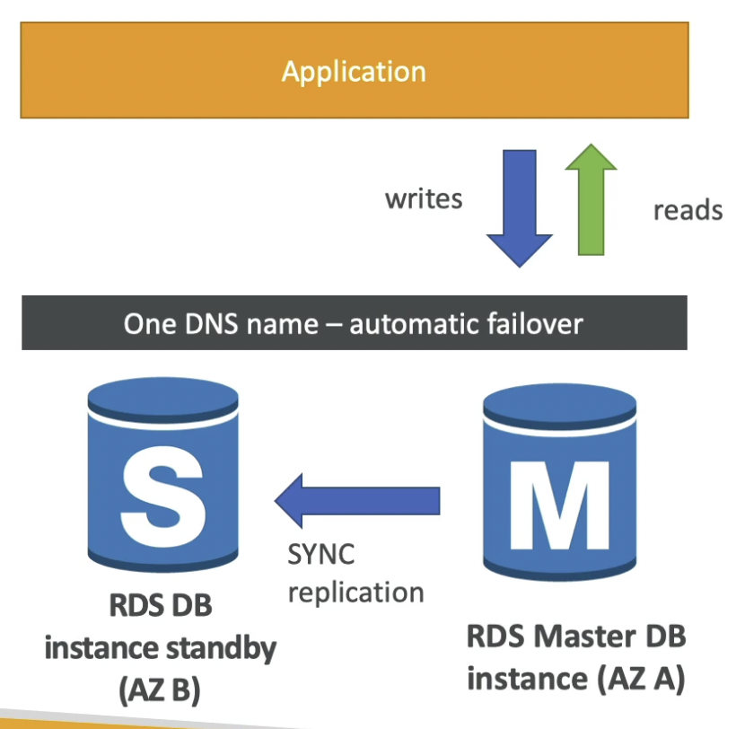
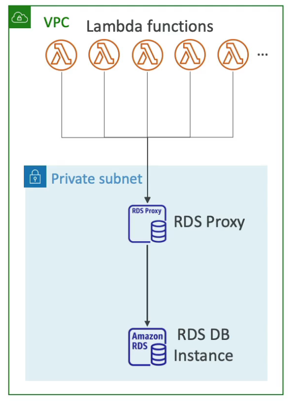
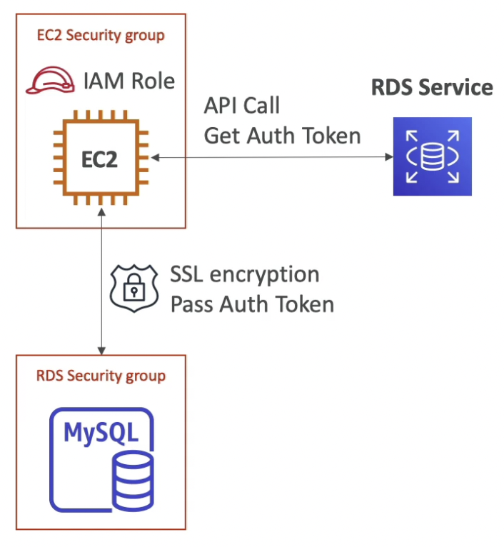

# RDS

---

## Intro

- Regional Service
- Supports Multi AZ
- AWS Managed SQL Database
- Supported Engines
    - Postgres
    - MySQL
    - MariaDB
    - Oracle
    - Microsoft SQL Server
    - Aurora (AWS Proprietary database)
- **Backed by EC2 instances with EBS storage**
- We don't have access to the underlying instance (cannot SSH into it)
- **DB connection is made on port 3306**
- SG is used for network security (must allow incoming TCP traffic on port 3306 from specific IPs)

## Backups

- **Automated Backups** (enabled by default)
    - Daily full backup of the database (during the defined maintenance window)
    - Backup retention: 7 days (max 35 days)
    - **Transaction logs** are backed-up every **5 minutes** for **Point In Time Recovery (PITR)**
    - **Automated backups happen in the same region** (can happen in multiple AZs in a multi-AZ deployment)
- **DB Snapshots**:
    - Manually triggered
    - Backup retention: unlimited
    - **Snapshots can be saved across regions**

## Auto Scaling

- Automatically scales the RDS storage within the max limit
- Condition for automatic storage scaling:
    - Free storage is less than 10% of allocated storage
    - Low-storage lasts at least 5 minutes
    - 6 hours have passed since last modification

## Read Replicas

- Allows us to scale the read operation (SELECT) on RDS
- **Up to 5 read replicas** (within AZ, cross AZ or cross region)
- **Asynchronous Replication** (seconds)
- **Replicas can be promoted to their own DB**
- **Applications must update the connection string to leverage read replicas**

- Network fee for replication
    - Same region: free
    - Cross region: paid

<aside>
💡 You can create a read replica as a Multi-AZ DB instance. A standby of the replica will be created in another AZ for failover support for the replica.

</aside>

## Multi AZ

- Increase availability of the RDS database by replicating it to another AZ
- **Synchronous Replication**
- **Connection string does not require to be updated** (both the databases can be accessed by one DNS name, which allows for automatic DNS failover to standby database)
- When failing over, **RDS flips the CNAME** record for the DB instance to point at the standby, which is in turn promoted to become the new primary.

- **Cannot be used for scaling as the standby database cannot take read/write operation while the master database is still active.**

## RDS Proxy

- **Serverless**, auto-scaling, **multi-AZ** proxy for RDS
- The applications connect to the RDS proxy instead of connecting directly to the RDS. The **RDS proxy pools and shares DB connections among the applications**.
- Reduces CPU and RAM requirements of the DB when a large number of applications need to connect to the DB
- **Minimizes open connections and timeouts**
- **DB failover is handled by RDS proxy** (reduces failover time by up to 66%)
- Supports **RDS (MySQL, PostgreSQL, MariaDB)** and **Aurora (MySQL, PostgreSQL)**

- **No code changes required** (just update the connection URL)
- **Allows to enforce IAM DB Auth** (credentials can be stored in Secrets Manager)
- **RDS Proxy can only be accessed from within the VPC**

## Encryption

- **At rest encryption**
    - KMS AES-256 encryption
    - Encrypted DB ⇒ Encrypted Snapshots, Encrypted Replicas and vice versa
- **In flight encryption**
    - **SSL certificates**
    - Force all connections to your DB instance to use SSL by setting the `rds.force_ssl` parameter to `true`
    - To enable encryption in transit, download the **AWS-provided root certificates** and use them when connecting to DB
- To encrypt an un-encrypted RDS database:
    - Create a snapshot of the un-encrypted database
    - Copy the snapshot and enable encryption for the snapshot
    - Restore the database from the encrypted snapshot
    - Migrate applications to the new database, and delete the old database
- To create an encrypted cross-region read replica from a non-encrypted master:
    - Encrypt a snapshot from the unencrypted master DB instance
    - Create a new encrypted master DB instance
    - Create an encrypted cross-region Read Replica from the new encrypted master

## Access Management

- Username and Password can be used to login into the database

- EC2 instances & Lambda functions should access the DB using **IAM DB Authentication** (**AWSAuthenticationPlugin** with **IAM**) - **token based access**
    - EC2 instance or Lambda function has an IAM role which allows is to make an API call to the RDS service to get the **auth token** which it uses to access the MySQL database.
    - Only works with **MySQL** and **PostgreSQL**
    - Auth token is valid for **15 mins**
    - Network traffic is encrypted in-flight using SSL
    - **Central access management using IAM** (instead of doing it for each DB individually)

- EC2 & Lambda can also get DB credentials from Parameter Store to authenticate to the DB - **credentials based access**

## RDS Events

- RDS events only provide operational events on the DB instance (not the data)
- To capture data modification events, use **native functions** or **stored procedures** to invoke a **Lambda** function.

## Monitoring

- **CloudWatch Metrics for RDS**
    - Gathers metrics from the **hypervisor** of the DB instance
        - CPU Utilization
        - Database Connections
        - Freeable Memory
- **Enhanced Monitoring**
    - Gathers metrics from an agent running on the RDS instance
        - OS processes
        - RDS child processes
    - Used to monitor different **processes or threads on a DB instance** (ex. percentage of the CPU bandwidth and total memory consumed by each database process in your RDS instance

## Logging

- **Error Logs** - enabled by default
- **Slow Query Logs** - logs queries that took longer to execute (can be enabled)
- **General Logs** - can be enabled
- **Audit Logs** - can be enabled

## Maintenance & Upgrade

Any database engine level upgrade for an RDS DB instance, with Multi-AZ deployment, triggers both the primary and standby DB instances to be upgraded at the same time. This causes **downtime** until the upgrade is complete. This is why it should be done during the maintenance window.

## Misc

- RDS supports using **Transparent Data Encryption (TDE)** to encrypt stored data on your DB instances running Microsoft SQL Server. TDE automatically encrypts data before it is written to storage, and automatically decrypts data when the data is read from storage.