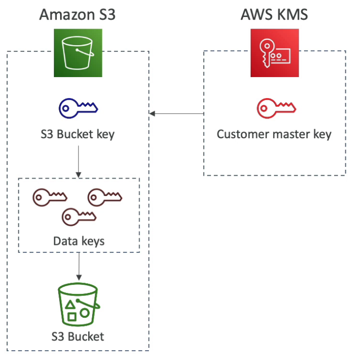
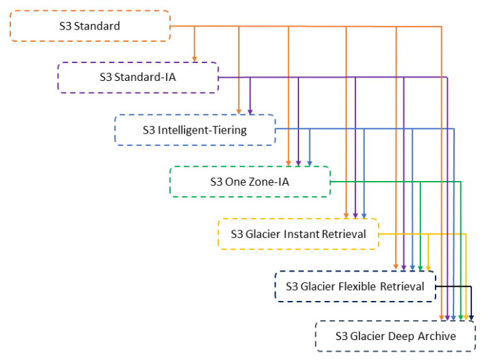
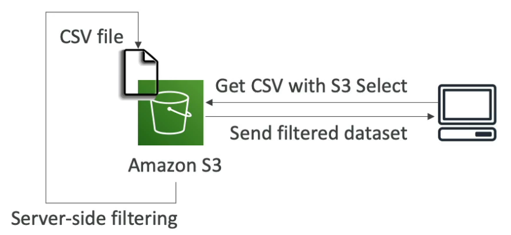
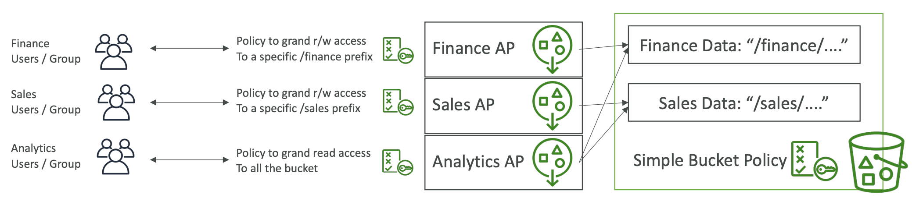
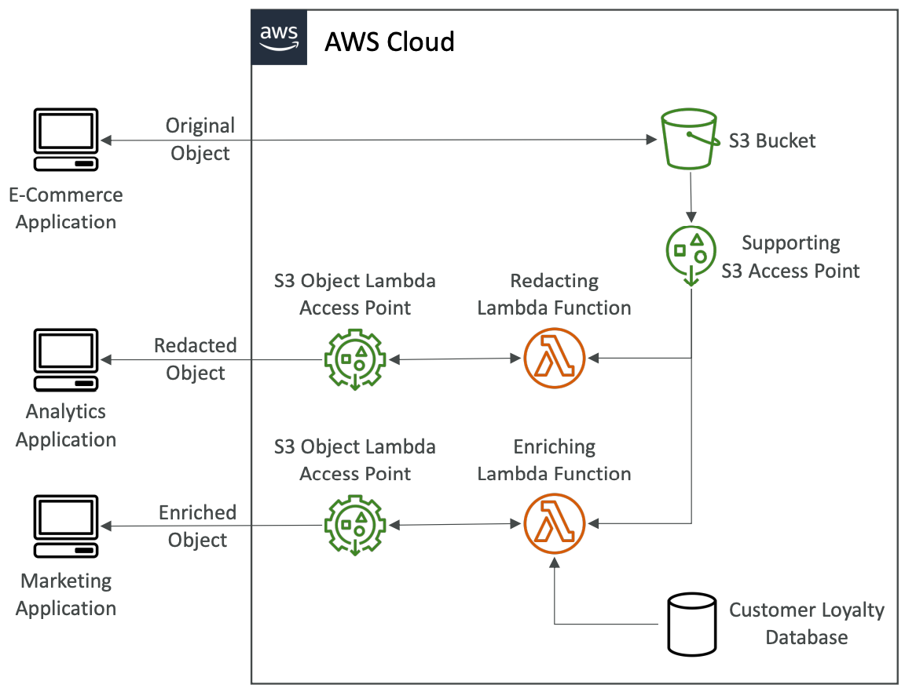
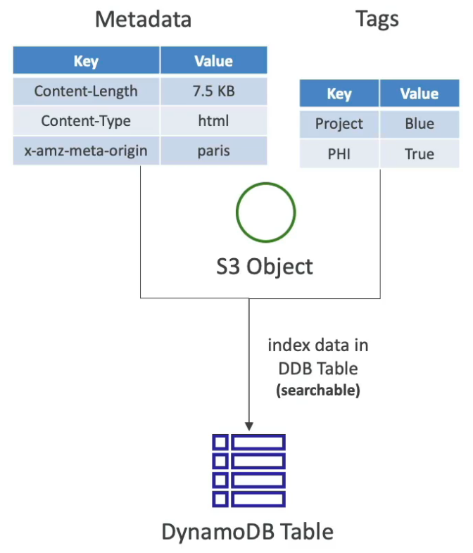
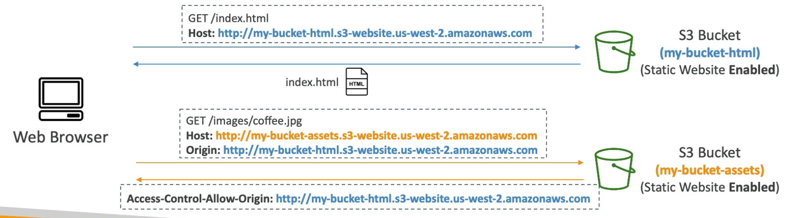

# S3

---

## Intro

- Global Service
- Object store (key-value pairs)
- Buckets must have a globally unique name
- **Buckets are defined at the regional level**
- Objects have a key (full path to the object):
`s3://my_bucket/my_folder/another_folder/my_file.txt`
- The key is composed of bucket + *prefix* + **object name**
`s3://my_bucket*/my_folder/another_folder/***my_file.txt**`
- There’s no concept of directories within buckets (just keys with very long names that contain slashes)
- **Max Object Size: 5TB**
- Durability: 99.999999999% (total 11 9's)

<aside>
💡 S3 delivers **strong read-after-write consistency** (if an object is overwritten and immediately read, S3 always returns the latest version of the object). However, **bucket configuration is eventually consistent** (if you delete a bucket and immediately list all buckets, the deleted bucket might still appear in the list).

</aside>

## Bucket Versioning

- Enabled at the bucket level
- Protects against unintended deletes
- Ability to restore to a previous version
- Any file that is not versioned prior to enabling versioning will have version `null`
- Suspending versioning does not delete the previous versions, just disables it for the future
- To restore a deleted object, delete it's **delete marker**

<aside>
💡 Versioning can only be suspended once it has been enabled. Once you version-enable a bucket, it can never return to an un-versioned state.

</aside>

## Encryption

### Encryption at Rest

- Can be enabled at the bucket level or at the object level
- **Server Side Encryption (SSE)**
    - **SSE-S3**
        - Keys managed by S3
        - AES-256 encryption
        - HTTP or HTTPS can be used
        - Must set header: `"x-amz-server-side-encryption": "AES256"`
    - **SSE-KMS**
        - Keys managed by KMS
        - HTTP or HTTPS can be used
        - KMS provides control over who has access to what keys as well as audit trails
        
        - Envelope encryption is used in this case. The user uploading the file must have `kms:GenerateDataKey` permission.
        - Decreases API calls made to KMS (and hence cost) by 99% (recommended if a a lot of objects have to be encrypted in S3)
        - Less KMS events in CloudTrail
        - Headers to be set
            - `"x-amz-server-side-encryption": "aws:kms"`
            - `x-amz-server-side-encryption-aws-kms-key-id`
        
        
        
    - **SSE-C**
        - Keys managed by the client
        - Client sends the key in HTTPS headers for encryption/decryption (S3 discards the key after the operation)
        - **If the client loses the key, they cannot decrypt the object**
        - **HTTPS must be used** as key (secret) is being transferred
        - Headers to be set
            
            Must provide the following request headers:
            
            - `x-amz-server-side-encryption-customer-algorithm` - This header specifies the encryption algorithm. The header value must be `AES256`.
            - `x-amz-server-side-encryption-customer-key` ****- This header provides the 256-bit, base64-encoded encryption key for Amazon S3 to use to encrypt or decrypt your data.
            - `x-amz-server-side-encryption-customer-key-MD5` ****- This header provides the base64-encoded 128-bit MD5 digest of the encryption key according to RFC 1321. Amazon S3 uses this header for a message integrity check to ensure the encryption key was transmitted without error.
- **Client Side Encryption**
    - Keys managed by the client
    - Client encrypts the object before sending it to S3 and decrypts it after retrieving it from S3

<aside>
💡 **Enforcing Encryption:**

- **Default encryption**: encrypt the files using the default encryption (specify the encryption for the file while uploading to override the default)
- Bucket policy can be used to force a specific type of encryption on the objects uploaded to S3
</aside>

### Encryption in Transit

- Enforce HTTPS connection by creating an S3 bucket policy that denies incoming request where `SecureTransport` is `false`

## Access Management

- **User based security**
    - IAM policies define which API calls should be allowed for a specific user
    - Preferred over bucket policy for **fine-grained access control**
- **Resource based security (Bucket Policy)**
    - Grant **public access** to the bucket
    - Force objects to be encrypted at upload
    - Cross-account access
    - Object Access Control List (ACL) - applies to the objects while uploading
    - Bucket Access Control List (ACL) - access policy that applies to the bucket
- **Pre-signed URL (Query String Authentication)**

<aside>
💡 An IAM principal can access an S3 object if the IAM permission allows it or the bucket policy allows it and there is no explicit deny.

</aside>

<aside>
💡

By default, an S3 object is owned by the account that uploaded it even if the bucket is owned by another account. To get full access to the object, the object owner must explicitly grant the bucket owner access. As a bucket owner, you can create a bucket policy to require external users to grant `bucket-owner-full-control` when uploading objects so the bucket owner can have full access to the objects.

</aside>

## S3 Static Websites

- Host static websites (may contain **client-side scripts**) and have them accessible on the public internet over **HTTP only** (for HTTPS, use CloudFront with S3 bucket as the origin)
- The website URL will be either of the following:
    - `<bucket-name>.s3-website-<region>.amazonaws.com`
    - `<bucket-name>.s3-website.<region>.amazonaws.com`
- If you get a `403 Forbidden` error, make sure the bucket policy allows public reads
- For cross-origin access to the S3 bucket, we need to enable CORS on the bucket

<aside>
💡

To host an S3 static website on a custom domain using Route 53, the bucket name should be the same as your domain or subdomain. Ex. for subdomain `portal.tutorialsdojo.com`, the name of the bucket must be `portal.tutorialsdojo.com`

</aside>

## MFA Delete

- MFA required to
    - permanently delete an object version
    - suspend versioning on the bucket
- **Bucket Versioning must be enabled**
- Can only be enabled or disabled by the root user

## Access Logs

- Most detailed way of logging access to S3 buckets
- Does not support **Data Events** & **Log File Validation** (use CloudTrail for that)
- Store S3 access logs into another bucket
- Logging bucket should not be the same as monitored bucket (logging loop)

## CloudTrail Logging

- Bucket level API access logs enabled by default
- Object level API access logs not enabled by default
- Bucket owner needs to be the object owner to get object access logs

## Replication

- **Asynchronous replication**
- Objects are replicated with the **same version ID** and tags
- Supports **cross-region** and **cross-account** replication
- **Versioning must be enabled for source and destination buckets**
- For DELETE operations:
    - Replicate delete markers from source to target (optional)
    - Permanent deletes are not replicated
- There is **no chaining of replication**. So, if bucket 1 has replication into bucket 2, which has replication into bucket 3. Then objects created in bucket 1 are not replicated to bucket 3.
- **Lifecycle actions are not replicated**
- **Can be configured at the S3 bucket level, prefix level, or object level using S3 object tags**

## Pre-signed URL

- Pre-signed URLs for S3 have temporary access token as query string parameters which allow anyone with the URL to temporarily access the resource before the URL expires (default 1h)
- Pre-signed URLs inherit the permission of the user who generated it
- Uses:
    - Allow only logged-in users to download a premium video
    - Allow users to upload files to a precise location in the bucket

## Storage Classes

- Data can be transitioned between storage classes manually or automatically using lifecycle rules
- Data can be put directly into any storage class
- **Standard**
    - **99.99% availability**
    - Most expensive
    - Instant retrieval
    - No cost on retrieval (only storage cost)
    - For frequently accessed data
- **Infrequent Access**
    - For data that is infrequently accessed, but requires rapid access when needed
    - Lower storage cost than Standard but **cost on retrieval**
    - Can **move data into IA from Standard only after 30 days**
    - Two types:
        - **Standard IA**
            - **99.9% Availability**
        - **One-Zone IA**
            - **99.5% Availability**
            - Data is lost if AZ fails
            - Storage for infrequently accessed data that can be easily recreated
- **Glacier**
    - For data archival
    - Cost for storage and retrieval
    - **Can move data into Glacier from Standard anytime**
    - **Objects cannot be directly accessed, they first need to be restored** which could take some time (depending on the tier) to fetch the object.
    - **Default encryption for data at rest and in-transit**
    - Three types:
        - **Glacier Instant Retrieval**
            - **99.9% availability**
            - Millisecond retrieval
            - Minimum storage duration of **90 days**
            - Great for data accessed once a quarter
        - **Glacier Flexible Retrieval**
            - **99.99% availability**
            - 3 retrieval flexibility (decreasing order of cost):
                - Expedited (1 to 5 minutes)
                    - Can **provision retrieval capacity** for reliability
                    - Without provisioned capacity expedited retrievals might be rejected in situations of high demand
                - Standard (3 to 5 hours)
                - Bulk (5 to 12 hours)
            - Minimum storage duration of **90 days**
        - **Glacier Deep Archive**
            - **99.99% availability**
            - 2 flexible retrieval:
                - Standard (12 hours)
                - Bulk (48 hours)
            - Minimum storage duration of **180 days**
            - Lowest cost
- **Intelligent Tiering**
    - **99.9% availability**
    - Moves objects automatically between Access Tiers based on usage
    - Small monthly monitoring and auto-tiering fee
    - **No retrieval charges**

### Moving between Storage Classes

In the diagram below, transition can only happen in the downward direction

## Lifecycle Rules

- Used to automate transition or expiration actions on S3 objects
- **Transition Action** (transitioned to another storage class)
- **Expiration Action** (delete objects after some time)
    - delete a version of an object
    - delete incomplete multi-part uploads
- Lifecycle Rules can be created for the bucket or prefix (ex `s3://mybucket/mp3/*`) or object tags (ex Department: Finance)

## S3 Analytics

- Provides analytics to determine when to transition data into different storage classes
- **Does not work for ONEZONE_IA & GLACIER**

## Performance

- 3,500 PUT/COPY/POST/DELETE and 5,500 GET/HEAD requests per second per prefix
- Recommended to **spread data across prefixes for maximum performance**
- SSE-KMS may create bottleneck in S3 performance
- Performance Optimizations
    - **Multi-part Upload**
        - parallelizes upload
        - **recommended for files > 100MB**
        - **must use for files > 5GB**
        - To perform a multipart upload with encryption using a KMS customer master key (CMK), the requester must have permission to the **`kms:Decrypt`**  and **`kms:GenerateDataKey*`** actions on the key. These permissions are required because Amazon S3 must decrypt and read data from the encrypted file parts before it completes the multipart upload.
    - **Byte-range fetches**
        - Parallelize download requests by fetching specific byte ranges in each request
        - Better resilience in case of failures since we only need to refetch the failed byte range and not the whole file
    - **S3 Transfer Acceleration**
        - Speed up **upload and download** for **large objects (>1GB)** for **global users**
        - Data is ingested at the nearest edge location and is transferred over AWS private network (uses CloudFront internally)

## S3 Notification Events

- Optional
- Generates events for operations performed on the bucket or objects
- Object name filtering using prefix and suffix matching
- **For the same combination of prefix and event type, we can only have one event rule.** Example: we can send S3 notification for object created at `/files` to only one destination (single rule).
- Targets
    - SNS topics
    - **SQS Standard** queues (not FIFO queues)
    - Lambda functions

## S3 Select

- Select a subset of data from S3 using **SQL queries** (**server-side filtering**)
- If the file is stored in S3 Glacier, it is called **Glacier Select**
- Less network cost
- Less CPU cost on the client-side

## S3 Access Points

**It simplifies managing access to objects stored in the S3 buckets when the complexity of access pattern grows.** It allows having a simple bucket policy and moving the complexity of defining access at the access point level using **Access Point Policies**. 

**Each Access Point has a unique DNS name (public or private)** through which it can be accessed. In case of a private DNS name, it can be reached through a **VPC Interface Endpoint**. The VPC endpoint policy must allow access to the target bucket and access point.

**Example:** If Finance and Sales teams need to have read and write access to `/finance` and `/sales` objects stored in the bucket whereas the Analytics team needs read access to both of these prefixes. Instead of using bucket policy to manage access for all these sets of users, we can create access points for Finance, Sales and Analytics teams. The finance access point will have a policy to allow read/write access to `/finance` prefix; similarly for sales access point. The analytics access point will have a policy to allow read access to the entire bucket.

## S3 Object Lambda

**It allows us to modify the object dynamically, using a Lambda function, when it is fetched.** The application queries the **S3 Object Lambda Access Point** which invokes the Lambda function to fetch the object from an S3 Access Point and make the required modifications. 

Use cases:

- Redacting PII during analytics
- Resizing and watermarking images

## Object Metadata & Tags

- Object Metadata
    - Metadata (key-value pairs) about the objects stored in S3
    - Some metadata is defined by AWS
    - User-defined metadata keys must begin with `x-amz-meta-` and are stored in **lowercase** format.
- Object Tags
    - Tags (key-value pairs) for objects in S3
    - Used to group objects to provide **fine-grained access control** and run **analytics**
- **Cannot search on metadata or tags directly in S3** (need to build a search index in an external DB)

## Security

- `aws:SecureTransport` - policy condition to enforce SSL requests to objects stored in an S3 bucket
- If the client-side JS in an S3 website fetches some resource from another origin (hosted on S3), CORS needs to be enabled in the bucket containing the assets to allow requests from all origins (or selected origin). `MaxAgeSeconds` is used as the TTL for browser to cache the pre-flight response.
    
    
    

## Misc

- If two writes are made to a single non-versioned object at the same time, it is possible that only a single event notification will be sent. If you want to ensure that an event notification is sent for every successful write, you can enable versioning on your bucket. With versioning, every successful write will create a new version of your object and will also send event notification.
- To ensure SSE-KMS on the bucket, add a bucket policy which denies any `s3:PutObject` action unless the request includes the `x-amz-server-side-encryption` header.
- `x-amz-server-side-encryption-aws-kms-key-id` header is used to enforce SSE-KMS using a specific KMS key.
- **S3 Object Ownership** setting can be used to make the bucket owner default owner of uploaded objects in the bucket.