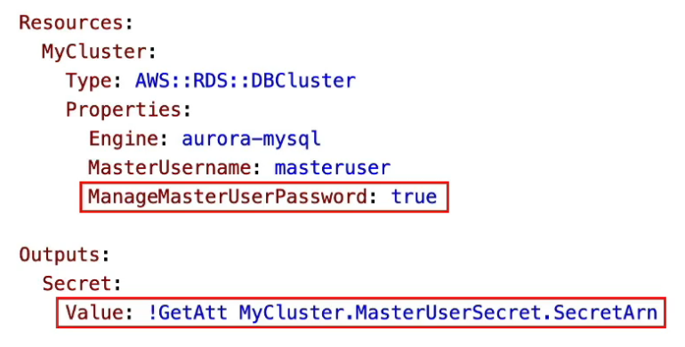
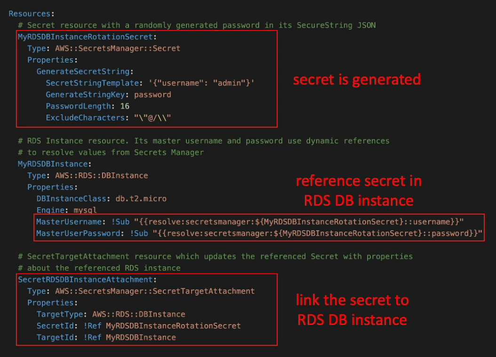

# Secrets Manager

---

## Intro

- For storing secrets only
- **Mandatory encryption** using KMS
- **Each secret can have multiple key-value pairs**
- **Ability to force rotation of secrets every n days** (not available in Parameter Store)
- **Well integrated with SQL databases** like MySQL, PostgreSQL, RDS and Aurora to store DB username and password
- **Automated secret rotation using Lambda** (needs IAM permission)
- Mostly used for **RDS authentication**
    - need to specify the username and password to access the database
    - link the secret to the database to allow for automatic rotation of database login info
- Can create custom secrets
- **Secrets are retained after deletion for 7 - 30** (default) days (waiting period)

## Integration with RDS & Aurora using CloudFormation

### Method 1

- Setting `ManageMasterUserPassword: True` for RDS & Aurora creates admin secret automatically
- The secret ARN can be retrieved using the `!GetAtt` func

### Method 2

- Create a secret in the CloudFormation template and reference it in the RDS or Aurora DB

