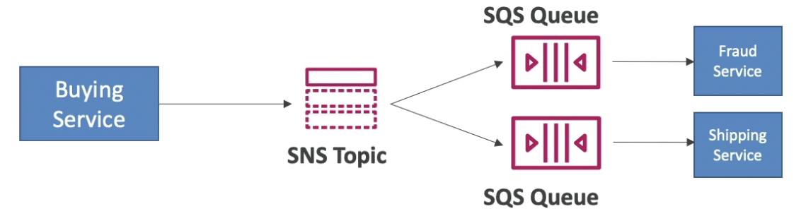

# SNS

---

## Intro

- Used to broadcast messages
- Pub-Sub model (publisher publishes messages to a topic, subscribers listen to the topic)
- Instant message delivery (does not queue messages)

## Encryption

- In-flight encryption by default using HTTPS API
- At-rest encryption using KMS keys (optional)
- Client-side encryption

## Access Management

- **lAM policies** to regulate access to the SNS API
- **SNS Access Policies** (resource based policy)
    - Used for cross-account access to SNS topics
    - Used for allowing other AWS services to publish to an SNS topic

## Standard Topics

- Highest throughput
- At least once message delivery
- Best effort ordering
- Subscribers can be:
    - SQS queues
    - HTTP / HTTPS endpoints
    - Lambda functions
    - Emails (using SNS)
    - SMS & Mobile Notifications
    - **KDF** to send the data into S3 or Redshift

## FIFO Topics

- Guaranteed ordering of messages in that topic
- Publishing messages to a FIFO topic requires:
    - **Group ID**: messages will be ordered and grouped for each group ID
    - **Message deduplication ID**: for deduplication of messages
- **Can only have SQS FIFO queues as subscribers**
- **Limited throughput (same as SQS FIFO)** because only SQS FIFO queues can read from FIFO topics
- **The topic name must end with** `.fifo`

## SNS + SQS Fanout Pattern

- Fully decoupled, no data loss
- SQS allows for: data persistence, delayed processing and retries of work
- Make sure your SQS queue access policy allows for SNS to write

## Message Filtering

- JSON policy used to filter messages sent to SNS topic’s subscriptions
- Each subscriber will have its own filter policy (if a subscriber doesn’t have a filter policy, it receives every message)
- Ex: filter messages sent to each queue by the order status