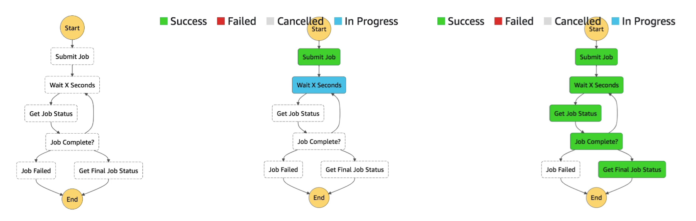
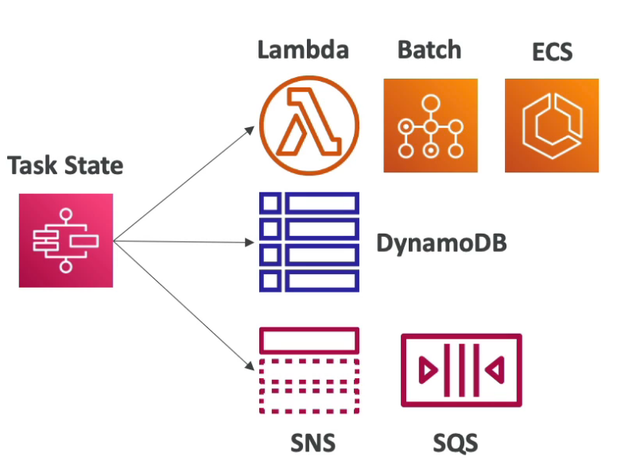
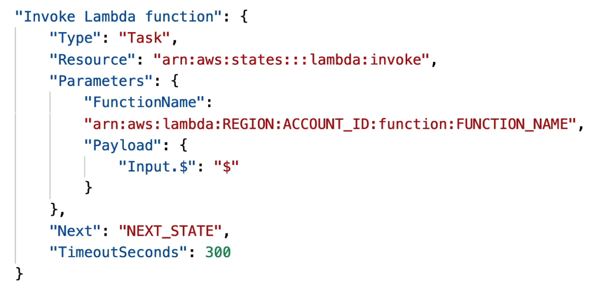
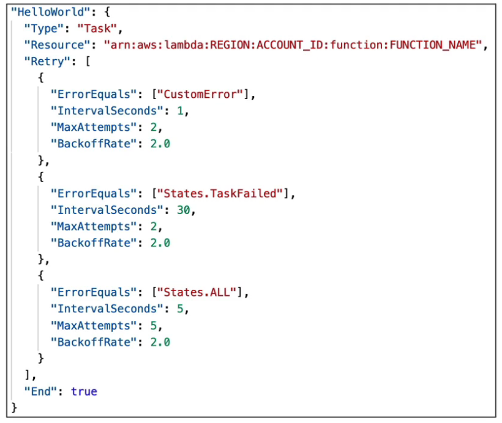
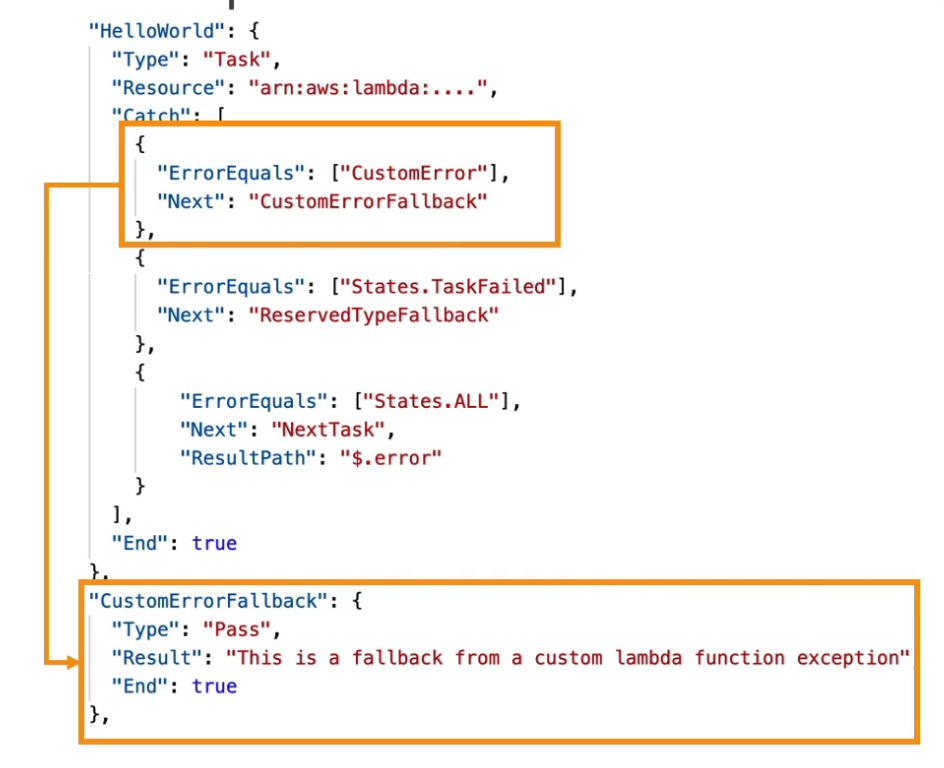
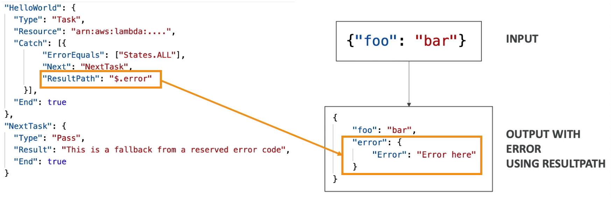
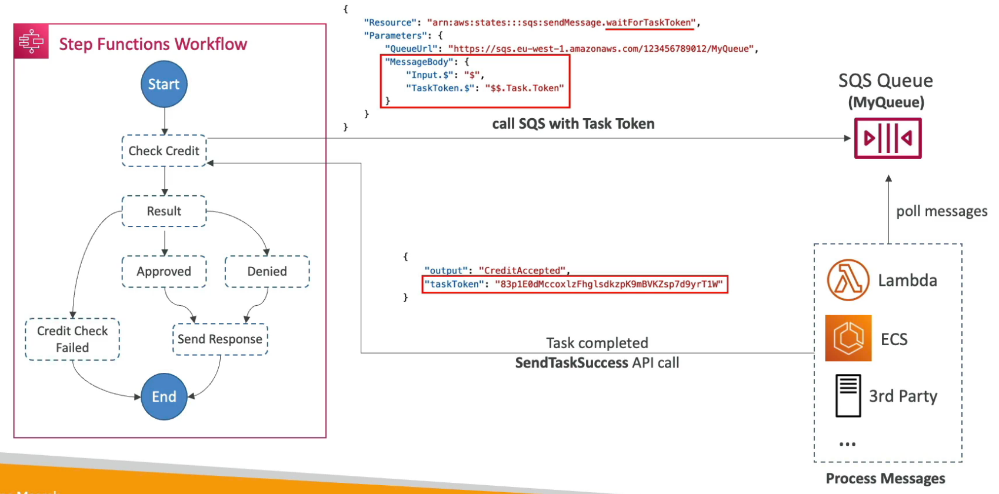
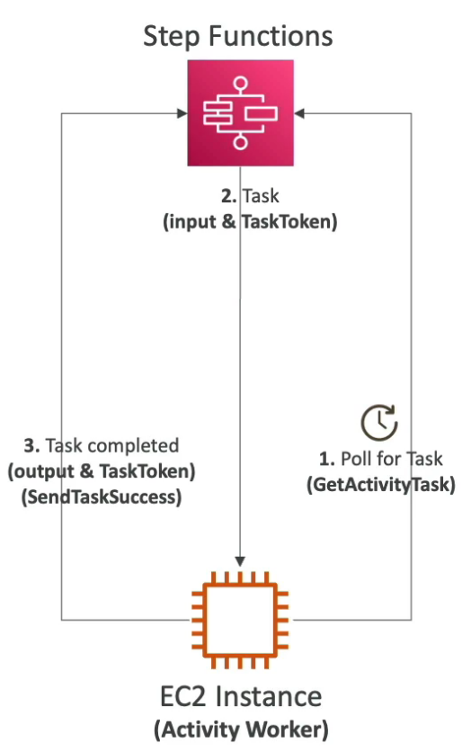
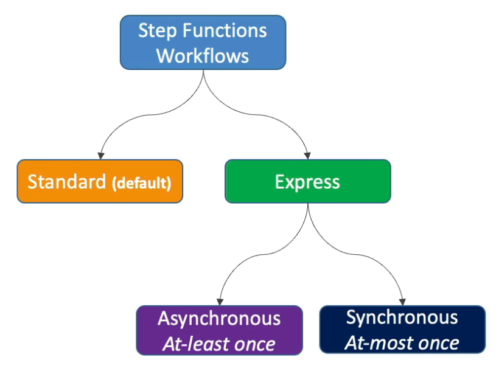

# Step Functions

---

## Intro

- **Serverless** workflow orchestration
- Model workflows as state machines (1 state machine per workflow)
- Written in JSON
- **Visual workflow execution**
- Execution event history shows the input and output of each step
- Step function has **amazing error handling capabilities** (can be offloaded from the application)

## Task

- Each task in the workflow could perform an action on an AWS service or launch another step function workflow.
- Task definition to invoke a Lambda function
    
    
    

## States

- **Choice State** - Test for a condition to send to a branch (or default branch)
- **Fail or Succeed State** - Stop execution with failure or success
- **Pass State** - Simply pass its input to its output or inject some fixed data
- **Wait State** - Provide a delay for a certain amount of time or until a specified time or date
- **Map State** - Dynamically iterate steps
- **Parallel State** - Begin parallel branches of execution (**asynchronous** execution)
- **Task State** - Run some code **synchronously**

## Error Handling

- Handle errors in the state machine instead of the application code. This makes the application logic simpler. Also, step functions provide execution history.
- Predefined error codes:
    - `States.ALL` - any error
    - `States.Timeout` -  task ran longer than `TimeoutSeconds` or no heartbeat received
    - `States.TaskFailed` - task execution failure
    - `States.Permissions` - insufficient privileges to execute code
- The state can also throw custom errors that can be caught in the step function (eg. a Lambda function throwing a custom error)

### Retry

- Retry failed state
- `Retry` block is evaluated top to bottom
- `BackoffRate` - what factor the `IntervalSeconds` should be multiplied with at each retry
- When `MaxAttempts` are reached, the `Catch` block kicks in

### **Catch**

- Transition to failed path
- `Catch` block is evaluated top to bottom
- After all the retries have been exhausted, the state function goes into `Catch`
- If the error is of X type, go to the next state Y.
- `ResultPath` - a path that determines what input is sent to the state specified in the `Next` field. Example: it can be used to send the error to the `Next` state.
    
    
    

## Wait for Task Token

- Used to integrate the workflow with an external task where the external task must finish the job before the workflow proceeds further.
- **Push-based** (the task pushes the work to the external application or worker which after completion invokes a callback API)
- The task is paused until it receives the callback (API call) with the `TaskToken`
- Append `.waitForTaskToken` to the `Resource` field to tell Step Functions to wait for the Task Token to be returned.
Example: `"Resource": "arn:aws:states:::sqs:sendMessage.waitForTaskToken"`
- **Working**: The step function is paused during the `Check Credit` task execution, where we pass the `TaskToken` to the external application (push to SQS). After the external application is done processing, it makes a `SendTaskSuccess` API call with the result of processing and the passed `TaskToken`. This means the external task was executed successfully and the step function can continue execution. If the external application fails to process, it makes a `SendTaskFailure` API call which is treated as task failed.
    
    
    

## Activity Tasks

- **Activity Workers** (running on any compute resource) poll the workflow for tasks using `GetActivityTask` API.
- If an activity worker gets a task, it will complete it and send the response of success or failure as `SendTaskSuccess` or `SendTaskFailure` API call.
- **Pull-based** (tasks are pulled by the Activity Workers)
- `TaskToken` is used to identify which task got completed (same way as in Wait for Task Token)
- To keep the Task active:
    - Configure `TimeoutSeconds` on the step function - how long the task will wait for the activity worker to complete (max 1 year)
    - Send heartbeats periodically from the activity worker to the task using `SendTaskHeartBeat` at an interval less than `HeartBeatSeconds` parameter (set in the step function).

## Workflow Types

### Standard Workflows (default)

- Max duration: 1 year
- Execution model: **Exactly-once Execution**
- Execution rate: Over 2,000 workflow executions per sec
- Execution history: **90 days in the console** (send to CloudWatch to retain for longer)
- Pricing: based on the number of state transitions
- Use cases: **Non-idempotent actions** (eg. payment processing)

### Express Workflows

- Max duration: 5 min
- Execution rate: Over 100,000 workflow executions per sec
- Execution history: Not available in the console (must use CloudWatch)
- Use cases: IoT data ingestion, streaming data, backend for apps, etc.
- Types:
    - **Asynchronous** Express Workflows
        - Execution model: **At-least Once Execution** (the operation must be idempotent because there could be retries)
        - When the workflow is invoked, it just starts and doesn’t return the result of computation.
        - Use cases: where we don’t need immediate response (eg. messaging services)
    - **Synchronous** Express Workflows
        - Execution model: **At-most Once Execution**
        - When the workflow is invoked, it completes it and returns the response.
        - Can be invoked from **API Gateway** or **Lambda function**