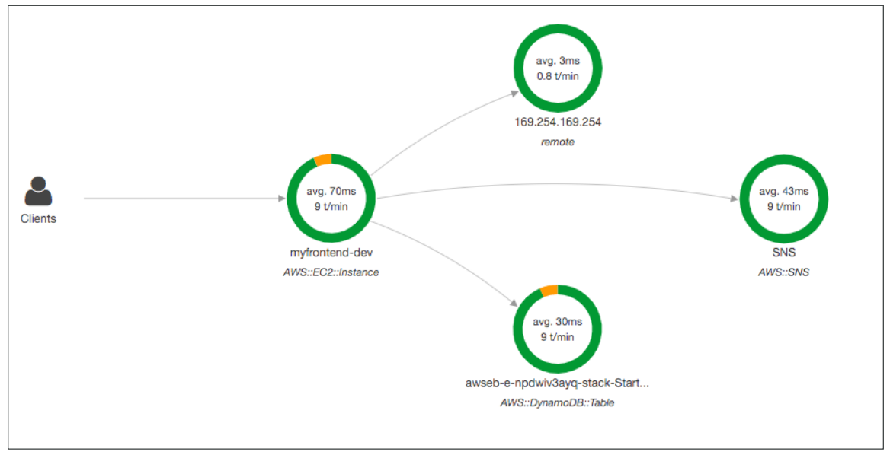
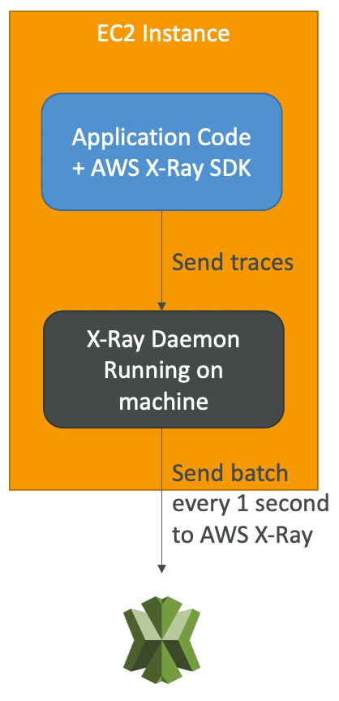
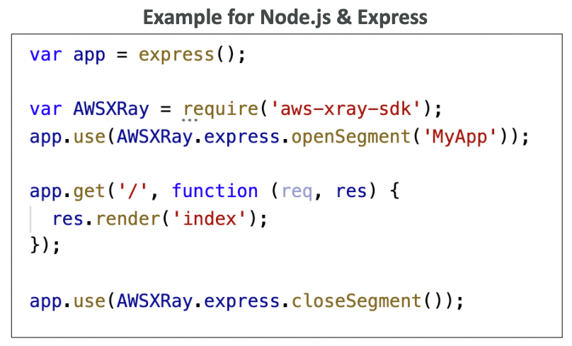
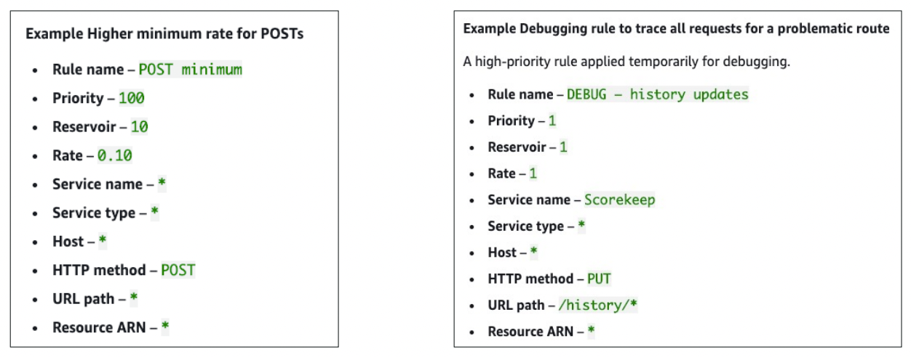
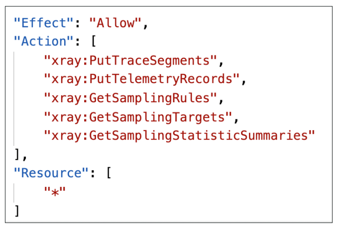
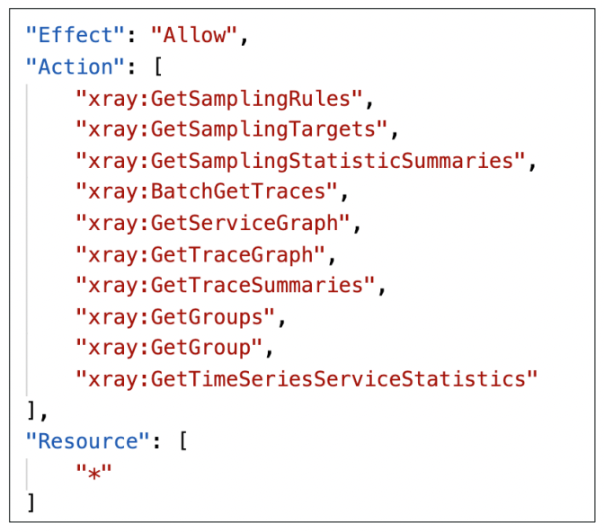
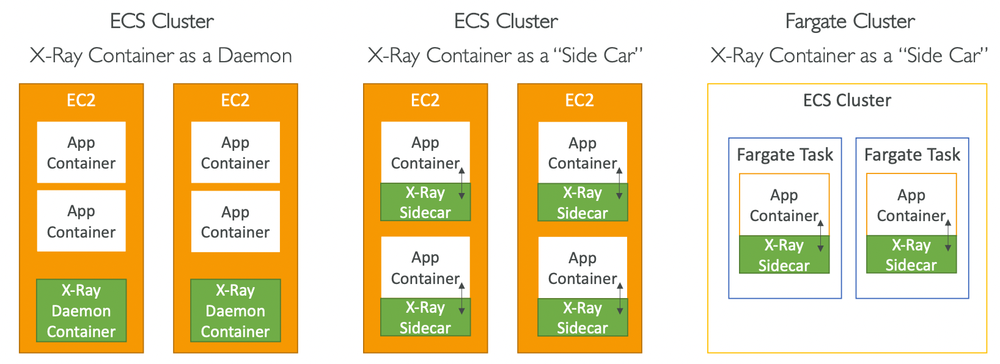
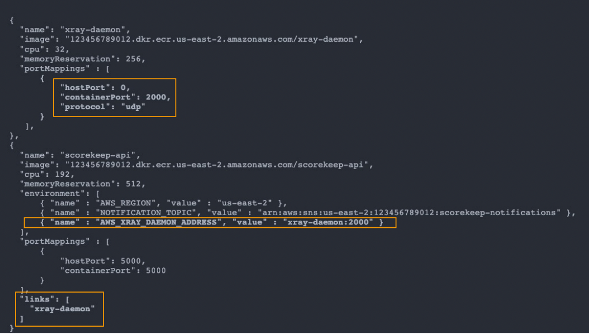

# X-Ray

---

## Intro

- **Provides tracing of requests as they travel through different AWS services** to
    - identify performance bottlenecks
    - pinpoint errors
    - understand dependencies in micro-services
- **Useful for micro-services (distributed) applications** where debugging is hard
- Ability to trace every request or a sample of requests
- Compatible with
    - Lambda
    - Elastic Beanstalk
    - ECS
    - ELB
    - API Gateway
    - EC2 instances or on-premise servers
- Security
    - IAM for authorization
    - KMS for encryption at rest
- Ability to **send traces across accounts** (allows to have a central account for application tracing)

## Enabling X-Ray

- Use the AWS **X-Ray SDK** in your code (little code modification)
- Install **X-Ray daemon** if your application is running on EC2 or on-premise server. For other services, enable X-Ray integration (X-Ray daemon is already running).
- Configure IAM permissions for the X-Ray daemon or AWS service to write data to X-Ray.

## How traces are sent

- X-Ray SDK captures calls to AWS services as well as other HTTP / HTTPS / Database / Queue calls.
- X-Ray SDK sends traces to X-Ray daemon through **UDP** on **port 2000** (configure port mappings and network settings in the task definition file to allow the application to communicate with the X-Ray daemon container)
- X-Ray daemon batches the traces and sends them to X-Ray service every second.

## X-Ray instrumentation in code

- Only configuration change is required in the code
- Can modify the application code to customize and annotate the traces sent by X-Ray SDK.

## Terminologies

- **Segments**: data sent by each application / service
- **Subsegments**: provide more granular timing information and details about downstream calls (to AWS services, HTTP API or an SQL DB) that your application makes to fulfill the original request.
- **Trace**: segments collected together to form an end-to-end trace
- **Annotations**: indexed key-value pairs attached to traces for search capability and filtering traces using **filter expressions**
- **Metadata**: non-indexed key-value pairs attached to traces

## Sampling

- Control the amount of data (traces) sent to X-Ray (to reduce cost)
- Sampling rules can be modified in the X-Ray console without changing the application code or restarting the application. The sampling rules are automatically applied to the X-Ray daemons.
- By **default**, the X-Ray SDK records the **first request each second** (**reservoir**), and **five percent of any additional requests** (**rate**).
- Custom sampling rules
    
    Smaller priority number ⇒ higher priority
    
    
    

## AWS managed IAM Policies

`AWSXrayWriteOnlyAccess` - policy to allow X-Ray daemon to send trace segments and telemetry data and get sampling info.

`AWSXrayReadOnlyAccess` - policy to get certain information from X-Ray

## X-Ray with ‣

- Enable X-Ray daemon by including the `xray-daemon.config` configuration file in the `.ebextensions` directory of your source code.
- Instance profile should have the required IAM permissions
- Application code should be instrumented with X-Ray SDK
- **X-Ray daemon must be manually setup in Multi-Container Docker**

## X-Ray with [Amazon ECS](amazon-ecs.md)

- In ECS, the **X-Ray daemon must be running as a container**. For EC2 launch types we can either have 1 X-Ray daemon container per instance or per application (side car). In fargate launch type, since we have no control over the container placement, we need to use sidecar pattern.
    
    
    
- Setting up sidecar X-Ray daemon for EC2 launch type requires port mapping and linking the application and side car containers.
    
    
    

## Misc

- A subset of segment fields are indexed by X-Ray for use with filter expressions. Example, if you set the `user` field on a segment to a unique identifier, you can search for segments associated with specific users in the X-Ray console or by using the `GetTraceSummaries` API.
- Segment metadata is not is not indexed for search
- Trace segments can be uploaded using `PutTraceSegments` API
- X-Ray daemon uses `PutTelemetryRecords` API to send telemetry data
- **Preferred over CloudWatch to debug serverless applications**
- Lambda functions use environment variables to facilitate communication with X-Ray
    - `AWS_XRAY_DAEMON_ADDRESS`
    - `_X_AMZN_TRACE_ID`
    - `AWS_XRAY_CONTEXT_MISSING`
- Use the `GetTraceSummaries` API to get the list of trace IDs and then retrieve the list of traces using `BatchGetTraces` API
- Prefer **AWS Distro for OpenTelemetry** over X-Ray if you want to send traces to multiple different tracing backends without having to re-instrument your code.
- We can define arbitrary subsegments to instrument specific functions or lines of code in an application.
    
    