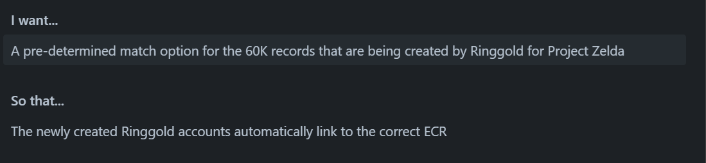
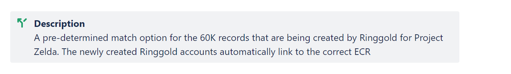

# mechanism to bulk upload pre-determined matches provided by Ringgold (Zelda Project)

In Enterprise Customer Hub (ECH), we have a new requirement (Zelda Project) to load bulk batches of pre-determined matches. These batches are provided by our partner Ringgold in form of CSV/Excel files. Once reviewed by ECH Business Team, then either Business/BAU member imports file into Semarchy Application and data gets processed there. Total volume of expected data would be around 60+k records to be processed.

There is currently no automated process as part of the ECH Semarchy implementation to import batches. The current method used to load this kind of data is via custom DB scripts. These have not gone through any kind of software development cycle and so have the potential to impact the deliverable with bugs, time taking to process and expert tech team member dependency.

## Decision

- Develop a Semarchy based solution:
    - Pre-determine matches information will be received from Ringgold in form of CSV/Excel files.
    - Access restricted to only specific application support users, allowing them to submit job to process data.
    - ECH Semarchy application should process data automatic once data is loaded into it.
    - Development to follow strict requirements provided by business.
    - Ensure to capture user audit data at record level.
    - Future enhancements can be introduced into this Semarchy development depending rules setup or source type.

## Consequences

- Quicker way to import data into the Semarchy application and single click to submission for processing.
- Bulk match import to ECH will no longer be error bound compared to current manual execution of DB scripts.
- Reduced support burden due to automation reducing the need for manual intervention.
- ECH DB scripts will be replaced with Semarchy development:
    - No need for expert tech support.
    - No more manually execution of scripts.
    - Can be triggered by ECH Super Users multiple times independently.
    - Developed and tested as part of the ECH Semarchy application release.
- Training document for DB script loading will no longer required.

Problem statement 🕛

We need Ringgold to create approximately 60K records where the ECR already exists.  We know that when the Ringgold record is created and consumed into ECH via the weekly delta file that not all newly created Ringgold IDs will automatch with the intended ECR for various reasons (poor data quality, outdated data, poor matching algorithms) and in these instances a new (duplicate) ECR will be generated.  There is also  a high percentage that will go into link status PM/MM/CS.  We want to ensure that these Ringgold records automatically link with the existing ECR.

Ringgold have agreed that once a week (Wednesday evening) they will provide us a with a list of all the records they’ve audited in the previous week.  This list will contact all newly created Ringgold IDs and any they have identified that already exist.

We need to take that list (before the Ringgold delta file is processed on a Friday lunchtime) and create a “shell” Ringgold record with the ECR attached so that when the delta file is processed and the real record appears in that file, it automatches with the intended ECR.   These “shell” records must go into source error (requirements in acceptance criteria).   As this is going to be a weekly event and we’ll be working to a tight deadline then we need to keep this very simple. 

Acceptance criteria :

1. If the Ringgold ID in the upload file isn’t already in ECH (in the SA/GD layers) create a “shell” account
2. If ECR in the upload file doesn’t exist then don’t create a “shell” account (ie do nothing)
3. If the Ringgold ID in the upload file already exists in the SA/GD layers don’t create a “shell” account (ie do nothing)
4. The “shell” account mustn’t be created in the GD layer but can be created in any combo of staging/sa layer in order to achieve the pre-determined match
5. The “shell” account mustn’t come out of source error during the delta file processing if a mandatory attribute has a DQ issue.
6. The “shell” account must come out of source error if there are no DQ issues for mandatory attributes and it must auto match with the specified ECR when delta file is processed
7. The “shell” account must be created with the following attributes: Pub ID = ‘RINGGOLD”, Source ID (provided in the upload file), linked ECRid (provided in the upload file), account id (to be determined by Semarchy), link status of KE (Known ECR) and set C. All other attributes must be blank.
8. No notifications should be generated for the ECR when creating the “shell” account (not mvp)
9. The upload spreadsheet that will contain the Ringgold ID and the ECR ID – it’s not expected that any other information should be provided
10. The ECH Business team and ECH Tech team to have access to upload the files to create the “shell” accounts. C-DOT should not be given access
11. I understand the need for stress testing but this process should never be more than a few thousand per load. So stress testing can be covered in future developments/ requirements
12. No reporting is needed – will all be done by the ECH team.
13. No ECRs should change and any accounts or identifiers linked to the ECR should remain linked
14. B_creator must have a unique creator, referencing Zelda. Something like Zelda_Shell_Creation will be fine. This creator mustn’t be used for anything else (unless specifically requested in a future story)
15. If any scenarios exist but aren’t covered by any of the above points, of if there is any ambiguation, contradictory requirements or questions please clarify these with Helen or Ian in the first instance