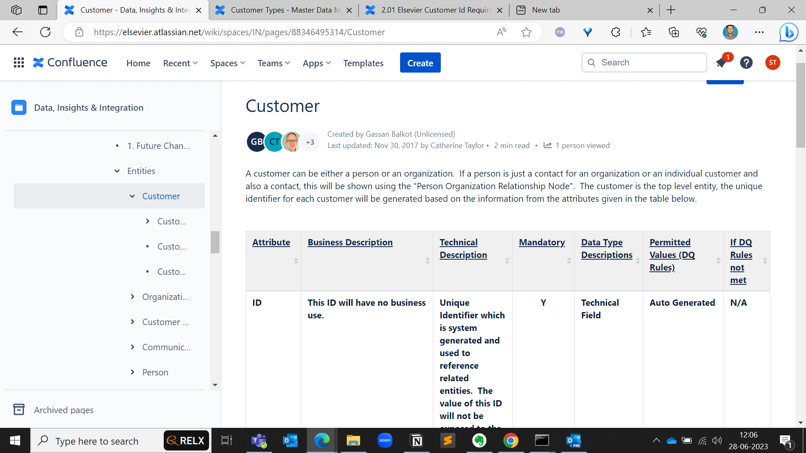
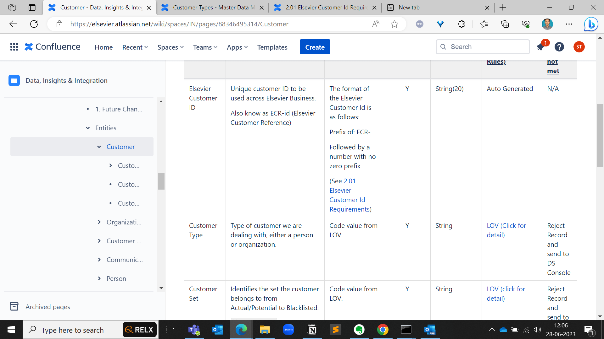
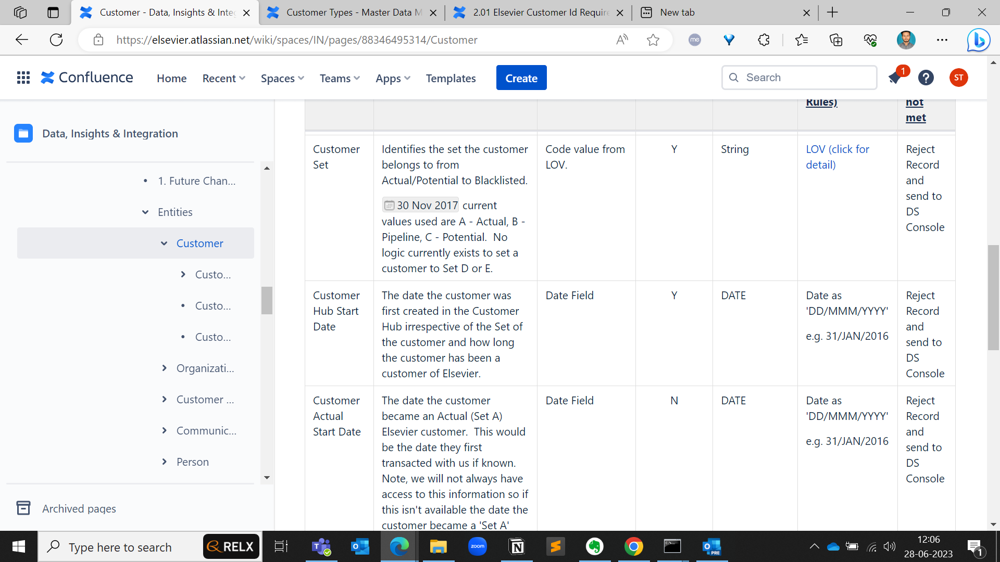
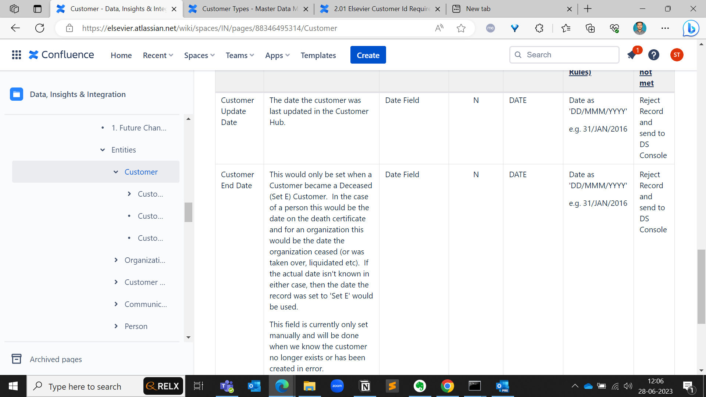

# entities and their attributes in Elsevier

**Requirements**

[ECI logic - DMG 27th Sept 2016.pptx](https://elsevier.atlassian.net/wiki/download/attachments/89406604686/ECI%20logic%20-%20DMG%2027th%20Sept%202016.pptx?version=1&modificationDate=1475489610000&cacheVersion=1&api=v2)

| **Id** | **Original Requirement** | **Solution Adapted Requirement** | **Gap** | **Status** | **Comment** |  |
| --- | --- | --- | --- | --- | --- | --- |
| 1.1 | The format of the Elsevier Customer Id is as follows:
Prefix of: ECR-
Followed by a number with no zero prefix and max 14 digits.
Where there is one and only one SIS Id for a customer the SIS id will be used for the number part of the id.
e.g. If Oxford University has the single SIS Id of 1312, the new Elsevier Customer Id will be ECR-1312
 
Where the customer has not had a SIS Id or there were multiple SIS Ids merged into 1 Customer a new number, greater than the last issued SIS id, will be used.
e.g. ECR-12345678
Analysis will be conducted to ensure we use a big enough number not to risk the 2 sequences overlapping during parallel run. | The format of the Elsevier Customer Id is as follows:
Prefix of: ECR-
Followed by a number with no zero prefix
 
Where there is one or more SIS Ids for a customer the lowest SIS id will be used for the number part of the id.
 
 
Where the customer has no SIS Id a new number, greater than the last issued SIS id, will be used.
e.g. ECR-12345678
Analysis will be conducted to ensure we use a big enough number not to risk the 2 sequences overlapping during parallel run. 
Elsevier Customer Id is 20 characters including prefix, e.g.
ECR-1234567890123456 | The Elsevier Customer Id will be set to the lowest SIS id merged into that customer, even if there are multiple SIS ids. | Approved | Taken to the DMG on September 27, 2016 |  |
| 1.2 | Every Confirmed Golden Record should be allocated an Elsevier Customer Id.  This is irrespective of the Set of the customer.  This is a change as initially we only implemented customer number for Set A and B customers
Non-confirmed Golden Records ideally shouldn't have Elsevier Customer Ids as the likelihood is that they will be merged in with a confirmed Golden record.  If a non-confirmed golden record is confirmed the Id should be generated at this point.  (this point could be negotiable dependent on ease of solution) |  | Achievable - all golden records, confirmed or otherwise will have an Elsevier customer id.  This will be assigned at the master data level and the lowest number will have precedence on the golden record |  |  |  |
| 1.3 | The Elsevier customer Id must be unique for each golden record in Semarchy |  | Achievable |  |  |  |
| 1.4 | The original Elsevier customer Id should persist.  If a new master record is merged into an existing Golden record or  an existing Golden record is merged into an existing Golden record the original Elsevier customer Id should persist.  **There is an exception to this rule with regards to loading SIS records on top of Set C records - see requirement 1.1** |  | Achievable but no new SIS Ids will be used to create the Elseiver Customer Id following go-live and switch over to CRM loads using real time API.  This means the exception does not apply |  |  |  |
| 1.5 | If 1 golden record is split, 1 of the records should retain the original Elsevier customer id.  The user should be able to specify which record is the original record (and keeps the original Elsevier customer id) and which gets a new Elsevier customer.
Ideally if 2 records were merged and then split, they should revert back to the original ids. | If 1 golden record is split, 1 of the records should retain the original Elsevier customer id. 
Ideally if 2 records were merged and then split, they should revert back to the original ids. | The user cannot specify which record keeps the original Elsevier customer id as it will automatically select the lowest id from the master records making up the golden record.
We will achieve the original ids if a merge and split occurs |  |  |  |

[ECI logic - DMG 27th Sept 2016.pptx](entities-and-their-attributes-in-elsevier/eci-logic-dmg-27th-sept-2016.pptx)

1. [Data, Insights & Integration](https://elsevier.atlassian.net/wiki/spaces/IN/overview?homepageId=88317175931)
2. **…**
3. [Customer](https://elsevier.atlassian.net/wiki/spaces/IN/pages/88346495314/Customer)

**Share**

# Customer Hierarchy.

This entity is used to link a customer to it's parent customer in a customer hierarchy.  There are multiple customer hierarchies see [Hierarchy Type LOV](https://elsevier.atlassian.net/wiki/spaces/MDM/pages/89406193477/Hierarchy+Type+LOV)

There will be 1 or no entries in this entity for each Organizational Customer per Hierarchy Type.  A customer can only have 1 parent within a hierarchy.  A customer can be a parent to no, 1 or many customers within a hierarchy.

| **Attribute** | **Business Description** | **Technical Description** | **Mandatory** | **Data Type Descriptions** | **Permitted Values** |
| --- | --- | --- | --- | --- | --- |
| **Attribute** | **Business Description** | **Technical Description** | **Mandatory** | **Data Type Descriptions** | **Permitted Values** |
| **Hierarchy Type ID (FK) (PK)** | **This has no business use.** | Foreign key to link to the 'Elsevier Customer Hierarchy' record in the Hierarchy Type entity | **Y** | **See LOV** | [**Entries Present in Hierarchy Type**](https://elsevier.atlassian.net/wiki/spaces/IN/pages/88348229339/Hierarchy+Type) |
| **ID (FK) (PK)** | **This has no business use.** | Foreign key to link to the customer table and represents the instance of the customer | Y | Technical Field | Auto Generated |
| Parent ID (FK) | **This has no business use.** | Foreign key to link to the customer table and represents the parent of the customer | Y | Technical Field | Auto Generated |

1. [Master Data Management](https://elsevier.atlassian.net/wiki/spaces/MDM/overview?homepageId=89517524350)
2. **…**
3. [LOVs](https://elsevier.atlassian.net/wiki/spaces/MDM/pages/89403623846/LOVs)

**Share**

# Hierarchy Type LOV

| **Hierarchy Type ID** | **Hierarchy Type Code** | **Relationship Type Description** | Commentary |
| --- | --- | --- | --- |
| **1** | **ELS** | **ELSEVIER CUSTOMER HIERARCHY** | Initially populated from the SIS Hierarchy at go live.  Manually updated since based on feedback from the business and updates required to resolve 'loops' where multiple CRM accounts that were in a SIS hierarchy were merged into a single customer. |
| 2 | RINGGOLD | Ringgold Customer Hierarchy | Populated and maintained on a weekly basis using 3rd party data from Ringgold |
| 3 | LN_RISK | Lexis Nexis Customer Hierarchy | Populated from the original Lexis Nexis feed.  Planned work to replace LN_RISK with LN_RISK2 a new feed (with different ids) from Lexis Nexis |
| 4 | CAP_IQ | Capital IQ Customer Hierarchy | Future data source not currently implemented as of November 30, 2017 |
|  |  |  |  |