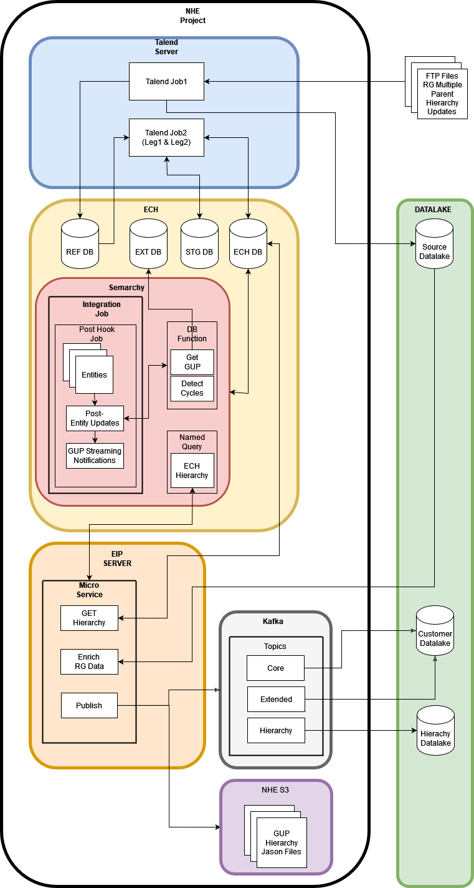
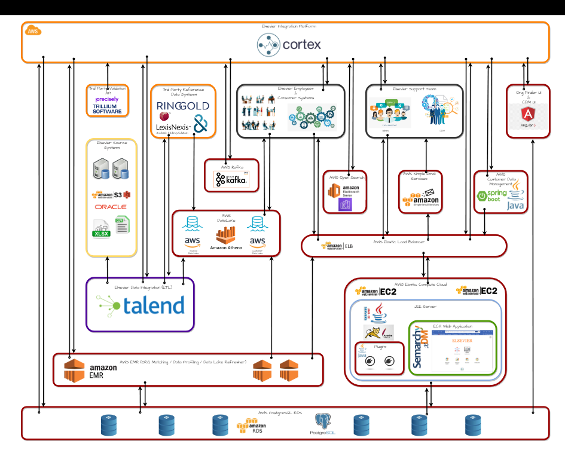

# Detailed notes along with the meeting with raj

1) Hierarchy

- [ ]  single parent with simple hierarchy
- [ ]  single parent with multilevel hierarchy
- [ ]  multi parent

safe id =  it is related to the particular source like crm , marketing t's a record ID safe ID is a record ID of a particular source. It is called as safe ID. Don't think safe ID is something like a unique ID. It's a specific to one particular source like CR, Mor R12 or something. Yeah marketing or some application which we is integrated into Ch. So so we are interested in that particular case only case safe ID and the ECR ID is our ECH internal id.

ringold is the refrence data id 

we get Ringgold, multiple parents, E TL it it's really talent. This blue one is the talent. Job reads that file and then it.

And then there's a talent like one and Leg 2, which is making leg one makes, reads the data from the temporary table and store it in staging area.

then the leg two is a common job which takes everything from the staging into ECH.

ou can see faster first talent job reads the file and stores in the Rev TB and from the Rev TB. It goes into talent job too and the leg one would go into staging and leg to go into ES database. OK and this job also stores it into source data like.

And then this ECH is nothing but our application E Ch as an application inside Ch we have one of the component called semarchy. So you have all Finder everything here only so in in the semarchy what will happen is we like if you understand some semarchy.

Ohh then what will happen is that jobs, these are the entities, post entity updates and you know do UP streaming notifications. So what happens is when you submit the job into the entity in the post entity update it will get the GUP means global ultimate parent. It will have a function which will trace back the Global ultimate parent and it will go and generate a global ultimate parent. So basically what happens is.

If this hierarchy changes, it will say this and this are the global ultimate parent and it'll say update this particular ERID which is there should be an mcrd here there should be ANERD for example this is the CID. So this is the global ultimate parent, so it'll say. Can you update this ccrd hierarchy? So that's how it goes in and then once that's done, So what will happen is there is a micro service which reads that?.

Notification and then calls a function to which is called as named query which you need to understand in some marquee which will generate the hierarchy in the JP model OK in the JPA model and then that JPM model you what you do is you enrich it with a ring gold data and then you publish it into your kafka streams. So why one is core and hierarchy. So we do just the hierarchy.

And then that that hierarchy topic goes into Data Lake.

And there's one more request for the energy snowflake to store the Jason file as it is rather than into a cafe Co topic because the snowflake cannot read a caca topic. It would read from and and and S3 bucket. So this is the project

so there's one more request to instead of going for the NHS, there is a Salesforce, a third party which has its own logic for which which we need to practise this. So I'm building a function so when we do an update to the Salesforce the IT will it would require a child, parent and ultimate parent nodes only it does not interest in the entire hierarchy.

o what happens is it goes and reads the hierarchy and produced the child, parent and ultimate parent in the notification record.Payload you just understand this

ETL - data loading from one to another ( enriching transforming and loading)

- [ ]  talend
- [ ]  airflow
- [ ]  EMR
- [ ]  mircroservices

I showed you one project. I'll show you DNB project, which is about referential data. How do we enrich data? So like I said, if we say your name is St in the account and then we go to a a Wikipedia where your name is Shyam Tiwari that from we if we acknowledge it as a third party golden data then we.

Yes, yes. Like I said, we don't use the integration from Samaki. We have our own integration outside third party integration like talent and microservice or AWS Emrs. We use that. We don't use the integration tool provided by Samarco, which is called as DI. We don't use thatAnd then we do some microservice and we do a WEMEMR for the ETLOK you know TL, right, you know L right?

El is nothing but a data loading from 1:00 to 1:00 another, but it's not just loading the data, it is enriching, transforming and loading.

ouhani is a talent expert. Vincent is now going to be Micro Micro service expert. So say all different different departments and AWS work is all done by Harris. Remember I said data scientist? Yeah, all the all, the Caprica and all those things is done by Harris.

[Untitled](detailed-notes-along-with-the-meeting-with-raj/untitled.docx)

[Untitled](detailed-notes-along-with-the-meeting-with-raj/untitled-1.docx)

‘